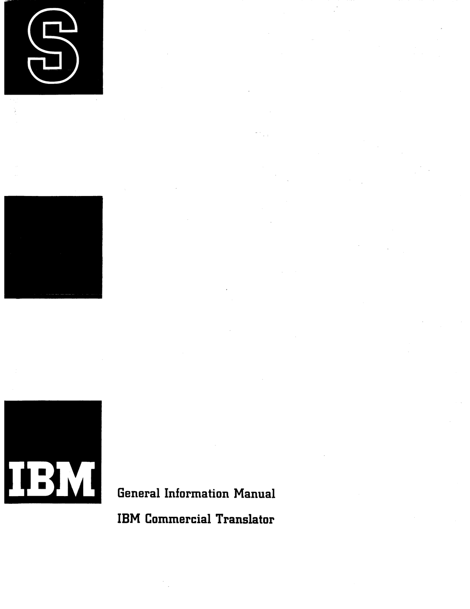

# F28-8043: General Information Manual — IBM Commercial Translator (front matter)

<!-- PDF 1 -->
**[PDF page 1]**

*Front cover: General Information Manual, IBM Commercial Translator (PDF page 1).*

<!-- PDF 2 -->
**[PDF page 2]**

*[Page otherwise blank apart from a boxed notice.]*

> **MAJOR REVISION**
> **(June 1960)**
>
> This manual, form F28-8043, is a major revision of the original Commercial Translator manual, form F28-8013, which is obsolete and should be destroyed.

<!-- PDF 3 -->
**[PDF page 3]**

**General Information Manual**
**IBM Commercial Translator**

Copyright 1960 by International Business Machines Corporation

<!-- PDF 4 -->
**[PDF page 4]**

## Contents

**Chapter 1: General Description of the Commercial Translator System**

- Introduction and Plan of the Manual — 1
- Designing Data Processing Programs — 1
- What Is a Data Processing System? — 1
  - Communication with a Data Processing Machine — 2
- The Commercial Translator System — 3
- Examples—1, 2, 3 — 3, 4, 5, 6, 7
  - Construction of the Commercial Translator Language — 7
  - Examples 4, 5 — 8, 9, 10
- Outline of Manual — 10

**Chapter 2: The Structure of the Language**

- Underlying Principles — 11
- Character Set — 12
- Verbs — 12
  - Operators — 13
- Names — 13
  - Kinds of Names — 13
    - Data-Names — 13
    - Procedure-Names — 14
    - Condition-Names — 14
  - Formation of Names — 15
  - Compound Names — 15
  - Placing Names in the Program — 16
- Constants — 17
  - Literals — 18
  - Named Constants — 19
  - Figurative Constants — 19
- Expressions — 20
  - Arithmetic Expressions — 20
  - Conditional Expressions — 21
    - Relations — 21
    - Condition-Names — 22
    - AND, OR, and NOT — 23
  - Truth Functions — 24
- Clauses — 24
  - Imperative Clauses — 25
  - Conditional Clauses — 25
- Sentences — 25
- Sections — 26
- Divisions — 26
- Punctuation and Spacing — 27
- Lists, Tables, and Subscripts — 28
- Functions — 32
  - Use of Functions in Procedure Statement — 34

**Chapter 3: Procedure Description**

- Introduction — 35
  - Verbs — 35
  - Commands — 35
  - Format of Procedure Statements — 37

<!-- PDF 5 -->
**[PDF page 5]**

- Program Commands — 38
  - Input/Output Commands — 38
    - The OPEN Command — 39
    - The GET Command — 39
    - The FILE Command — 40
    - The CLOSE Command — 41
  - Data Transmission Commands — 41
    - The MOVE Command — 42
    - The MOVE CORRESPONDING Command — 43
  - Arithmetic Commands — 44
    - The SET Command — 44
    - The ADD Command — 47
    - The ADD CORRESPONDING Command — 47
  - Control Commands — 48
    - The GO TO Command — 48
    - The DO Command — 49
    - The STOP Command — 54
  - Other Program Commands — 54
    - The LOAD Command — 54
    - The DISPLAY Command — 54
- Processor Commands — 55
  - The OVERLAP Command — 55
  - The BEGIN SECTION and END Commands — 56
  - The INCLUDE Command — 58
  - The CALL Command — 59
  - The NOTE Command — 59
  - The ENTER Command — 59
- Relationship Between Program Commands and Processor Commands — 60

**Chapter 4: Data Description**

- What a Data Description Is — 61
  - The Purpose of a Data Description — 61
  - Files, Records, and Fields — 63
- Data Description Format — 65
  - General — 65
  - Ctl. and Serial (Col. 1-6) — 65
  - Data Name (Col. 7-22) — 67
  - Level (Col. 23-24) — 68
  - Type (Col. 25-30) — 71
  - Quantity (Col. 31-35) — 77
  - Mode (Col. 36) — 78
  - Justify (Col. 37) — 78
  - Description (Col. 38-71) — 79
  - Cont. (Col. 72) — 84
  - Identification (Col. 73-80) — 84
- Storage Areas — 84

**Appendix 1: Programming Example** — 87

**Appendix 2: Supplementary Information** — 105

- Rules for Forming Conditional Expressions — 105
- Rules for Forming Arithmetic Expressions — 106
- List of Commercial Translator Commands — 108
- List of Commercial Translator Words — 110

**Appendix 3: Glossary** — 111

**Index** — 117

<!-- PDF 6 -->
**[PDF page 6]**

## Preface

#### Background

Persons familiar with the history of programming will realize that the development of the Commercial Translator system is a logical step in the evolution of programming systems. The step from machine language coding to symbolic coding systems such as those for the IBM 702 and 705 was a natural and relatively simple development. With the introduction of "SOAP" for the IBM 650, "SAP" for the 704 and "Autocoder" for the 705, it became possible to write programs using English language words or abbreviations instead of symbolic numbers. A parallel development was the concept of writing one synthetic instruction, i.e., a macro-instruction, to represent several machine operations. Several systems at this level of development are a combination of the "one-for-one" coding of symbolic languages and the "several-for-one" coding of macros. Although these systems greatly simplify programming, they are all essentially machine-oriented; that is, the programmer must think in terms of the operation repertory of the particular machine. A highly significant step occurred with the advent of compilers such as FORTRAN. For the first time, coding systems were designed in terms of the language of the problem to be coded instead of in terms of a specific data processing system. The FORTRAN language is used to formulate mathematical problems for several data processing systems. It naturally preceded the development of the Commercial Translator system since it is directly related to the language of mathematics, the forms of which are accepted universally. Now, with Commercial Translator, a problem-oriented language becomes available for the formulation of commercial problems.

#### Concerning this Manual

The primary purpose of this manual is to present the Commercial Translator system in sufficient detail to permit the programming of applications in its language. Certain information is omitted: Separate publications will describe the operation of the processors, i.e., the programs for each data processing system which translate the Commercial Translator language into the machine language of that particular system. These publications will also cover the rules for stating environment description, which is the portion of a Commercial Translator program that specifies the available components of the data processing system and the external characteristics of the files to be processed.

<!-- conversion notes: PDF pages 1-6 (front matter, no printed page numbers) converted per spec. PDF 1 embedded as the illustrated front cover. PDF 2 is mostly blank apart from a short boxed "Major Revision" notice; a one-line note plus the full (short) notice text is given for fidelity. PDF 3 is the title/half-title page (text reproduced; small IBM outline logo not embedded, deemed non-essential to content). PDF 4-5 comprise the Contents (table of contents); reproduced as a nested Markdown list with printed page numbers, dot leaders omitted, following the visual indentation of the original two-column layout. PDF 6 is the Preface (Background / Concerning this Manual side-heads rendered as #### sub-heads). No pages required image-only fallback; no uncertain/illegible text encountered in this range. -->
