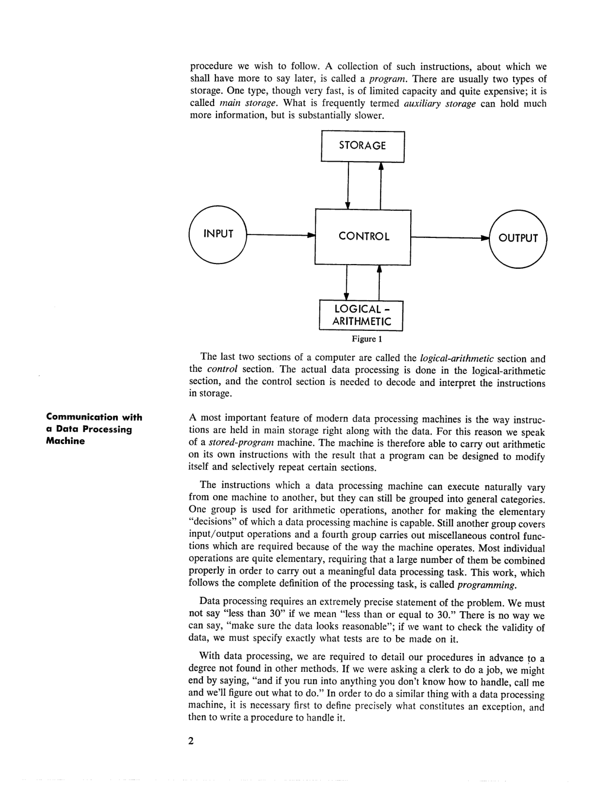
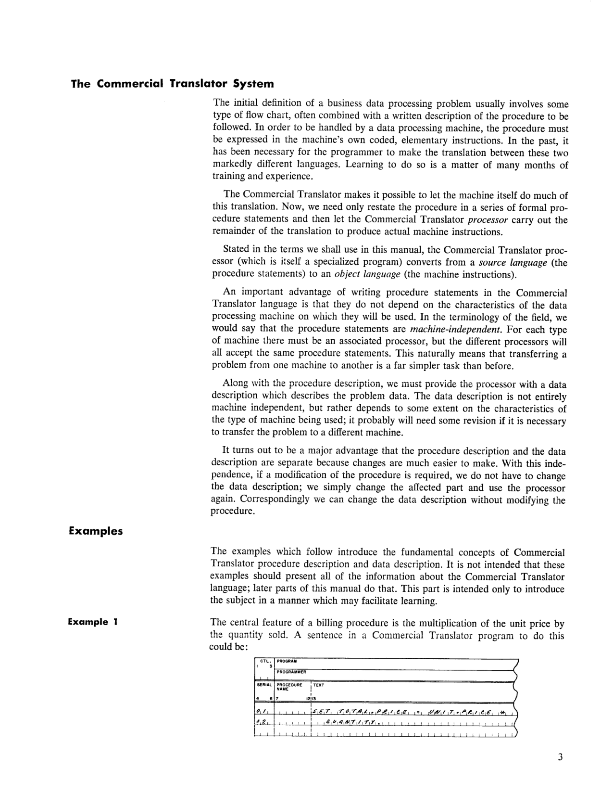
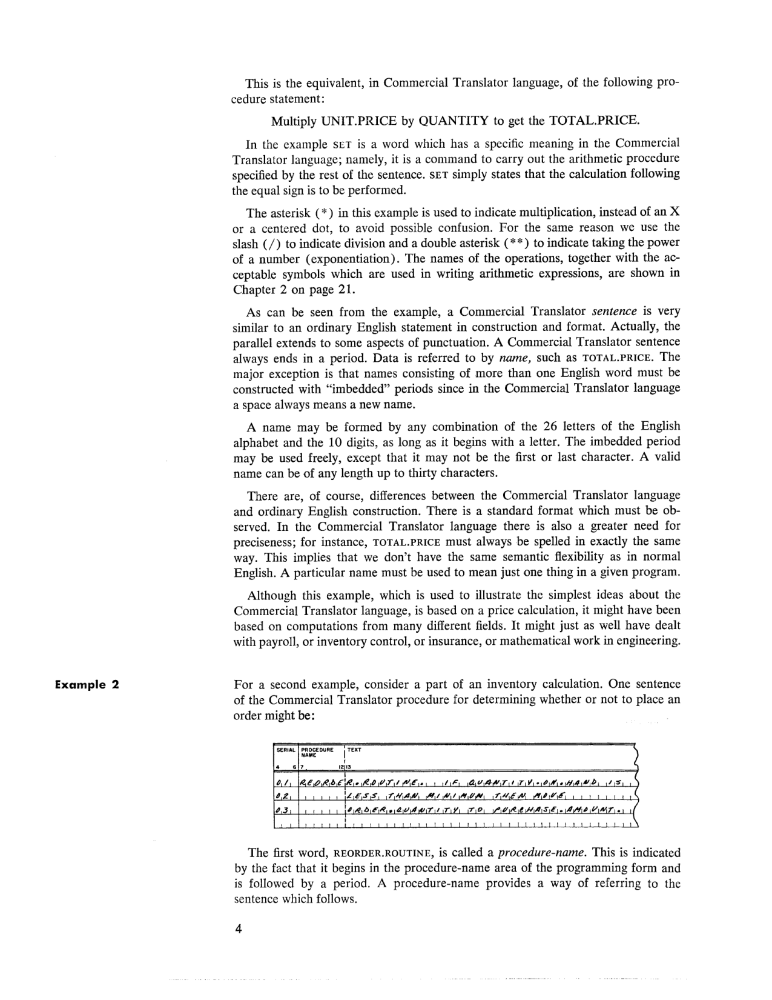
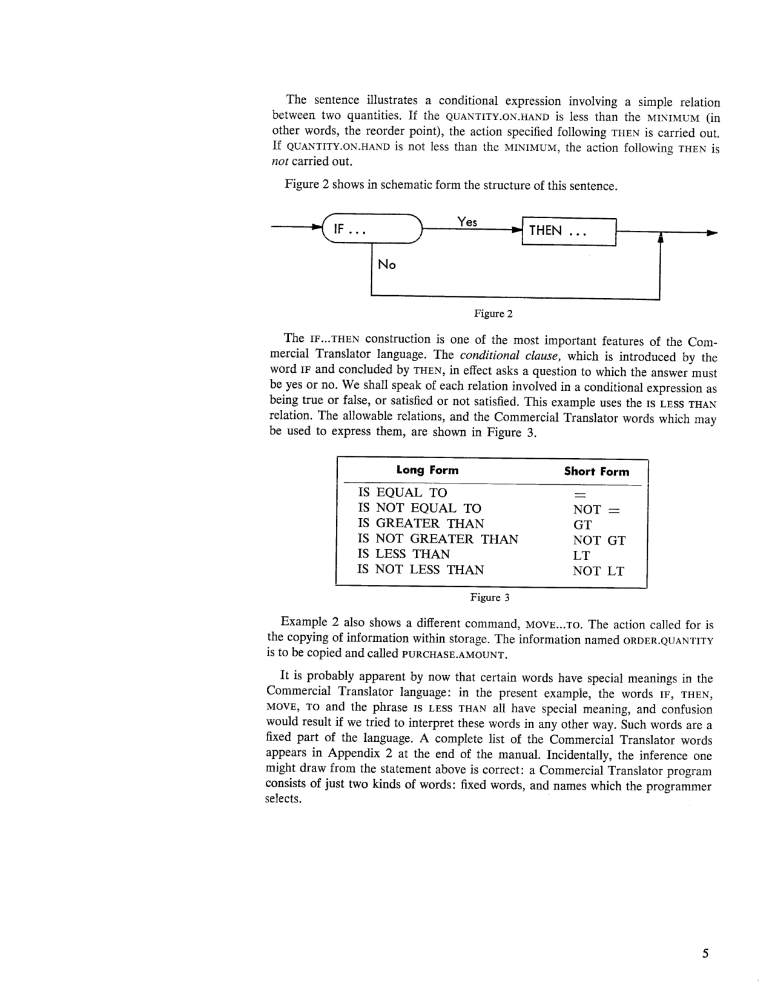
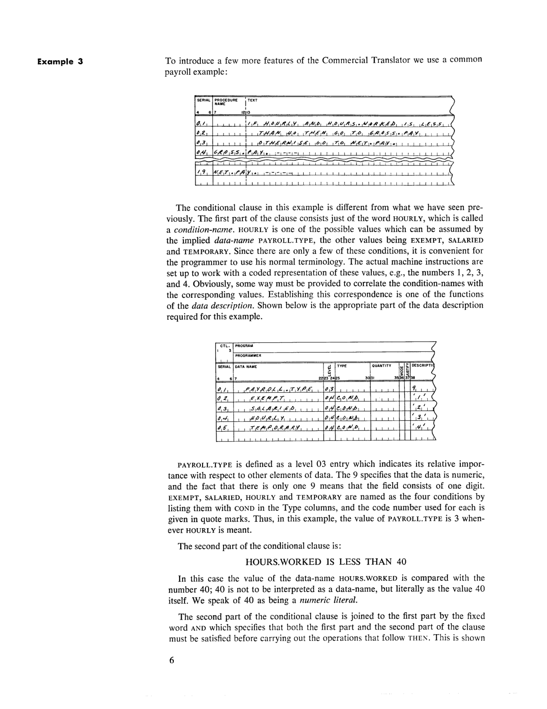
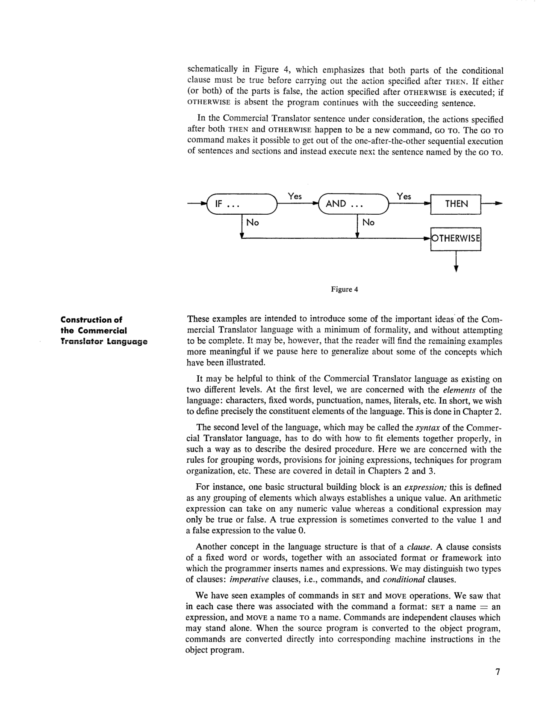
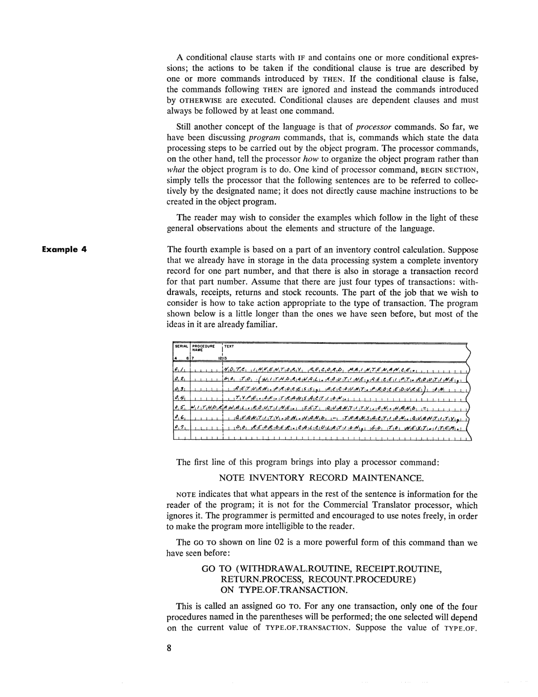
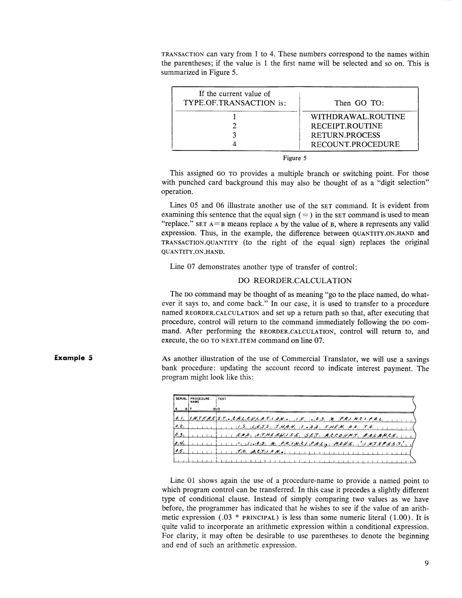

# Chapter 1: General Description of the Commercial Translator System

<!-- page 1 | PDF 7 -->
**[page 1]**

## Introduction and Plan of the Manual

This manual has been written to be useful to two different groups of readers. Chapters 2 through 4 present a comprehensive description of the Commercial Translator language. The reader with experience in data processing may therefore begin immediately with Chapter 2. The present chapter contains a brief discussion of the essential characteristics of data processing systems (language questions aside), an indication of the motivation that led to the Commercial Translator language, and a number of relatively simple graded examples. These examples introduce the fundamentals of the Commercial Translator language without attempting to be complete.

This chapter then is intended to be of assistance to the new user who has had little or no experience in data processing.

## Designing Data Processing Programs

Suppose you have been assigned to a team that is to set up a data processing system for some application in payroll, or inventory control, or utility billing, or insurance, or even in an area of science or engineering. What do you need to know about data processing in order to use the Commercial Translator language on such a job?

To begin with, we can mention a few areas of knowledge that are not needed. You need no knowledge of electronics. You need no knowledge of mathematics beyond high school algebra (unless, of course, the problem itself is mathematical). With the Commercial Translator language you do not even need a *detailed* knowledge of how your particular computer system works. However, you do need to know certain facts about data processing, and eventually, if you work with the subject for a while, you will pick up certain detailed facts about your particular computer—but you do not need these now. For now, the general ideas which you should have are discussed below.

## What Is a Data Processing System?

A data processing system is composed functionally of five parts, as shown in Figure 1. The *input* section accepts information "from the outside," and converts it into the electronic form in which it is manipulated and stored internally. Externally, information is typically recorded on punched cards, punched paper tape, or magnetic tape. In some applications, printed characters can be read directly. Presently-used business machines cannot recognize handwriting or speech. The *output* section of a computer has the obvious function of converting from the internal representation to some convenient external form, such as printing, punched cards, magnetic tape, punched paper tape, or a variety of specialized media. Though the speeds of all of these devices are much greater than those of manual devices, they are still generally quite slow compared to speeds of internal electronic manipulation. The kind and number of input and output devices naturally depends on the particular machine and its application.

The *storage* section of a computer serves two important purposes. The obvious function is to hold the data on which we wish to operate. A function less obvious to the newcomer is to hold coded *instructions* which we place there to specify the procedure we wish to follow.

<!-- page 2 | PDF 8 -->
**[page 2]**

A collection of such instructions, about which we shall have more to say later, is called a *program*. There are usually two types of storage. One type, though very fast, is of limited capacity and quite expensive; it is called *main storage*. What is frequently termed *auxiliary storage* can hold much more information, but is substantially slower.


*Figure 1. Functional diagram of a data processing system (page 2).*

The last two sections of a computer are called the *logical-arithmetic* section and the *control* section. The actual data processing is done in the logical-arithmetic section, and the control section is needed to decode and interpret the instructions in storage.

### Communication with a Data Processing Machine

A most important feature of modern data processing machines is the way instructions are held in main storage right along with the data. For this reason we speak of a *stored-program* machine. The machine is therefore able to carry out arithmetic on its own instructions with the result that a program can be designed to modify itself and selectively repeat certain sections.

The instructions which a data processing machine can execute naturally vary from one machine to another, but they can still be grouped into general categories. One group is used for arithmetic operations, another for making the elementary "decisions" of which a data processing machine is capable. Still another group covers input/output operations and a fourth group carries out miscellaneous control functions which are required because of the way the machine operates. Most individual operations are quite elementary, requiring that a large number of them be combined properly in order to carry out a meaningful data processing task. This work, which follows the complete definition of the processing task, is called *programming*.

Data processing requires an extremely precise statement of the problem. We must not say "less than 30" if we mean "less than or equal to 30." There is no way we can say, "make sure the data looks reasonable"; if we want to check the validity of data, we must specify exactly what tests are to be made on it.

With data processing, we are required to detail our procedures in advance to a degree not found in other methods. If we were asking a clerk to do a job, we might end by saying, "and if you run into anything you don't know how to handle, call me and we'll figure out what to do." In order to do a similar thing with a data processing machine, it is necessary first to define precisely what constitutes an exception, and then to write a procedure to handle it.

<!-- page 3 | PDF 9 -->
**[page 3]**

## The Commercial Translator System

The initial definition of a business data processing problem usually involves some type of flow chart, often combined with a written description of the procedure to be followed. In order to be handled by a data processing machine, the procedure must be expressed in the machine's own coded, elementary instructions. In the past, it has been necessary for the programmer to make the translation between these two markedly different languages. Learning to do so is a matter of many months of training and experience.

The Commercial Translator makes it possible to let the machine itself do much of this translation. Now, we need only restate the procedure in a series of formal procedure statements and then let the Commercial Translator *processor* carry out the remainder of the translation to produce actual machine instructions.

Stated in the terms we shall use in this manual, the Commercial Translator processor (which is itself a specialized program) converts from a *source language* (the procedure statements) to an *object language* (the machine instructions).

An important advantage of writing procedure statements in the Commercial Translator language is that they do not depend on the characteristics of the data processing machine on which they will be used. In the terminology of the field, we would say that the procedure statements are *machine-independent*. For each type of machine there must be an associated processor, but the different processors will all accept the same procedure statements. This naturally means that transferring a problem from one machine to another is a far simpler task than before.

Along with the procedure description, we must provide the processor with a data description which describes the problem data. The data description is not entirely machine independent, but rather depends to some extent on the characteristics of the type of machine being used; it probably will need some revision if it is necessary to transfer the problem to a different machine.

It turns out to be a major advantage that the procedure description and the data description are separate because changes are much easier to make. With this independence, if a modification of the procedure is required, we do not have to change the data description; we simply change the affected part and use the processor again. Correspondingly we can change the data description without modifying the procedure.

### Examples

The examples which follow introduce the fundamental concepts of Commercial Translator procedure description and data description. It is not intended that these examples should present all of the information about the Commercial Translator language; later parts of this manual do that. This part is intended only to introduce the subject in a manner which may facilitate learning.

### Example 1

The central feature of a billing procedure is the multiplication of the unit price by the quantity sold. A sentence in a Commercial Translator program to do this could be:


*Coding-form facsimile: Example 1 procedure statement (page 3).*

```
SERIAL   PROCEDURE NAME        TEXT
 01                             SET TOTAL.PRICE = UNIT.PRICE *
 02                             QUANTITY.
```

<!-- page 4 | PDF 10 -->
**[page 4]**

This is the equivalent, in Commercial Translator language, of the following procedure statement:

> Multiply UNIT.PRICE by QUANTITY to get the TOTAL.PRICE.

In the example SET is a word which has a specific meaning in the Commercial Translator language; namely, it is a command to carry out the arithmetic procedure specified by the rest of the sentence. SET simply states that the calculation following the equal sign is to be performed.

The asterisk (`*`) in this example is used to indicate multiplication, instead of an X or a centered dot, to avoid possible confusion. For the same reason we use the slash (`/`) to indicate division and a double asterisk (`**`) to indicate taking the power of a number (exponentiation). The names of the operations, together with the acceptable symbols which are used in writing arithmetic expressions, are shown in Chapter 2 on page 21.

As can be seen from the example, a Commercial Translator *sentence* is very similar to an ordinary English statement in construction and format. Actually, the parallel extends to some aspects of punctuation. A Commercial Translator sentence always ends in a period. Data is referred to by *name,* such as TOTAL.PRICE. The major exception is that names consisting of more than one English word must be constructed with "imbedded" periods since in the Commercial Translator language a space always means a new name.

A name may be formed by any combination of the 26 letters of the English alphabet and the 10 digits, as long as it begins with a letter. The imbedded period may be used freely, except that it may not be the first or last character. A valid name can be of any length up to thirty characters.

There are, of course, differences between the Commercial Translator language and ordinary English construction. There is a standard format which must be observed. In the Commercial Translator language there is also a greater need for preciseness; for instance, TOTAL.PRICE must always be spelled in exactly the same way. This implies that we don't have the same semantic flexibility as in normal English. A particular name must be used to mean just one thing in a given program.

Although this example, which is used to illustrate the simplest ideas about the Commercial Translator language, is based on a price calculation, it might have been based on computations from many different fields. It might just as well have dealt with payroll, or inventory control, or insurance, or mathematical work in engineering.

### Example 2

For a second example, consider a part of an inventory calculation. One sentence of the Commercial Translator procedure for determining whether or not to place an order might be:


*Coding-form facsimile: Example 2 procedure statement (page 4).*

```
SERIAL   PROCEDURE NAME          TEXT
 01      REORDER.ROUTINE.         IF QUANTITY.ON.HAND IS
 02                                LESS THAN MINIMUM THEN MOVE
 03                                ORDER.QUANTITY TO PURCHASE.AMOUNT.
```

The first word, REORDER.ROUTINE, is called a *procedure-name.* This is indicated by the fact that it begins in the procedure-name area of the programming form and is followed by a period. A procedure-name provides a way of referring to the sentence which follows.

<!-- page 5 | PDF 11 -->
**[page 5]**

The sentence illustrates a conditional expression involving a simple relation between two quantities. If the QUANTITY.ON.HAND is less than the MINIMUM (in other words, the reorder point), the action specified following THEN is carried out. If QUANTITY.ON.HAND is not less than the MINIMUM, the action following THEN is not carried out.

Figure 2 shows in schematic form the structure of this sentence.


*Figure 2. Schematic structure of an IF...THEN sentence (page 5).*

The IF...THEN construction is one of the most important features of the Commercial Translator language. The *conditional clause,* which is introduced by the word IF and concluded by THEN, in effect asks a question to which the answer must be yes or no. We shall speak of each relation involved in a conditional expression as being true or false, or satisfied or not satisfied. This example uses the IS LESS THAN relation. The allowable relations, and the Commercial Translator words which may be used to express them, are shown in Figure 3.

| Long Form | Short Form |
| --- | --- |
| IS EQUAL TO | = |
| IS NOT EQUAL TO | NOT = |
| IS GREATER THAN | GT |
| IS NOT GREATER THAN | NOT GT |
| IS LESS THAN | LT |
| IS NOT LESS THAN | NOT LT |

*Figure 3. Relations: long form and short form (page 5).*

Example 2 also shows a different command, MOVE...TO. The action called for is the copying of information within storage. The information named ORDER.QUANTITY is to be copied and called PURCHASE.AMOUNT.

It is probably apparent by now that certain words have special meanings in the Commercial Translator language: in the present example, the words IF, THEN, MOVE, TO and the phrase IS LESS THAN all have special meaning, and confusion would result if we tried to interpret these words in any other way. Such words are a fixed part of the language. A complete list of the Commercial Translator words appears in Appendix 2 at the end of the manual. Incidentally, the inference one might draw from the statement above is correct: a Commercial Translator program consists of just two kinds of words: fixed words, and names which the programmer selects.

<!-- page 6 | PDF 12 -->
**[page 6]**

### Example 3

To introduce a few more features of the Commercial Translator we use a common payroll example:


*Coding-form facsimile: Example 3 procedure statement (page 6).*

```
SERIAL   PROCEDURE NAME          TEXT
 01                                IF HOURLY AND HOURS.WORKED IS LESS
 02                                THAN 40 THEN GO TO GROSS.PAY
 03                                OTHERWISE GO TO NET.PAY.
 04      GROSS.PAY.                [rest of line: wavy omission rule — routine body not shown]
         ⋮  (lines 05-18 omitted from the facsimile, marked with a wavy omission rule)
 19      NET.PAY.                  [rest of line: wavy omission rule — routine body not shown]
```

The conditional clause in this example is different from what we have seen previously. The first part of the clause consists just of the word HOURLY, which is called a *condition-name.* HOURLY is one of the possible values which can be assumed by the implied data-name PAYROLL.TYPE, the other values being EXEMPT, SALARIED and TEMPORARY. Since there are only a few of these conditions, it is convenient for the programmer to use his normal terminology. The actual machine instructions are set up to work with a coded representation of these values, e.g., the numbers 1, 2, 3, and 4. Obviously, some way must be provided to correlate the condition-names with the corresponding values. Establishing this correspondence is one of the functions of the *data description.* Shown below is the appropriate part of the data description required for this example.


*Coding-form facsimile: data description for Example 3 (page 6).*

```
SERIAL   DATA NAME          LEVEL   TYPE    DESCRIPTION
 01      PAYROLL.TYPE         03                9
 02      EXEMPT                04    COND      '1'
 03      SALARIED              04    COND      '2'
 04      HOURLY                04    COND      '3'
 05      TEMPORARY             04    COND      '4'
```

PAYROLL.TYPE is defined as a level 03 entry which indicates its relative importance with respect to other elements of data. The 9 specifies that the data is numeric, and the fact that there is only one 9 means that the field consists of one digit. EXEMPT, SALARIED, HOURLY and TEMPORARY are named as the four conditions by listing them with COND in the Type columns, and the code number used for each is given in quote marks. Thus, in this example, the value of PAYROLL.TYPE is 3 whenever HOURLY is meant.

The second part of the conditional clause is:

```
HOURS.WORKED IS LESS THAN 40
```

In this case the value of the data-name HOURS.WORKED is compared with the number 40; 40 is not to be interpreted as a data-name, but literally as the value 40 itself. We speak of 40 as being a *numeric literal.*

The second part of the conditional clause is joined to the first part by the fixed word AND which specifies that both the first part and the second part of the clause must be satisfied before carrying out the operations that follow THEN. This is shown

<!-- page 7 | PDF 13 -->
**[page 7]**

schematically in Figure 4, which emphasizes that both parts of the conditional clause must be true before carrying out the action specified after THEN. If either (or both) of the parts is false, the action specified after OTHERWISE is executed; if OTHERWISE is absent the program continues with the succeeding sentence.

In the Commercial Translator sentence under consideration, the actions specified after both THEN and OTHERWISE happen to be a new command, GO TO. The GO TO command makes it possible to get out of the one-after-the-other sequential execution of sentences and sections and instead execute next the sentence named by the GO TO.


*Figure 4. Schematic structure of an IF...AND...THEN...OTHERWISE sentence (page 7).*

### Construction of the Commercial Translator Language

These examples are intended to introduce some of the important ideas of the Commercial Translator language with a minimum of formality, and without attempting to be complete. It may be, however, that the reader will find the remaining examples more meaningful if we pause here to generalize about some of the concepts which have been illustrated.

It may be helpful to think of the Commercial Translator language as existing on two different levels. At the first level, we are concerned with the *elements* of the language: characters, fixed words, punctuation, names, literals, etc. In short, we wish to define precisely the constituent elements of the language. This is done in Chapter 2.

The second level of the language, which may be called the *syntax* of the Commercial Translator language, has to do with how to fit elements together properly, in such a way as to describe the desired procedure. Here we are concerned with the rules for grouping words, provisions for joining expressions, techniques for program organization, etc. These are covered in detail in Chapters 2 and 3.

For instance, one basic structural building block is an *expression;* this is defined as any grouping of elements which always establishes a unique value. An arithmetic expression can take on any numeric value whereas a conditional expression may only be true or false. A true expression is sometimes converted to the value 1 and a false expression to the value 0.

Another concept in the language structure is that of a *clause.* A clause consists of a fixed word or words, together with an associated format or framework into which the programmer inserts names and expressions. We may distinguish two types of clauses: *imperative* clauses, i.e., commands, and *conditional* clauses.

We have seen examples of commands in SET and MOVE operations. We saw that in each case there was associated with the command a format: SET a name = an expression, and MOVE a name TO a name. Commands are independent clauses which may stand alone. When the source program is converted to the object program, commands are converted directly into corresponding machine instructions in the object program.

<!-- page 8 | PDF 14 -->
**[page 8]**

A conditional clause starts with IF and contains one or more conditional expressions; the actions to be taken if the conditional clause is true are described by one or more commands introduced by THEN. If the conditional clause is false, the commands following THEN are ignored and instead the commands introduced by OTHERWISE are executed. Conditional clauses are dependent clauses and must always be followed by at least one command.

Still another concept of the language is that of processor commands. So far, we have been discussing *program* commands, that is, commands which state the data processing steps to be carried out by the object program. The processor commands, on the other hand, tell the processor *how* to organize the object program rather than *what* the object program is to do. One kind of processor command, BEGIN SECTION, simply tells the processor that the following sentences are to be referred to collectively by the designated name; it does not directly cause machine instructions to be created in the object program.

The reader may wish to consider the examples which follow in the light of these general observations about the elements and structure of the language.

### Example 4

The fourth example is based on a part of an inventory control calculation. Suppose that we already have in storage in the data processing system a complete inventory record for one part number, and that there is also in storage a transaction record for that part number. Assume that there are just four types of transactions: withdrawals, receipts, returns and stock recounts. The part of the job that we wish to consider is how to take action appropriate to the type of transaction. The program shown below is a little longer than the ones we have seen before, but most of the ideas in it are already familiar.


*Coding-form facsimile: Example 4 procedure statement (page 8).*

```
SERIAL   PROCEDURE NAME          TEXT
 01                                NOTE INVENTORY RECORD MAINTENANCE.
 02                                GO TO (WITHDRAWAL.ROUTINE, RECEIPT.ROUTINE,
 03                                RETURN.PROCESS, RECOUNT.PROCEDURE) ON
 04                                TYPE.OF.TRANSACTION.
 05      WITHDRAWAL.ROUTINE.       SET QUANTITY.ON.HAND =
 06                                QUANTITY.ON.HAND - TRANSACTION.QUANTITY.
 07                                DO REORDER.CALCULATION. GO TO NEXT.ITEM.
```

The first line of this program brings into play a processor command:

```
NOTE INVENTORY RECORD MAINTENANCE.
```

NOTE indicates that what appears in the rest of the sentence is information for the reader of the program; it is not for the Commercial Translator processor, which ignores it. The programmer is permitted and encouraged to use notes freely, in order to make the program more intelligible to the reader.

The GO TO shown on line 02 is a more powerful form of this command than we have seen before:

```
GO TO (WITHDRAWAL.ROUTINE, RECEIPT.ROUTINE,
       RETURN.PROCESS, RECOUNT.PROCEDURE)
       ON TYPE.OF.TRANSACTION.
```

This is called an *assigned* GO TO. For any one transaction, only one of the four procedures named in the parentheses will be performed; the one selected will depend on the current value of TYPE.OF.TRANSACTION. Suppose the value of TYPE.OF.

<!-- page 9 | PDF 15 -->
**[page 9]**

TRANSACTION can vary from 1 to 4. These numbers correspond to the names within the parentheses; if the value is 1 the first name will be selected and so on. This is summarized in Figure 5.

| If the current value of TYPE.OF.TRANSACTION is: | Then GO TO: |
| --- | --- |
| 1 | WITHDRAWAL.ROUTINE |
| 2 | RECEIPT.ROUTINE |
| 3 | RETURN.PROCESS |
| 4 | RECOUNT.PROCEDURE |

*Figure 5. Assigned GO TO values for Example 4 (page 9).*

This assigned GO TO provides a multiple branch or switching point. For those with punched card background this may also be thought of as a "digit selection" operation.

Lines 05 and 06 illustrate another use of the SET command. It is evident from examining this sentence that the equal sign (`=`) in the SET command is used to mean "replace." `SET A=B` means replace A by the value of B, where B represents any valid expression. Thus, in the example, the difference between QUANTITY.ON.HAND and TRANSACTION.QUANTITY (to the right of the equal sign) replaces the original QUANTITY.ON.HAND.

Line 07 demonstrates another type of transfer of control:

```
DO REORDER.CALCULATION
```

The DO command may be thought of as meaning "go to the place named, do whatever it says to, and come back." In our case, it is used to transfer to a procedure named REORDER.CALCULATION and set up a return path so that, after executing that procedure, control will return to the command immediately following the DO command. After performing the REORDER.CALCULATION, control will return to, and execute, the GO TO NEXT.ITEM command on line 07.

### Example 5

As another illustration of the use of Commercial Translator, we will use a savings bank procedure: updating the account record to indicate interest payment. The program might look like this:


*Coding-form facsimile: Example 5 procedure statement (page 9).*

```
SERIAL   PROCEDURE NAME          TEXT
 01      INTEREST.CALCULATION.     IF .03 * PRINCIPAL
 02                                 IS LESS THAN 1.00 THEN GO TO
 03                                 END. OTHERWISE SET ACCOUNT BALANCE
 04                                 = 1.03 * PRINCIPAL. MOVE 'INTEREST'
 05                                 TO ACTION.
```

Line 01 shows again the use of a procedure-name to provide a named point to which program control can be transferred. In this case it precedes a slightly different type of conditional clause. Instead of simply comparing two values as we have before, the programmer has indicated that he wishes to see if the value of an arithmetic expression (`.03 * PRINCIPAL`) is less than some numeric literal (1.00). It is quite valid to incorporate an arithmetic expression within a conditional expression. For clarity, it may often be desirable to use parentheses to denote the beginning and end of such an arithmetic expression.

<!-- page 10 | PDF 16 -->
**[page 10]**

## Outline of Manual

The careful reader may have noticed what appears to be an error in line 03: there seems to be an imbedded period missing in ACCOUNT BALANCE. However, the omission is deliberate; this is an example of *name qualification.* Remember that in an ordinary name, a blank indicates the start of a new word. Here, BALANCE is the name of a *field* of data; ACCOUNT is the name of a *record,* which includes a number of fields. The idea of using record names to qualify field names is that certain field names might be fairly common, and that the programmer should not be required to think up unique names for every field in every record. Instead, he can name the fields in any way that seems reasonable and then identify each field by the record in which it appears. Thus, in our example, ACCOUNT BALANCE means the field BALANCE which appears in the record ACCOUNT. Of course, a name qualifier is not required if a particular name is, in fact, unique.

There is one other new point to notice in this example. On lines 04 and 05 we have:

```
MOVE 'INTEREST' TO ACTION.
```

The quotation marks indicate that the word INTEREST itself is to be moved to the area named ACTION. Thus INTEREST is identified by the quotation marks as being an *alphameric literal.* An alphameric literal may contain any characters except the quotation mark.

The following pages are devoted to a detailed description of the Commercial Translator language and its application. The description proceeds as follows:

Chapter 2—This chapter covers the elements, or components, of the Commercial Translator language and describes the overall structure of the language.

Chapter 3—The procedure-describing part of the language is discussed in this chapter. The various Commercial Translator verbs and the commands in which they appear are explained in detail.

Chapter 4—The rules and conventions for stating the data description are covered in this chapter.

Appendices—

1. A sample payroll program written in the Commercial Translator language is presented in Appendix 1.
2. Appendix 2 contains supplementary information of various kinds for reference purposes.
3. A glossary of terms is included in Appendix 3.

<!-- conversion notes: PDF pages 7-16 = printed pages 1-10, all present. Page images embedded for: Figure 1 (page 2, PDF 8), the Example 1-5 coding-form facsimiles (pages 3, 4, 6, 8, 9 — PDF 9, 10, 12, 14, 15), and Figures 2 and 4 flow diagrams (pages 5 and 7 — PDF 11, 13); the same page-012.png is referenced twice (once for the Example 3 procedure statement, once for the accompanying data-description form) since both coding forms appear on that single scanned page. Figures 3 and 5 (simple two-column tables) reproduced as Markdown tables rather than re-embedding the page image. On the Example 3 coding-form facsimile (page 6, PDF 12), the routine bodies for GROSS.PAY and NET.PAY are represented on the original form only by a wavy "omission" rule (no text filled in); this is noted rather than fabricated. No text in this range was illegible or transcribed with uncertainty; no pages required image-only fallback. -->
