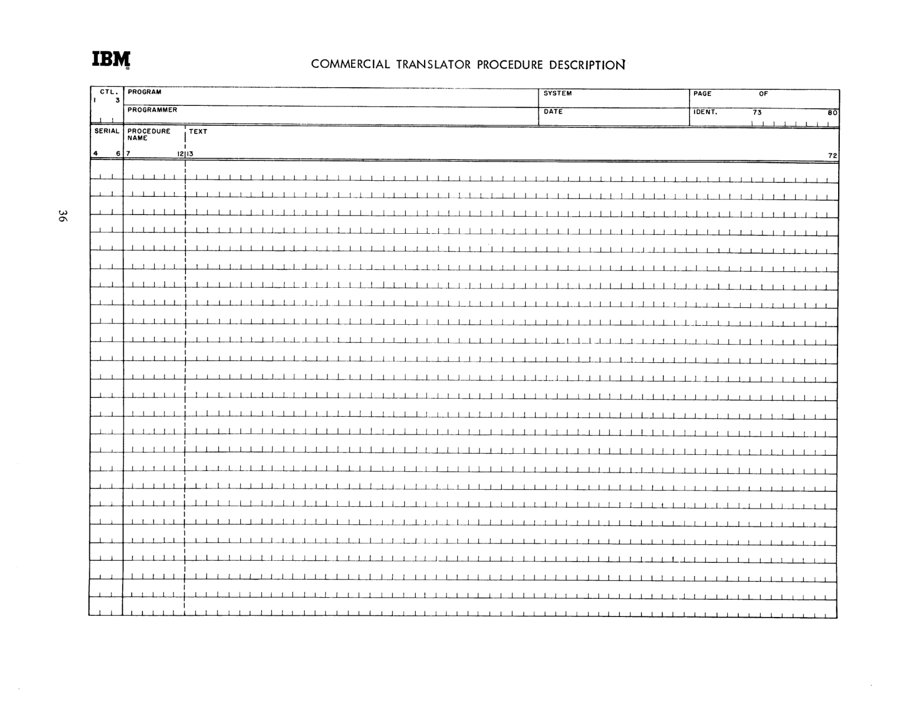
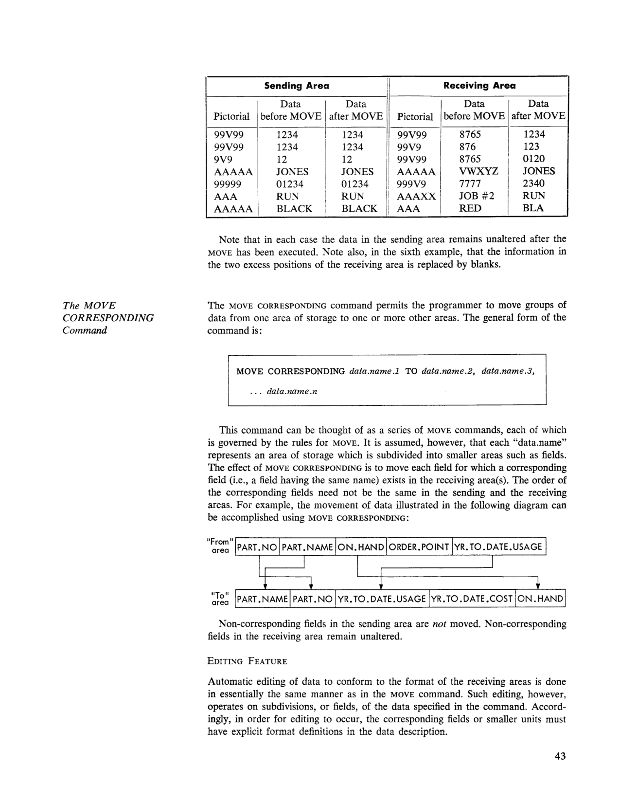
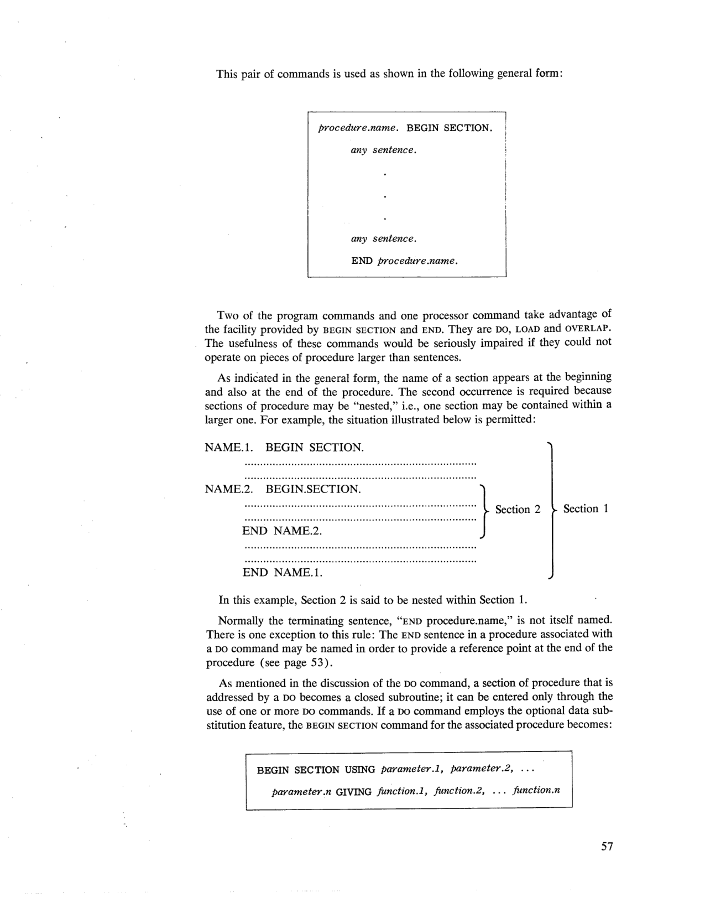

# Chapter 3: Procedure Description

<!-- page 35 | PDF 41 -->
**[page 35]**

## Introduction

This chapter is concerned with the verbs and commands which are presently a part
of the procedure vocabulary of the Commercial Translator language. The verbs
fall into two main categories. Most of them are used in commands that state the
data processing steps to be performed, and thus they are called "program" verbs.
The other category includes the "processor" verbs; these verbs are used in the
processor-directing commands.

## Verbs

The list of verbs is given below. The organization of this chapter is based on the
classification shown in the list:

### Program Verbs

```
OPEN     \
GET       |  Input/Output
FILE      |
CLOSE    /

MOVE        Data Transmission

SET      \
ADD      /  Arithmetic

GO TO    \
DO        |  Control
STOP     /

LOAD      \
DISPLAY   /  Miscellaneous
```

### Processor Verbs

```
OVERLAP
BEGIN SECTION
END
INCLUDE
CALL
NOTE
ENTER
```

The Commercial Translator system is designed as an "open-ended" programming
system. That is, the list of verbs and associated commands is never closed. The
processors are so constructed as to permit the introduction of new verbs and commands
when required.

## Commands

Most of the discussion in this chapter is concerned with commands. Each verb in
the preceding list forms the basis for a particular type of command; accordingly, the
various commands can be classified as either program commands or processor commands.
A command normally consists of a verb followed by one or more operands
and may be written as an imperative clause or as a sentence.

<!-- page 36 | PDF 42 -->
**[page 36]**


*Commercial Translator Procedure Description coding form (page 36).*

```
IBM              COMMERCIAL TRANSLATOR PROCEDURE DESCRIPTION

CTL.   PROGRAM                                             SYSTEM      PAGE     OF
1  3
       PROGRAMMER                                          DATE        IDENT.   73        80

SERIAL   PROCEDURE   TEXT
         NAME
4    6   7      12 13                                                                 72
```

*(The remainder of the form consists of ruled, unfilled lines for coding entries.)*

<!-- page 37 | PDF 43 -->
**[page 37]**

## Format of Procedure Statements

The clauses, sentences and sections that constitute the procedural portion of a
Commercial Translator source program are written in "free-form" text on a programming
form designed for that purpose. The form is shown on page 36; it has
just four fields, which are as follows:

### Ctl. and Serial (Col. 1-6)

Though separated on the form, the six spaces of "Ctl." and "Serial" are actually
one field; the information entered in the first three spaces is the same for all lines
on one page. This area of the form is used to indicate card sequence by means of
numbers and/or alphabetic characters. The information will be sequence-checked
by the processor. (Source programs are read by the processor in the form of a deck
of punched cards or their equivalent on tape; each line of the programming form
becomes one card in the source program deck.) The right-most space of this field,
i.e., Column 6, is usually left blank or else made zero so that subsequent inserts can
be numbered sequentially. For example, if the serials on a page are 010, 020, 030,
etc., cards numbered 011, 012, . . . 019 can be inserted later between 010 and 020.

### Procedure Name (Col. 7-12)

Columns 7-12 of the form are reserved for procedure-names, i.e., the names of
sentences or sections. It is convenient to speak of this field as the *name margin* of the
"Text" (see below) and to think of the procedure-names as "sticking out" into this
margin.

The rules for procedure-names are as follows:

1. The procedure header, \*PROCEDURE, is a special name that must appear on a
   separate line preceding each procedural portion of a source program to distinguish
   it from data description or environment description.
2. Procedure-names, like data-names, may contain up to thirty characters. Unlike
   data-names, however, they must be followed by a period and a blank.
3. Procedure-names are written left-justified in the name margin and, if longer
   than six characters, extend into the "Text" area.

### Text (Col. 13-72)

The procedure statements of the program are written in the "Text" area of the
programming form. A number of examples in this chapter, as well as the sample
program in Appendix 1, illustrate the manner in which the procedure is stated. The
clauses, sentences and sections of procedure are written in free form, subject to the
following rules:

1. A named sentence follows its name. That is, it begins to the right of the name
   margin, on the same line as its name.
2. An unnamed sentence must begin on a separate line and to the right of the
   name margin.
3. Succeeding lines of a sentence must begin to the right of the name margin. (If
   desired, they may be indented to facilitate reading the text.)
4. When a section of procedure is begun, only the BEGIN SECTION command may
   appear on the same line as the name of the section.
5. To end a section, the command "END section.name" is written as a sentence,
   i.e., on a separate line.

### Identification (Col. 73-80)

Columns 73-80 can be used to identify the program. The information entered here
will be the same for all lines on the page. The use of this area of the form is optional.

<!-- page 38 | PDF 44 -->
**[page 38]**

## Presentation of Commands and Examples

In the following description of the specific elements of the Commercial Translator
procedure vocabulary, each command is represented in its "general form." In each
case the general form is enclosed in a rectangular frame to distinguish it from text
and examples. The verbs and other words which are a fixed part of the language
appear in the general forms in boldface capital letters. The words and phrases
representing names, clauses and sentences which will be written by the programmer
are shown in lower-case italics. For reference purposes, the same general forms
are presented in Appendix 2 in a more concise manner, without any discussion. For
those commands that may contain a variable number of operands, a construction
such as, "data.name.1, data.name.2, . . . data.name.n" is used to indicate that as
many as "n" operands may be specified by the programmer. It is important to note
that, except for imbedded periods within italicized words, any punctuation shown
in the general form of a command is a fixed and necessary part of the command.

In contrast to the general forms, *examples* of the various commands are written
completely in capital letters and are not enclosed in frames.

## Program Commands

Each of the Commercial Translator program commands causes some event or series
of events to take place at object time, that is, the time at which the object program is
run. The program commands are discussed, in turn, in the following pages according
to the classification shown on the first page of this chapter.

### Input/Output Commands

Within the category of program commands it is helpful to consider the input/output
commands as a subgroup. The control of data flow through the data processing
system is accomplished by means of an input/output control system. This system is
called into play when the programmer uses one of the input/output commands in a
statement of the procedure to be executed. The four verbs associated with these
commands are OPEN, GET, FILE, and CLOSE.

Using the input/output commands, the programmer initiates the movement of
data into buffers or internal storage, the checking of the validity of the file itself,
the checking of the validity of the input or output operation, the storage of data in
internal storage to insure its availability when required, and finally, the making
available or filing away of data according to the needs of the program. Thus the
input/output control system provides data flow control and, where feasible, a "look
ahead" at the data flow.

The input/output control system in the Commercial Translator is a record processing
system. That is, the unit of data which is made available by the system and on
which attention is focused during each processing cycle is the record. Should the
needs of the program require that more than one record from a file be made available
for processing at one time, it will be necessary for the programmer to provide working
storage into which he will move the additional records as required.

The input/output control system provided in the initial version of the Commercial
Translator is intended for the handling of tape and card files. The detection of errors
is an implicit part of the tape and card handling system; error correction, where
feasible, is handled automatically. More specific information on the use of the data
flow control vocabulary is presented in the following paragraphs.

<!-- page 39 | PDF 45 -->
**[page 39]**

#### The OPEN Command

The OPEN command initiates the handling of one or more files. It may take either
of two general forms:

```
OPEN file.name.1, file.name.2, ... file.name.n
OPEN ALL FILES
```

The first form of the command causes only the named file(s) to be opened. When
the second form is used, all files specified in the environment description are opened.
A given file must be opened, of course, before it can be addressed by a GET or FILE
command.

If the file being opened is an input file, the following series of events occurs:

1. The label record, if any, is read into storage and checked for validity according
   to the standard label-handling conventions.
2. Subsequent records are brought into the portion of storage governed by the
   input/output control system, filling the area which has been allocated to the file.
3. Checking is performed, and a record count is initiated.

In the case of an output file the following events occur:

1. If specified by the programmer, a label record is created and written.
2. Preparation is made to file data records in the output file as they become available
   in processing.
3. Checking is performed, and a record count is initiated.

Some typical OPEN commands are:

```
OPEN INVENTORY.FILE.
OPEN ALL FILES.
OPEN STATISTICS, CUSTOMER.FILE, INVOICE.FILE.
```

#### The GET Command

The GET command is used to fetch records from an input storage area which is filled
automatically from a file stored on tape or cards. The programmer need be concerned
only with the use of single records since all auxiliary input operations such as

- unblocking
- tape alternation
- tape identification
- error checking
- reading ahead

are automatically provided in the object program by the processor, based on information
in the environment description.

The GET command may take either of two general forms:

```
GET RECORD FROM file.name
GET record.name
```

The first form of the command assumes that the specified input file contains more
than one type of data record. The record obtained may be of any type, and the
programmer must arrange to identify the type. The second form implies an input
file containing only one type of data record: the record is obtained from the file
associated with "record.name" in the environment description.

<!-- page 40 | PDF 46 -->
**[page 40]**

Either form of the GET causes the next record to be made available so that the
entire record or any of its parts may be used in processing. Note that the previous
record of the file is no longer addressable after the execution of a GET command.

To provide for the execution of an alternate command conditional upon end of
file, the optional phrase,

```
..., AT END any imperative clause
```

may be appended to either form of the GET. A command thus specified is performed
after the last record of a file has been made available for processing and a subsequent
GET command has been encountered. The programmer should always use the AT END
option if the possibility exists of reaching end of file upon execution of the GET.

When the GET command is executed at object time, the following events take
place:

1. The next record of the file is made available for processing.
2. If end of tape is reached, the end-of-tape label is read, and checks are made.
   The input tape is rewound, and provision is made for an alternate tape unit to
   be substituted.
3. If end of file is reached, any alternate command specified in the AT END phrase
   is performed.

Some examples of the use of GET are:

```
GET RECORD FROM INVOICE.FILE.
GET MASTER, AT END GO TO END.OF.MASTERS.
```

#### The FILE Command

The FILE command is used to place records on tape (for subsequent on-line or off-line
processing), on cards, or on the printer. The programmer is concerned only with
the placing of the unit record. Other considerations, such as

- blocking
- tape alternation
- file identification
- error checking
- setting checkpoints

are provided automatically by the data flow control system based upon information
supplied through the environment description. There are two forms of the FILE
command:

```
FILE record.name
FILE record.name IN file.name
```

In the first form the record is filed in the output file with which it has been associated
through the environment description. In the second form the named record
is filed from storage to the output file even though that record may not have been
hitherto associated with that file. Creating new records in working storage and then
merging them into a master file is an instance of the latter situation.

When the FILE command is executed at object time, the following events take
place:

1. The named record is added to the list of those awaiting write-out. When the

<!-- page 41 | PDF 47 -->
**[page 41]**

   proper number of records has been accumulated, writing occurs.
2. When the physical end of a reel is sensed, the end-of-reel label is prepared and
   written, arrangements are made for alternation of tape units, and the tape is
   rewound.
3. A count of the number of records written is maintained.

It should be noted that a record that has been filed is still available for further
processing. It is entirely possible, for example, to file a record in each of several
files by means of a succession of FILE commands.

Some examples of the FILE command are:

```
FILE MASTER.
FILE PAY.RECORD.
FILE DETAIL IN ERROR.FILE.
```

#### The CLOSE Command

The CLOSE command terminates the use of one or more data files. It may take either
of two general forms:

```
CLOSE file.name.1, file.name.2, ... file.name.n
CLOSE ALL FILES
```

In its first form the CLOSE command causes only the named file(s) to be closed.
With the second form, all files defined in the environment description are closed.

In the case of an input file the CLOSE command causes appropriate "housekeeping
" operations such as:

1. The record count is compared with the count in the end-of-file label if label
   records are present and if end of file has been reached. If the count does not
   agree, notification is given through external display. If the tape is not at end of
   file the record count is ignored.
2. If the file is on tape, a rewind is initiated.
3. The storage area allocated to the file is released for the use of other files.

If the addressed file is an output file, operations such as the following occur:

1. Any remaining information belonging to that file is written.
2. If specified by the programmer, an end-of-file label containing the record count
   is written.
3. The tape is rewound (if the file is on tape).
4. The storage area is released for the use of other files.

Each file which has been opened must ultimately be closed.

Examples of the CLOSE command are:

```
CLOSE INVENTORY.FILE, STATISTICS.
CLOSE ALL FILES.
```

### Data Transmission Commands

The transmission of data from one area of storage to another is implicit in the
functioning of a number of the Commercial Translator verbs. For example, the
SET verb requires the transmission of result data after the computation has been
performed. Except for one verb, however, such transmission is incidental to the
main purpose. It is the MOVE verb which has as its primary function the transmission
, or movement, of data from one area of storage to one or more other areas.
MOVE and its alternate form, MOVE CORRESPONDING, are used in writing the two
data transmission commands, which are described in the following paragraphs.

<!-- page 42 | PDF 48 -->
**[page 42]**

#### The MOVE Command

The MOVE command calls for the movement of data from one area of storage to
one or more other areas. Concurrent editing will occur automatically in certain cases
depending on the format of the data as defined in the data description. The general
form of the MOVE command is:

```
MOVE data.name.1 TO data.name.2, data.name.3, ... data.name.n
```

The data specified by "data.name.1" is moved to the area of storage designated
by "data.name.2" and to any other area(s) mentioned in the command (data.name.3,
. . . data.name.n). As used in this command "data.name" may represent data at any
level defined in the data description (see Chapter 4).

The following rules must be observed in writing MOVE commands:

1. Information from numeric fields may be moved to other numeric fields, to alphameric
   fields, and to report fields.
2. Information from alphabetic or alphameric fields may be moved only to other
   alphabetic or alphameric fields.

Some examples of the MOVE command are:

```
MOVE CURRENT.DATE TO CHECK.DATE.
MOVE ZEROS TO MONTH.TOTAL, YEAR.TOTAL, CUMUL.TOTAL.
```

##### EDITING FEATURE

Editing of the data in the sending area to conform to the format of the receiving
area is a feature of the MOVE command. Such editing occurs automatically if an
explicit format definition, i.e., a field pictorial, is given in the data description for
both the "from" and the "to" areas. (The field pictorial is a convenient method of
describing formats and is discussed in detail in the data description portion of the
manual; see page 79.)

The following conventions are observed in the editing feature of the MOVE
command:

**Numeric Information**

The data from the sending area is aligned with respect to the decimal point
(assumed or actual) in the receiving area. Such alignment may involve the
dropping of leading digits or low-order digits (or both if the sending field is
larger than the receiving one). If the "from" area is smaller than the "to"
area, the excess positions of the receiving area will be replaced by zeros.

**Alphameric Information**

If the sending area is larger than the receiving area, the data being moved will
be left-justified and truncated; i.e., low-order characters will be dropped as may
be necessary to make the data fit into the receiving area. If the sending area is
the smaller, the data will be left-justified in its new location. The low-order
positions of the receiving area, i.e., the excess positions, will be filled with
blanks.

A few examples are included below to clarify the editing feature. Regarding the
pictorials shown in each case, for the purposes of these examples it is sufficient to
know that the digit 9 represents any digit, the character A any non-numeric character
, the character X any character, and that V shows the position of the assumed
decimal point.

<!-- page 43 | PDF 49 -->
**[page 43]**

| Sending Area Pictorial | Sending Data before MOVE | Sending Data after MOVE | Receiving Area Pictorial | Receiving Data before MOVE | Receiving Data after MOVE |
|---|---|---|---|---|---|
| 99V99 | 1234 | 1234 | 99V99 | 8765 | 1234 |
| 99V99 | 1234 | 1234 | 99V9 | 876 | 123 |
| 9V9 | 12 | 12 | 99V99 | 8765 | 0120 |
| AAAAA | JONES | JONES | AAAAA | VWXYZ | JONES |
| 99999 | 01234 | 01234 | 999V9 | 7777 | 2340 |
| AAA | RUN | RUN | AAAXX | JOB #2 | RUN |
| AAAAA | BLACK | BLACK | AAA | RED | BLA |


*Sending/Receiving Area MOVE editing examples, and diagram of MOVE CORRESPONDING field mapping between a "From" area (PART.NO, PART.NAME, ON.HAND, ORDER.POINT, YR.TO.DATE.USAGE) and a "To" area (PART.NAME, PART.NO, YR.TO.DATE.USAGE, YR.TO.DATE.COST, ON.HAND) (page 43).*

Note that in each case the data in the sending area remains unaltered after the
MOVE has been executed. Note also, in the sixth example, that the information in
the two excess positions of the receiving area is replaced by blanks.

#### The MOVE CORRESPONDING Command

The MOVE CORRESPONDING command permits the programmer to move groups of
data from one area of storage to one or more other areas. The general form of the
command is:

```
MOVE CORRESPONDING data.name.1 TO data.name.2, data.name.3,
    ... data.name.n
```

This command can be thought of as a series of MOVE commands, each of which
is governed by the rules for MOVE. It is assumed, however, that each "data.name"
represents an area of storage which is subdivided into smaller areas such as fields.
The effect of MOVE CORRESPONDING is to move each field for which a corresponding
field (i.e., a field having the same name) exists in the receiving area(s). The order of
the corresponding fields need not be the same in the sending and the receiving
areas. For example, the movement of data illustrated in the following diagram can
be accomplished using MOVE CORRESPONDING:

```
"From"  | PART.NO | PART.NAME | ON.HAND | ORDER.POINT | YR.TO.DATE.USAGE |
 area

"To"    | PART.NAME | PART.NO | YR.TO.DATE.USAGE | YR.TO.DATE.COST | ON.HAND |
 area
```

Non-corresponding fields in the sending area are *not* moved. Non-corresponding
fields in the receiving area remain unaltered.

##### EDITING FEATURE

Automatic editing of data to conform to the format of the receiving areas is done
in essentially the same manner as in the MOVE command. Such editing, however,
operates on subdivisions, or fields, of the data specified in the command. Accordingly
, in order for editing to occur, the corresponding fields or smaller units must
have explicit format definitions in the data description.

<!-- page 44 | PDF 50 -->
**[page 44]**

### Arithmetic Commands

Two of the verbs in the Commercial Translator vocabulary are used for arithmetic.
They are SET and ADD. These two verbs form the basis for the three types of
arithmetic commands, as follows:

#### The SET Command

The SET command permits the programmer to specify a computation or a sequence
of computations. It can be used for all arithmetic. The general form of this command
is:

```
SET variable.1, variable.2, ... variable.n = arithmetic expression
```

The equal sign in the SET command is used in the sense of replacement. It means,
"replace the value of the variable(s) on the left side of the equal sign with the value
of the expression on the right." If required, the result of a computation will be
edited automatically according to the format of a receiving field as specified in the
data description. For example, if a result represents an amount of money, editing
appropriate to the defined format of the money field will be performed.

Ordinarily the result of the SET operation will be rounded to the number of places
indicated by the format description of the result field or fields. If the dropping of
digits (instead of rounding) is desired, the arithmetic expression is followed by

```
... TRUNCATED
```

In the process of storing the final result of a SET command it is possible for a loss
of significant high-order digits to occur. For example, if a result field has been
defined as having three places to the left of the decimal point and a result such as
1001 is developed, the high-order "1" will be lost. This situation is known as
"overflow." If the SET command specifies just one result field (i.e., if it has only
one variable-name to the left of the equal sign), the programmer may anticipate
and provide for an overflow by appending

```
..., ON OVERFLOW any imperative clause
```

at the end of the SET command. In the event of an overflow, the object program
will execute the command thus specified instead of storing the erroneous result.

Some examples of the SET command are:

```
SET GROSS.PAY = BASE.RATE * 40.
SET NET.PAY = GROSS.PAY − (FICA + STATE.TAX +
    DEDUCTIONS).
SET A= B * (C + D), ON OVERFLOW GO TO ERROR.
SET REORDER = ORDER.AMT * TR (STOCK.LEVEL LT
    ORDER.POINT).
SET APPROX = 2 * SQUARE.ROOT ((X)) TRUNCATED.
SET A, B, C =D.
```

<!-- page 45 | PDF 51 -->
**[page 45]**

The second of these examples shows the way in which subexpressions may be
contained in parentheses when required. Likewise, the examples taken together
illustrate the use of each element which may appear in an arithmetic expression,
viz., arithmetic operators, names of variables and constants, literals, truth functions,
and function-names. Each of these elements is considered individually below even
though it may be discussed in greater detail elsewhere in the manual. (The formal
rules governing the formation of arithmetic expressions are given in Appendix 2.)

##### ARITHMETIC OPERATORS

The following arithmetic operators are used to join other elements to form meaningful
arithmetic expressions:

| Operator | Written as |
|---|---|
| Addition | + |
| Subtraction | − |
| Multiplication | `*` |
| Division | `/` |
| Exponentiation | `**` |

These operators are sometimes referred to as "binary" operators because each
of them relates two quantities. There are three additional arithmetic operators
known as "unary" operators. They are:

| Operator | Written as |
|---|---|
| Negation | − |
| Absolute value | ABS |
| Truth value | TR |

These operators affect only the quantity or expression which follows, hence the
term unary. If the operand of a unary operator is an expression it must be enclosed
in parentheses, as in these examples:

```
... + ABS (A + B)
... * (−(ON.HAND + ON.ORDER))
... TR (A IS LESS THAN B)
```

##### VARIABLES AND CONSTANTS

Data-names which represent numeric variables or constants may appear anywhere
in arithmetic expressions. Those which represent alphameric variables and constants
, however, may appear only within truth functions.

##### LITERALS

Literals may be used as needed in arithmetic expressions. Literals used in the above
examples of the SET command are 40 in the first example and 2 in the fifth.

##### TRUTH FUNCTIONS

A conditional expression enclosed in parentheses preceded by the truth operator
TR is known as a truth function. A truth function always has one of two values,
1 or 0, depending on whether the conditional expression is true or false.

<!-- page 46 | PDF 52 -->
**[page 46]**

Accordingly, a truth function can be manipulated arithmetically in the same manner as
any other quantity.

In the fourth of the preceding SET command examples, TR (STOCK.LEVEL LT
ORDER.POINT) is a truth function. When the SET command is executed, the relation
between STOCK.LEVEL and ORDER.POINT is evaluated. If the relation is true, that is,
if STOCK.LEVEL is less than ORDER.POINT, then the truth function takes the value 1.
If the relation is false, it becomes 0. The result of this SET command, then, is to
cause the field REORDER to contain the order amount if stock level is below order
point, or zero if the stock level is at or above order point.

##### FUNCTION-NAMES

The names of functions are used in arithmetic expressions in much the same way
as data-names or literals. That is, a function-name is treated as a quantity, as in
the fifth of the preceding examples of the SET command, where the square root of X
is multiplied by 2 and truncated to obtain the result. There are some differences,
however, between data-names and function-names. Data-names represent values
which, at object time, are immediately available for arithmetic operations. Function-names,
on the other hand, imply an evaluation process at object time. The
evaluation is carried out by procedural statements identified by a BEGIN SECTION
command (see page 56). These procedure statements deliver a value to be used in
computing the value of the arithmetic expression.

#### SET Used with Condition Names

The SET command has a second function that is not strictly arithmetic. It provides
a convenient way of changing the status of a conditional variable, i.e., a variable
which has one or more conditions associated with it. When SET is used for this
purpose it takes the general form:

```
SET condition.name
```

As a result of this command, the variable with which "condition.name" is associated
(in the data description) is assigned the status, or value, of the specified
condition.

Using the example mentioned in Chapter 2, if the current value of the variable
MARITAL.STATUS is SINGLE and the programmer wishes to change it to MARRIED,
he simply writes:

```
SET MARRIED.
```

This is the equivalent of writing:

```
SET MARITAL.STATUS = 'M'.
```

It is important to recognize the distinction between testing and setting the value
of a conditional variable. Testing the value provides a basis for a decision but does
not change the value; the testing is accomplished by using a conditional clause,
IF . . . THEN. Setting a value of a conditional variable, on the other hand, causes the
current value to be replaced by another of the possible values and is effected by
means of the SET command.

<!-- page 47 | PDF 53 -->
**[page 47]**

#### The ADD Command

The ADD command provides a way to add a given quantity to each of one or more
variable quantities. The general form is:

```
ADD data.name TO variable.1, variable.2, ... variable.n
```

The effect of the ADD command is to increment the one or more named variables
by the quantity represented by "data.name." In this context, "data.name" may be a
literal or the name of a variable, constant or function.

The optional phrases TRUNCATED and ON OVERFLOW described above in conjunction
with the SET command are equally applicable to the ADD command. As in the
case of SET, the ON OVERFLOW option is permitted only if the command specifies
a single result field.

Some examples of the use of ADD are:

```
ADD GROSS.PAY TO YR.TO.DATE.GROSS.
ADD 1 TO COUNTER, ON OVERFLOW GO TO BEGIN.
ADD ADJUST.FACTOR TO RATE TRUNCATED.
```

#### The ADD CORRESPONDING Command

This command permits the programmer to specify a series of additions. Its general
form is:

```
ADD CORRESPONDING data.name.1 TO data.name.2, data.name.3,
    ... data.name.n
```

Each "data.name" in an ADD CORRESPONDING command must represent an area
of storage which is composed of smaller units or fields. The effect of the command
is to cause each field in "data.name.1" to be added to its corresponding field (i.e., a
field with the same name) in the "to" area(s). Non-corresponding fields in
"data.name.1" and in the "to" areas are not affected by the command.

To illustrate, suppose that the programmer wishes to accumulate department
totals and grand totals from certain fields in each detail record of a payroll. The
detail-record fields involved might be GROSS.PAY, FICA, FED.TAX, STATE.TAX and
DEDUCTIONS. Having defined DEPT.TOTALS and GRAND.TOTALS as records containing
corresponding fields, the programmer could write:

```
ADD CORRESPONDING DETAIL.RECORD TO DEPT.TOTALS,
    GRAND.TOTALS.
```

This one command would cause all of the desired totals to be accumulated; it
would have the same effect as writing:

```
ADD DETAIL.RECORD GROSS.PAY TO DEPT.TOTALS
    GROSS.PAY, GRAND.TOTALS GROSS.PAY.
ADD DETAIL.RECORD FICA TO DEPT.TOTALS FICA,
    GRAND.TOTALS FICA.
ADD DETAIL.RECORD FED.TAX TO DEPT.TOTALS FED.TAX,
    GRAND.TOTALS FED.TAX.
ADD DETAIL.RECORD STATE.TAX TO DEPT.TOTALS
    STATE.TAX, GRAND.TOTALS STATE.TAX.
ADD DETAIL.RECORD DEDUCTIONS TO DEPT.TOTALS
    DEDUCTIONS, GRAND.TOTALS DEDUCTIONS.
```

<!-- conversion notes:
- Page 36 (PDF 42) is a blank "Commercial Translator Procedure Description" coding
  form facsimile; embedded as an image. Only the printed column-header labels are
  transcribed (the body of the form is ruled but otherwise blank).
- Page 43 (PDF 49) contains a complex ruled table (Sending Area / Receiving Area
  editing examples, with merged group headers) and an arrow diagram illustrating
  MOVE CORRESPONDING field mapping. Both were reproduced as best-effort
  Markdown (table and a plain-text field list) and the page image was also embedded
  per the complex-table/diagram rule.
- The subtraction/negation operator, printed in the source as a short horizontal dash,
  is rendered here as the Unicode minus sign "−" throughout for consistency (e.g.,
  "GROSS.PAY − (FICA + ...)").
- The bracket/brace grouping used in the Program Verbs list (page 35) to associate
  OPEN/GET/FILE/CLOSE, SET/ADD, GO TO/DO/STOP, and LOAD/DISPLAY with their
  category labels was approximated with slash/pipe characters in a fenced code block;
  no data was altered.
- No overpunched/overbar digits occur in this page range.
- No pages in this range required full image-only fallback for body text; all running
  text was transcribed and verified against the page images.
-->

<!-- page 48 | PDF 54 -->
**[page 48]**

### Control Commands

The control commands enable the programmer to state the logical flow of a program. During the execution of the object program the procedure is normally executed in the order in which it appears in the source program. The control commands are used primarily to specify a departure from this sequence in order to execute some other portion of the program. The verbs that form the basis of the Commercial Translator control commands are GO TO, DO, and STOP.

#### The GO TO Command

The GO TO command is used to specify transfer-type operations. It has three forms:

##### UNCONDITIONAL

The unconditional GO TO is written:

```
GO TO procedure.name
```

It provides a transfer of control, or branching, to the item of procedure named in the command. The "procedure.name" may be the name of either a sentence or a section in the procedural part of the source program.

Some examples are:

```
GO TO MAIN.ROUTINE.
GO TO CALC.ORDER.POINT.
```

##### CONDITIONAL

The conditional GO TO command is essentially a multiple branch or switching point; from this point, control may pass to one of several places in the program. As the name implies, the transfer of control depends on the truth or falsity of one or more conditional expressions. The general form of the command is:

```
GO TO procedure.name.1 WHEN conditional expression 1,
     procedure.name.2 WHEN conditional expression 2, ...
     procedure.name.n WHEN conditional expression n
```

When the conditional GO TO is executed at object time, each conditional expression is evaluated in turn until one is found to be true. Thereupon, control is transferred to the "procedure.name" associated with that conditional expression. Any remaining conditional expressions are left unevaluated. If none of the conditional expressions in the command is found to be true, control passes to the next clause or sentence in sequence.

The following is a typical use of the conditional GO TO:

```
GO TO ERROR.RTN WHEN DETAIL IS LESS THAN MASTER,
     PROCESSING WHEN DETAIL IS EQUAL TO MASTER,
     NO.ACTIVITY WHEN DETAIL IS GREATER THAN MASTER.
```

##### ASSIGNED

The assigned GO TO command also serves as a multiple branch point in a program. In this case, however, the transfer of control depends upon the prior setting of an

<!-- page 49 | PDF 55 -->
**[page 49]**

index rather than on the truth or falsity of conditional expressions. The setting of the index may have occurred in one of two ways:

1. Through bringing the index into storage as a constant or file variable.
2. As a result of computation involving the index.

The general form of the command is:

```
GO TO ( procedure.1, procedure.2, ... procedure.n ) ON index.name
```

A transfer of control will be made according to the value of the index at the time the GO TO is executed. If the value of the index is 1, control will pass to the first sentence or section of procedure named in the command; if 2, the second item named; and so on.

The functioning of the assigned GO TO command assumes that the value of the index will always be an integer in the range 1 to n. If the index has any other value, no transfer will occur; instead, control will pass to the next clause or sentence in sequence.

To illustrate, suppose that in a payroll job several different methods are used to compute gross pay depending on the employee's classification. The programmer might use an assigned GO TO command to effect a transfer to the appropriate routine, as follows:

```
GO TO (PIECE.WORK, INCENTIVE, HOURLY.RATE, SALARY) ON
     PAY.TYPE.
```

The index PAY.TYPE in this case would be a field in each employee record which would contain a 1, 2, 3, or 4 depending on the employee's classification.

Note that the parentheses shown in both the general form and the example are a fixed part of the command and must always be included.

#### The DO Command

The DO command provides a means of departing from the normal sequence of program steps in order to execute some procedure, i.e., some other portion of program, and then return to the original sequence. In other words, the DO is used to execute subroutines which, in the Commercial Translator system, are either named sentences or sections.

The DO command may take one of several forms. In the simplest form of the command the procedure is executed once each time the DO is encountered. Expanded forms of the command permit repetitive execution, or "looping," of the subroutine and control of subscripts. Data substitution, which is an optional feature, is also provided.

The simpler forms of the DO command are:

```
DO procedure.name
DO procedure.name EXACTLY n TIMES
```

where "procedure.name" represents the name of a sentence or section. (If a procedure consists of more than one sentence, it must be defined as a section in order to be named. The processor commands BEGIN SECTION and END are used to define

<!-- page 50 | PDF 56 -->
**[page 50]**

sections.)

Any procedure, i.e., any sentence or section, that is referred to by a DO command must be what is known technically as a "closed" or "linked" subroutine. That is, it must be entered only through the use of a DO command, and not by any other means such as transfer of control to a sentence within the procedure or through the normal passage of control to the first sentence of the procedure. It should be noted, however, that this rule permits the addressing of a procedure by more than one DO command.

When the DO command takes the first of the two forms shown above, the "procedure.name" subroutine is executed only once and control passes to the sentence or clause following the DO.

For example, the programmer might write:

```
DO CALC.ORDER.POINT.
IF ORDER.POINT IS LESS THAN 2.5 * MONTHLY.USAGE THEN
     GO TO . . .
```

The DO command in this example will cause the CALC.ORDER.POINT procedure (subroutine) to be executed once, whereupon control will pass to the IF ORDER.POINT IS . . . sentence.

With the second form of the command the "procedure.name" procedure is executed the specified number of times. The number of repetitions, n, may be stated as a literal or as a data-name, but in either case the value of n must be a positive integer. To illustrate this form of the DO, suppose that in a payroll program a field called BOND.ACCUM is divided by another field, BOND.DENOM, and the result truncated to an integer in order to determine the number of bonds purchasable. The result might be called NO.OF.BONDS. Then the programmer could write:

```
DO BOND.ORDER.RTN EXACTLY NO.OF.BONDS TIMES.
```

This example assumes, of course, that the payroll program contains a procedure called BOND.ORDER.RTN which is used to prepare a file of bond orders.

#### The DO Command with Indexing

Repetitive execution, or looping, of a procedure based on indexing is provided in the more powerful forms of the DO command. To control a single index and/or provide subscript control of the variables associated with the index, the DO command takes the form:

```
DO procedure.name FOR index.name = p(q)r
```

where "index.name" represents a field which has been defined in the data description as an integer. The effect of this DO command (in the object program) is to set the index to the initial value p and transfer control to the first sentence of the named procedure. After the last sentence of the procedure has been reached and executed, control is returned to the DO command which increments the index by the quantity q and causes control to return to the "loop." This process is repeated until the value of the index equals r; at this point, control is no longer returned to the loop but instead passes to the sentence or clause which follows the DO. To state this another way, the command, "DO rtn FOR i = p(q)r" is the equivalent of:

<!-- page 51 | PDF 57 -->
**[page 51]**

```
        SET i = p.
START.  DO rtn.
        IF i = r THEN GO TO NEXT.
        ADD q TO i.
        GO TO START.
NEXT.   .
        .
        .
```

Each of the loop control parameters p, q and r may be either of the following:

1. A literal having an integer value.
2. The name of a field defined as an integer.

The following example shows a DO command of this form:

```
DO RATE.UPDATE.CALC FOR STATE = 1(1)50.
```

In this example, each item in a rate table is being updated. The table contains fifty entries—a rate for each state. The procedure RATE.UPDATE.CALC might appear as:

```
RATE.UPDATE.CALC.  SET RATE (STATE) = RATE (STATE) *
     ADJUST.FACTOR + FLAT.AMT.
```

This procedure will be executed repeatedly, once for each value of the index STATE (from 1 through 50). The value of STATE (in the DO command) at any given time specifies which table item is to be dealt with in the procedure. Thus, the variable RATE is said to be subscripted by the index STATE.

When it is desired to control two indices during the execution of a DO, thus providing a loop within a loop, the command takes the form:

```
DO procedure.name FOR index.name.1 = p.1(q.1)r.1, index.name.2 = p.2(q.2)r.2
```

In this case, "index.name.1" and "index.name.2" are initially set to p.1 and p.2 respectively. Each time the inner loop is executed, index.name.2 is incremented by q.2 until it equals r.2; thereupon, index.name.2 is reset to p.2 and index.name.1 is set to p.1 + q.1. Control is returned to the inner loop and the process is repeated. When index.name.1 is equal to r.1, control passes to the clause or sentence which follows the DO.

A maximum of three indices may be controlled with the DO command. Again, the rightmost index is the one which varies most rapidly. The following example illustrates the DO controlling three indices:

```
DO COMPUTATION FOR HOURS = 1(1)12, MINUTES = 1(1)60,
     SECONDS = 1(1)60.
```

In this case, the procedure COMPUTATION is executed with the index SECONDS being incremented from 1 through 60 (in increments of 1), at which time MINUTES is increased by 1 and SECONDS again runs to 60. When the index MINUTES reaches 60 the index HOURS is incremented by 1, and so on. After HOURS has reached 12, the loop is completed and control passes to the operation following the DO. The subroutine will have been executed 60x60x12 times.

<!-- page 52 | PDF 58 -->
**[page 52]**

#### The DO Command with Data Substitution

Frequently, a procedure which has been written for a particular purpose can be used at some other point in a program only if provision is made to substitute different items of data to be operated on by the procedure. Such substitution could be specified by writing appropriate MOVE commands in conjunction with the second DO command. For example, if a procedure operates on three pieces of data called A, B, and C and produces two results, D and E, the programmer could use the procedure with other items of data by writing:

```
MOVE V TO A.
MOVE W TO B.
MOVE X TO C.
DO PROCEDURE.
MOVE D TO Y.
MOVE E TO Z.
```

Since this method is somewhat laborious, the Commercial Translator language provides a facility for writing procedures in a generalized form in order to accomplish the same result. Procedures which are to be used with data substitution are always defined by the two processor commands "BEGIN SECTION USING . . . GIVING . . ." and "END" (see page 56).

Data substitution can be specified in each of the several forms of the DO command. When this feature is utilized, the general form of the simplest DO becomes:

```
DO procedure.name USING data.name.1, data.name.2, ...
     data.name.n GIVING result.name.1, result.name.2 ...
     result.name.n
```

Similarly, if data substitution is desired in the other forms of the DO command, the "USING . . . GIVING . . ." option is simply appended to the command.

The "data.names" in the command specify the variable data, constants or literals which, at object time, are substituted for the data represented by the corresponding names (parameters) that appear in the "procedure.name" routine. Likewise, the "result.names" are the names which become associated with the outputs of the subroutine.

The data substitution feature of the language being discussed here should not be confused with name substitution, which is another feature of Commercial Translator. Name substitution is effected by the INCLUDE command and occurs at processing time; it involves the replacement of names in library procedures that are being incorporated in a program (see page 58).

To illustrate data substitution using a more complete example, suppose that the following procedure has already been written into a program. This procedure is designed to determine a minimum value:

```
MIN.ROUT.  BEGIN SECTION USING A, B, C GIVING MIN.
     IF A IS LESS THAN B THEN MOVE A TO MIN OTHERWISE MOVE
          B TO MIN.
     IF C IS LESS THAN MIN THEN MOVE C TO MIN.
END MIN.ROUT.
```

In one portion of his program the programmer might have used this MIN.ROUT procedure to determine the lowest of three rates called R.RATE, E.RATE, and M.RATE using the command:

<!-- page 53 | PDF 59 -->
**[page 53]**

```
DO MIN.ROUT USING R.RATE, E.RATE, M.RATE GIVING MIN.RATE.
```

The effect of this DO command is equivalent to the following commands:

```
MOVE R.RATE TO A.
MOVE E.RATE TO B.
MOVE M.RATE TO C.
DO MIN.ROUT.
MOVE MIN TO MIN.RATE.
```

Now, in another part of the program, the programmer wishes to compare two ages and a constant value to determine the lowest of the three values. The MIN.ROUT procedure will serve the purpose in this situation as well. This time, however, the programmer writes:

```
DO MIN.ROUT USING INSURED.AGE, BENEFIC.AGE, 70 GIVING
     LOW.AGE.
```

Again the appropriate data substitutions are made when the DO command is executed. As a result, the two values representing ages will be compared with the literal value 70, and the lowest of the three will become the value of LOW.AGE.

#### The DO Command with Named END

When a DO command is compiled, the processor places appropriate instructions in the object program to effect transfer of control between the DO and the associated procedure and to perform any indexing operations specified in the DO. For correct functioning of the DO, these control instructions must be executed each time an iteration of the associated procedure is executed. The control instructions are performed following the last program command specified in the procedure. Accordingly, a problem arises in the case of a multi-sentence procedure in which the last program command is executed only under certain conditions, i.e., when the logic of the procedure requires a conditional exit prior to the last program command. The solution to the problem is to name the "END procedure.name" sentence which terminates the procedure and to use this name as an exit point. (Normally the END sentence is not named; this is the only exception to the rule.) This provides the necessary linkage with the control instructions. The following DO command and its associated procedure illustrate this situation:

```
DO REORDER.RTN FOR PART.NO = 1001(1)1499.
        .
        .
        .
REORDER.RTN.  BEGIN SECTION.
        IF QTY.ON.HAND(PART.NO) IS GREATER THAN ORDER.POINT
             (PART.NO) THEN GO TO EXIT.
        SET REORDER.AMT(PART.NO) = ORDER.AMT(PART.NO) -
             QTY.ON.HAND(PART.NO).
EXIT.   END REORDER.RTN.
```

In this example the logic of the procedure requires that the current iteration be terminated after the first sentence if the conditional clause is true. Assigning the name EXIT to the END sentence makes it possible to bypass the latter part of the procedure and yet maintain the necessary linkage with the control instructions.

<!-- page 54 | PDF 60 -->
**[page 54]**

#### The STOP Command

The STOP command is used to specify a halt in the object program. Its general form is simply:

```
STOP n
```

where n is an integer.

The number n will be displayed when the command is executed, i.e., when the machine halts. Restarting the machine causes execution of the object program to be resumed beginning with the next command in sequence.

For a "dead-end" halt, an unconditional GO TO command placed immediately following the STOP can be used to effect a transfer back to the STOP command.

### Other Program Commands

In addition to the commands described in the foregoing pages there are two program commands that do not fall into any of the four categories discussed. These "miscellaneous" commands, which employ the verbs LOAD and DISPLAY, are described in the following paragraphs:

#### The LOAD Command

Since an object program may exceed the capacity of internal storage, a facility is needed for keeping a part of the program in "standby status" (in external storage) and for calling it in to replace a portion of the program currently in internal storage. The LOAD command, used in conjunction with the processor command OVERLAP, provides this facility. The general form of the LOAD command is:

```
LOAD procedure.name
```

where "procedure.name" is the name of a portion of the program which, at object time, will be waiting in external storage. The LOAD command causes this unit of procedure to be brought into the area of storage shared by the procedures mentioned in the associated OVERLAP command. The portion of the object program formerly occupying that area is replaced by the new portion but can be retrieved later by another LOAD command.

Any unit of procedure addressed by a LOAD command must be named in an OVERLAP command.

The use of the LOAD command is illustrated in the example given in the discussion of the OVERLAP command (see page 56).

#### The DISPLAY Command

At certain times during the running of the object program, the programmer may wish to examine particular values of data in internal storage, or may need to send messages to the operator. The DISPLAY command causes the object program to present such low-volume information on an appropriate output device or display medium. The general form of the DISPLAY command is:

```
DISPLAY 'any message' data.name 'any message'
```

The DISPLAY command displays all the information that follows the word DISPLAY up to, but not including, a comma or period not enclosed in quotation marks.

<!-- page 55 | PDF 61 -->
**[page 55]**

The quotation marks in the DISPLAY command have precisely the same meaning as in alphameric literals. The information within the quotation marks will be displayed exactly as it appears in the command. Substitution of a value for its name may be specified by writing the name outside the pair(s) of quotation marks. That is, if the programmer wishes the current value of a data-name rather than the data-name itself to appear in a message, he arranges the text so that the data-name is not enclosed within a pair of quotation marks.

To illustrate this point, suppose that the following command is written:

```
DISPLAY 'VALUE OF WAGES LESS DEDUCTIONS IS NET.PAY'.
```

The resulting display at object time will be:

```
VALUE OF WAGES LESS DEDUCTIONS IS NET.PAY
```

This is obviously not what the programmer intended. Had the command been written,

```
DISPLAY 'VALUE OF WAGES LESS DEDUCTIONS IS' NET.PAY.
```

the message at object time would be:

```
VALUE OF WAGES LESS DEDUCTIONS IS $67.75
```

assuming that the current value of NET.PAY was $67.75.

The name of the variable outside the parentheses may be subscripted. It must represent a defined field, however, and not an arithmetic combination of fields.

The manual for each Commercial Translator processor will specify the standard display device for the respective machine system.

## Processor Commands

The Commercial Translator processor commands are instructions to the processor; they cause the processor to take certain specific action. Some of the processor commands have an indirect effect on the object program. Others, such as NOTE, have no effect whatsoever on the object program. In general, the processor commands do not generate instructions in the object program.

### The OVERLAP Command

An object program produced by the Commercial Translator system is organized as one loading of storage unless the programmer specifies otherwise by means of the OVERLAP command. This command designates portions of the program that are to occupy (at different times) the same area in internal storage. The general form is:

```
OVERLAP procedure.name.1, procedure.name.2, ...
     procedure.name.n
```

As mentioned previously, OVERLAP is used in conjunction with the program command LOAD. OVERLAP instructs the processor to assign the same area of memory for the procedures mentioned in the command. LOAD, on the other hand, causes one of the procedures to be called in at object time so that it can be executed.

When the processor assigns storage space for the two or more procedures, it sets aside an area large enough to accommodate the longest. Thus when a procedure is

<!-- page 56 | PDF 62 -->
**[page 56]**

loaded over one which is longer, not all of the earlier procedure will be "erased." Accordingly, all overlapped procedures should have an unconditional GO TO as the last command.

The loading of an overlapped procedure does not cause its execution. The programmer must specify a transfer of control to the procedure by means of a GO TO or a DO command. Also, care should be taken to insure that a LOAD command does not appear within the procedure it obliterates. This would cause the destruction of the subsequent commands which effect transfer out of the procedure.

When a source program includes one or more OVERLAP commands, the object program will be organized as follows:

1. The initial loading of storage will include all parts of the program not mentioned in any OVERLAP, plus the first procedure named in each OVERLAP command.
2. Any procedures not included in the initial loading may be called in by a LOAD command.
3. Any procedure that has been obliterated by a LOAD command may be retrieved (in its original form) by another LOAD command.

A simple example of the use of the OVERLAP and LOAD commands is as follows. The "housekeeping" portion of a program is to be executed and then overlapped by the main part of the program. Assuming that both procedures, i.e., both of these parts of the program, consist of more than one sentence, each must be treated as a section in order to apply names. The structure might be represented as follows:

```
HOUSEKEEPING.  BEGIN SECTION.
        ..................................................
        ..................................................
        ..................................................
        .................................., GO TO SUPERVISOR.1.
END HOUSEKEEPING.

MAIN.ROUTINE.  BEGIN SECTION.
        ..................................................
        ..................................................
        ..................................................
        ..................................................
END MAIN.ROUTINE.

SUPERVISOR.1.  LOAD MAIN.ROUTINE, GO TO MAIN.ROUTINE.
```

Elsewhere in the source program, probably included with the other processor commands, the programmer would write:

```
OVERLAP HOUSEKEEPING, MAIN.ROUTINE.
```

As indicated in the schematic program above, the program command, LOAD MAIN.ROUTINE, is placed outside the housekeeping routine, possibly in a short supervisory routine.

### The BEGIN SECTION and END Commands

The two processor commands, BEGIN SECTION and END, perform a simple but important function. They are used to delimit sections of procedure and thus extend the range of a procedure-name. That is, they enable the programmer to give names to units of procedure that consist of more than one sentence. Unless BEGIN SECTION and END are used, a procedure-name applies only to the sentence which follows it.

<!-- page 57 | PDF 63 -->
**[page 57]**

This pair of commands is used as shown in the following general form:

```
procedure.name.  BEGIN SECTION.
     any sentence.
     .
     .
     .
     any sentence.
END procedure.name.
```

Two of the program commands and one processor command take advantage of the facility provided by BEGIN SECTION and END. They are DO, LOAD and OVERLAP. The usefulness of these commands would be seriously impaired if they could not operate on pieces of procedure larger than sentences.

As indicated in the general form, the name of a section appears at the beginning and also at the end of the procedure. The second occurrence is required because sections of procedure may be "nested," i.e., one section may be contained within a larger one. For example, the situation illustrated below is permitted:

```
NAME.1.   BEGIN SECTION.
        ..................................................
        ..................................................
NAME.2.   BEGIN SECTION.
        ..................................................
        ..................................................
          END NAME.2.
        ..................................................
        ..................................................
          END NAME.1.
```


*Nested sections diagram: Section 2 nested within Section 1 (page 57).*

In this example, Section 2 is said to be nested within Section 1.

Normally the terminating sentence, "END procedure.name," is not itself named. There is one exception to this rule: The END sentence in a procedure associated with a DO command may be named in order to provide a reference point at the end of the procedure (see page 53).

As mentioned in the discussion of the DO command, a section of procedure that is addressed by a DO becomes a closed subroutine; it can be entered only through the use of one or more DO commands. If a DO command employs the optional data substitution feature, the BEGIN SECTION command for the associated procedure becomes:

```
BEGIN SECTION USING parameter.1, parameter.2, ...
     parameter.n GIVING function.1, function.2, ... function.n
```

<!-- page 58 | PDF 64 -->
**[page 58]**

The "parameters" are the names of data which, at object time, will be replaced by the data specified in the USING phrase of the DO command. The "functions" are names representing results produced by the procedure; these results become the values of the result-names specified in the GIVING phrase of the DO command. An example of the USING . . . GIVING phrases is included in the discussion of the DO command on page 52.

Another point mentioned elsewhere should be noted in this context: The names of functions, i.e., the names of results produced by a section of procedure, may be used directly in an arithmetic expression instead of writing a DO command. In this case, each function-name is followed by its parameters enclosed in double parentheses. (See the discussion of functions in Chapter 2 and in this chapter on page 46.)

### The INCLUDE Command

The INCLUDE command causes the processor to extract a unit of procedure from the library and to insert it in the present program. The basic forms of the command are:

```
INCLUDE library.procedure
INCLUDE HERE library.procedure
```

The "library.procedure" named in the command may be either a sentence or a section of procedure filed in the library under that name. The first form of INCLUDE causes the procedure to be placed at the end of the present program. With INCLUDE HERE, the procedure is inserted wherever the command appears. The first form is normally used to copy closed subroutines (i.e., procedures that are addressed by DO commands) since such procedures must be set off from the main flow of the program. Procedures to be used "in line" are inserted by means of the second form.

Name substitution is an optional feature of the INCLUDE command which enables the programmer to rename the procedure itself and/or certain names within the procedure. The substitution is done by the processor at the time the procedure is included. To specify a new name for the procedure, an additional phrase is appended to the basic forms of the command:

```
. . . AS procedure.name
```

If this phrase is used, all occurrences of the library procedure-name are replaced by the "procedure.name" indicated. Otherwise, of course, the procedure is referenced by means of its name in the library.

Similarly, if names within the library procedure are to be replaced by new names, another phrase is appended to the command:

```
. . . WITH new.name.1 FOR old.name.1, new.name.2 FOR
     old.name.2, ... new.name.n FOR old.name.n
```

Again, all occurrences of the "old.names" are replaced by the specified "new.names."

<!-- page 59 | PDF 65 -->
**[page 59]**

### The CALL Command

The CALL command is used to specify alternate names, or synonyms, for previously defined names. The general form of the command is:

```
CALL (old.name.1) new.name.1, (old.name.2) new.name.2, ...
     (old.name.n) new.name.n
```

Synonyms are useful as abbreviations for often used names and as a means of communication between parts of a program, written by different programmers, that must refer to common areas of data. Data, work areas, and constants are capable of being named and thus may be renamed by means of this command. In the general form, the "old.names" are the names already defined, and the "new.names" are the alternate names being assigned.

Some examples of the CALL command are:

```
CALL (MASTERFILE) M.
CALL (INSURANCE.PREM) INSPREM, (RETIREMENT.PREM)
     RETPREM.
CALL (DEPARTMENT.TOTAL HOURS) DEPT.HRS.
```

Synonyms must always be single names rather than compound names. A synonym may be applied to a compound name, however, as in the third example above.

### The NOTE Command

The NOTE command enables the programmer to place explanatory information in the listing of the program. Its general form is:

```
NOTE any sentence.
```

This command affects only the program listing, not the program itself. The sentence introduced by NOTE will not produce instructions in the object program.

Any combination of characters from the allowable character set may be placed after the verb NOTE as explanatory information. Some examples are:

```
NOTE START OF MERGE 1.
NOTE UPDATE BEGINS HERE IF RATE HAS CHANGED.
```

The NOTE command is terminated by the first period that is followed by a blank.

### The ENTER Command

Although most source programs will be stated entirely in the Commercial Translator language, there may be occasions when the programmer wishes to employ the symbolic "one-for-one" language of the particular machine system. The ENTER command instructs the processor to accept statements in another language. Its general form is:

```
ENTER coding.language
```

To revert to the Commercial Translator language, another ENTER command is required, specifically:

```
ENTER COMMERCIAL TRANSLATOR.
```

Further information regarding the particular symbolic languages will be provided in the publications dealing with the respective processors.

<!-- page 60 | PDF 66 -->
**[page 60]**

## Relationship Between Program Commands and Processor Commands

It will be obvious to the reader at this point that the program commands and the processor commands are essentially quite different. Accordingly, they cannot be intermixed in source program sentences. For example, it is meaningless to write sentences such as:

```
IF A = B THEN GO TO C OTHERWISE OVERLAP SECTION.1,
     SECTION.2.
```

Processor commands, with the exception of BEGIN SECTION and END, should be written as unnamed sentences. This rule makes it impossible for a program command to transfer control to a processor command. (In a sense, BEGIN SECTION and END are not exceptions to the rule since their main purpose is to permit the programmer to apply a name to two or more sentences of procedure.) This is not to say, however, that the two types of commands cannot appear in sequence in a source program. It is perfectly logical, for example, to use INCLUDE HERE following a program command as long as the preceding sentence logically leads to the first sentence of the procedure being included.

<!-- conversion notes: Pages 54-66 (printed 48-60) all transcribed from the page images; OCR draft had numerous errors corrected against the images, including: "Go TO" -> "GO TO", "contro]" -> "control", "po"/"Do" -> "DO" throughout, "STOP x" -> "STOP n" (general-form box), "1 to vn" -> "1 to n", "No.oF.BONDS"/"NO.oF.BONDS" -> "NO.OF.BONDS", "iast" -> "last". On PDF page 59 (printed 53), the OCR draft contained a block of unrelated garbled characters ("SNAILS: BEER ERIS Seana ann ieeane...") in place of the vertical-dot ellipsis before the REORDER.RTN example; this was pure OCR noise not present in the source image and was discarded/replaced with the correct ". . ." ellipsis shown in the image. Dotted "fill" lines in the OVERLAP/BEGIN SECTION schematic examples (pages 56/PDF 62 and 57/PDF 63) represent omitted procedure text in the original coding-form facsimiles and are reproduced as representative dot-leader lines rather than an exact character count. Page 57 (PDF 63) embeds the page image in addition to a best-effort text transcription because the nested-section illustration includes brace/bracket graphics ("Section 2" nested within "Section 1") that cannot be faithfully reproduced in Markdown. No overpunched/overbar digits appeared in this page range. -->
