# Appendix 1: Programming Example

<!-- page 87 | PDF 92 -->
**[page 87]**

## Introduction

The Commercial Translator system is so designed that the programmer can analyze a business problem in terms of the problem itself, rather than in terms of the equipment on which it will be processed. He can rely on the processor to convert his source program into a machine program which will take advantage of the operating characteristics of the equipment. Thus, his first approach to a problem will be one in which he determines each of the basic steps needed to solve it, and the sequence in which they must occur.

The basic device for showing the flow of information and the sequence of operations in a simple form is the flow chart. In addition, a process chart will be useful in determining how data should be grouped for input to the system and what data groupings are to be obtained from it. From these two charts the programmer can proceed easily to writing the source program itself.

To illustrate these three phases, the following pages contain a flow chart, a process chart, and a sample program that could theoretically be used for a simplified payroll operation. This program is intended only to illustrate the general method of using the Commercial Translator language and to show how the data to be used in a program might be defined in a typical data description division. It is in no sense an attempt to demonstrate an ideal solution to a payroll problem.

As the process chart shows, there will be two input files—a master file and a detail file. These will be on magnetic tape. The output files, also on tape, will be the following: (1) An updated master file, which will be used as input in the next running of the program. (2) A payroll report file, which will be used to produce a printed report. (3) A check file, which will control the printing and punching of pay checks. (4) An exception, or error, file, which will contain any master or detail record for which no matching detail or master has been found.

Both the master and the detail files consist of individual pay records for each employee, arranged in ascending sequence by employee number. It is assumed that there will be a master record for each detail record with the same employee number, and a detail record for each master record. Any exceptions will be given an error code and moved to the exception file for subsequent correction.

Each master record contains, among other information, hourly pay rate and year-to-date totals for gross pay, retirement premiums, and insurance. Among the items included in each detail record is a statement of the number of hours worked during the current pay period; this, together with the hourly rate in the master record, is used to compute gross pay. The records also contain other data, such as employee name, department, information to be used in performing withholding tax, FICA, bond deduction and other computations, and so on.

Each of these items of data is named and defined in the data description portion of the program, in accordance with the rules given in Chapter 4 of this manual.

The actual procedure statements, which in this case are written before the data description entries, follow the rules given in Chapter 3. The program begins with a renaming of data items, using the CALL command, so that they can be referred to by abbreviated names. It then proceeds to a comparison of the employee numbers used to control the processing, and the reader will see that provisions are made to transfer

<!-- page 88 | PDF 93 -->
**[page 88]**

to various routines (using the "conditional" GO TO command) depending on whether the numbers are equal or unequal.

The sequence of procedures from that point on closely parallels that of the flow chart. As the reader will see, the program contains a number of complete routines which are performed when necessary, regardless of the sequence in which they appear in the program. The GO TO, DO, and BEGIN SECTION commands are used to call for them.

While this program is very much simplified, it does illustrate many of the basic techniques used in programming. The reader will find it helpful to review portions of Chapters 2, 3, and 4 as new concepts are presented in the procedure statements.

### Process Chart — Payroll Example

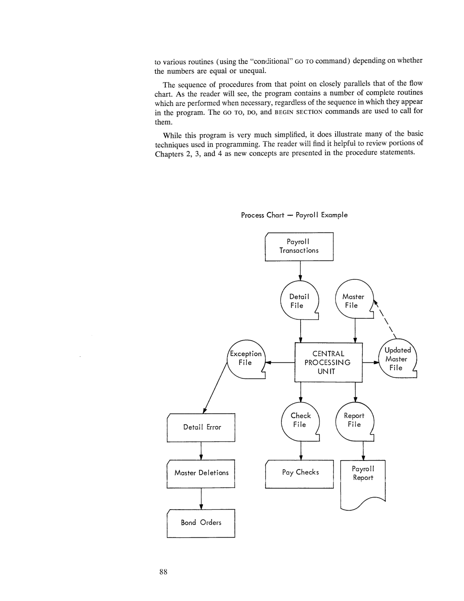
*Process Chart — Payroll Example (page 88).*

<!-- page 89 | PDF 94 -->
**[page 89]**

### Flow Chart — Payroll Example

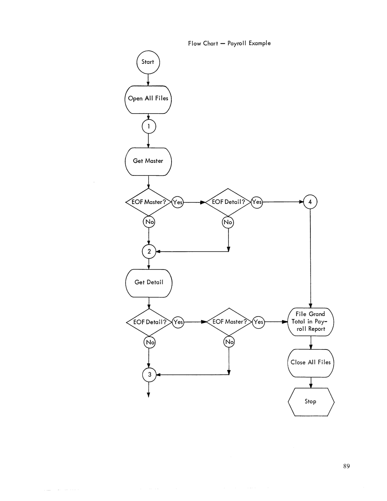
*Flow Chart — Payroll Example, part 1 of 2 (page 89).*

<!-- page 90 | PDF 95 -->
**[page 90]**

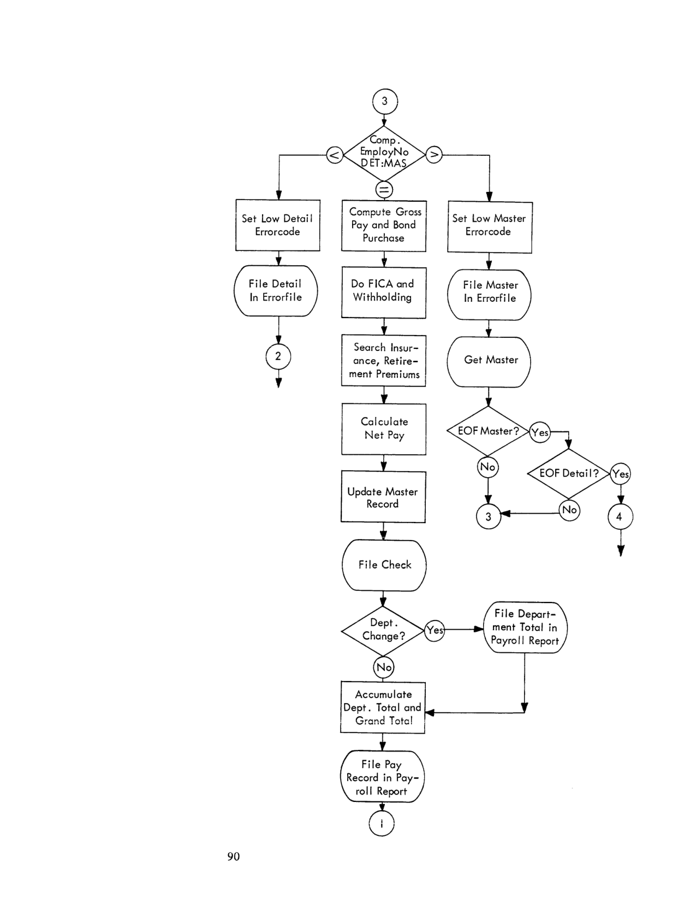
*Flow Chart — Payroll Example, part 2 of 2 (page 90).*

<!-- page 91 | PDF 96 -->
**[page 91]**

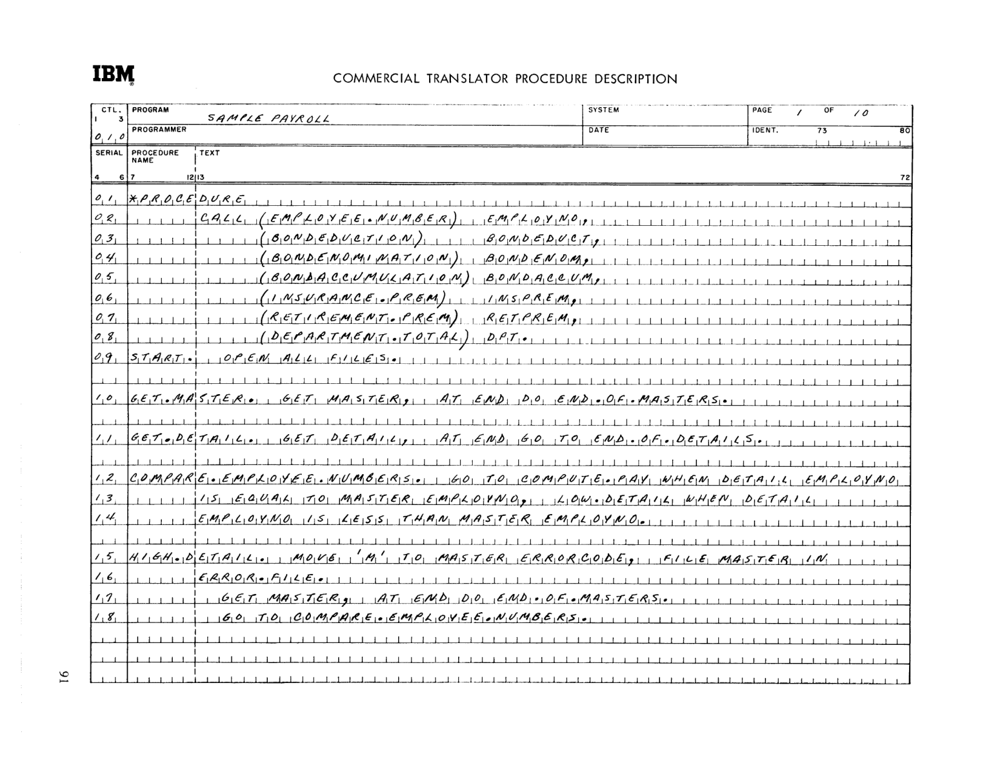
*Commercial Translator Procedure Description — Sample Payroll, page 1 of 10 (page 91).*

```
01            *PROCEDURE
02            CALL (EMPLOYEE.NUMBER) EMPLOYNO,
03                 (BONDEDUCTION) BONDEDUCT,
04                 (BONDENOMINATION) BONDENOM,
05                 (BONDACCUMULATION) BONDACCUM,
06                 (INSURANCE.PREM) INSPREM,
07                 (RETIREMENT.PREM) RETPREM,
08                 (DEPARTMENT.TOTAL) DPT.
09  START.         OPEN ALL FILES.

10  GET.MASTER.    GET MASTER, AT END DO END.OF.MASTERS.

11  GET.DETAIL.    GET DETAIL, AT END GO TO END.OF.DETAILS.

12  COMPARE.EMPLOYEE.NUMBERS.
                   GO TO COMPUTE.PAY WHEN DETAIL EMPLOYNO
13                 IS EQUAL TO MASTER EMPLOYNO, LOW.DETAIL WHEN DETAIL
14                 EMPLOYNO IS LESS THAN MASTER EMPLOYNO.

15  HIGH.DETAIL.   MOVE 'M' TO MASTER ERRORCODE, FILE MASTER IN
16                 ERROR.FILE.
17                 GET MASTER, AT END DO END.OF.MASTERS.
18                 GO TO COMPARE.EMPLOYEE.NUMBERS.
```

<!-- page 92 | PDF 97 -->
**[page 92]**

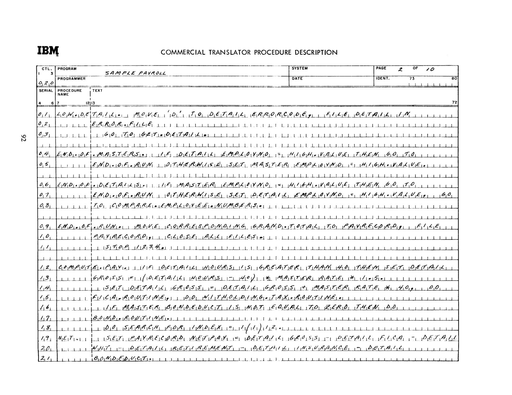
*Commercial Translator Procedure Description — Sample Payroll, page 2 of 10 (page 92).*

```
01  LOW.DETAIL.    MOVE 'D' TO DETAIL ERRORCODE, FILE DETAIL IN
02                 ERROR.FILE.
03                 GO TO GET.DETAIL.

04  END.OF.MASTERS. IF DETAIL EMPLOYNO = HIGH.VALUE THEN GO TO
05                 END.OF.RUN OTHERWISE SET MASTER EMPLOYNO = HIGH.VALUE.

06  END.OF.DETAILS. IF MASTER EMPLOYNO = HIGH.VALUE THEN GO TO
07                 END.OF.RUN OTHERWISE SET DETAIL EMPLOYNO = HIGH.VALUE, GO
08                 TO COMPARE.EMPLOYEE.NUMBERS.

09  END.OF.RUN.    MOVE CORRESPONDING GRAND.TOTAL TO PAYRECORD, FILE
10                 PAYRECORD, CLOSE ALL FILES.
11                 STOP 1234.

12  COMPUTE.PAY.   IF DETAIL HOURS IS GREATER THAN 40 THEN SET DETAIL
13                 GROSS = (DETAIL HOURS - 40) * MASTER RATE * 1.5.
14                 SET DETAIL GROSS = DETAIL GROSS + MASTER RATE * 40, DO
15                 FICA.ROUTINE, DO WITHOLDING.TAX.ROUTINE.
16                 IF MASTER BONDEDUCT IS NOT EQUAL TO ZERO THEN DO
17                 BOND.ROUTINE.
18                 DO SEARCH FOR INDEX = 1(1)12.
19  NET.           SET PAYRECORD NETPAY = DETAIL GROSS - DETAIL FICA - DETAIL
20                 WHT - DETAIL RETIREMENT - DETAIL INSURANCE - DETAIL
21                 BONDEDUCT.
```

<!-- page 93 | PDF 98 -->
**[page 93]**

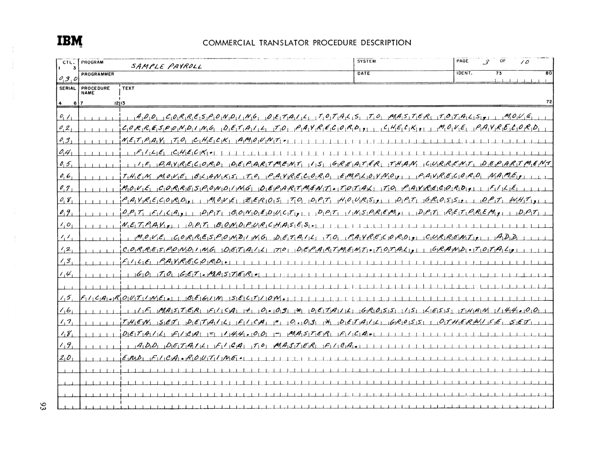
*Commercial Translator Procedure Description — Sample Payroll, page 3 of 10 (page 93).*

```
01                 ADD CORRESPONDING DETAIL TOTALS TO MASTER TOTALS, MOVE
02                 CORRESPONDING DETAIL TO PAYRECORD, CHECK, MOVE PAYRECORD
03                 NETPAY TO CHECK AMOUNT.
04                 FILE CHECK.
05                 IF PAYRECORD DEPARTMENT IS GREATER THAN CURRENT DEPARTMENT
06                 THEN MOVE BLANKS TO PAYRECORD EMPLOYNO, PAYRECORD NAME,
07                 MOVE CORRESPONDING DEPARTMENT.TOTAL TO PAYRECORD, FILE
08                 PAYRECORD, MOVE ZEROS TO DPT HOURS, DPT GROSS, DPT WHT,
09                 DPT FICA, DPT BONDEDUCT, DPT INSPREM, DPT RETPREM, DPT
10                 NETPAY, DPT BONDPURCHASES.
11                 MOVE CORRESPONDING DETAIL TO PAYRECORD, CURRENT, ADD
12                 CORRESPONDING DETAIL TO DEPARTMENT.TOTAL, GRAND.TOTAL,
13                 FILE PAYRECORD.
14                 GO TO GET.MASTER.

15  FICA.ROUTINE.  BEGIN SECTION.
16                 IF MASTER FICA + 0.03 * DETAIL GROSS IS LESS THAN 144.00
17                 THEN SET DETAIL FICA = 0.03 * DETAIL GROSS OTHERWISE SET
18                 DETAIL FICA = 144.00 - MASTER FICA.
19                 ADD DETAIL FICA TO MASTER FICA.
20                 END FICA.ROUTINE.
```

<!-- page 94 | PDF 99 -->
**[page 94]**

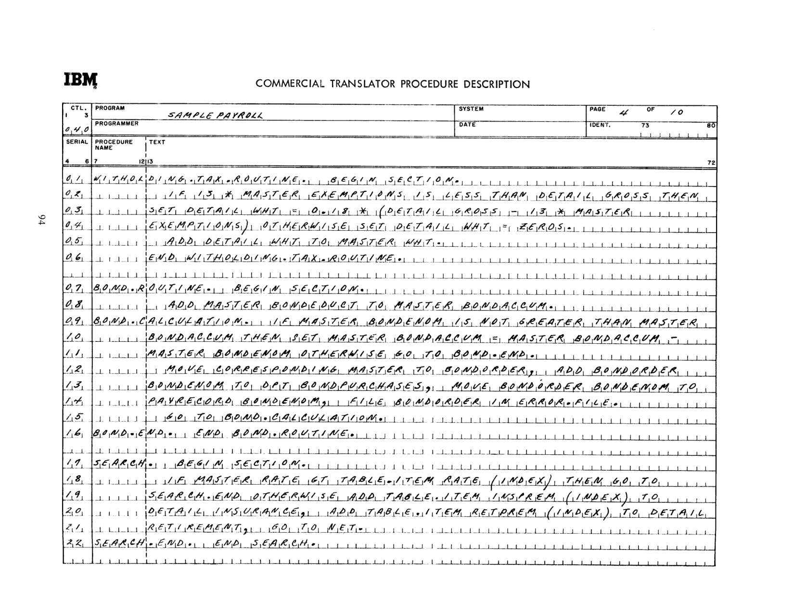
*Commercial Translator Procedure Description — Sample Payroll, page 4 of 10 (page 94).*

```
01  WITHOLDING.TAX.ROUTINE.
                   BEGIN SECTION.
02                 IF 13 * MASTER EXEMPTIONS IS LESS THAN DETAIL GROSS THEN
03                 SET DETAIL WHT = 0.18 * (DETAIL GROSS - 13 * MASTER
04                 EXEMPTIONS) OTHERWISE SET DETAIL WHT = ZEROS.
05                 ADD DETAIL WHT TO MASTER WHT.
06                 END WITHOLDING.TAX.ROUTINE.

07  BOND.ROUTINE.  BEGIN SECTION.
08                 ADD MASTER BONDEDUCT TO MASTER BONDACCUM.
09  BOND.CALCULATION.
                   IF MASTER BONDENOM IS NOT GREATER THAN MASTER
10                 BONDACCUM THEN SET MASTER BONDACCUM = MASTER BONDACCUM -
11                 MASTER BONDENOM OTHERWISE GO TO BOND.END.
12                 MOVE CORRESPONDING MASTER TO BONDORDER, ADD BONDORDER
13                 BONDENOM TO DPT BONDPURCHASES, MOVE BONDORDER BONDENOM TO
14                 PAYRECORD BONDENOM, FILE BONDORDER IN ERROR.FILE.
15                 GO TO BOND.CALCULATION.
16  BOND.END.      END BOND.ROUTINE.

17  SEARCH.        BEGIN SECTION.
18                 IF MASTER RATE GT TABLE.ITEM RATE (INDEX) THEN GO TO
19                 SEARCH.END OTHERWISE ADD TABLE.ITEM INSPREM (INDEX) TO
20                 DETAIL INSURANCE, ADD TABLE.ITEM RETPREM (INDEX) TO DETAIL
21                 RETIREMENT, GO TO NET.
22  SEARCH.END.    END SEARCH.
```

<!-- page 95 | PDF 100 -->
**[page 95]**

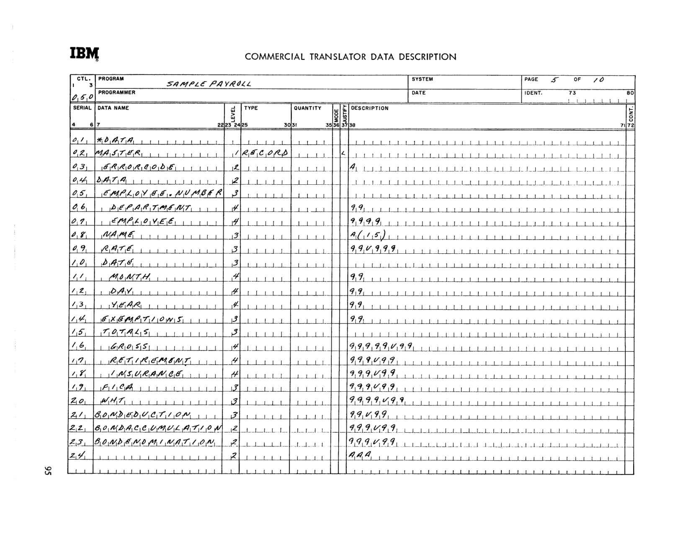
*Commercial Translator Data Description — Sample Payroll, page 5 of 10 (page 95).*

```
SERIAL  DATA NAME                LEVEL  DESCRIPTION
01      *DATA
02      MASTER                     1    RECORD                    [JUSTIFY: <]
03        ERRORCODE                2    A
04        DATA                     2
05          EMPLOYEE.NUMBER        3
06            DEPARTMENT           4    99
07            EMPLOYEE             4    9999
08          NAME                   3    A(15)
09          RATE                   3    99V999
10          DATE                   3
11            MONTH                4    99
12            DAY                  4    99
13            YEAR                 4    99
14          EXEMPTIONS             3    99
15          TOTALS                 3
16            GROSS                4    99999V99
17            RETIREMENT           4    999V99
18            INSURANCE            4    999V99
19          FICA                   3    999V99
20          WHT                    3    9999V99
21          BONDEDUCTION           3    99V99
22        BONDACCUMULATION         2    999V99
23        BONDENOMINATION          2    999V99
24                                 2    AAA
```

<!-- conversion notes: Pages 96-100 (PDF) are handwritten Commercial Translator coding-form facsimiles (Procedure Description forms, pages 1-4 of a 10-page listing, and the first page of the Data Description form, page 5 of 10). Every page image was inspected at 2.5-4x zoom to verify each handwritten character against the OCR draft, which was heavily garbled on these pages; the OCR draft was not usable as a starting point for the code transcription and was rebuilt from the page images. Data-names on the coding forms are written with embedded periods standing in for spaces within multi-word names/paragraph labels (e.g. EMPLOYEE.NUMBER, GET.MASTER., END.OF.MASTERS.) and are reproduced exactly as written, including the spelling "WITHOLDING" (single H, as written on the form, vs. "withholding" in the surrounding prose). Serial numbers from the SERIAL column are retained as line-prefixes in the fenced transcriptions; the coding form's own 6-character PROCEDURE NAME column boundary is not strictly preserved in the transcription since paragraph labels routinely overflow it on the source form. On page 100 (Data Description), the "<" mark under the JUSTIFY column for the MASTER record (level 1) is reproduced literally as a bracketed note since its exact meaning is not stated on this page. The process chart (page 93/PDF) and both flow-chart pages (94-95/PDF) are reproduced as embedded images only, per the general rule for figures/flowcharts; no ASCII re-diagramming of the flow lines was attempted, to avoid misrepresenting the branching logic. No overpunched/overbar digits were found in this chunk. Printed page numbers for PDF 92-95 were confirmed directly against the number printed at the foot of each page image (87, 88, 89, 90); printed page numbers for PDF 96-100 (91-95) were computed via the PDF-5 rule and cross-checked against the small rotated page number in the lower-left margin of each coding-form image. -->

<!-- page 96 | PDF 101 -->
**[page 96]**

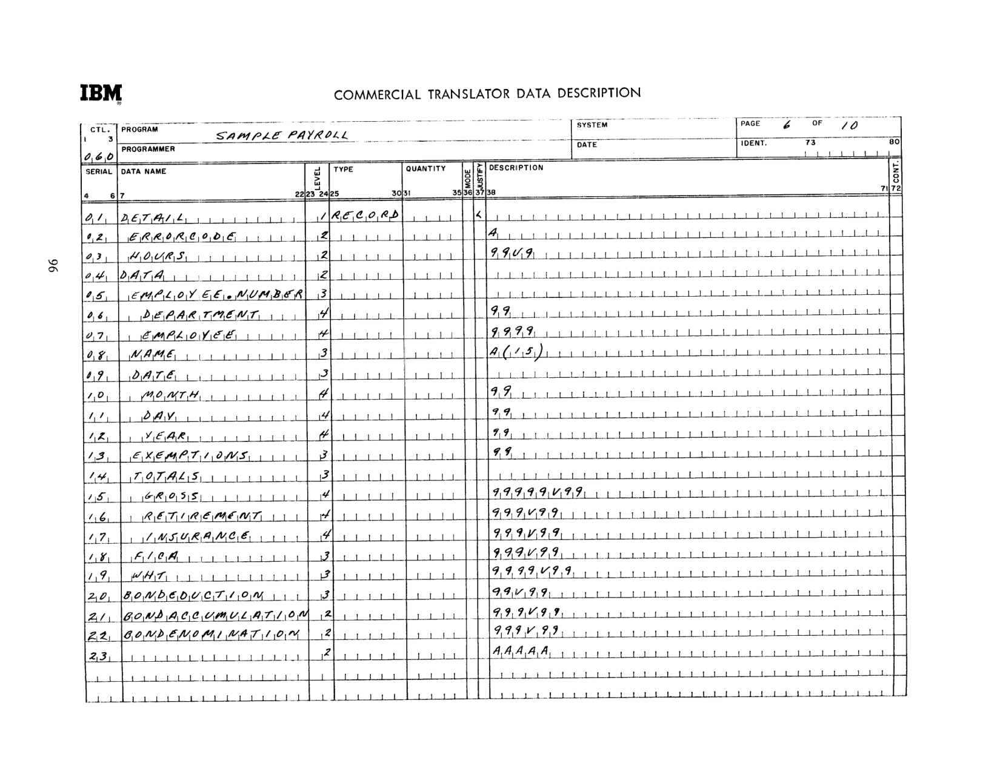
*Commercial Translator Data Description form, SAMPLE PAYROLL, page 6 of 10 — DETAIL record (page 96).*

```
SERIAL  DATA NAME                LV  TYPE     QUAN  J  DESCRIPTION

01      DETAIL                    1  RECORD        L
02        ERRORCODE                2                  A
03        HOURS                    2                  99V9
04        DATA                     2
05          EMPLOYEE.NUMBER        3
06            DEPARTMENT           4                  99
07            EMPLOYEE             4                  9999
08          NAME                   3                  A(15)
09          DATE                   3
10            MONTH                4                  99
11            DAY                  4                  99
12            YEAR                 4                  99
13          EXEMPTIONS             3                  99
14          TOTALS                 3
15            GROSS                4                  99999V99
16            RETIREMENT           4                  999V99
17            INSURANCE            4                  999V99
18          FICA                   3                  999V99
19          WHT                    3                  9999V99
20        BONDEDUCTION             3                  99V99
21      BONDACCUMULATION           2                  999V99
22      BONDENOMINATION            2                  999V99
23                                 2                  AAAAA
```

<!-- page 97 | PDF 102 -->
**[page 97]**

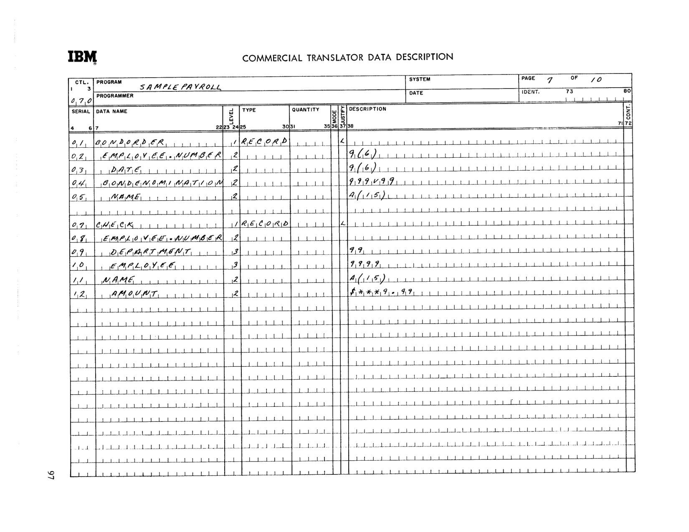
*Commercial Translator Data Description form, SAMPLE PAYROLL, page 7 of 10 — BONDORDER and CHECK records (page 97).*

```
SERIAL  DATA NAME                LV  TYPE     QUAN  J  DESCRIPTION

01      BONDORDER                 1  RECORD        L
02        EMPLOYEE.NUMBER          2                  9(6)
03        DATE                     2                  9(6)
04        BONDENOMINATION          2                  999V99
05        NAME                     2                  A(15)

07      CHECK                     1  RECORD        L
08        EMPLOYEE.NUMBER          2
09          DEPARTMENT             3                  99
10          EMPLOYEE               3                  9999
11        NAME                     2                  A(15)
12          AMOUNT                 2                  $***9.99
```

<!-- page 98 | PDF 103 -->
**[page 98]**

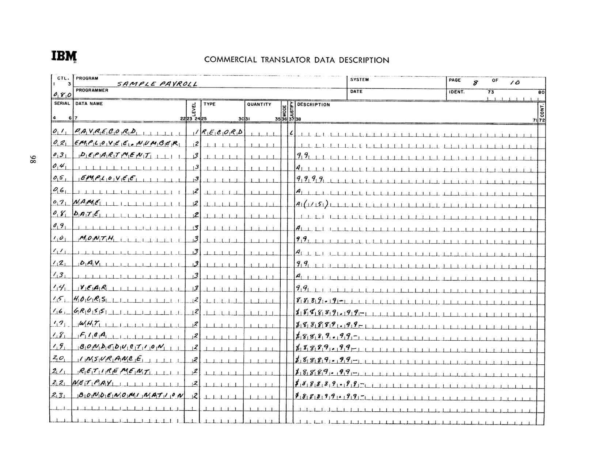
*Commercial Translator Data Description form, SAMPLE PAYROLL, page 8 of 10 — PAYRECORD record (page 98).*

```
SERIAL  DATA NAME                LV  TYPE     QUAN  J  DESCRIPTION

01      PAYRECORD                 1  RECORD        L
02        EMPLOYEE.NUMBER          2
03          DEPARTMENT             3                  99
04                                 3                  A
05          EMPLOYEE               3                  9999
06                                 2                  A
07        NAME                     2                  A(15)
08        DATE                     2
09                                 3                  A
10          MONTH                  3                  99
11                                 3                  A
12          DAY                    3                  99
13                                 3                  A
14          YEAR                   3                  99
15      HOURS                      2                  8889.9-
16      GROSS                      2                  $88889.99-
17        WHT                      2                  $88889.99-
18        FICA                     2                  $8889.99-
19        BONDEDUCTION             2                  $8889.99-
20        INSURANCE                2                  $8889.99-
21        RETIREMENT               2                  $8889.99-
22      NETPAY                     2                  $88889.99-
23        BONDENOMINATION          2                  $88899.99-
```

<!-- page 99 | PDF 104 -->
**[page 99]**

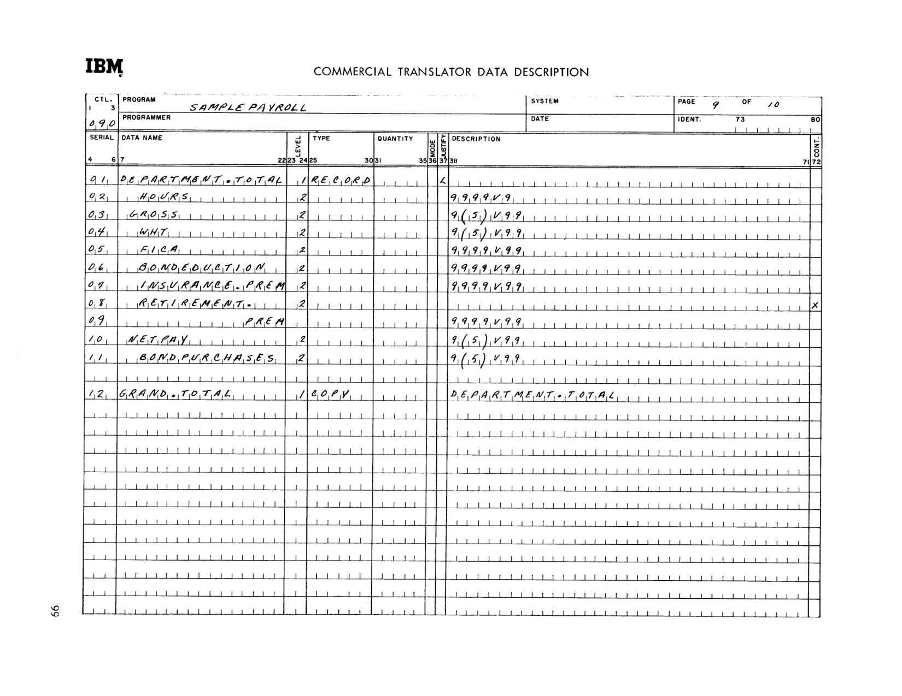
*Commercial Translator Data Description form, SAMPLE PAYROLL, page 9 of 10 — DEPARTMENT.TOTAL and GRAND.TOTAL records (page 99).*

```
SERIAL  DATA NAME                LV  TYPE     QUAN  J  DESCRIPTION

01      DEPARTMENT.TOTAL          1  RECORD        L
02        HOURS                    2                  9999V9
03        GROSS                    2                  9(5)V99
04        WHT                      2                  9(5)V99
05        FICA                     2                  9999V99
06        BONDEDUCTION             2                  9999V99
07        INSURANCE.PREM           2                  9999V99
08        RETIREMENT.              2
09            PREM                                    9999V99
10        NETPAY                   2                  9(5)V99
11        BONDPURCHASES            2                  9(5)V99

12      GRAND.TOTAL               1  COPY             DEPARTMENT.TOTAL
```

Note — serial 09008/09009: the data-name RETIREMENT.PREM is split across two ruled lines of the form (continuation column marked), with the description entered on the second line.

<!-- page 100 | PDF 105 -->
**[page 100]**

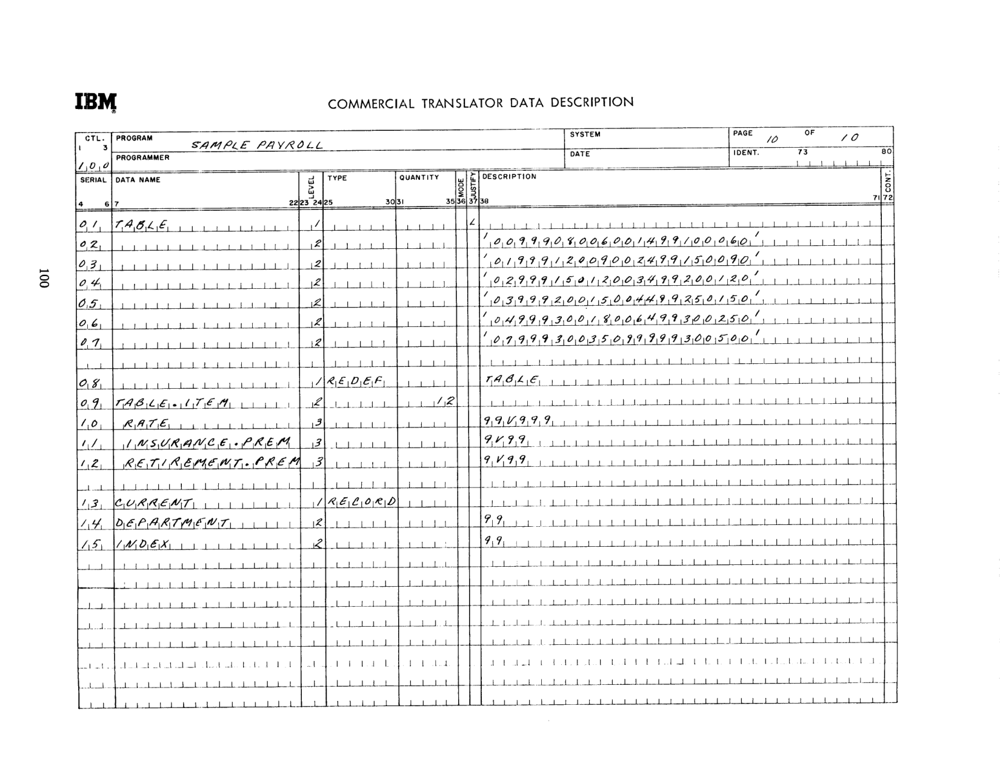
*Commercial Translator Data Description form, SAMPLE PAYROLL, page 10 of 10 — TABLE, TABLE.ITEM, and CURRENT records (page 100).*

```
SERIAL  DATA NAME                LV  TYPE     QUAN  J  DESCRIPTION

01      TABLE                     1                L
02                                 2                  '0099908006001499100060'
03                                 2                  '0199912009002499150090'
04                                 2                  '0299915012003499200120'
05                                 2                  '0399920015004499250150'
06                                 2                  '0499930018006499300250'
07                                 2                  '0799930035099999300500'

08                                1  REDEF            TABLE
09      TABLE.ITEM                2         12
10        RATE                     3                  99V999
11        INSURANCE.PREM           3                  9V99
12        RETIREMENT.PREM          3                  9V99

13      CURRENT                   1  RECORD
14        DEPARTMENT               2                  99
15        INDEX                    2                  99
```

Note — serials 02–07 carry the initial-value literal for TABLE as a single quoted string continued across six lines of the form (opening/closing quote marks repeated on each line per COMTRAN continuation convention); concatenated, the 132-character string supplies the twelve RATE / INSURANCE.PREM / RETIREMENT.PREM entries (11 characters each) of TABLE.ITEM, redefined over TABLE at serial 08.

## SAMPLE PAYROLL PROGRAM - MACHINE LISTING

<!-- page 101 | PDF 106 -->
**[page 101]**

```
SERIAL NAME    TEXT

01001 *PROCEDURE

01002        CALL (EMPLOYEE.NUMBER)     EMPLOYNO,
01003             (BONDEDUCTION)        BONDEDUCT,
01004             (BONDENOMINATION)     BONDENOM,
01005             (BONDACCUMULATION)    BONDACCUM,
01006             (INSURANCE.PREM)      INSPREM,
01007             (RETIREMENT.PREM)     RETPREM,
01008             (DEPARTMENT.TOTAL)    DPT.

01009 START.  OPEN ALL FILES.

01010 GET.MASTER.  GET MASTER, AT END DO END.OF.MASTERS.

01011 GET.DETAIL.  GET DETAIL, AT END GO TO END.OF.DETAILS.

01012 COMPARE.EMPLOYEE.NUMBERS.  GO TO COMPUTE.PAY WHEN DETAIL EMPLOYNO
01013        IS EQUAL TO MASTER EMPLOYNO, LOW.DETAIL WHEN DETAIL
01014        EMPLOYNO IS LESS THAN MASTER EMPLOYNO.

01015 HIGH.DETAIL.  MOVE 'M' TO MASTER ERRORCODE, FILE MASTER IN
01016        ERROR.FILE.

01017        GET MASTER, AT END DO END.OF.MASTERS.

01018        GO TO COMPARE.EMPLOYEE.NUMBERS.

02001 LOW.DETAIL.  MOVE 'D' TO DETAIL ERRORCODE, FILE DETAIL IN
02002        ERROR.FILE.

02003        GO TO GET.DETAIL.

02004 END.OF.MASTERS.  IF DETAIL EMPLOYNO = HIGH.VALUE THEN GO TO
02005        END.OF.RUN OTHERWISE SET MASTER EMPLOYNO = HIGH.VALUE.

02006 END.OF.DETAILS.  IF MASTER EMPLOYNO = HIGH.VALUE THEN GO TO
02007        END.OF.RUN OTHERWISE SET DETAIL EMPLOYNO = HIGH.VALUE, GO
02008        TO COMPARE.EMPLOYEE.NUMBERS.

02009 END.OF.RUN.  MOVE CORRESPONDING GRAND.TOTAL TO PAYRECORD, FILE
02010        PAYRECORD, CLOSE ALL FILES.
02011        STOP 1234.

02012 COMPUTE.PAY.  IF DETAIL HOURS IS GREATER THAN 40 THEN SET DETAIL
02013        GROSS = (DETAIL HOURS - 40) * MASTER RATE * 1.5.

02014        SET DETAIL GROSS = DETAIL GROSS + MASTER RATE * 40, DO
02015        FICA.ROUTINE, DO WITHOLDING.TAX.ROUTINE.

02016        IF MASTER BONDEDUCT IS NOT EQUAL TO ZERO THEN DO
02017        BOND.ROUTINE.

02018        DO SEARCH FOR INDEX = 1(1)12.

02019 NET.   SET PAYRECORD NETPAY = DETAIL GROSS - DETAIL FICA - DETAIL
02020        WHT - DETAIL RETIREMENT - DETAIL INSURANCE - DETAIL
02021        BONDEDUCT.
```

<!-- page 102 | PDF 107 -->
**[page 102]**

```
SERIAL NAME    TEXT

03001         ADD CORRESPONDING DETAIL TOTALS TO MASTER TOTALS, MOVE
03002         CORRESPONDING DETAIL TO PAYRECORD, CHECK, MOVE PAYRECORD
03003         NETPAY TO CHECK AMOUNT.

03004         FILE CHECK.

03005         IF PAYRECORD DEPARTMENT IS GREATER THAN CURRENT DEPARTMENT
03006         THEN MOVE BLANKS TO PAYRECORD EMPLOYNO, PAYRECORD NAME,
03007         MOVE CORRESPONDING DEPARTMENT.TOTAL TO PAYRECORD, FILE
03008         PAYRECORD, MOVE ZEROS TO DPT HOURS, DPT GROSS, DPT WHT,
03009         DPT FICA, DPT BONDEDUCT, DPT INSPREM, DPT RETPREM, DPT
03010         NETPAY, DPT BONDPURCHASES.

03011         MOVE CORRESPONDING DETAIL TO PAYRECORD, CURRENT,  ADD
03012         CORRESPONDING DETAIL TO DEPARTMENT.TOTAL, GRAND.TOTAL,
03013         FILE PAYRECORD.

03014         GO TO GET.MASTER.

03015 FICA.ROUTINE.  BEGIN SECTION.

03016         IF MASTER FICA + 0.03 * DETAIL GROSS IS LESS THAN 144.00
03017         THEN SET DETAIL FICA = 0.03 * DETAIL GROSS  OTHERWISE SET
03018         DETAIL FICA = 144.00 - MASTER FICA.

03019         ADD DETAIL FICA TO MASTER FICA.
03020         END FICA.ROUTINE.

04001 WITHOLDING.TAX.ROUTINE.  BEGIN SECTION.

04002         IF 13 * MASTER EXEMPTIONS IS LESS THAN DETAIL GROSS THEN
04003         SET DETAIL WHT = 0.18 * (DETAIL GROSS - 13 * MASTER
04004         EXEMPTIONS) OTHERWISE SET DETAIL WHT = ZEROS.

04005         ADD DETAIL WHT TO MASTER WHT.
04006         END WITHOLDING.TAX.ROUTINE.

04007 BOND.ROUTINE.  BEGIN SECTION.

04008         ADD MASTER BONDEDUCT TO MASTER BONDACCUM.

04009 BOND.CALCULATION.  IF MASTER BONDENOM IS NOT GREATER THAN MASTER
04010         BONDACCUM THEN SET MASTER BONDACCUM = MASTER BONDACCUM -
04011         MASTER BONDENOM OTHERWISE GO TO BOND.END.

04012         MOVE CORRESPONDING MASTER TO BONDORDER, ADD BONDORDER
04013         BONDENOM TO DPT BONDPURCHASES, MOVE BONDORDER BONDENOM TO
04014         PAYRECORD BONDENOM, FILE BONDORDER IN ERROR.FILE.

04015         GO TO BOND.CALCULATION.

04016 BOND.END.  END BOND.ROUTINE.

04017 SEARCH.  BEGIN SECTION.

04018         IF MASTER RATE GT TABLE.ITEM RATE (INDEX) THEN GO TO
04019         SEARCH.END OTHERWISE ADD TABLE.ITEM INSPREM (INDEX) TO
04020         DETAIL INSURANCE, ADD TABLE.ITEM RETPREM (INDEX) TO DETAIL
04021         RETIREMENT, GO TO NET.

04022 SEARCH.END.  END SEARCH.
```

<!-- page 103 | PDF 108 -->
**[page 103]**

```
SERIAL  NAME               LV TYPE   QUAN MJ  DESCRIPTION

05001 *DATA

05002 MASTER                1RECORD      L

05003   ERRORCODE           2            A


05004 DATA                  2

05005   EMPLOYEE.NUMBER     3
05006     DEPARTMENT        4            99
05007     EMPLOYEE          4            9999

05008   NAME                3            A(15)
05009   RATE                3            99V999

05010   DATE                3
05011     MONTH             4            99
05012     DAY               4            99
05013     YEAR              4            99

05014   EXEMPTIONS          3            99

05015   TOTALS              3
05016     GROSS             4            99999V99
05017     RETIREMENT        4            999V99
05018     INSURANCE         4            999V99

05019   FICA                3            999V99
05020   WHT                 3            9999V99
05021 BONDEDUCTION          3            99V99

05022 BONDACCUMULATION      2            999V99
05023 BONDENOMINATION       2            999V99
05024                       2            AAA


06001 DETAIL                1RECORD      L

06002   ERRORCODE           2            A
06003   HOURS               2            99V9

06004 DATA                  2

06005   EMPLOYEE.NUMBER     3
06006     DEPARTMENT        4            99
06007     EMPLOYEE          4            9999

06008   NAME                3            A(15)

06009   DATE                3
06010     MONTH             4            99
06011     DAY               4            99
06012     YEAR              4            99

06013   EXEMPTIONS          3            99

06014   TOTALS              3
06015     GROSS             4            99999V99
06016     RETIREMENT        4            999V99
06017     INSURANCE         4            999V99

06018   FICA                3            999V99
06019   WHT                 3            9999V99
06020 BONDEDUCTION          3            99V99

06021 BONDACCUMULATION      2            999V99
06022 BONDENOMINATION       2            999V99
06023                       2            AAAAA
```

<!-- page 104 | PDF 109 -->
**[page 104]**

```
SERIAL  NAME                 LV TYPE   QUAN MJ  DESCRIPTION           CONT

07001 BONDORDER              1RECORD      L

07002   EMPLOYEE.NUMBER      2            9(6)
07003   DATE                 2            9(6)
07004   BONDENOMINATION      2            999V99
07005   NAME                 2            A(15)


07007 CHECK                  1RECORD      L

07008   EMPLOYEE.NUMBER      2
07009     DEPARTMENT         3            99
07010     EMPLOYEE           3            9999

07011   NAME                 2            A(15)
07012     AMOUNT             2            $***9.99


08001 PAYRECORD              1RECORD      L

08002 EMPLOYEE.NUMBER        2
08003   DEPARTMENT           3            99
08004                        3            A
08005   EMPLOYEE             3            9999

08006                        2            A
08007 NAME                   2            A(15)

08008 DATE                   2
08009                        3            A
08010   MONTH                3            99
08011                        3            A
08012   DAY                  3            99
08013                        3            A
08014   YEAR                 3            99

08015 HOURS                  2            8889.9-
08016 GROSS                  2            $88889.99-
08017   WHT                  2            $88889.99-
08018   FICA                 2            $8889.99-
08019   BONDEDUCTION         2            $8889.99-
08020   INSURANCE            2            $8889.99-
08021   RETIREMENT           2            $8889.99-
08022 NETPAY                 2            $88889.99-
08023   BONDENOMINATION      2            $88899.99-


09001 DEPARTMENT.TOTAL       1RECORD      L

09002   HOURS                2            9999V9
09003 GROSS                  2            9(5)V99
09004   WHT                  2            9(5)V99
09005   FICA                 2            9999V99
09006   BONDEDUCTION         2            9999V99
09007   INSURANCE.PREM       2            9999V99
09008   RETIREMENT.          2                                          X
09009           PREM                      9999V99
09010   NETPAY               2            9(5)V99
09011   BONDPURCHASES        2            9(5)V99


09012 GRAND.TOTAL            1COPY             DEPARTMENT.TOTAL


10001 TABLE                  1            L
10002                        2            '0099908006001499100060'
10003                        2            '0199912009002499150090'
10004                        2            '0299915012003499200120'
10005                        2            '0399920015004499250150'
10006                        2            '0499930018006499300250'
10007                        2            '0799930035099999300500'

10008                        1REDEF            TABLE

10009 TABLE.ITEM             2       12
10010   RATE                 3            99V999
10011   INSURANCE.PREM       3            9V99
10012   RETIREMENT.PREM      3            9V99


10013 CURRENT                1RECORD

10014 DEPARTMENT             2            99
10015 INDEX                  2            99
```

<!-- conversion notes:
- Pages 96–100 (PDF 101–105) are hand-completed IBM "Commercial Translator Data Description" coding forms (pages 6–10 of 10 for the SAMPLE PAYROLL program). Each page image was embedded per spec, and the SERIAL/DATA NAME/LEVEL/TYPE/QUANTITY/DESCRIPTION content was transcribed into a fenced code block. Because these forms are handwritten in a cursive/print hybrid hand, digit- and letter-level transcription (especially the TABLE literal on page 100 and the edit-picture DESCRIPTION strings of dollar signs/8s/9s on pages 98–99) was cross-verified against the typeset "MACHINE LISTING" of the identical data description on pages 103–104 (PDF 108–109, serials 06001–10015), which reproduces the same source data in unambiguous monospaced type. Where the two sources agreed exactly, the typeset reading was used for the transcription; no content was inferred beyond what appears on one or the other page image.
- The hand-drawn tick/checkmark in the form's JUSTIFY column (rendered here as "L") appears beside each level-1 RECORD entry and corresponds to the "L" printed in the MJ column of the machine listing.
- Printed page numbers on pages 96 and 97 (PDF 101–102) run vertically top-to-bottom in the left margin; on pages 98–100 (PDF 103–105) the same vertical page number is printed rotated 180° from that orientation. Both were verified against PDF-number-minus-5, which held for all nine pages in this chunk.
- No pages in this chunk required image-only fallback; none were blank.
-->
