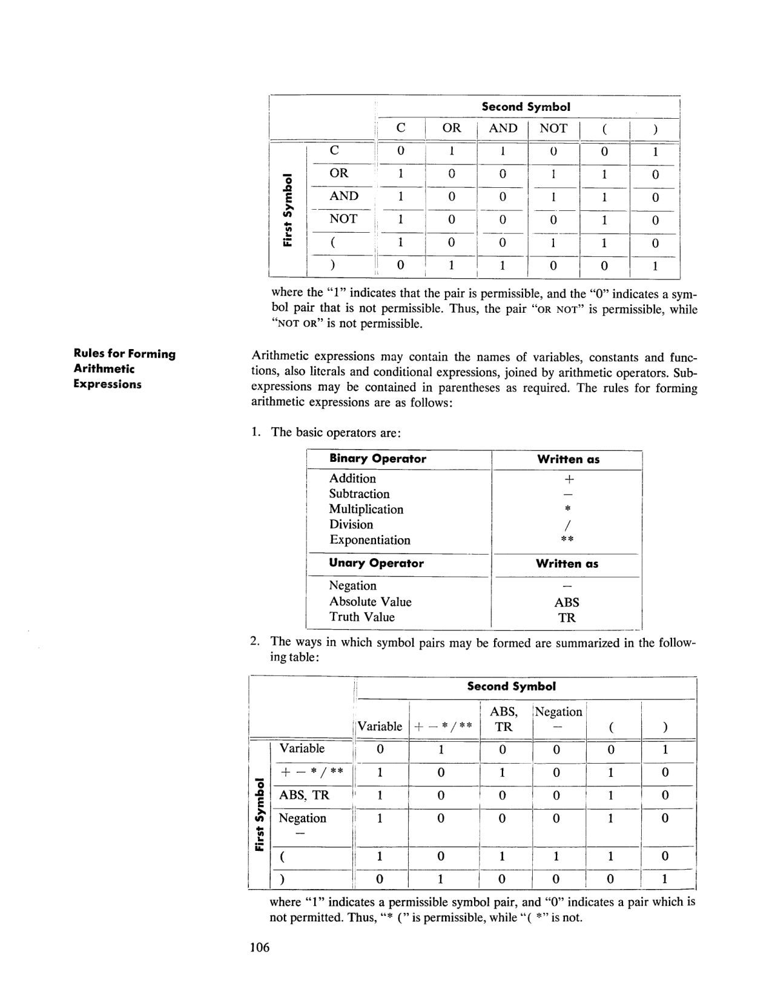

# Appendix 2: Supplementary Information

<!-- page 105 | PDF 110 -->
**[page 105]**

## Rules for Forming Conditional Expressions

Conditional expressions may contain the names of conditions, variables, constants
and functions, as well as literals, arithmetic operators, relations of equality and relative
magnitude and the operators NOT, AND and OR. Subexpressions may be contained
in parentheses as required.

If a conditional expression (such as MARRIED OR PAY IS GREATER THAN 2 * X + Y)
is designated by the symbol Ci the following rules may be stated concerning the
formation of conditional expressions involving Ci, NOT, AND and OR.

1.

| The Conditional Expression | Is True If |
|---|---|
| C1 | C1 is true |
| NOT C1 | C1 is false |
| C1 AND C2 | Both C1 and C2 are true |
| C1 OR C2 | Either C1 is true, C2 is true, or both are true |
| NOT (C1 AND C2) | C1 is false, C2 is false, or both are false |
| NOT (C1 OR C2) | C1 and C2 are both false |

2. If C1 and C2 are conditional expressions, then "C1 AND C2" and "C1 OR C2"
   are conditional expressions, as are similar expressions formed with the use of
   NOT. Thus, an expression of the form

   C1 AND (C2 OR NOT (C3 OR C4))

   may be successively reduced by substituting as follows:

   Let C5 equal "C3 OR C4" → C1 AND (C2 OR NOT C5)

   Let C6 equal "C2 OR NOT C5" → C1 AND C6

   Let C7 equal "C1 AND C6" → C7

   This rule indicates how conditional expressions may be formed from conditional
   expressions.

3. The conditional expression "C1 OR C2 AND C3" is identical with "C1 OR
   (C2 AND C3)" but is not the same as "(C1 OR C2) AND C3." In other words,
   conditional expressions are grouped first according to AND and subsequently by
   OR. However, the programmer's use of parentheses will affect the order of
   grouping.

4. The rules for formation of symbol pairs are contained in the following table:

<!-- page 106 | PDF 111 -->
**[page 106]**

**Second Symbol**

| First Symbol | C | OR | AND | NOT | ( | ) |
|---|---|---|---|---|---|---|
| C | 0 | 1 | 1 | 0 | 0 | 1 |
| OR | 1 | 0 | 0 | 1 | 1 | 0 |
| AND | 1 | 0 | 0 | 1 | 1 | 0 |
| NOT | 1 | 0 | 0 | 0 | 1 | 0 |
| ( | 1 | 0 | 0 | 1 | 1 | 0 |
| ) | 0 | 1 | 1 | 0 | 0 | 1 |

where the "1" indicates that the pair is permissible, and the "0" indicates a symbol
pair that is not permissible. Thus, the pair "OR NOT" is permissible, while
"NOT OR" is not permissible.

## Rules for Forming Arithmetic Expressions

Arithmetic expressions may contain the names of variables, constants and functions
, also literals and conditional expressions, joined by arithmetic operators. Subexpressions
may be contained in parentheses as required. The rules for forming
arithmetic expressions are as follows:

1. The basic operators are:

| Binary Operator | Written as |
|---|---|
| Addition | + |
| Subtraction | − |
| Multiplication | * |
| Division | / |
| Exponentiation | ** |

| Unary Operator | Written as |
|---|---|
| Negation | − |
| Absolute Value | ABS |
| Truth Value | TR |

2. The ways in which symbol pairs may be formed are summarized in the following
   table:

**Second Symbol**

| First Symbol | Variable | + − * / ** | ABS, TR | Negation − | ( | ) |
|---|---|---|---|---|---|---|
| Variable | 0 | 1 | 0 | 0 | 0 | 1 |
| + − * / ** | 1 | 0 | 1 | 0 | 1 | 0 |
| ABS, TR | 1 | 0 | 0 | 0 | 1 | 0 |
| Negation − | 1 | 0 | 0 | 0 | 1 | 0 |
| ( | 1 | 0 | 1 | 1 | 1 | 0 |
| ) | 0 | 1 | 0 | 0 | 0 | 1 |

where "1" indicates a permissible symbol pair, and "0" indicates a pair which is
not permitted. Thus, "* (" is permissible, while "( *" is not.


*Symbol-pair tables: conditional-expression symbols (top) and arithmetic-expression symbols (bottom) (page 106).*

<!-- page 107 | PDF 112 -->
**[page 107]**

3. When the hierarchy of operations in an expression is not completely specified
   by parentheses, the order of operations (working from inside to outside) is assumed
   to be exponentiation, then multiplication and division, and finally addition
   and subtraction. Thus the expression A + B/C + D**E*F − G will be
   taken to mean A + (B/C) + (Dᴱ·F) − G.

4. When the sequence of consecutive operations of the same hierarchal level (i.e.,
   consecutive multiplications and divisions or consecutive additions and subtractions
   ) is not completely specified by parentheses, the order of operations is assumed
   to be from left to right. Thus expressions ordinarily considered ambiguous,
   e.g., A/B · C and A/B/C, are permitted in Commercial Translator statements.
   For instance, the expression A*B/C*D is taken to mean ((A*B)/C)*D.

5. The expression Aᴮᶜ, which is sometimes considered meaningful, cannot be written
   as A**B**C; it should be written as (A**B)**C or A**(B**C), whichever is
   intended.

<!-- page 108 | PDF 113 -->
**[page 108]**

## List of Commercial Translator Commands

The general forms of all of the Commercial Translator commands are presented
below in alphabetic order for reference purposes. In order to make the list as concise
as possible, optional words and phrases are shown enclosed in brackets, — [ ]; the
brace, {, is used to indicate a choice of one of two or more variant forms.

```
ADD [CORRESPONDING] data.name.1 TO data.name.2, data.name.3,
    ... data.name.n

BEGIN SECTION [USING parameter.1, parameter.2, ...
    parameter.n] [GIVING function.1, function.2, ... function.n]

CALL (old.name.1) new.name.1, (old.name.2) new.name.2, ...
    (old.name.n) new.name.n

CLOSE  { file.name.1, file.name.2, ... file.name.n
       { ALL FILES

DISPLAY  { 'any message'
         { data.name
         { any combination of the above

DO procedure.name [EXACTLY n TIMES] [USING data.name.1, data.name.2, ..
    data.name.n] [GIVING result.name.1, result.name.2, ... result.name.n]

DO procedure.name FOR index.name.1 = p.1(q.1)r.1 [, index.name.2 =
    p.2(q.2)r.2, index.name.3 = p.3(q.3)r.3] [USING data.name.1, data.name.2,
    ... data.name.n] [GIVING result.name.1, result.name.2, ... result.name.n]

END procedure.name

ENTER coding.language

FILE record.name [IN file.name]
```

<!-- page 109 | PDF 114 -->
**[page 109]**

```
GET  { RECORD FROM file.name  }
     { record.name            } AT END any imperative clause

GO TO procedure.name

GO TO procedure.name.1 WHEN conditional expression 1,
    procedure.name.2 WHEN conditional expression 2, ...
    procedure.name.n WHEN conditional expression n

GO TO (procedure.1, procedure.2, ... procedure.n) ON index.name

INCLUDE [HERE] library.procedure [AS procedure.name] [WITH new.name.1 FOR
    old.name.1, new.name.2 FOR old.name.2, ... new.name.n FOR old.name.n]

LOAD procedure.name

MOVE [CORRESPONDING] data.name.1 TO data.name.2, data.name.3,
    ... data.name.n

NOTE any sentence.

OPEN  { file.name.1, file.name.2, ... file.name.n
      { ALL FILES

OVERLAP procedure.name.1, procedure.name.2, ... procedure.name.n

SET variable.1, variable.2, ... variable.n = arithmetic expression
    [TRUNCATED][, ON OVERFLOW any imperative clause]

SET condition.name

STOP n
```

<!-- page 110 | PDF 115 -->
**[page 110]**

## List of Commercial Translator Words

All those words which are a fixed part of the Commercial Translator vocabulary are
listed below. The words are presented here to assist the programmer in avoiding the
use of any of them when choosing data-names and procedure-names.

| | | |
|---|---|---|
| ABS | GET | |
| ADD | GIVING | OTHERWISE |
| ALL | GO | OVERFLOW |
| AND | GREATER | OVERLAP |
| AS | GT | |
| AT | | †PARAM |
| | HERE | |
| BEGIN | HIGH.VALUE | †QUANTITY |
| BLANK | HIGH.VALUES | |
| BLANKS | | RECORD |
| | IF | †REDEF |
| CALL | IN | |
| CLOSE | INCLUDE | SECTION |
| COMMERCIAL | IS | SET |
| †COND | | STOP |
| †COPY | †LABEL | |
| CORRESPONDING | LESS | THAN |
| | †LIBRARY | THEN |
| DISPLAY | LOAD | TIMES |
| DO | LOW.VALUE | TO |
| | LOW.VALUES | TR |
| END | LT | TRANSLATOR |
| ENTER | | TRUNCATED |
| EQUAL | MOVE | |
| EXACTLY | | USING |
| | NOT | |
| FILE | NOTE | WHEN |
| FILES | | WITH |
| FOR | ON | |
| FROM | OPEN | ZERO |
| †FUNCT | OR | ZEROS |

Notes —

1. †These words have a restricted usage only in data description; they may be
   used freely in procedure description.

<!-- conversion notes: Page 111 (printed 106) embeds the source image alongside the transcribed
Markdown tables because both symbol-pair tables use a nested "Second Symbol" column
group and a "First Symbol" row group (merged/spanning header cells) that a plain pipe
table cannot fully represent; the transcribed values were verified against the image.
The command general-forms on pages 113-114 (printed 108-109) use brace ({) notation to
show grouped variant forms (e.g., CLOSE, DISPLAY, GET, OPEN); these are rendered in the
fenced code blocks with the brace repeated at the left margin of each grouped line to
approximate the original multi-line curly brace, since Markdown/plain text has no native
multi-line brace glyph. The reserved-word list on page 115 (printed 110) is reproduced as
a 3-column table matching the source page's column layout exactly (each column
independently alphabetical); empty table cells reflect blank positions in the original
grid. No pages in this chunk were left as image-only fallback. Overpunched/overbar digits
did not occur in this chunk. -->
