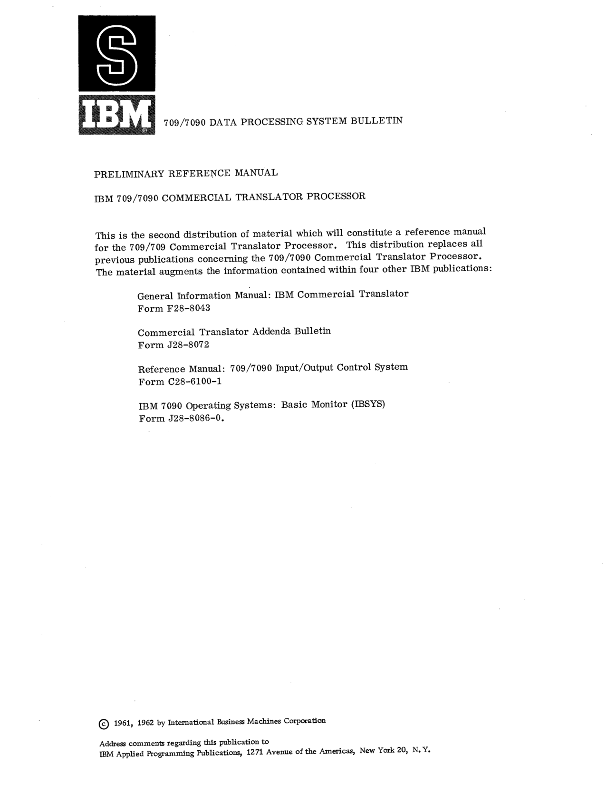

# J28-6169-1: IBM 709/7090 Commercial Translator Processor — cover and contents

<!-- PDF 1 -->
**[Cover, PDF p.1]**

*Bulletin cover page, IBM 709/7090 Commercial Translator Processor (PDF p. 1).*

709/7090 DATA PROCESSING SYSTEM BULLETIN

PRELIMINARY REFERENCE MANUAL

IBM 709/7090 COMMERCIAL TRANSLATOR PROCESSOR

This is the second distribution of material which will constitute a reference manual
for the 709/709 Commercial Translator Processor. This distribution replaces all
previous publications concerning the 709/7090 Commercial Translator Processor.
The material augments the information contained within four other IBM publications:

General Information Manual: IBM Commercial Translator
Form F28-8043

Commercial Translator Addenda Bulletin
Form J28-8072

Reference Manual: 709/7090 Input/Output Control System
Form C28-6100-1

IBM 7090 Operating Systems: Basic Monitor (IBSYS)
Form J28-8086-0.

(c) 1961, 1962 by International Business Machines Corporation

Address comments regarding this publication to
IBM Applied Programming Publications, 1271 Avenue of the Americas, New York 20, N.Y.

<!-- 00.00.01 | PDF 2 -->
**[00.00.01]**

## Table of Contents

- Table of Contents — 00.00.01

- **SECTION 01: DOCUMENTATION** — 01.00.00
  - Introduction — 01.00.00
  - Notation Conventions — 01.01.01
  - Current Pages — 01.02.01

- **SECTION 02: COMPILER** — 02.00.00
  - Introduction — 02.00.00
  - Control Cards — 02.01.01
  - Compiler Output — 02.02.01
  - General Programming Considerations — 02.03.01
  - Procedure — 02.04.01
  - Data — 02.05.01
  - Environment — 02.06.01.01
  - Input Output — 02.07.01
  - Crypt — 02.08.01

- **SECTION 03: LOADER** — 03.00.00
  - Introduction — 03.00.00
  - Composition of Deck — 03.01.01
  - Control Cards — 03.02.01
  - Loader Output — 03.03.01

- **SECTION 04: SUPERVISORY SYSTEM** — 04.00.00
  - Introduction — 04.00.00
  - Basic Monitor — 04.01.01
  - Commercial Translator Supervisor — 04.02.01

- **SECTION 05: SYSTEMS OPERATION** — 05.00.00
  - Introduction — 05.00.00
  - Peripheral Equipment Used — 05.01.01
  - Peripheral Equipment Assignment — 05.02.01
  - System Set-Up Procedure — 05.03.01
  - System Restart Procedure — 05.04.01
  - Output From System — 05.05.01
  - Program Flow and Operator Messages — 05.06.01
  - Object Time Tape Assignment — 05.07.01

<!-- 00.00.02 | PDF 3 -->
**[00.00.02]**

- **SECTION 06: SYSTEMS MAINTENANCE** — 06.00.00
  - Introduction — 06.00.00
  - Minimum Machine Requirements — 06.01.01
  - System Units and Object-Time Tape Assignment — 06.02.01
  - Subroutine Files Updating — 06.03.01
  - Symbolic Tape Maintenance — 06.04.01

- **APPENDIX 90.01: DEFERRED FEATURES, RESTRICTIONS, AND LIMITATIONS** — 90.01.00
- **APPENDIX 90.02: GENERATED CODE** — 90.02.00
- **APPENDIX 90.03: OBJECT DECK FORMAT** — 90.03.00
- **APPENDIX 90.04: ERROR MESSAGES AND SEVERITY CODES** — 90.04.00
- **APPENDIX 90.05: SAMPLE PROGRAM** — 90.05.00
- **APPENDIX 90.07: SAMPLE NON STANDARD LABEL PROCESSING (Not Currently Available)** — 90.07.00
- **APPENDIX 90.08: COMPILER USE OF ENVIRONMENT DESCRIPTIONS IN GENERATION OF LOADER SYMBOLIC CONTROL CARDS** — 90.08.00

<!-- conversion notes: PDF page 1 (cover) carries no section-code header, so it is
marked with the PDF-number form per spec. PDF page 2's header code was misread by
OCR/jmap.json as null; read directly from the page image as 00.00.01. PDF page 3's
header (00.00.02) matches jmap.json. The Table of Contents (PDF 2-3) is reproduced as
a nested Markdown list mapping each heading to its section code, dot leaders removed,
per chunk instructions; the original dash/dot-leader run and right-aligned code column
were corrected against the page images (OCR had scrambled the leader characters and
misaligned several codes, e.g. "COMPILER USE OF ENVIRONMENT DESCRIPTIONS..." run-on
and stray "SEC TION" spacing). The cover page (PDF 1) is both embedded as an image
(for the IBM logo graphic) and transcribed as text; the source text itself reads
"709/709 Commercial Translator Processor" in its first mention (an apparent period
typo in the original 1961/62 printing, immediately followed by the correct
"709/7090" on the next line) — reproduced verbatim per the fidelity rule, not
corrected. No pages required image-only fallback. -->
