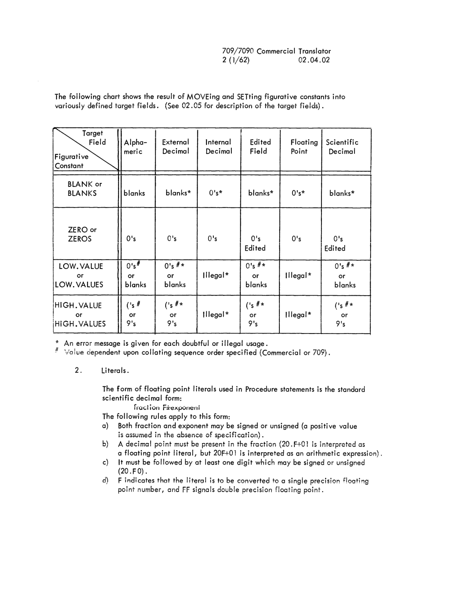
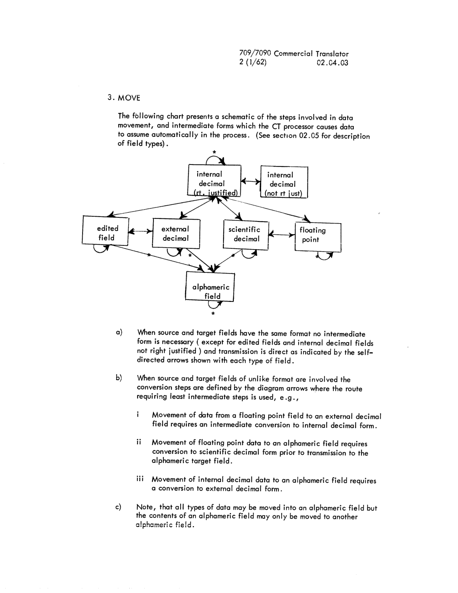
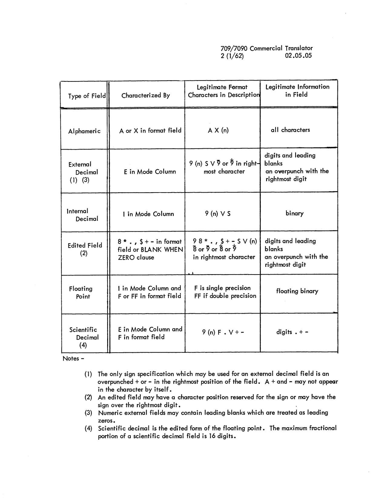
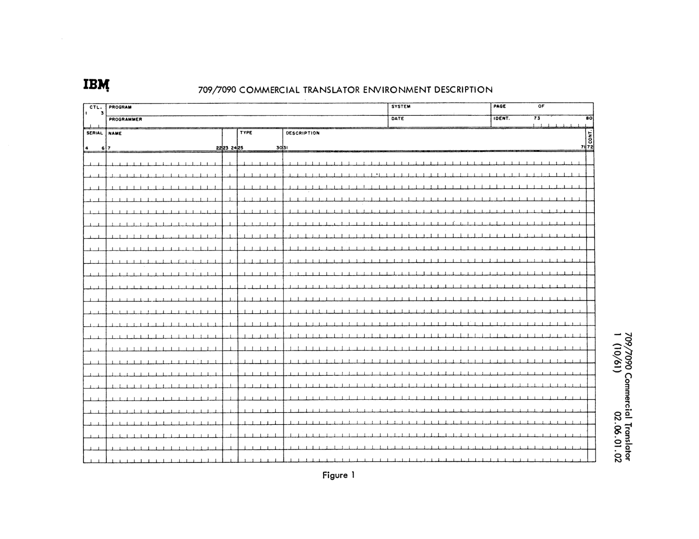
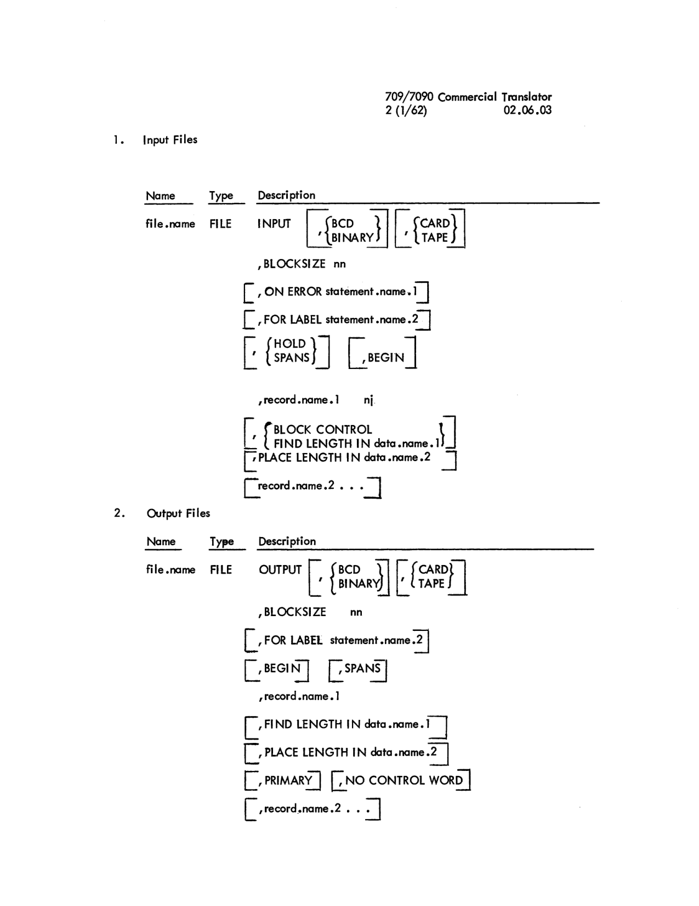
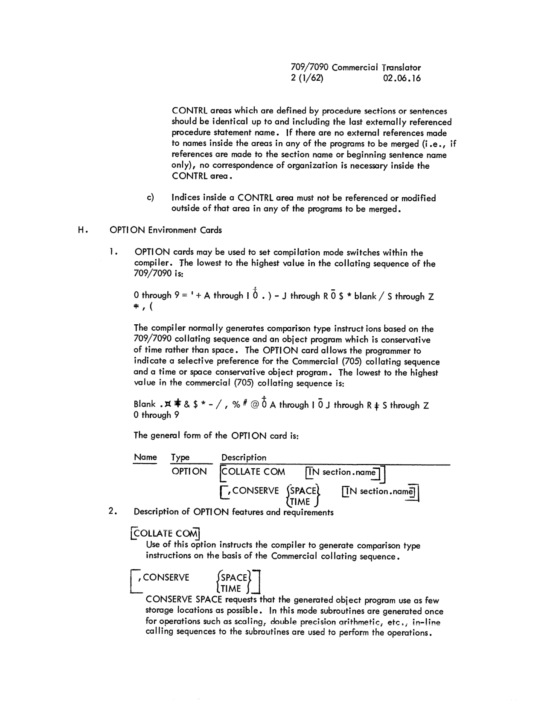
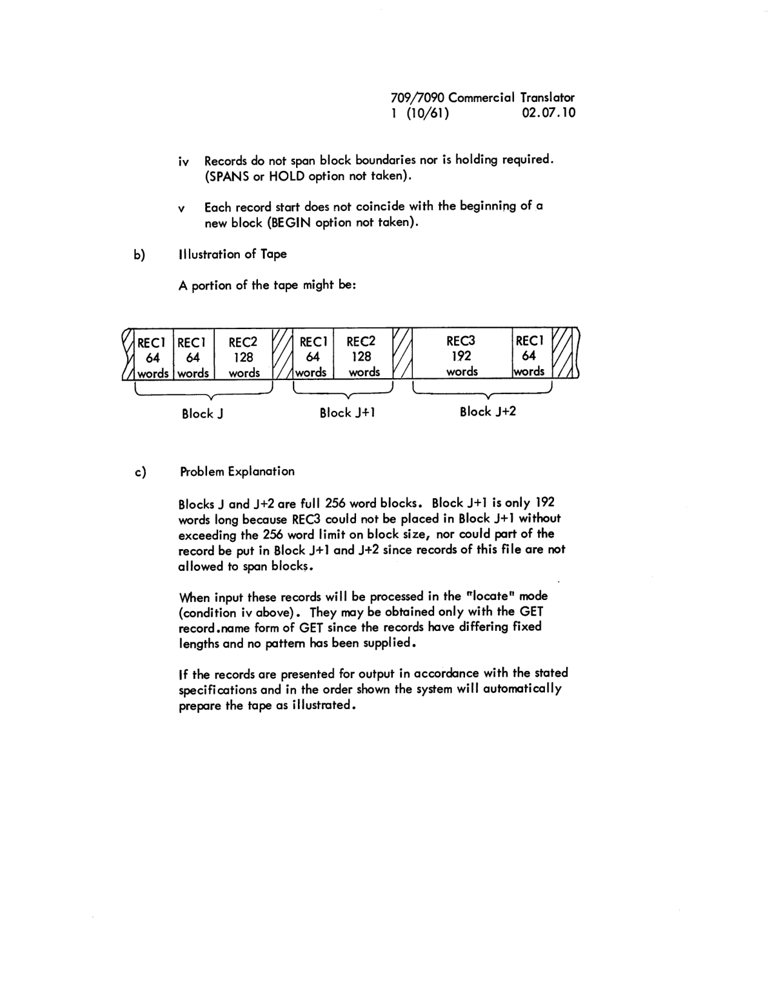
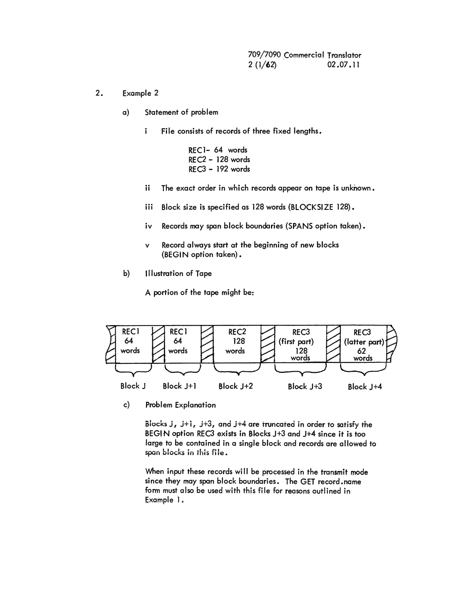
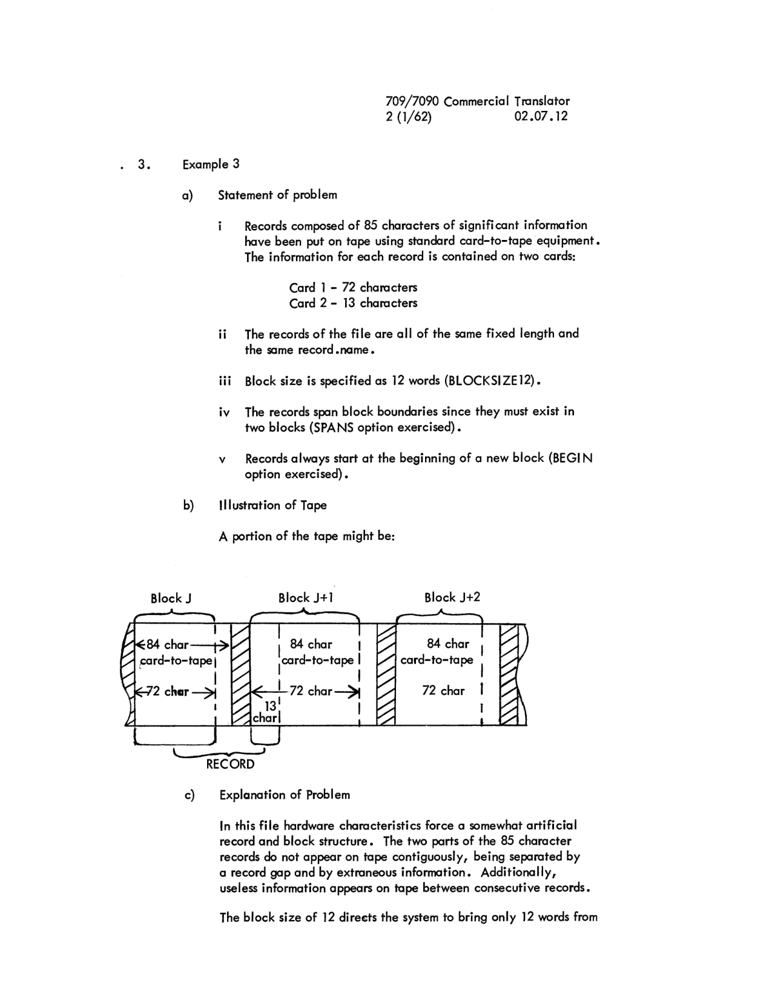
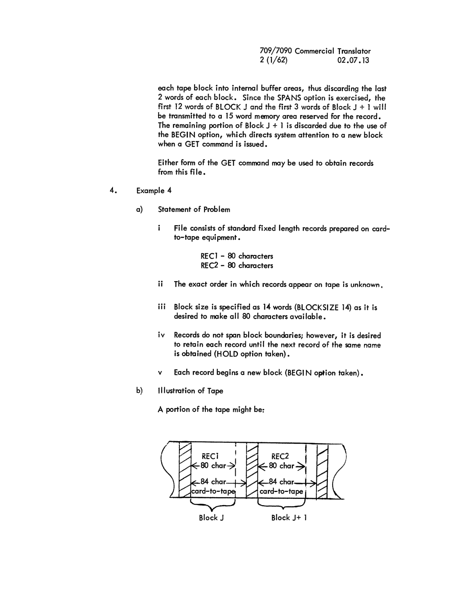

# Section 02: Compiler

<!-- 02.00.00 | PDF 9 -->
**[02.00.00]**

## 02.00 Introduction

The 709/7090 Commercial Translator Compiler under the direction of the Commercial Translator Supervisor analyzes Commercial Translator Data, Procedure and Environment Descriptions and CRYPT symbolic machine language instructions and produces a relative binary object program deck. Description of the control cards which direct compilation, discussion of compiler output, amplification of source language rules, and a general discussion of input/output facilities are presented in this section. Discussion of compiler operation appears in section 05 and a detail description of object code generated by the Compiler appears in Appendix 90.02. Current compiler restrictions, limitations and/or deferred features are found in Appendix 90.01.

<!-- 02.01.01 | PDF 10 -->
**[02.01.01]**

## 02.01 Compiler Control Cards

#### A. $CMPLE Card

A $CMPLE card must precede each source language program. It is recognized by the Commercial Translator Monitor (CTM) for purposes of operational control and interpreted by the Commercial Translator compiler to initiate processing of source language statements. The general form of the $CMPLE card is:

```
1  -  6      8  -  13       16
$CMPLE       deck.name      [NODECK]        [,LIST]         [,DICT]
                            [,LOAD]         [,LOGIC]        [,FILES]
                            [,MAP]          [,NOGO]

             55        -        72
             [secondary.identifier]
```

where

`deck.name` is the primary deck identifier composed of six or less characters chosen from the set appropriate for use in CT names. The name may begin in any of the positions but must not include imbedded blanks. Leading blanks are ignored by the compiler.

The complete deck.name is punched in columns 1-6 of all Loader symbolic control cards in the generated object deck for use in cross referencing when multiple decks are combined at load time.

The options used must not be separated by blanks as the first blank terminates the list of options. The options must be separated only by commas.

`[,NODECK]` instructs the Compiler to omit punching of an object deck. Normally, an output deck is produced except when a severe error has been encountered during compilation. The severity value (code) is used to determine whether a deck will be produced when NODECK is not specified. If the severity code is 5, a deck will not be produced.

`[,LIST]` instructs the compiler to produce a symbolic listing of the generated instructions. Normal compiler action produces no symbolic list.

`[,DICT]` instructs the compiler to list the dictionary giving the relative locations of all names used in the object program. Normally a dictionary is not listed.

<!-- 02.01.02 | PDF 11 -->
**[02.01.02]**

`[,LOAD]` instructs the compiler to write the object program on a system utility tape and turn control over to the Loader for loading the program after compilation. A map will be produced if the LOGIC option has been specified. The program will be executed unless the NOGO option has been taken, or the Compiler has encountered a source program error with a severity code greater than 1 or an undefined symbol in the code which it has generated.

`[,LOGIC]` instructs the Loader to list the origin and extent of all program sections, system subroutines required for execution (including IOCS) and buffer assignments. The LOAD option is automatically initiated by LOGIC and unless the NOGO option is specified the program will also be executed.

`[,FILES]` requests that a list of the I/O unit assignments made by the Loader be output on SYSOU1 whether or not the program is to be executed.

`[,MAP]` is an option yet to be specified for obtaining additional load-time information.

`[,NOGO]` instructs the Loader not to allow execution of the program after loading it. This does not inhibit the LOGIC and FILES options.

`[secondary.identifier]` provides the Compiler with identifying information to be printed in heading of the output listing prepared on SYSOU1. It is also punched in the *CTEND Loader control card. Any character may be used in any of the positions, columns 55 through 72.

#### B. *FINISH card

The *FINISH card delimits the extent of the source language statements to be compiled. The form of the card is:

```
7
*FINISH
```

Note that this card must be followed by an end of file (see 04.02 and 05.03).

<!-- 02.02.01 | PDF 12 -->
**[02.02.01]**

## 02.02 Compiler Output

The normal expected Compiler output is:

**A.** A relocatable column binary deck (see Appendix 90.03 for detailed format) unless the NODECK option has been selected or a severe error has been encountered during compilation.

1. Symbolic Control cards
2. \*CTEXT
3. Relative Binary Program Deck
   - a) Control Break Table
   - b) File Check Table
   - c) Text
4. \*CTEND

**B.** List Tape containing

1. **Source Program**

   The source program is listed with certain additions.

   - a) First column - source program card sequence numbers.
   - b) Second column - statement number assigned by the Compiler to the Procedure sentence, Data Description entry or Environment card. It is of the form xxxxx,00.
   - c) Third column - body of source program cards (columns 7-72). In some cases, names generated by the Compiler, i.e., GN)nnn, are shown in the name field of Procedure statements or Data entries unnamed by the programmer.

2. **Error Messages**

   A complete list of all error messages output by the Compiler appears in Appendix 90.04. Cross referencing between the source program and the error message list is made throught the statement numbers assigned by the Compiler. There are from three to six digits in the statement numbers. The last two are separated from the preceding digit(s) by a comma and they tell which clause is being referenced. The digit(s) preceding the comma tell which line is being referenced. The statement number 9999,99 is an exception. It is used to reference errors which are not confined to a single source statement.

3. File list
4. Assembly listing if LIST was selected and no severe error was encountered during compilation. (see Appendix 90.02 for guide to interpretation of this listing).

**C.** An intermediate tape containing a deck of the form described in (A) above will be produced if the object deck is to be loaded immediately after compilation.

<!-- 02.03.01 | PDF 13 -->
**[02.03.01]**

## 02.03 General Programming Considerations

#### A. Use of Coding Forms

1. Card serial numbers in columns 1-6 of source decks are not sequence checked by the compiler.
2. **Continuation of Specifications on Multiple Lines**

   - **a) General Rule** — Data and Environment entries using more than a single card for complete specification have a non-blank character in column 72 to indicate that the following card is part of the same entry. Continuation of Procedure text on successive lines is determined by the nature of the text; no continuation character is used.
   - **b) Data and Environment Names** — All imbedded and leading blanks in the name fields of cards associated with an entry are eliminated and the non-blank characters are compressed to form a single name.
   - **c) Determination of Break Points** — In all sections each word or literal must be complete upon a line since the processor assumes a blank following column 72 of Procedure lines and replaces the contents of column 72 with a blank in Data and Environment lines. The only exception to this rule is introduced by the manner in which the 7090 processor handles literals in the Data Description. Literals in this section which are continued on multiple lines in violation of the rules given on page 83 of the General Information Manual are handled correctly. Use of this characteristic of the 7090 processor should not be made if compatibility with other processors is desired.
   - **d) Continuation of Data Description Entries** — The name and description fields only of Data Description entries may be continued. All other specifications to be made for an entry must be made on the first card of that entry since these fields are not scanned on continuation cards.

3. **Termination of Statements and Entries**

   - **a)** Procedure statements are terminated by the first period (.) followed by a blank. Any information following this period blank is considered to be commentary.

<!-- 02.03.02 | PDF 14 -->
**[02.03.02]**

   - **b)** Data and Environment entries are considered complete when column 72 is blank. The period (.) must not be used to signal completion. In these sections, a period is considered part of the previous word, thus creating an undefined name.

#### B. Key Words

Many of the reserved Commercial Translator words are usable as Procedure, Data and Environment names in certain situations as shown in the following key word lists. However, it is strongly recommended that the entire group be avoided altogether.

1. The following words are always interpreted as Key words and may not be used as programmer names in any division.

   | | |
   |---|---|
   | BEGIN | LOW.VALUES |
   | FILE | ON |
   | FOR | RECORD |
   | HIGH.VALUE | WHEN |
   | HIGH.VALUES | ZERO |
   | IN | ZEROS |
   | LOW.VALUE | |

2. The following words may not be used as Data or Procedure names:

   | | | | |
   |---|---|---|---|
   | ABS | END | INCLUDE | QUANTITY |
   | ADD | ENTER | IS | RUN |
   | ALL | EQUAL | LESS | SECTION |
   | AND | EQUALS | LIBRARY | SET |
   | AT | EXACTLY | LOAD | STOP |
   | BLANK | FILES | LT | THAN |
   | BLANKS | FROM | MOVE | THEN |
   | CALL | GET | NOT | TIMES |
   | CLOSE | GIVING | NOTE | TO |
   | COMMERCIAL | GO | OPEN | TR |
   | CORRESPONDING | GREATER | OR | TRANSLATOR |
   | CRYPT | GT | OTHERWISE | TRUNCATED |
   | DISPLAY | HERE | OVERFLOW | USING |
   | DO | IF | OVERLAP | WITH |

<!-- 02.03.03 | PDF 15 -->
**[02.03.03]**

3. The following key words may be used as Procedure and Data names providing it is not necessary to reference the procedure or data items in the Environment Division:

   | | | | |
   |---|---|---|---|
   | ACTIVITY | COM | LOW | SEQ |
   | BCD | CONSERVE | MULTI | SERIAL |
   | BINARY | CONTROL | NO | SPACE |
   | BLOCK | DEFER | OPENCOUNT | SPANS |
   | BLOCKSIZE | ERROR | OPENF | TAPE |
   | BUFFERCOUNT | FIND | OPENW | THROUGH |
   | CARD | HIGH | OUTPUT | TIME |
   | CHECKC | HOLD | PLACE | UNIT1 |
   | CHECKF | INPUT | PRIMARY | UNIT2 |
   | CHECKPOINT | KEYS | REEL | WORD |
   | CKSUMS | LABEL | RETAIN | |
   | CLOSER | LABELN | | |
   | CLOSEW | LABELS | | |
   | COLLATE | LENGTH | | |

#### C. Name Qualification

Qualified names may not be used in the Environment Description or in CRYPT instructions. Data and Procedure names used in these sections must be of one word only. The verb CALL enables the programmer to reduce a qualified name to a one-word name to fulfill this requirement.

#### D. Effect of Data Storage Mode on Arithmetic Efficiency

Arithmetic operations are performed only in the internal (binary) mode. For this reason it is advantageous to have fields used in arithmetic operations in the internal mode when the programmer has a choice. If the fields are in the external mode and reoccur in different arithmetic statements, it is generally more efficient to MOVE this data to an area which has been defined with the mode as internal. This area would be referenced when the fields are used in arithmetic statements.

Consider the following examples:

Assume the following Data Description

| | | |
|---|---|---|
| A | 01 | 999 |
| B | 01 | 99 |
| C | 01 | 99 |
| D | 01 | 999 |
| E | 01 | 99 |
| X | 01 | IR999 |

<!-- 02.03.03.01 | PDF 16 -->
**[02.03.03.01]**

**1)** The sequence

```
SET A = B+C
SET D = A+E
```

could be made arithmetically more efficient by the sequence

```
SET X = B+C
SET D = X+E
```

This assumes of course, that A is not to be used elsewhere in its external form.

**2)** The sequence

```
SET A = B+C
SET D = B+E
```

can be improved by the sequence

```
MOVE B to X
SET A = X+C
SET D = X+E
```

<!-- conversion notes: All 8 pages (PDF 9-16) transcribed from page images against OCR draft; OCR errors corrected throughout (e.g., garbled option-bracket lines on PDF 10-11, "9999,99" statement-number references on PDF 12, scrambled key-word column lists on PDF 14-15). Page-header codes for PDF 11 and PDF 15 were misread by OCR ("02.01.62", null) and have been corrected to 02.01.02 and 02.03.03 respectively by reading the printed page-image headers directly. The character string "IR999" (Data Description example, PDF 15/16) is transcribed as printed; the first character is confirmed as the letter I, not digit 1 — settled by glyph inspection at 400 dpi on 2026-08-01 (in this face digit 1 carries a top-left flag while letter I is a bare stem; the word UNIT1 on the same page shows both forms side by side) and independently confirmed by manual review of the page. An earlier version of this note wrongly claimed the face renders 1 and I identically. The typo "throught" (for "through") on PDF 12 is preserved as printed in the source. No pages required image-only fallback; no figures/forms required embedding — all 8 pages are running text, syntax-card formats, key-word lists, or short data/code examples, fully transcribed as fenced code blocks and tables. -->

<!-- 02.04.01 | PDF 17 -->
**[02.04.01]**

## 02.04 Procedure Description Clarification and Amplification

### A. Constants and Literals

#### 1. Figurative Constants

a) Values of HIGH.VALUE and LOW.VALUE

HIGH.VALUE will be considered to be the left parenthesis, (, and LOW.VALUE the zero, 0, unless the Commercial collating sequence (COM) is specified in the Environment Description. The Commercial HIGH.VALUE is 9 and the LOW.VALUE is blank.

b) Figurative constants used in comparisons

ZERO may be compared to either numeric or alphameric fields.

HIGH.VALUE, LOW.VALUE and BLANK may be compared to alphameric fields only.

c) Use of figurative constants with MOVE and SET verbs.

Figurative constants may be used as source fields by both MOVE and SET. Two restrictions on the length of the target fields should be noted.

i. Figurative constants may not be moved to variable length arrays, i.e., to fields with which QUANTITY IN is associated signalling that the field length is determined at execution-time. However, figurative constants may be moved to a particular element of a variable length array.

For example, for the following data description entries:

```
          Lev   Quant   Description
ARRAY     01
FIELD     02    100     A(6) QUANTITY IN NNN
```

the sentence MOVE BLANKS TO ARRAY is illegal, whereas MOVE BLANKS TO FIELD(3) is proper.

ii. Figurative constants may not be moved to fields which are longer than 2^15 - 1 characters.

<!-- 02.04.02 | PDF 18 -->
**[02.04.02]**

The following chart shows the result of MOVEing and SETting figurative constants into variously defined target fields. (See 02.05 for description of the target fields).

| Figurative Constant | Alphameric | External Decimal | Internal Decimal | Edited Field | Floating Point | Scientific Decimal |
|---|---|---|---|---|---|---|
| BLANK or BLANKS | blanks | blanks* | 0's* | blanks* | 0's* | blanks* |
| ZERO or ZEROS | 0's | 0's | 0's | 0's Edited | 0's | 0's Edited |
| LOW.VALUE or LOW.VALUES | 0's# or blanks | 0's #* or blanks | Illegal* | 0's #* or blanks | Illegal* | 0's #* or blanks |
| HIGH.VALUE or HIGH.VALUES | ('s# or 9's | ('s #* or 9's | Illegal* | ('s #* or 9's | Illegal* | ('s #* or 9's |

Notes —
1. \* An error message is given for each doubtful or illegal usage.
2. \# Value dependent upon collating sequence order specified (Commercial or 709).


*Chart: result of MOVEing and SETting figurative constants into variously defined target fields (page 18).*

#### 2. Literals.

The form of floating point literals used in Procedure statements is the standard scientific decimal form:

```
fraction F±exponent
```

The following rules apply to this form:

a) Both fraction and exponent may be signed or unsigned (a positive value is assumed in the absence of specification).

b) A decimal point must be present in the fraction (20.F+01 is interpreted as a floating point literal, but 20F+01 is interpreted as an arithmetic expression).

c) It must be followed by at least one digit which may be signed or unsigned (20.F0).

d) F indicates that the literal is to be converted to a single precision floating point number, and FF signals double precision floating point.

<!-- 02.04.02.01 | PDF 19 -->
**[02.04.02.01]**

### B. Verbs

#### 1. ENTER

There are only two forms which this command may take: ENTER CRYPT and ENTER COMMERCIAL TRANSLATOR. The first form signals the processor that the following instructions are to be processed by CRYPT, the SCAT-like machine symbolic assembler of Commercial Translator. The second form of the command terminates the processing of CRYPT instructions and signals that Commercial Translator statements follow.

#### 2. DISPLAY

The display device for the 709/7090 processor is the on-line 716 printer. Note that the portion of the material to be displayed which is written enclosed in quotation marks actually is an alphameric literal, which may not exceed fifty characters in length and must be complete upon a single line.

A check is made to determine whether the internal form of the sentence to be displayed is more than 255 words of storage. If it is, the entire literal will be printed but it will be printed as more than one physical record.

<!-- 02.04.03 | PDF 20 -->
**[02.04.03]**

#### 3. MOVE

The following chart presents a schematic of the steps involved in data movement, and intermediate forms which the CT processor causes data to assume automatically in the process. (See section 02.05 for description of field types).


*Schematic of the intermediate forms assumed automatically during data movement for the MOVE verb (page 20).*

a) When source and target fields have the same format no intermediate form is necessary (except for edited fields and internal decimal fields not right justified) and transmission is direct as indicated by the self-directed arrows shown with each type of field.

b) When source and target fields of unlike format are involved the conversion steps are defined by the diagram arrows where the route requiring least intermediate steps is used, e.g.,

i Movement of data from a floating point field to an external decimal field requires an intermediate conversion to internal decimal form.

ii Movement of floating point data to an alphameric field requires conversion to scientific decimal form prior to transmission to the alphameric target field.

iii Movement of internal decimal data to an alphameric field requires a conversion to external decimal form.

c) Note, that all types of data may be moved into an alphameric field but the contents of an alphameric field may only be moved to another alphameric field.

<!-- 02.04.04 | PDF 21 -->
**[02.04.04]**

d) Subroutines are normally used to perform the requisite conversion and transmission except where arrows have associated an \*. These moves are normally performed by in-line instructions.

e) For the source fields of the scientific decimal type, a free form of data is allowed within the limits of the field. For example, a field with the pictorial -99V-99 may contain the value 1 in any of the following ways, (b represents a space):

```
b.01b2b        (i.e.   01 x 10^2)
1bb+01b        (note above scale applies when no point)
.001bb3
b1bbbbb        (note above scale applies when no point)
1000.-3
etc.
```

#### 4. CORRESPONDING Option with MOVE and ADD

Correspondence is determined at the lowest possible level on the basis of name only. All qualifiers must be present and identical through the level of the name itself to meet the criteria of correspondence. Note, however, that the resultant MOVE or ADD may be affected since the rules governing these commands are the same whether or not the CORRESPONDING option is exercised. Consider the command

```
MOVE CORRESPONDING DATA.1 to DATA.2.
```

a) Where the data with associated levels are

```
DATA.1          01      DATA.2          04
  GROUP         02        GROUP         05
    ITEM        03          ITEM        06
      FIELD.1   04            FIELD.1   08
      FIELD.2   04            FIELD.2   08
```

correspondence would be found at FIELD.1 and FIELD.2 level, and instructions would be generated to

```
MOVE DATA.1 GROUP ITEM FIELD.1 TO DATA.2 GROUP ITEM FIELD.1.
MOVE DATA.1 GROUP ITEM FIELD.2 TO DATA.2 GROUP ITEM FIELD.2.
```

b) Where the data with associated levels are

```
DATA.1          01      DATA.2          01
  GROUP         02
    ITEM        03          ITEM        03
      FIELD.1   04            FIELD.1   04
      FIELD.2   04            FIELD.2   04
```

no fields would be found to correspond due to the absence of the qualifier GROUP in DATA.2.

c) Where the data with associated levels are

```
DATA.1          05      DATA.2          01
  GROUP         06        GROUP         02
    ITEM        07          ITEM        03
      FIELD.1   08
      FIELD.2   08
```

<!-- 02.04.05 | PDF 22 -->
**[02.04.05]**

correspondence would be determined at the ITEM level, and an attempt would be made to generate the instructions to

```
MOVE DATA.1 GROUP ITEM TO DATA.2 GROUP ITEM.
```

Since the field DATA.1 GROUP ITEM has sub-fields, it has no format characteristics of its own and is assumed to be alphameric. If DATA.2 GROUP ITEM is a field into which alphameric information may not be legally moved, an error will be noted.

Data items referenced in a MOVE or ADD CORRESPONDING clause may be subscripted. The compiler simply appends the designated subscript to the generated instructions. For example, if in example a) above the command had been

```
MOVE CORRESPONDING DATA.1 TO DATA.2 (I)
```

and appropriate quantity values had been supplied in the Data Description the generated instructions would now be

```
MOVE DATA.1 GROUP ITEM FIELD.1 TO DATA.2 GROUP ITEM FIELD.1(I)
MOVE DATA.1 GROUP ITEM FIELD.2 TO DATA.2 GROUP ITEM FIELD.2(I)
```

#### 5. CALL

The (old.name) in a CALL statement must be unique and may not be subscripted. This requirement is met if the (old.name) appears only once in the Data Description or if sufficient qualifiers are used to identify it uniquely. The use of record.names should be avoided in CALL statements.

#### 6. SET

The operands of a SET instruction which are used in an arithmetic expression may be fields of any format except alphameric (the result field may be alphameric, however, and a statement of the form SET alpha.field.1 = alpha.field.2 is allowed since no arithmetic expression is specified). Appropriate conversion is performed in all cases although arithmetic operations are considerably less efficient when performed on fields having dissimilar formats. Generally, fields frequently referenced in arithmetic expressions should be converted to internal form right justified for most efficient operation.

a) Mode of Expression Evaluation

The 709/7090 Commercial Translator System allows single or double precision arithmetic in either the floating or fixed point modes. Floating point arithmetic is the 709/7090 floating binary arithmetic. Fixed point arithmetic is a binary integer arithmetic with decimal scaling.

<!-- 02.04.05.01 | PDF 23 -->
**[02.04.05.01]**

If a floating point or double precision number is encountered in the evaluation of an arithmetic expression, all remaining operations in the expression will be performed in floating point or double precision mode, as appropriate. Once the mode of evaluation is thus changed, the appearance of a number in the other of these modes will force subsequent evaluation to be performed in double precision-floating point mode.

b) Order of Expression Evaluation

When the hierarchy of arithmetic operations in an expression is not explicitly specified by the use of parentheses, operators are honored in the following order:

```
TR or ABS or - (Negation)
**
* or /
+ or -
```

For example, the expression

```
A+B/C+D**E*F
```

will be taken to mean

```
(A+(B/C)) + ((D**E)*F)
```

When there are two operators of the same hierarchy, ordering proceeds from left to right

For example, the expression

```
A*B*C
```

will be taken to mean

```
(A*B)*C
```

Parentheses may be used to specify an exact ordering of operations within an arithmetic expression.

For example, the expression

```
A*(B*C)
```

will be taken to mean

```
(A*(B*C))
```

<!-- 02.04.06 | PDF 24 -->
**[02.04.06]**

#### 7. GET and FILE

For discussion of these two verbs, refer to section 02.07.

#### 8. CLOSE ALL FILES

This command causes each open file to be closed in accordance with the close options exercised on the Loader \*SPEC card. Section 03.02 describes the options as they appear on the \*SPEC card which may be supplied by the programmer or generated by the Compiler from an Environment SPECIF card (Section 02.07). In the absence of specification, closing includes a rewind and unload of the unit.

Files closed by this form of the CLOSE command may not be subsequently reopened by the program.

#### 9. STOP RUN

A STOP RUN instruction must be included in each program to provide for transfer of control to the CT Supervisor at conclusion of execution of the object program. All open files are closed prior to this transfer of control as if a CLOSE ALL FILES had been supplied.

### C. Conditional Statements

1. Comparisons may not be made between numeric and alphameric fields. If ABC is described as three position alphameric field (AAA) and DEF as a three position numeric field (999) the following IF statement represents an invalid comparison:

```
IF ABC = DEF THEN ---
```

The implied or explicit specification of DEF as an external decimal field does not affect the validity of the comparison.

<!-- 02.04.07 | PDF 25 -->
**[02.04.07]**

#### 2. Comparisons of fields of unequal length

a) Numeric fields are compared arithmetically without regard to length.

b) Alphameric fields of unequal length are treated on the basis of the operator used in the comparison.

i. In tests for an = or NOT = condition the fields will always be found to be unequal. In the following example where fields A and B are of alphameric type with unequal length the only code generated will be a transfer to D.

```
IF A = B THEN GO TO C OTHERWISE GO TO D.

IF A NOT = B THEN GO TO D OTHERWISE GO TO C.
```

ii. In tests for NOT greater or less conditions the lengths are made equal by right truncation of the longer field.

3. For purposes of comparison edited fields (see 02.05 for definition) are converted to pure numeric fields. They may not be compared to alphameric fields.

4. All non-format fields (see 02.05 for definition) are compared alphamerically, subject to rules stated in 2b above.

5. Variable length fields may not be compared. (A variable length field is a field which uses the QUANTITY IN option).

6. For comparison purposes zero is considered an unsigned number, even though computational sequences generated by the compiler may produce negative or positive zeros.

### D. Subscripting and Indexing

A source program may refer to array elements through use of subscripted names such as A(J, K). Each unique subscripted name appearing in one or more Procedure statements causes the Compiler to generate a positional indicator which will serve to locate the array element when the program is executed. For example, each of the following subscripted names would cause the Compiler to generate a positional indicator although they refer to elements in the same array: A(J, K), A(J, K+1), A(2,3), A(2,1). Only one positional indicator will be generated for each, regardless of the number of times each is referenced.

A positional indicator contains the location (word and byte) of the particular element being referred to by the present values of the subscripts. The value of the positional indicator is a function of the location of the array, the dimensions of the array, and the values of the subscripts. A positional indicator with constant subscripts such as A(2,3) may be a load-time constant or may change in value if the dimensions or base location of the array vary during the execution of the object program.

<!-- 02.04.07.01 | PDF 26 -->
**[02.04.07.01]**

In general, positional indicators are evaluated when their subscripts change value. Execution of the code generated for SET K=K+2 would cause the positional indicators for 3 of the subscripted names shown above to be updated:

```
A(J, K),   A(2, K),   and   A(J, K+1)
```

The initial value of an array is A(1) and not A(0).

<!-- conversion notes:
- Page 17 (02.04.01), item A.1.c.ii: the source reads "Fiaurative constants" (apparent original typo/typewriter defect for "Figurative"), confirmed against the page image and preserved verbatim per the fidelity rule.
- Page 18 (02.04.02): the figurative-constant/target-field chart has non-standard notation (0's#, ('s #*, Illegal*) reproduced as a Markdown table; the source page image is also embedded beneath it per the complex-table convention, since the notation includes footnote markers (*, #) that are easy to misread from a text table alone.
- Page 18: the floating-point literal general form is printed as "fraction F±exponent" (± is a single overstruck plus/minus glyph in the original); reproduced literally in a fenced code block.
- Page 20 (02.04.03): the MOVE data-conversion schematic is a boxes-and-arrows flowchart (internal decimal / external decimal / edited field / scientific decimal / floating point / alphameric field, with self-directed and cross arrows, some marked with *); embedded as the page image rather than attempting an ASCII reproduction, since arrow routing is not reliably representable in text. The accompanying prose (a–e) already describes the routing rules in full.
- Page 21 (02.04.04): "b" is used in the source as an explicit stand-in glyph for a space character in the free-form scientific-decimal examples (b.01b2b, etc.) and is preserved as printed, not converted to literal spaces.
- No pages in this range were null/unknown in the section-code map; all PDF 17–26 header codes were confirmed directly against the page images.
-->

<!-- 02.05.01 | PDF 27 -->
**[02.05.01]**

## 02.05 Data Description Amplification and Clarification

The name of each data field referenced in Procedure statements or Environment Descriptions must appear in the name field of a Data Description entry. Neither storage allocation nor assignment of data characteristics is made for data fields not so named.

### A. Level

1. Any numbers 01-99 may be used to specify the level of fields. Leading zeros are optional and all level numbers less than 10 are right justified by the compiler.

2. The highest level in a program need not be 01. All data fields of level equal to the highest level in a source program will be left justified unless explicitly specified as right justified. Consider a source program in which only the following description of data appears:

```
Name    Level    Type      Description
A       05       RECORD
  B     10                 A(20)
  C     10                 9(20)
D       05                 9(2)
E       05                 A(3)
```

Fields A, D, and E will each be left justified (although no justification is specified and previous fields may not complete full words) since 05 is the highest level used in the program.

### B. Type Codes.

#### 1. RECORD

a) A record is a data hierarchy which may not be part of any data organization except a file or a section. The "Quantity columns" are used to specify the number of times a format of data is repeated within a hierarchy; the use of these columns with a data hierarchy, such as RECORD, is unacceptable. When the type code RECORD is recognized the previous data organization is always terminated. Record definition is terminated by specification of a level number equal to or less than the one associated with RECORD.

b) A record must have length, and redefinition of a record area does not give it length.

The compiler considers that no length has been specified for REC1 in the following example:

```
Name    Level    Type      Description
REC1    01       RECORD
                  REDEF     REC1
AREA    01                  A(40)
```

<!-- 02.05.02 | PDF 28 -->
**[02.05.02]**

The length of a record is normally determined on the basis of fields defined within it. Length may also be given to a record through use of a pictorial with the RECORD entry itself.

#### 2. COND

a) Normally this type code is associated with several entries naming and describing the values a particular field may have. These entries must be preceded by a higher level entry defining the format of the fields and must all have the same level number and include the COND type code.

#### 3. REDEF (see iii under Data Description on page 90.01.03 for limitation).

a) When the REDEF type code is used, it should appear on a line with no additional coding except a serial number and the name of the item being redefined. The first item appearing thereafter must have the same level number as the item referenced by the REDEF.

b) When a REDEF is first encountered, the contents of the storage assignment counter are saved by the compiler, and assignment proceeds according the REDEF. The effect of a REDEF is terminated upon encountering an item of a level above or equal to the level of the item referenced by the REDEF or upon encountering another REDEF. Termination of the former type causes the storage assignment counter to be restored and assignment proceeds in the normal manner.

c) Compound names are formed without regard to REDEFs (or other type codes) and as a function of the level and position within the program of the simple names only. Consider the following examples, in which the completely qualified name of H is A G H in both instances.

EXAMPLE 1 -

```
Data Name    Level    Type      Description
A            01
  B          02
    C        03
    D        03
E            02
  F          03
                       REDEF     B
G            02
                       REDEF     C
  H          03
```

<!-- 02.05.03 | PDF 29 -->
**[02.05.03]**

EXAMPLE 2 -

```
Data Name    Level    Type      Description
A            01
  B          02
    C        03
    D        03
  E          02
    F        03
                       REDEF     E
  G          02
                       REDEF     C
    H        03
```

#### 4. RCDMRK

The RCDMRK type code causes insertion of a single character record mark constant in the indicated position. No description field specification is required since the compiler automatically provides a pictorial with a single A. Information may be freely moved into or out of this position subject only to the restriction imposed by its single character alphameric format.

#### 5. LABEL

The type code LABEL allows the programmer to redefine with the indicated data description entries, the single 14 word label area in the Input/Output Control System from which all labels for output files are written and into which all input labels are read. This area may only be processed by the Commercial Translator programmer by using the FOR LABEL option on the Environment FILE cards. Use of the FOR LABEL option with a file causes IOCS to transfer control to the procedure.name specified with the option when the file is opened or closed, or when a reel switch occurs. Discussion of the implementation of this procedure may be found in Appendix 90.07. The type code LABEL and the FOR LABEL option provide the programmer with an IOCS oriented method of checking and forming non-standard labels. The restrictions limiting the length of labels processed in this manner to 14 words and dictating that portions of the FOR LABEL coding must be done in CRYPT may make an alternate method desireable; i.e., defining labels as records and processing with the GET and FILE verbs.

#### 6. PARAM and FUNCT

These two type codes described in the General Information Manual are no longer in the language.

<!-- 02.05.04 | PDF 30 -->
**[02.05.04]**

### C. Quantity Field

An entry in this field is used by the compiler to reserve storage for sequential data of the same format. If no value is specified, 1 is assumed. No check against this value is made at execute time. The maximum Quantity which may be specified is 2¹⁵ - 1. Since Quantity numbers are used to specify sequences of data descriptions for use of lists and tables, and since data in tables is referred to by the use of subscripted names, quantity numbers should not be assigned to data items not having names, unless these items include named items at a lower level.

### D. Mode and Justify Fields

1. The MODE column of the data description coding form merits careful attention. Internal mode (I) designates that the associated numeric field is to contain data in binary form. External mode (E) designates that the stored form is BCD.

2. A numeric internal mode field designated as right justified (R) appears by itself in the low order positions of a full word (two if double precision) with the sign value in the sign bit of the word. Numeric external fields to be involved in extensive computation should be converted to this internal right justified by a preliminary SET or MOVE in order to prevent repetitive unpacking and converting.

   The length of a numeric internal mode fixed point field designated as left justified or without justification specification is the least multiple of 6 bits sufficient to contain the number and its sign (leftmost bit of the field so designated). Left justification (L), as with external fields, reserves storage beginning with the leftmost bit of a new word and extending through as many words and bits as necessary. The no justification mode (blank) differs only in that storage reservation begins immediately to the right (within the same word if possible) of the preceding storage reservation.

   For a right justified external mode field, storage is reserved beginning in a new word so that the field's last character is also the rightmost character of its final word.

3. Specification of right justification is effective only for data items with explicitly described formats. Left justification is always effective.

### E. Description Field

#### 1. Pictorials

a) Definition of Allowable Data Field Types

The chart on the following page defines the types of formats which data fields may assume. The determining characteristics, allowable format description characters and proper field contents are shown for the various field types.

b) The pictorial characters A and X are considered to be synonymous by the 7090 CT Compiler.

<!-- 02.05.05 | PDF 31 -->
**[02.05.05]**

| Type of Field | Characterized By | Legitimate Format Characters in Description | Legitimate Information in Field |
|---|---|---|---|
| Alphameric | A or X in format field | A X (n) | all characters |
| External Decimal (1)(3) | E in Mode Column | 9 (n) SV9̅ or 9̅ in rightmost character | digits and leading blanks; an overpunch with the rightmost digit |
| Internal Decimal | I in Mode Column | 9 (n) V S | binary |
| Edited Field (2) | 8 * ., $ + - in format field or BLANK WHEN ZERO clause | 9 8 * ., $ + - S V (n); 8 or 9 or 8̅ or 9̅ in rightmost character | digits and leading blanks; an overpunch with the rightmost digit |
| Floating Point | I in Mode Column and F or FF in format field | F is single precision; FF if double precision | floating binary |
| Scientific Decimal (4) | E in Mode Column and F in format field | 9 (n) F . V + - | digits . + - |


*Chart: Definition of Allowable Data Field Types (02.05.05).*

Notes —

1. The only sign specification which may be used for an external decimal field is an overpunched + or - in the rightmost position of the field. A + and - may not appear in the character by itself.
2. An edited field may have a character position reserved for the sign or may have the sign over the rightmost digit.
3. Numeric external fields may contain leading blanks which are treated as leading zeros.
4. Scientific decimal is the edited form of the floating point. The maximum fractional portion of a scientific decimal field is 16 digits.

<!-- 02.05.06 | PDF 32 -->
**[02.05.06]**

c) A field for which no pictorial is given is treated as alphameric with length equal to the length of its subfields.

No subfields may be specified for the field whose format is described. The only entry which may legitimately appear at a lower level is a COND definition.

In the following example A and D are treated as alphameric fields with lengths of 12 characters each.

```
Name    Level    Mode    Justify    Description
A       01
  B     02       I       R          99
  C     02       I       R          99
D       01
  E     02                          A(6)
  F     02                          A(6)
```

d) Fixed point double precision numbers are denoted in the Data Description by formats representing more than 10 digits. Double precision internal floating point numbers are specified by "FF" in the Data Description.

e) Any non-format character appearing in the pictorial will result in the pictorial being interpreted as a name. An error message will be produced if the pictorial is not a data, key, or a procedure name.

#### 2. Constants

a) Constants cannot be defined.

i in a field whose pictorial characterizes it as an edited field.

ii as a part of a located input area. (see section 02.07).

iii following a variable length field.

iv as part or all of the redefinition of an area.

b) No format specification is required in the definition of alphameric constants. The length of the literal is assumed as the length of the field. However, if a pictorial is furnished and the length given by the pictorial is:

i greater than the length of the constant the constant is left-justified in the field and the remaining positions of the field filled with blanks.

ii less than the length of the constant the characters of the constant starting with the left end are placed in the field until the field is full; at which time the remaining characters are discarded. Also, an error message is produced.

<!-- 02.05.07 | PDF 33 -->
**[02.05.07]**

c) If a field is defined as external decimal the length specified by the pictorial must be exactly equal to the length of the constant. Also, the constant must utilize the sign convention given in the pictorial e.g.,

If the pictorial is 999̅, the number 123̅ would be correct
whereas 123 would not be correct

d) If a field is defined as internal decimal the length of the field specified in the pictorial may be larger than the constant. In this case the constant is right justified in the field. If the constant is larger, the constant is truncated at the left-end to the size specified by the pictorial, converted and stored. Also, an error message is produced.

The appropriate sign conventions for internal decimal constants are:

i leading + or -

ii trailing + or -

iii no sign

#### 3. QUANTITY IN data.name

Use of this option indicates that the associated entry(s) is to be repeated a variable number of times as determined at execute time by the value in the indicated 'data.name'.

The compiler reserves sufficient storage for the maximum number of times the field may be present on the basis of the value entered in the Quantity Field.

#### 4. BLANK WHEN ZERO

When associated with an output field this clause indicates that the field is to be replaced with blanks when it becomes zero. Since leading blanks in numeric input fields are automatically treated as zeros, the use of this clause is redundant. In some cases it may even result in decreased efficiency in the object program as these fields are treated as edited types.

<!-- conversion notes: Page 02.05.05 (PDF 31) is a complex ruled table (the Data Field Type chart); a best-effort Markdown table is given and the source page image is embedded beneath it per chunk instructions. Overpunched sign digits are normalized throughout to Unicode combining overline (9̅, 8̅) per the conversion spec, including the worked example on 02.05.07 (PDF 33) where the source renders the overpunch as a small raised +/- above the digit rather than a full overline — the overline form was used for consistency with the spec's instruction and with the chart on 02.05.05; the underlying distinction being illustrated (sign-punched digit vs. plain digit) is preserved. Isolated marks at the top margin of PDF pages 32 ("ho") and 33 ("3.") appear to be scan/print artifacts rather than legible content and were omitted. The Name/Level/Type/Description and Name/Level/Mode/Justify/Description worked-example tables (02.05.01–02.05.04, 02.05.06) are reproduced as fenced code blocks to preserve column alignment and indentation, matching how they appear as coding-form-style entries in the source; original indentation of items such as E and H across the two REDEF examples is inconsistent in the source itself (not a transcription error) and has been preserved as printed. No pages in this chunk required full image-only fallback. -->

<!-- 02.06.01.01 | PDF 34 -->
**[02.06.01.01]**

## 02.06 Environment Description

#### A. Introduction

1. The Environment Description of the Commercial Translator language allows the programmer to specify the external physical factors which relate to the compilation and execution of the program. These factors may usually be changed without affecting the logical description of the problem, as contained in the Procedure and Data Description parts of the language. The Environment Description of a source program specifies and describes those factors which allow the processor and object program to deal with information as it exists in the "external world", including physical characteristics of data, machine configurations, and programmer-elected features.
2. In this chapter, a general discussion of the Environment Description is followed by a detailed explanation of the various specifications. Appendix 90.08 describes the effect of the various Environment specifications on the Loader symbolic control cards generated by the Compiler.

#### B. Environment Types

1. **General Rules for Use of Coding Form**

   Figure 1 is a sample Environment Description coding form on which seven general types of specifications may be made. The information associated with each type is entered on one or more cards. The first card of each specification group may contain an appropriate name in the Name field (columns 7-22) and must contain one of the following seven type codes in the Type field (columns 25-30):

   - a) FILE
   - b) SPECIF
   - c) POOL
   - d) GROUP
   - e) CONTRL
   - f) OPTION
   - g) COND

   When multiple cards are required continuation of the options (columns 31-71) or Name on subsequent cards is indicated by a non-blank character in the Continuation field (column 72). The absence of a character in column 72 signals that the next card initiates a new specification; if the next card does not contain a type specification the card is deleted and an error message given. If a card containing the continuation signal is followed by one which contains a type specification, the type is ignored and the options specified are considered to be part of the previous specification.

<!-- 02.06.01.02 | PDF 35 -->
**[02.06.01.02]**


*Figure 1 — 709/7090 Commercial Translator Environment Description coding form, blank specimen (page 35).*

The form carries no completed entries in this specimen; only the printed column headings and ruling are present:

```
IBM               709/7090 COMMERCIAL TRANSLATOR ENVIRONMENT DESCRIPTION

CTL.    PROGRAM                                              SYSTEM          PAGE     OF
1  3
        PROGRAMMER                                           DATE            IDENT.   73        80

SERIAL  NAME                             TYPE      DESCRIPTION                                CONT.
4   6   7                     22 23  24  25    30  31                                    71    72

[ruled card-image lines follow, unfilled]
```

<!-- 02.06.02 | PDF 36 -->
**[02.06.02]**

A period (.) must not be used to signal the end of a specification as it will be treated as part of the previous word thus creating an undefined symbol.

2. **General Function of Specification Types**

   | Card | Description |
   |---|---|
   | **FILE cards** | The FILE environment card must be included to describe the file characteristics which affect compilation, such as use for input or output and the type of blocking utilized. |
   | **SPECIF cards** | The SPECIF card describes such file characteristics as symbolic input/output unit assignments, density, relative activity, labeling conventions and other programmer choices which are to be punched during compilation into load-time control cards. SPECIF cards may be omitted if the programmer prefers to provide his own cards containing the appropriate information at load-time. |
   | **POOL cards** | POOL environment cards may be used by the programmer to direct the processor in the allocation of buffer storage for several files. In the absence of POOL cards, the processor will automatically make pool and buffer assignments. |
   | **GROUP cards** | GROUP cards may be used by the programmer to specify buffer allocation for files belonging to a particular buffer POOL. |
   | **CONTRL cards** | If several separately compiled programs are to be combined and executed as one program, any joint procedure or data description areas must be defined for the compiler by CONTRL environment cards. |
   | **OPTION cards** | OPTION cards are used when the programmer wants the processor to depart from its standard use of 709/7090 collating sequence, or when he wishes special emphasis placed on minimizing either storage or running time requirements in his object program. |
   | **COND cards** | The COND card names and defines a computer console key setting which the programmer may want to test by procedure statements in his program. |

#### C. FILE Environment Card

FILE cards are used to supply the compiler with the characteristics of the file which are necessary at compile time. This specification must be made for each file processed by the program. The formats of the FILE cards and options available for input, output and checkpoint files are shown below:

<!-- 02.06.03 | PDF 37 -->
**[02.06.03]**

1. **Input Files**

   ```
   Name        Type    Description

   file.name   FILE    INPUT    [ ,{BCD}    ]    [ ,{CARD} ]
                                 [  {BINARY} ]    [  {TAPE} ]

                        ,BLOCKSIZE nn

                        [ ,ON ERROR statement.name.1 ]
                        [ ,FOR LABEL statement.name.2 ]
                        [ ,{HOLD}  ]    [ ,BEGIN ]
                           {SPANS}

                        ,record.name.1        nj

                        [ ,{BLOCK CONTROL}               ]
                        [  {FIND LENGTH IN data.name.1}  ]
                        [ ,PLACE LENGTH IN data.name.2   ]

                        [ record.name.2 . . . ]
   ```

   *[Resolved by scan re-verification, 2026-08-01.]* The mark `nj` after `,record.name.1` is genuine type on the page — full-strength, right-reading, and baseline-aligned with the form text (not bleed-through, which would print mirrored); a tiny trailing mark formerly read as a period is a dust speck, not a character. It corresponds to no defined syntax element and its purpose is unknown (stray keystroke, abandoned annotation, or erasure remnant); it is reproduced in the code block above per the fidelity rule.

   
   *FILE card general forms for Input Files and Output Files (page 37).*

2. **Output Files**

   ```
   Name        Type    Description

   file.name   FILE    OUTPUT   [ ,{BCD}    ]    [ ,{CARD} ]
                                 [  {BINARY} ]    [  {TAPE} ]

                        ,BLOCKSIZE nn

                        [ ,FOR LABEL statement.name.2 ]

                        [ ,BEGIN ]    [ ,SPANS ]

                        ,record.name.1

                        [ ,FIND LENGTH IN data.name.1  ]
                        [ ,PLACE LENGTH IN data.name.2 ]
                        [ ,PRIMARY ]    [ ,NO CONTROL WORD ]

                        [ ,record.name.2 . . . ]
   ```

<!-- 02.06.04 | PDF 38 -->
**[02.06.04]**

3. **Checkpoint Files**

   ```
   Name        Type    Description

   file.name   FILE    CHECKPOINT
   ```

4. **Description of File Options and Requirements**

   - a) The order in which options are exercised on the FILE card is critical only in that the options exercised for a particular record must be listed following the record.name and prior to the introduction of another record.name.
   - b) Detail Description of FILE options and requirements

   ```
   {INPUT      }
   {OUTPUT     }
   {CHECKPOINT }
   ```

   The description of the file must specify one of these three types. If a file is designated as CHECKPOINT it may have no other usage.

   ```
   [ ,{BCD}    ]
   [  {BINARY} ]
   ```

   The specification states the mode in which an input file is to be read or an output file written. If no specification is made the file is assumed to be BCD.

   ```
   [ ,{CARD} ]
   [  {TAPE} ]
   ```

   CARD is specified if the on-line card reader or card punch is the processing unit. When CARD is specified BEGIN is assumed, i.e., each record starts at the beginning of a physical block. With this option only columns 1 through 72 are read. For the most efficient handling of card input a GROUP card should be used when more than two cards constitute a record. If no specification is made TAPE processing is assumed.

   ```
   ,BLOCKSIZE nn
   ```

   nn is an integer representing the size of the largest block to be output or the maximum number of words to be input from an input block. This specification must be made. All input card files must have a block size of at lease 24 words. Maximum blocksize is 9999 words.

   ```
   [ ,ON ERROR statement.name.1 ]
   ```

   Statement.name.1 references a procedure statement name in the Commercial Translator program to which transfer will be made if the system is unable to recover from an input error. (See Section 02.07).

<!-- 02.06.05 | PDF 39 -->
**[02.06.05]**

   ```
   [ ,FOR LABEL statement.name.2 ]
   ```

   FOR LABEL option provides transfer of control to statement.name.2 whenever a file is opened or closed or whenever a reel switch occurs. See Appendix 90.07 for application of this option in processing non-standard labels.

   **record.name** — All records associated with the file **must be** named on the FILE card.

   ```
   [ ,{HOLD}  ]
   [  {SPANS} ]
   ```

   Specification of either the HOLD or SPANS option

   - **i** For an input file: forces data to be processed in the transmit mode. This is required if records in the file overrun the boundaries of a block (SPANS); when it is required that each named record of the file be available until another of the same name is input (HOLD).
   - **ii** For an output file: specifies that output records are to be written in blocks of the specified length. This allows the existence of partial records in blocks for the sake of compactness (SPANS). Files written in this manner must be processed in the transmit mode when input.

   The compiler does not differentiate between the words HOLD and SPANS. They produce the same effect and are both included in the vocabulary for mnemonic convenience.

   If neither HOLDS or SPANS is selected an input file will be processed in the locate mode; an output file will be created with all records complete within blocks.

   ```
   [ ,BEGIN ]
   ```

   The BEGIN option specifies that each record to be read or written by the program starts at the beginning of a physical block.

   ```
   [ ,{BLOCK CONTROL}              ]
   [  {FIND LENGTH IN data.name.1} ]
   ```

   BLOCK CONTROL specifies that the input record is of variable length but has no standard control word preceding it; the logical record length is equal to the length of the block. FIND LENGTH IN data.name.1 signals that the length of an input or output record is to be obtained from data.name.1 rather than as specified by the data description. If neither option is selected it is assumed that the variable length record is preceded on tape by the standard control word.

<!-- 02.06.06 | PDF 40 -->
**[02.06.06]**

If both options are specified for a record, only BLOCK CONTROL will be effective.

```
[ ,PLACE LENGTH IN data.name.2 ]
```

Use of this option on input makes available in data.name.2 the length of the current record. On output the length of the current record will be placed in data.name.2 prior to filing the record.

<!-- 02.06.07 | PDF 41 -->
**[02.06.07]**

```
[ ,PRIMARY ]
```

The PRIMARY option enables the user to file selectively a record which is associated with more than one output file. The 'FILE record.name' command will file records belonging to more than one output file only in those files where PRIMARY has been specified for that record.name. If PRIMARY is not used with the record.name in any file, the record will be filed in all output files with which it is associated.

```
[ ,NO CONTROL WORD ]
```

This option notifies the system not to produce the standard control word for the variable length output record.

#### D. SPECIF Environment Card

1. The SPECIF card is used to describe load time I/O options for the designated file. SPECIF cards are not necessary for correct compilation of a Commercial Translator program; the user may elect to punch the required load time cards himself rather than allowing the compiler to do so on the basis of SPECIF cards. The SPECIF card(s) may appear anywhere within the environment division. The general form of the SPECIF card is:

   ```
   Name    Type      Description

           SPECIF    file.name  [ ,UNIT1 'unit.1' ]  [ ,UNIT2 'unit.2' ]

                     [ ,{LOW}  ]   [ ,DEFER ]   [ ,OPENW ]   [ ,OPENF ]
                        {HIGH}

                     [ ,{CLOSER} ]   [ ,ACTIVITY nn ]   [ ,{CHECKC} ]   [ ,MULTI ]
                        {CLOSEW}                            {CHECKF}

                     [ ,SEQ ]   [ ,CKSUMS ]

                     [ ,{LABELS} ]   [ ,SERIAL 'ser.no' ]   [ ,REEL 'reel.no' ]
                        {LABELN}

                                   [ ,RETAIN days ]   [ ,{HIGH} ]
                                                          {LOW}
   ```

<!-- 02.06.08 | PDF 42 -->
**[02.06.08]**

**file.name** — File.name must be the first item of the SPECIF card description field. It must be identical with the file.name in the FILE card.

```
[ ,UNIT1 'unit.1' ]   [ ,UNIT2 'unit.2' ]
```

Note that the Quote Marks are mandatory. The alphameric literals 'unit.1' and 'unit.2' specify symbolically the I/O units (card or tape) to which the file is attached. The available unit specification includes relative unit assignment, symbolic channels, and tape transport model type. The secondary unit specification UNIT2 'unit.2', allows for the assignment of the secondary reel of a multi-reel file on another or the same unit which will be automatically referenced upon a reel switch. If UNIT2 is left blank, the secondary unit assignment will be the same as the primary unit. To explain these specifications the following notation is employed:

| Symbol | Meaning |
|---|---|
| X | denotes one of the real channels A,B,...,H |
| P | denotes a symbolic (unspecified physical) channel S,T,...,Z |
| k | denotes one of the numbers 1,...,9,0 |
| m | denotes a tape transport model number, II or IV |

The allowable unit specifications are:

- a) No specification - when the option is not exercised any available unit is to be assigned to the file.
- b) 'm' - any available unit of this model type is to be assigned to the file.
- c) 'X' - any available unit on this physical channel is to be assigned to the file.
- d) 'P' - all files in the job having this symbolic channel designation are to be assigned to the same channel.
- e) 'X(k)' - the kth available unit on the specified channel is to be assigned to the file; note that the parenthesis are required.

<!-- conversion notes: PDF pages 34-42 transcribed from page images against the OCR draft; the OCR draft was largely unreliable for the bracket/brace syntax "boxes" (FILE, SPECIF card general forms, pages 37-42), which were re-transcribed from the page images preserving [ ] (optional) and { } (choice) grouping and multi-line alignment as printed. Page-header codes: PDF 34 and PDF 35 carry a 4-component code (02.06.01.01 and 02.06.01.02) read directly from the page-image headers; jmap.json listed the truncated "02.06.01" for PDF 34 and null for PDF 35 — both corrected from the images. PDF 36 (jmap null) is 02.06.02, read from the image. On PDF 37, the mark "nj" appears immediately after `record.name.1` in the Input Files general form; scan re-verification (2026-08-01, 400 dpi, independently confirmed by manual review) established that it is genuine full-strength type, not bleed-through, and that the faint trailing mark formerly read as "." is a dust speck — it is therefore now reproduced verbatim in the transcribed code block; it corresponds to no defined syntax element and its purpose is unknown. The typo "at lease 24 words" (PDF 38, should read "at least") and "If neither HOLDS or SPANS" (PDF 39, plural "HOLDS") are preserved verbatim as printed in the source per fidelity rules — not corrected. PDF 35 is a coding-form facsimile (Figure 1) with no entries filled in; it is embedded as an image and its column headings/ruling are transcribed in a code block rather than the (blank) card rows. No other pages required image-only fallback. -->

<!-- 02.06.09 | PDF 43 -->
**[02.06.09]**

- f) 'Pm' — any available unit of this model type on the symbolic channel specified is to be assigned to the file.

- g) 'Pkm' — an available unit on the symbolic channel, having this model number, is to be assigned to the file. *k* in this use without parenthesis indicates the order of preference for the channel so that if the number of available units on the channel is less than the total requested for the channel those with lower numbers are to be assigned to the same channel.

- h) System units may be assigned by:

  - i 'IN' — the current system Input unit is to contain the file.
  - ii 'OU' — the current system Output unit is to be used for a printed output file.
  - iii 'PP' — the current system Peripheral Punch unit is to be used for a punch output file.
  - iv 'UTk' — System utility tape k (non-parenthesized k = 1-4) is to be used for the file.

- i) Card equipment is assigned for a file by

  - 1) 'RDX' — card reader, channel X
  - 2) 'PRX' — printer, channel X
  - 3) 'PUX' — card punch, channel X

- j) As a special option, an `*` in the UNIT2 field indicates that the secondary unit of a file is to be any unit on the same channel and of the same model type, which is available after all other assignments have been made. At load-time if units are available, but of a different model, one will be assigned; if no units are available on the channel, no secondary unit is assigned prior to execution of the job.

<!-- 02.06.10 | PDF 44 -->
**[02.06.10]**

**Examples**

A tape to be assigned to the first available unit on channel A is specified in the SPECIF card as `, UNIT1 'A(1)'`

If a programmer desires to use the system output tape he would specify `, UNIT1 'OU'`

Note, that in this case (also for 'IN') included options for density, opening and closing are non-effective.

Additional and more complete information concerning unit assignment will be found in section 03.

```
[, {LOW }]
   {HIGH}
```
LOW and HIGH specify the density of the tape. Density is assumed as HIGH if no specification is made.

```
[, DEFER]
```
This option may be exercised for files which are not required when processing is begun. Unless DEFER is specified the file must be mounted before program processing commences.

```
[, OPENW]
```
OPENW specifies that the file is not to be rewound before opening. If OPENW is not specified the file will be rewound prior to being opened.

```
[, OPENF]
```
OPENF specifies that this standard labeled file is to be found on a multi-file reel by searching forward until labeling information indicates that the proper file has been found. If this option is selected without the selection of the OPENW option the tape is rewound before searching. When OPENW and OPENF are both selected, the programmer must insure two things:

- 1) the tape is positioned before a header label; and
- 2) the labeled file to be searched for is further down the tape.

If the user desires that a file not be rewound and unloaded when it is closed he may exercise one of these options.

```
[, {CLOSER }]
   {CLOSEW}
```
CLOSER specifies that the file is only to be rewound upon closing. CLOSEW specifies that the file is not to be rewound upon closing.

<!-- 02.06.11 | PDF 45 -->
**[02.06.11]**

```
[, ACTIVITY nn]
```
nn is a number between 1 and 99 that represents the relative activity (or usage) of this file with respect to other files. The loading-time program uses this information in the allocation of buffer areas to produce a more efficient object program.

```
[, CHECKC
   CHECKF]
```
CHECKC specifies that a checkpoint will be written on the checkpoint file upon reel switch of this file. CHECKF specifies that a checkpoint will be written on this file upon reel switch; the file must be a labeled output file for this option to be operative. No check point will be written if neither option is exercised.

```
[, MULTI]
```
MULTI specifies a tape file which is contained in more than one tape reel. A single reel file is assumed if MULTI is not specified.

```
[, SEQ]
```
SEQ specifies that each block in the file contains a block sequence number which is to be checked by the I/O system. (see IOCS)

```
[, CKSUMS]
```
CKSUMS specifies that each block in the file carries a checksum of data in the block which is to be checked by the I/O system. (see IOCS).

```
[, {LABELS}]  [, SERIAL 'ser.no']  [, REEL 'reel.no']  [, RETAIN days]  [, {HIGH}]
   {LABELN}                                                                {LOW }
```
LABELS specifies a file with a standard label, i.e., labels to be checked or written automatically by IOCS.

LABELN indicates the use of a non-standard label, i.e., a label of 14 words or less which is to be checked by the programmer using a linkage supplied by the FOR LABEL option of the Environment FILE card. Either LABELS or LABELN must be explicitly stated if labels are to be recognized by IOCS and acted upon in either a standard or non-standard fashion. If neither option is exercised the file is considered to be unlabeled.

<!-- 02.06.12 | PDF 46 -->
**[02.06.12]**

The SERIAL, REEL, and RETAIN options may be specified for files with either standard or non-standard labels; this information is kept in the IOCS file block and is printed on-line in certain error situations. It is used by IOCS in checking and preparing standard labels (but not non-standard labels) and may be used by the programmer in checking and preparing non-standard labels.

Note:  careful study of the IOCS manual and Appendix 90.07 of this bulletin is essential for understanding standard and non-standard labels.

```
[, SERIAL 'ser.no']
```
The alphameric literal 'ser.no' is composed of 5 or less characters. Standard input labels will be checked against this serial number if a non-blank literal is specified. Standard output lables written by IOCS for this file will contain this serial number only if the REEL option specifies a 'reel.no' greater than 1; output serial numbers are normally taken from the label already present on the tape on which the first reel of the file is written.

```
[, REEL 'reel.no']
```
The alphameric literal 'reel.no' is composed of 4 or less numeric characters. Use of this option specifies the reel sequence number of the first reel of a file. When the option is not exercised this sequence number is assumed to be 1. Reel sequence number is adjusted at object time to reflect reel switching, and is checked in standard input labels.

```
[, RETAIN days]
```
The numeric literal, days, is composed of 3 or less numeric characters which specify the number of days a tape is to be retained from the date it was written.

An attempt to write a labeled file on this tape before the end of the period has expired will result in an on-line error message from IOCS. Unless a labeled file is to be written on a tape, the system assumes that no label is present on the tape.

```
[, {HIGH}]
   {LOW }
```
LOW and HIGH appearing after LABELS or LABELN indicate the density of the label. Label dinsity is assumed to be that of the file if no specification is made.

<!-- 02.06.13 | PDF 47 -->
**[02.06.13]**

#### E. POOL Environment Card

1. The POOL card enables the user to achieve a more efficient object program by specifying that certain files are to share a common buffer area. These cards are optional. If the programmer so desires, he may enter the information (normally provided in the POOL card) on an object time loading card. If POOL specifications are not provided at all, files will be grouped automatically by IOCS.

2. The general form of the POOL card is:

```
Name        Type    Description

pool.name   POOL    file.name.1   [file.name.2.....]

                     [, BUFFERCOUNT nn]

                     [, BLOCKSIZE nn]
```

3. Description of POOL options

```
[BUFFERCOUNT nn]
```
nn buffers will be assigned to the files in the pool by the loading program. nn must be equal to or greater than the number of files in the pool. (A further grouping of files is possible. This is described in the following section on GROUPS. When the GROUP option is used, nn must be equal to or greater than the total number of buffers assigned to groups within the pool). If BUFFERCOUNT is not specified, it will be assigned automatically by the compiler.

```
[, BLOCKSIZE nn]
```
nn is the number of words to be allocated to each of the buffers in the POOL. The POOL BLOCKSIZE should be equal to or greater than the largest BLOCKSIZE specified for any file in the pool. If BLOCKSIZE nn is not entered on the POOL card, the POOL BLOCKSIZE used will be the same as the BLOCKSIZE of the largest file in the POOL. (see FILE BLOCKSIZE)

#### F. GROUP Environment card

1. The GROUP card is used in conjunction with a POOL card in allocating buffer areas to be shared by files.

<!-- 02.06.14 | PDF 48 -->
**[02.06.14]**

The function of the GROUP cards is to specify how buffers within a POOL are to be shared by the various files in the POOL. These cards are optional. The information (normally provided in the GROUP card) may be punched into a load-time control card. If GROUP specifications are not made at all, the compiler will attempt to assign at least 2 buffers to each file.

2. The general form of the GROUP card is:

```
Name    Type     Description

        GROUP    [pool.name]

                  [, OPENCOUNT nn]

                  [, BUFFERCOUNT nn]

                  , file.name.1   [, file.name.2.....]
```

3. Description of GROUP Options

```
[pool.name]
```
The POOL to which a particular GROUP of files belongs must be specified by listing the pool.name as the first item in the variable field.

```
[, OPENCOUNT nn]
```
nn is the maximum number of files within the group which may be open concurrently during execution of the program. This count determines the minimum buffer count necessary for processing the GROUP of files. If no OPENCOUNT is given, the OPENCOUNT will be assumed equal to the number of files in the GROUP.

```
[, BUFFERCOUNT nn]
```
nn is the number of buffers which are to be assigned by the loader to this GROUP. The BUFFERCOUNT of a GROUP must be equal to or greater than the OPENCOUNT of the GROUP. If no BUFFERCOUNT is given for the GROUP, the loader will attempt to assign at least twice the OPENCOUNT number of buffers to the GROUP.

If the POOL BUFFERCOUNT or storage limitations prevent such assignment, buffers (in addition to the minimum necessary) are allocated to the GROUP on the basis of the activity of the files in the GROUP.

<!-- 02.06.15 | PDF 49 -->
**[02.06.15]**

#### G. CONTRL Environment Card

1. The CONTRL cards define procedure and/or data areas common to two or more Commercial Translator programs. These programs may be compiled and checked out independently and then merged at object loading time into one running program. The general format is:

```
Name     Type      Description

loadnm   CONTRL    { section.name
                      sentence.name.1   TO   sentence.name.2
                      record.name }
```

loadnm is a name of 6 characters or less which is used at object load time to equate areas in various programs defined by the environment CONTRL cards. This load time reference name must have been specified on a CONTRL card in each program referring to the area. The body of the CONTRL area may contain entirely different names in the various programs being combined.

In the form sentence.name.1 to sentence.name.2 the area defined will not include any of sentence.name.2.

2. The following restrictions apply to CONTRL areas.

- a) CONTRL areas which are defined by the Data Description must begin with left justification.

- b) References outside of CONTRL areas to names inside CONTRL areas are valid only if:

  - i The name referenced has the same bit displacement from the beginning of the CONTRL area in all programs to be merged.
  - ii The name referenced has the same format in all programs to be merged. Therefore, the following general rules apply to CONTROL areas:

    CONTROL areas which are defined by the Data Description should be identical in organization and format up to and including the last externally referenced item.

<!-- 02.06.16 | PDF 50 -->
**[02.06.16]**

CONTRL areas which are defined by procedure sections or sentences should be identical up to and including the last externally referenced procedure statement name. If there are no external references made to names inside the areas in any of the programs to be merged (i.e., if references are made to the section name or beginning sentence name only), no correspondence of organization is necessary inside the CONTRL area.

- c) Indices inside a CONTRL area must not be referenced or modified outside of that area in any of the programs to be merged.

#### H. OPTION Environment Cards

1. OPTION cards may be used to set compilation mode switches within the compiler. The lowest to the highest value in the collating sequence of the 709/7090 is:

```
0 through 9  =  '  +  A through I  0̅  .  )  −  J through R  0̅  $  *  blank  /  S through Z
                                                                              ‡  ,  (
```
*[Transcription uncertain for some special 709/7090 print-train characters in this collating-sequence display — see page image. Overbar (0̅) marks a special (non-alphameric) character position in this chart, not a numeral.]*


*Collating sequence notation, 709/7090 native and Commercial (705) order (page 50).*

The compiler normally generates comparison type instructions based on the 709/7090 collating sequence and an object program which is conservative of time rather than space. The OPTION card allows the programmer to indicate a selective preference for the Commercial (705) collating sequence and a time or space conservative object program. The lowest to the highest value in the commercial (705) collating sequence is:

```
Blank  .  ×  ‡  &  $  *  −  /  ,  %  #  @  0̅  A through I  0̅  J through R  ‡  S through Z
0 through 9
```
*[Transcription uncertain for some special characters in this line — see page image above.]*

2. The general form of the OPTION card is:

```
Name   Type     Description

       OPTION   [COLLATE COM]                 [IN section.name]

                [, CONSERVE {SPACE}]           [IN section.name]
                            {TIME }
```

Description of OPTION features and requirements

```
[COLLATE COM]
```
Use of this option instructs the compiler to generate comparison type instructions on the basis of the Commercial collating sequence.

```
[, CONSERVE {SPACE}]
            {TIME }
```
CONSERVE SPACE requests that the generated object program use as few storage locations as possible. In this mode subroutines are generated once for operations such as scaling, double precision arithmetic, etc., in-line calling sequences to the subroutines are used to perform the operations.

<!-- 02.06.17 | PDF 51 -->
**[02.06.17]**

CONSERVE TIME requests an object program which will be executed in a minimum amount of time; this is achieved by the generation of in-line instructions to perform the operations. This is the normal mode of operation.

```
[IN section.name]
```
This option may be used with either CONSERVE or COLLATE and enables the programmer to limit the modal specification to a particular section. When this option is used with CONSERVE or COLLATE the mode of generation reverts to the normal mode at the end of the specified section. There is no restriction on the number of times these modes may be altered.

#### I. COND Environment Card

1. The COND card defines a computer console entry keys setting which may be interrogated by procedure statements. The general form of the COND card is:

```
Name             Type    Description

condition.name   COND    KEYS 'nn'
```

The alphameric literal 'nn' is composed of 12 octal digits representing "on" settings of the 36 console entry keys. When the condition.name is tested in a procedure statement only the keys specified in 'nn' are tested for "on" setting. The specified console keys must all be "on" for the condition to be true. No "off" or "on" test is made for the non-specified keys.

Note that Data Description condition.names are tested differently, i.e., for absolute equivalence to the specified value.

<!-- conversion notes: Continuation part covering PDF pages 43-51 (section codes 02.06.09 through 02.06.17), all confirmed against jmap.json and page image headers with no null/uncertain codes in this range. No top-level heading emitted per continuation instructions; lettered card subsections (E. POOL, F. GROUP, G. CONTRL, H. OPTION, I. COND Environment Cards) rendered as #### headings, consistent with the lettered-subhead convention. Bracket "[ ]" (optional) and brace "{ }" (choice) syntax notation from the option call-out diagrams throughout pages 43-51 reproduced in small fenced code blocks immediately preceding their descriptive paragraphs, matching source layout. Original spelling/typos preserved verbatim per fidelity rule: "lables" (for "labels") and "dinsity" (for "density") on PDF p.46, and "GROUP Environment card" (lowercase "card") on PDF p.47. Page 47->48 paragraph ("The GROUP card is used...") split at the nearest sentence boundary to the physical page break, per spec guidance on merging paragraphs across pages. PDF p.50 (02.06.16): the two collating-sequence display lines (709/7090 native order and Commercial/705 order) contain several special 709/7090 print-train characters (record-mark/group-mark-type glyphs) that do not have unambiguous typewritten or Unicode equivalents; transcribed with best-effort approximations (combining overline 0̅ for overbarred zero, × and ‡ for two other special marks) and flagged uncertain; the page image is embedded immediately below for verification — this is the one page in this chunk embedded as an image (in addition to text). No other pages in this range required image-only fallback. All 9 pages (43-51) are present with markers; none were blank. -->

<!-- 02.07.01 | PDF 52 -->
**[02.07.01]**

## 02.07 Input/Output Facilities of the 709/7090 Commercial Translator

### A. Introduction

Input/Output operations are handled within the Commercial Translator system by the 709/7090 Input/Output Control System.

This section is intended to explain how data may be organized and the commands used for efficient input/output. Examples are given to illustrate usage, and appropriate references are made to the General Information Manual and to other parts of this publication.

### B. Definitions

#### 1. The Record

A record is a logical grouping of fields. (See the Data Description section of the Commercial Translator General Information manual). A record is made available for processing from an input file by the GET command. The data so obtained may then be operated on by internal commands, such as SET and MOVE. A record is placed in an output file by the FILE command.

#### 2. The File

A Commercial Translator file is a collection of logically related records stored in an external medium, such as tape or cards. Characteristics of a file are specified in the Environment Description (02.06).

A file is referenced by the commands OPEN and CLOSE to initiate and complete file activity. (See Commercial Translator General Information manual).

#### 3. The Block

Physical segments of data in a file are called blocks. A block may consist of any combination of records or parts of records. Four factors determine block and record relations: specified block size, whether records span the boundaries of the block, whether every record of the file begins a block, and whether each record is the block on tape (see SPANS, HOLD, BEGIN, BLOCK CONTROL and BLOCKSIZE in the Environment Description section, 02.06).

<!-- 02.07.02 | PDF 53 -->
**[02.07.02]**

The greater the length of a block, the greater will be the percentage of useful information that can be stored on a length of tape. However, large blocks do require large storage allocations which if too large, may not result in the most efficient balance between input/output and internal processing (computing). Blocks of 200 to 500 words will probably provide for the optimum processing of master records within the Commercial Translator system.

#### 4. Buffers

The Loader reserves a portion of core storage for use by the I/O system as operating storage. This storage area is subdivided into buffers into which all input blocks of data are read and from which all output blocks of data are written. Since the IOCS routine attempts dynamic optimization of buffer assignments, data blocks of a particular file may be located within any of the buffers associated with this or several files.

#### 5. Locate and Transmit

In the 709/7090 Commercial Translator system it is possible to process the records of an input file in the buffers or in an area(s) reserved for them outside the buffer area; all records in a file must be processed in the same manner.

**a) Locate Mode of Operation**

The GET command when dealing with a record to be processed in the buffer area

i. 'locates' the next record in the file, i.e., determines the position of the record within the buffer area, and

ii. adjusts all program references to data within the record to reflect the new base reference address of the record within the buffer area.

**b) Transmit Mode of Operation**

The GET command when dealing with a record to be processed in an area assigned outside of the buffer area

i. locates the next record in the file, and

ii. 'transmits' the record to its assigned area. As the area assignment is fixed no adjustment of references to data within the record is necessary.

<!-- 02.07.03 | PDF 54 -->
**[02.07.03]**

The 'transmit' mode is triggered by the selection of the SPANS, HOLD or CARD options on the Environment FILE card. 'Locate' is assumed when none of these options have been selected.

#### 6. Record Types

**a) Definition**

There are two record types, fixed length and variable length.

i. A fixed length record cannot vary from the length specified by the data description. When it is read or written, a fixed number or words are always made available or output from the buffer.

ii. The number of words in a variable length record is defined at object time by use of the QUANTITY IN option. When it is read or written the current value of the data.name(s) specified by the QUANTITY IN option(s) defines the number of words to be processed. Storage, if the record is transmitted, is always allocated on the basis of the maximum size of the record. The QUANTITY IN clause, by designating that the length of a field within a record is variable in length, identifies the record as being a variable length record.

**b) Standard Variable Length Record Format**

i. The standard variable length record when contained in an external storage medium or in a buffer area is always immediately preceded by a control word containing the record length. Although this control word is not described as part of the record in the Data Description and may not be addressed by the programmer, it must be considered in specifying block size for a file.

The control word is automatically supplied for standard variable length records generated by the system, and must be supplied for those generated outside the system. The form of the control word for standard variable length binary records is:

```
IOCTN 0,,length.of.record.in.words.
```

Standard variable length BCD records must be immediately preceded by six (6) BCD characters specifying the length of the record in words. Facilities for handling non-standard variable length records are described later in this section.

ii. Caution if a variable length record is to be processed in the buffer area (located) it cannot be expanded unless each record in the file begins a new block. No check is made for violation of this rule either at compile time or at execute time.

<!-- 02.07.04 | PDF 55 -->
**[02.07.04]**

#### 7. The GET Command

The GET command makes available for processing the next record of an open file. If the file is not open and a GET command is given, the end of file exit is taken. No error message is given. The Commercial Translator language contains two forms of the verb:

```
GET RECORD FROM file.name
GET record.name
```

The verb is described incorrectly in the Commercial Translator General Information manual and the definition given in the last paragraph on page 39 of the manual should be replaced with:

> "The first form of the command assumes that the system has at its disposal sufficient information to obtain the next record. When using a GET of the second form the programmer supplies the system with the name of the next record in the file. Regardless of what record is next in the file, it will be obtained by the GET in accordance with the characteristics associated with the specified 'record.name'. The 'record.name' must be associated with only one input file in the Environment Description."

In order to use the form 'GET RECORD FROM file.name' in 709/7090 Commercial Translator programs at least one of the following conditions must exist:

a) All records in the file are of a fixed and equal length.

b) The beginning of each record in the file corresponds with the beginning of a tape block (indicated by the BEGIN option of the Environment Description FILE card).

c) All records in the file are in the standard variable length form.

d) Each tape block in the file consists of one complete record whose length is equal to the length of the block (signalled by the Environment BLOCK CONTROL).

e) All records in the file which will be obtained by this form of the command are included in a PATTERN in the Environment Description.

### C. Usage of the GET Command

#### 1. Factors Affecting Choice and Use of Locate or Transmit Mode

**a) File characteristics and processing requirements**

A GET command instructs the system to make available for processing

<!-- 02.07.05 | PDF 56 -->
**[02.07.05]**

a record which is in a buffer area. In the 709/7090 system, records may be either located or transmitted. Transmission occurs when either the HOLD or SPANS option is specified for the file in the Environment Description, SPANS being designated when records in the file may span blocks and HOLD when records of different names must be available from a file at the same time.

**b) Relative Efficiency**

The locate mode allows for more efficient utilization of memory, as no additional space outside of the buffer area is required for record storage.

The locate mode allows for more efficient processing of records whose fields are referenced only infrequently in arithmetic, MOVE, or indexing operations. In general, a record should be transmitted if the number of words in the record is less than three times the total number of arithmetic and MOVE references to fields of the record.

**c) Miscellaneous Requirements of Locate and Transmit Modes**

i. If the locate mode is being used, no references can be made to the record or its fields until after execution of a GET command for that record. All references to fields of a located record initially specify location zero. Upon a GET these references are adjusted to reflect the location of the data within the buffer area. If references are made to located fields prior to the first automatic GET adjustment the low order portions of memory (the monitor) will be irreparably damaged.

ii. When through use of the type code REDEF a record is specified to share an area with data other than records within the same file, all records of the file are automatically 'transmitted'. If the records of the file were originally to be located a message is printed indicating this change.

iii. All records of a file (whether located or transmitted) which are related through use of the Data Description type code REDEF are made available for processing when any one of the records is requested with the GET command. When records of a file processed in the locate mode are obtained using the GET RECORD FROM file.name form of the verb the result is as described above.

#### 2. End of File Processing

The AT END clause which may be used with the GET command may consist of a single imperative statement only. The clause is used to specify the action

<!-- 02.07.06 | PDF 57 -->
**[02.07.06]**

to be taken when the end of a file is reached. A programmer may omit the clause when it is felt no end of file condition will occur with a particular GET. However, when no alternative action is specified through use of the AT END clause, the discovery of an end condition in attempting to GET a record will cause immediate termination of execution of the object program; an error message is printed on-line indicating the cause.

#### 3. Input Error Processing

IOCS automatically attempts to correct most input errors discovered in processing.

**a) Input Errors Uncorrectable by IOCS**

i. Unrecoverable Redundancy Errors

These are errors typically caused by permanent tape defects and attempts to read tapes in the wrong mode.

ii. Block Checksum Errors

A block checksum error occurs when the checksum of the block written with it on tape does not agree with the checksum calculated at the time the tape is read. Block checksums are not checked unless the Environment SPECIF card option CKSUMS is selected (see section 02.06).

iii. Block Sequence Errors

Block sequence errors occur when an out of sequence block number is discovered. If block sequence checking is desired the Environment SPECIF card option SEQ must be selected (see section 02.06).

iv. Record Length Errors

Record length errors (referred to as EOB errors in the IOCS manual) generally arise when information in a block does not conform with the blocking conventions described by the programmer in the Environment Description. (Records of an input file which span block boundaries cannot be processed unless the SPANS option is specified).

Record length errors are totally unrecoverable by IOCS or the programmer and cause immediate termination of object program execution. An error message is given on the on-line printer.

<!-- 02.07.07 | PDF 58 -->
**[02.07.07]**

**b) Facilities for Programmer Error Recovery**

IOCS cannot continue processing after discovering an unrecoverable redundancy error, a block checksum error or a block sequence error without direction from the programmer. The ON ERROR option of the Environment FILE card provides for communication between IOCS and the programmer in these three error situations.

In certain simple error situations such as an unrecoverable redundancy error discovered in a file whose records are complete within the block, the programmer may elect to return directly to the GET command ignoring the error(s) in the unreadable record. This is accomplished by specifying in the ON ERROR clause of the FILE card the procedure.name associated with the GET command.

Recovery from most errors, however, is much more complex. The nature of the error discovered by IOCS must be obtained and analyzed by the programmer and then recovery attempted with or without IOCS routines. A detailed explanation of IOCS facilities available to the Commercial Translator programmer is given in the IOCS manual (primarily pages 17 and 18).

**c) System Action When Programmer Recovery not Attempted**

If the programmer does not provide for error recovery through the ON ERROR clause, when an IOCS-unrecoverable error is discovered during execution of the object program, the system prints an on-line message describing the type of error and the name and certain characteristics of the offending file. Control is then returned to the Commercial Translator Supervisor for processing the next job.

### D. Usage of the FILE Command

The FILE command transmits a record from a reserved memory area or an input buffer to an output buffer area for automatic processing onto tape or cards.

#### 1. Forms of the Command

**a) `FILE record.name`**

The command "FILE record.name" causes a record to be filed in the output file(s) with which it has been associated through the Environment Description. A record so filed is still available for further processing. However, if the record carries the option PRIMARY in one or more of the output files to which it is associated with in the Environment Description, it is only filed in those files wherein it is so classified.

<!-- 02.07.08 | PDF 59 -->
**[02.07.08]**

**b) `FILE record.name IN file.name`**

This form of the verb provides a means of filing a record in a specific file when the record.name is associated with several output files.

#### 2. Miscellaneous Considerations

a) In using either form of the FILE command the record.name must be associated in the Environment Description with the name(s) of the file(s) into which it is to be filed.

b) If a file has not been OPENed or has been CLOSEd when a FILE command is encountered at execution time, the command acts as a NOP. No error message is given.

### E. Variable Length Record Options

The options described for manipulation of variable length records are specified on the Environment FILE card for each record to which they pertain. They may be elected selectively when only the GET record.name form of the GET command is used to obtain records in the file; the options must be specified for all records if the GET RECORD FROM file.name form is used.

#### 1. Non-standard Variable Length Input Records

Facilities are provided for handling variable length input records not preceded on tape by the standard control word in either one of two ways:

**a) By use of the FIND LENGTH IN data.name option**

If the length of a non-standard variable length record is already available in storage at the time the record is to be obtained, its location in storage may be indicated to the I/O system through use of this option.

**b) By use of the BLOCK CONTROL Option**

If the length of a non-standard variable length record is always equal to the size of the block in which it appears, this characteristic is specified by the BLOCK CONTROL option.

The PLACE LENGTH IN data.name option requests that the length of the record obtained be placed in the specified data.name after completion of the GET command. The data.name is not required to be in the record referenced. This option may be used with either of the above two options.

<!-- 02.07.09 | PDF 60 -->
**[02.07.09]**

#### 2. Variable Length Output Records

**a) NO CONTROL WORD**

This option when associated with the name of a variable length record on the Environment FILE card, instructs the system to suppress generation and output of the standard control word for the record.

**b) FIND LENGTH IN data.name**

Specification of this option notifies the system that when the record is filed its length is to be taken from the data.name specified rather than calculated on the basis of the length of the fields of the record. The data.name specified need not necessarily be in the referenced record. This option may be specified whether or not standard control words are to be prepared.

**c) PLACE LENGTH IN data.name**

This option instructs the system that prior to filing the record referenced, the length of the record is to be placed in the location, data.name, which is not required to be in the record.

#### 3. Use of the Options with Fixed Length Records

For special purposes, the programmer may employ in connection with a fixed length record any of the variable length record options explained above. NO CONTROL WORD will produce no effect.

### F. Examples of Usage

#### 1. Example 1

**a) Statement of problem**

i. File consists of records of three fixed lengths:

```
REC1 -  64 words
REC2 - 128 words
REC3 - 192 words
```

ii. The exact order in which records appear on tape is unknown.

iii. Block size is specified as 256 words (BLOCKSIZE 256).

<!-- conversion notes: Pages 52-60 (section codes 02.07.01-02.07.09) transcribed against page images; section codes read directly from page-top headers and cross-checked against jmap.json (both agree for this range). Corrections made against garbled OCR include: "IOCS" (OCR frequently misread as "1OCS"/"[OCS"); the standard variable-length binary control-word form on p.54 (02.07.03), OCR rendered as "INCOTAIN TWVNLINY", confirmed by high-magnification crop as "IOCTN 0,,length.of.record.in.words." (transcribed as printed; the mnemonic "IOCTN" could not be independently verified against other IBM documentation but the glyphs are clear and unambiguous in the source image); "procedure. name" / "record. name" style spacing normalized to the manual's dot-notation convention (procedure.name, record.name) matching data.name/file.name elsewhere; p.60 (02.07.09) OCR dropped the "REC2 - 128 words" line entirely from the three-line record-length list, restored from the image. The phrase "a fixed number or words" on p.54 (02.07.03) is preserved verbatim as printed, even though "or" appears to be a typographical error for "of" in the original. A short unexplained ink mark preceding "1." at the start of "1. Factors Affecting..." on p.55 (02.07.04) was treated as a scan artifact and omitted. No overpunched/overbar digits appeared in this page range. No pages required image-only fallback; no figures or complex ruled tables occurred in this range. -->

<!-- 02.07.10 | PDF 61 -->
**[02.07.10]**

**iv** Records do not span block boundaries nor is holding required. (SPANS or HOLD option not taken).

**v** Each record start does not coincide with the beginning of a new block (BEGIN option not taken).

##### b) Illustration of Tape

A portion of the tape might be:


*Illustration of tape for Example 1 (page 61).*

| Block | Contents | Words |
|---|---|---|
| Block J | REC1, REC1, REC2 | 64 + 64 + 128 = 256 |
| Block J+1 | REC1, REC2 | 64 + 128 = 192 |
| Block J+2 | REC3, REC1 | 192 + 64 = 256 |

##### c) Problem Explanation

Blocks J and J+2 are full 256 word blocks. Block J+1 is only 192 words long because REC3 could not be placed in Block J+1 without exceeding the 256 word limit on block size, nor could part of the record be put in Block J+1 and J+2 since records of this file are not allowed to span blocks.

When input these records will be processed in the "locate" mode (condition iv above). They may be obtained only with the GET record.name form of GET since the records have differing fixed lengths and no pattern has been supplied.

If the records are presented for output in accordance with the stated specifications and in the order shown the system will automatically prepare the tape as illustrated.

<!-- 02.07.11 | PDF 62 -->
**[02.07.11]**

#### 2. Example 2

##### a) Statement of problem

**i** File consists of records of three fixed lengths.

- REC1 - 64 words
- REC2 - 128 words
- REC3 - 192 words

**ii** The exact order in which records appear on tape is unknown.

**iii** Block size is specified as 128 words (BLOCKSIZE 128).

**iv** Records may span block boundaries (SPANS option taken).

**v** Record always start at the beginning of new blocks (BEGIN option taken).

##### b) Illustration of Tape

A portion of the tape might be:


*Illustration of tape for Example 2 (page 62).*

| Block | Contents | Words |
|---|---|---|
| Block J | REC1 | 64 |
| Block J+1 | REC1 | 64 |
| Block J+2 | REC2 | 128 |
| Block J+3 | REC3 (first part) | 128 |
| Block J+4 | REC3 (latter part) | 62 |

##### c) Problem Explanation

Blocks J, J+1, J+3, and J+4 are truncated in order to satisfy the BEGIN option. REC3 exists in Blocks J+3 and J+4 since it is too large to be contained in a single block and records are allowed to span blocks in this file.

When input these records will be processed in the transmit mode since they may span block boundaries. The GET record.name form must also be used with this file for reasons outlined in Example 1.

<!-- 02.07.12 | PDF 63 -->
**[02.07.12]**

#### 3. Example 3

##### a) Statement of problem

**i** Records composed of 85 characters of significant information have been put on tape using standard card-to-tape equipment. The information for each record is contained on two cards:

- Card 1 - 72 characters
- Card 2 - 13 characters

**ii** The records of the file are all of the same fixed length and the same record.name.

**iii** Block size is specified as 12 words (BLOCKSIZE12).

**iv** The records span block boundaries since they must exist in two blocks (SPANS option exercised).

**v** Records always start at the beginning of a new block (BEGIN option exercised).

##### b) Illustration of Tape

A portion of the tape might be:


*Illustration of tape for Example 3 (page 63).*

##### c) Explanation of Problem

In this file hardware characteristics force a somewhat artificial record and block structure. The two parts of the 85 character records do not appear on tape contiguously, being separated by a record gap and by extraneous information. Additionally, useless information appears on tape between consecutive records.

The block size of 12 directs the system to bring only 12 words from

<!-- 02.07.13 | PDF 64 -->
**[02.07.13]**

each tape block into internal buffer areas, thus discarding the last 2 words of each block. Since the SPANS option is exercised, the first 12 words of BLOCK J and the first 3 words of Block J + 1 will be transmitted to a 15 word memory area reserved for the record. The remaining portion of Block J + 1 is discarded due to the use of the BEGIN option, which directs system attention to a new block when a GET command is issued.

Either form of the GET command may be used to obtain records from this file.

#### 4. Example 4

##### a) Statement of Problem

**i** File consists of standard fixed length records prepared on card-to-tape equipment.

- REC1 - 80 characters
- REC2 - 80 characters

**ii** The exact order in which records appear on tape is unknown.

**iii** Block size is specified as 14 words (BLOCKSIZE 14) as it is desired to make all 80 characters available.

**iv** Records do not span block boundaries; however, it is desired to retain each record until the next record of the same name is obtained (HOLD option taken).

**v** Each record begins a new block (BEGIN option taken).

##### b) Illustration of Tape

A portion of the tape might be:


*Illustration of tape for Example 4 (page 64).*

| Block | Record | Record chars | Block (card-to-tape) chars |
|---|---|---|---|
| Block J | REC1 | 80 | 84 |
| Block J+1 | REC2 | 80 | 84 |

<!-- 02.07.14 | PDF 65 -->
**[02.07.14]**

##### c) Explanation of Problem

Blocks J and J+1 each contain 84 characters (14 words); 80 characters of the record plus 4 characters of unwanted data which the card-to-tape equipment supplied to make the block a multiple of six characters.

Upon the command 'GET REC1' (assuming that REC1 is the next record to be read) 14 words are transmitted (because of the HOLD option) from the buffer to the area associated with REC1. Now if the command 'GET REC2' is given, 14 words are transmitted to the area belonging to REC2. The information at REC1 is still available after this second command and will continue to be available until replaced by another 'GET REC1'.

Note, other Commercial Translator operations, such as the MOVE, will be based upon the 80 characters specified in the Data Description of the record rather than the 84 characters appearing on tape.

<!-- 02.08.01 | PDF 66 -->
**[02.08.01]**

## 02.08 The 709/7090 Machine Symbolic Language - CRYPT

### A. Introduction

The 709/7090 Commercial Translator System provides the programmer with the ability to include symbolic machine language instructions and data description at any logical point in his program. The procedure command, 'ENTER CRYPT' signals the System that the ensuing source statements are in symbolic machine language form. The object instructions generated from these statements will be located immediately following the last word generated from the preceding Commercial Translator statement.

The symbolic machine language acceptable to the system is similar to SCAT, with several restrictions and some additional flexibility. The standard SHARE 709/7090 coding form is used for CRYPT statements.

### B. CRYPT Rules

The rules of the SCAT system are modified in the following way for CRYPT.

1. Since the special characters (see chapter 2 of the General Information manual) are used for special purposes in the source language of Commercial Translator, these characters cannot be used as part of symbols. The same rules which are applied to Commercial Translator names are applied to CRYPT names.

   Examples of illegal or specialized usage are:

   | Example | Explanation |
   |---|---|
   | `L(5)` | Will be interpreted to mean the fifth of the array elements, L. |
   | `.AB.` | A period may not be used as the first or last character of a symbol. |
   | `A'B)$` | The characters, "Quotation Mark," "Left Parenthesis," "Right Parentheis," "Dollar Sign" may not be used as part of a symbol. |

2. No SCAT macros are acceptable.

3. The only pseudo ops which may be used are:

   ```
   OCT                                  BSS
   PZE, etc. (both MZE and FOR sets)    BES
   EQU                                  BCI
   ```

<!-- 02.08.02 | PDF 67 -->
**[02.08.02]**

4. The following pseudo ops may not be used:

   ```
   HEAD
   VFD
   DEC
   DUP
   ORG
   SYN
   END
   ```

5. Literals are not presently permitted in machine language.

### C. Flexibility Above that of SCAT

In using the CRYPT language, advantage may be taken of several Commercial Translator features which have been added to SCAT facilities:

1. Names which are defined in the Commercial Translator sections of the program may be referenced in the variable field of the machine language sections. Thus, names in the variable field may contain up to 30 characters. Compound names (qualified) may not, however, be used in the machine language section. If such a qualified name is to be used, it should be renamed as a single name, using the CALL verb outside a CRYPT section.

2. The Commercial Translator system for the 709/7090 addresses array elements by the use of "Symbolic Registers". The Symbolic Register for the array, A(I,J), always contains the address of the element corresponding to the present values of the component variables, I and J. The system will replace a symbolic instruction of the form CLA A(I,J) with the following instruction: `CLA* SRAIJ`. It should be noted that the system will not check for changes in component variables while in the machine language mode. Therefore, although the programmer may change the values of I or J, the Symbolic Register for A(I,J) will not be updated by the System. Also, indirect addressing is not permitted on the original operation.

3. Arithmetic expressions may contain parenthesis. For example, the following is a legitimate usage: `AXT A*(B + C),4`.

4. The Commercial Translator Data Description form provides a flexible and effective means of describing data and entering constants.

<!-- 02.08.03 | PDF 68 -->
**[02.08.03]**

### D. Machine Language Instructions Generated from CRYPT Language

There are several instances where the System develops instructions which do not agree with those specified by the symbolic source language on a one-to-one basis. If DATE is specified in the Environment and Data Description sections as a field of record to be processed in locate mode, the system will generate for CLA DATE the machine language instructions of the form:

```
LAC     BASE.LOCATOR.OF.DATE,4
TXL     SYS)294,4,0
CLA     DATE.DISP,4
```

where:

- **BASE.LOCATOR.OF.DATE** contains the current origin of the record in which DATE appears.
- **SYS)294** is an error message routine that prints the fact that BASE.LOCATOR.OF.DATE has not been set if such is the case.
- **DATE.DISP** is the displacement of the DATE field from the base location of the record in which it appears.

Note that the contents of index register 4 are destroyed, and that instructions have been inserted in the program. Care must be taken to avoid incorrect referencing when relative addressing using * to signify the location counter is used.

### E. Return to Commercial Translator Language

Processing of CRYPT instructions is terminated by an ENTER COMMERCIAL TRANSLATOR instruction. ENTER is punched as an operation code and COMMERCIAL TRANSLATOR as a variable field entry beginning in column 16. The Compiler expects to find Commercial Translator source statements after this instruction.

<!-- conversion notes: Pages 61-64 tape-layout diagrams were embedded as page images (figures use tape-reel/hatching notation not reproducible in Markdown); a best-effort summary table of block/record contents was added beneath each where the mapping was unambiguous from the printed labels. Page 63's diagram (Example 3, card-to-tape splitting of an 85-character record across blocks) was left as an image-only embed without a supplementary table because the merged/bracketed notation could not be reproduced with confidence. Heading levels used: ## for 02.08 (major section), ### for lettered divisions (A.-E.), #### for numbered "Example N" sub-sections, ##### for the recurring a)/b)/c) "Statement of problem / Illustration of Tape / Problem Explanation" sub-heads within each example; roman-numeral list items (i, ii, iii...) rendered as bold-prefixed paragraphs since Markdown has no native roman-numeral list marker. Minor original inconsistencies preserved verbatim per fidelity rule: "BLOCKSIZE12" (no space, page 63) vs "BLOCKSIZE 128"/"BLOCKSIZE 14" (with space) elsewhere; "Record always start" (singular, page 62); "Right Parentheis" (printed typo for Parenthesis, page 66); heading wording "Problem Explanation" (Examples 1-2) vs "Explanation of Problem" (Examples 3-4); "a) Statement of problem" (Examples 1-3, lowercase p) vs "a) Statement of Problem" (Example 4, capital P). OCR corrections made against page images: "TAL" -> "TXL", "direets" -> "directs", "RECI" -> "REC1" throughout, spacing normalized in compound names (e.g. "BASE.LOCATOR.OF.DATE") to match the no-space convention used elsewhere for dotted names. -->
