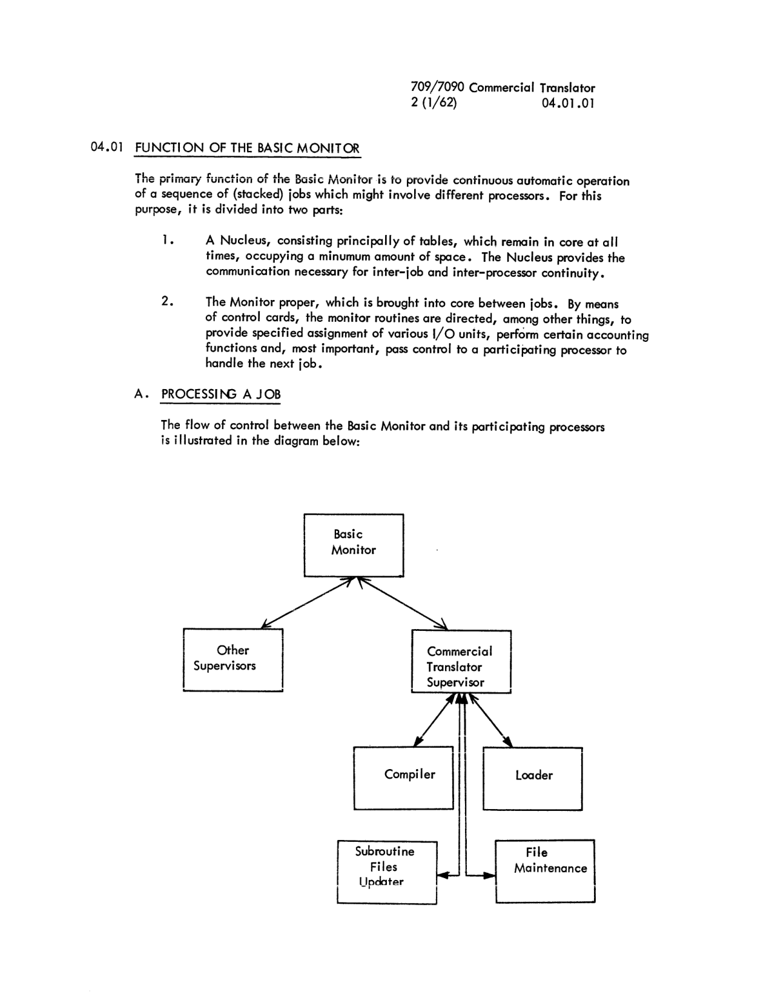

# Section 04: Supervisory System

<!-- 04.00.00 | PDF 84 -->
**[04.00.00]**

## INTRODUCTION

The Commercial Translator Processor operates as one of a group of processors which are connected and controlled by a system supervisor called the 709/7090 Basic Monitor. The flow of jobs through the Commercial Translator Processor is controlled by the Commercial Translator Supervisor (CTM). This section explains the functions of:

1. Basic Monitor
2. Commercial Translator Supervisor

An attempt has been made to provide sufficient operating detail to enable an installation to exploit fully the capabilities of the Basic Monitor, without obscuring the simple methods of ordinary job running.

For a more detailed explanation of the Basic Monitor refer to the manual, IBM 7090 Operating Systems: Basic Monitor (IBSYS). Form J28-8086-0.

For input/output, checkpoint and restart facilities refer to the 709/7090 Input/Output Control System. The form number of the manual is C28-6100-2.

<!-- 04.01.01 | PDF 85 -->
**[04.01.01]**

## 04.01 Function of the Basic Monitor

The primary function of the Basic Monitor is to provide continuous automatic operation of a sequence of (stacked) jobs which might involve different processors. For this purpose, it is divided into two parts:

1. A Nucleus, consisting principally of tables, which remain in core at all times, occupying a minumum amount of space. The Nucleus provides the communication necessary for inter-job and inter-processor continuity.
2. The Monitor proper, which is brought into core between jobs. By means of control cards, the monitor routines are directed, among other things, to provide specified assignment of various I/O units, perform certain accounting functions and, most important, pass control to a participating processor to handle the next job.

#### A. Processing a Job

The flow of control between the Basic Monitor and its participating processors is illustrated in the diagram below:


*Diagram: flow of control between Basic Monitor, Other Supervisors, Commercial Translator Supervisor, and its subsystems (Compiler, Loader, Subroutine Files Updater, File Maintenance) (page 85).*

<!-- 04.01.02 | PDF 86 -->
**[04.01.02]**

The sequence of operations within the framework is:

1. The Basic Monitor is called into core from the system tape. For the first job, this is done by the initial start procedure; for subsequent jobs, this is done by a routine in the Nucleus upon return from the processor which handled the previous jobs.

2. The Monitor functions as directed by control cards. For example, the sequence (the exact format of the control cards will be specified later)

   ```
   $ATTACH          A6
   $AS              SYSPP1
   ```

   would result in an entry in the Unit Function table of the Nucleus, assigning physical unit A6 to the function of System Peripheral Punch tape until changed by some subsequent assignment. It should be emphasized that such an assignment is needed only to deviate from the normal one in use at a particular installation.

   Finally, upon recognition of

   ```
   $EXECUTE         Processor-name
   ```

   (Processor-name = CT for Commercial Translator), the Basic Monitor will position the System Library tape to the named processor, read in the first record, and relinquish control to it.

3. The processor involved examines the Unit Function and Unit Availability tables within the Nucleus; and from them determines which I/O units to use for the job. It then proceeds to process the current job.

4. When the processor encounters the control card $IBSYS, the availability table is restored (if necessary) and control is turned back to the Basic Monitor.

5. Steps 1 through 4 are repeated until the stack of jobs has been completely processed.

#### The Unit Function and Availability Tables

In order to achieve the maximum flexibility in the use of I/O units attached to the machine, it is necessary to know the number and status of these units at all times. For this purpose, the nucleus contains an assembled table, the Unit Availability table, which describes the physical configuration of the machine, the number of channels, and the number and type of units on each channel. Programs operating within the system use this table to make their unit assignments,

<!-- 04.01.03 | PDF 87 -->
**[04.01.03]**

and are responsible for maintaining it. In addition, changes in configuration, such as removal of a tape transport for maintenance can be reflected in the table by means of Basic Monitor control cards.

Besides the problem of general unit availability, programs operating within an automatic system are forced to use certain units to carry out specific functions. For example, the units to be used for Library tape, the input (job) tape, and the output (list) tape, cannot be chosen arbitrarily by a processor without doing violence to the notion of continuous operation. In order to provide a uniform way to reference this class of units, they have been assigned symbolic names indicative of their function. The particular unit currently assigned to a given function is found in the Unit Function table of the Nucleus. This table, together with the Unit Availability table, provides complete information on the current status of the I/O units available within the system.

The symbolic function names are alwyas used on Basic Monitor control cards, in order to effect changes in status for specific unit assignment for this class of units. The functional units of the current system are:

| Symbolic Name | Function |
|---|---|
| SYSLB1 | System |
| SYSLB2 | Library |
| SYSLB3 | and |
| SYSLB4 | Alternates |
| SYSCRD | System Card Reader |
| SYSPRT | System Printer |
| SYSPCH | System Punch |
| SYSIN1 | System Input |
| SYSIN2 | and Alternate |
| SYSOU1 | System Output |
| SYSOU2 | and Alternate |
| SYSPP1 | System Peripheral Punch |
| SYSPP2 | and Alternate |
| SYSCK1 | System Checkpoint Tape |
| SYSCK2 | and Alternate |
| SYSUT1 | System |
| SYSUT2 | Utility |
| SYSUT3 | Tapes |
| SYSUT4 |  |

The participating processors of the system do not necessarily use all of these units; nor do they use the Utility tapes for the same functions. In order to take full advantage of the tape handling facilities of the Basic Monitor, the operator should take the time to learn the unit requirements and usages for the various processors. The table of Section 06.02 provides such information of the CT Compiler, CT Loader, CT Maintenance, and Subroutine Files Updater.

<!-- 04.01.04 | PDF 88 -->
**[04.01.04]**

#### B. Basic Monitor Control Cards

The notation employed in discussing these control cards (and others in the Bulletin) is as follows:

1. Words in square brackets `[ ]` represent an option which may be included or omitted at the user's choice.
2. Words in curly brackets `{ }` indicate that a choice is to be made from the contents.
3. Upper case words, and all punctuation, are to be used as is.
4. Lower case words represent a substitution to be made.
5. A number over the first letter of a field indicates the initial card column of the field; a second number, if it appears, is the final column of the field.

#### $DATE Card

The first card in any operating stack should be:

```
1                16
$DATE            mmddyy
```

which enters the date into a communication cell. Mmddyy would be written 061561 for June 15, 1961.

#### $ATTACH and $AS Cards

The two cards

```
1                16
$ATTACH          Unit [,II]
$AS              Unit-function-name [,H]
```

are used together, in the order shown, to assign unit 'unit' to the functional unit 'unit-function-name'. This assignment remains in force until changed by another, or until the Basic Monitor is refreshed by a $RESTORE card (see below).

'Unit' is written for tapes in the usual way, such as B9 or C1, while for card equipment,

```
RDX      for Card Reader, Channel X
PRX      for Printer, Channel X
PUX      for Card Punch, Channel X
```

is used. The drive type is assumed to be IV unless II appears, and the density is assumed low unless H appears.

<!-- 04.01.05 | PDF 89 -->
**[04.01.05]**

#### $RELEASE Card

A card of the format

```
1                16
$RELEASE         Unit-function-name
```

releases the unit assigned to the functional unit 'unit-function-name' from system use, and makes it generally available. Thus, it is possible for object programs to make use of almost all units on the machine, if necessary. For obvious reasons, the system library tape should not be treated in this cavalier fashion.

#### $EXECUTE Card

Recognition of the card

```
1                16
$EXECUTE         Processor-name
```

causes the Basic Monitor to position the System Library tape to the named processor, read in the first record, and relinquish control to it.

#### $IBSYS Card

A card of the form

```
1
$IBSYS
```

returns System control to the Basic Monitor, and prepares it to interpret control cards. It is the one control card which must be universally recognized by all participating processors in the system, in order to effect return of control to the Basic Monitor.

#### $RESTORE Card

A card of the form

```
1
$RESTORE
```

restores the Basic Monitor nucleus to its pristine state, as well as preparing the monitor to interpret control cards. The $RESTORE card is used primarily to restore the functional units to their normal (assembled) installation assignment.

<!-- 04.01.06 | PDF 90 -->
**[04.01.06]**

#### $CARDS and $TAPE Cards

The Basic Monitor normally reads control cards from the system input unit, SYSIN1. Upon recognition of the card

```
1
$CARDS
```

however, the next control card will be read from the system card reader (SYSCRD).

Return to control card reading from SYSIN1 is effected by the control card

```
1
$TAPE
```

#### $UNITS Card

For operating convenience, the card

```
1
$UNITS
```

causes an on-line print of the physical units currently assigned to the Functional units.

#### $PAUSE Card

The card

```
1
$PAUSE
```

provides a means for temporary halt of the machine, in order to allow some required operator intervention.

#### $SWITCH Card

A card of the form

```
1                16
$SWITCH          Unit-function-name-1, Unit-function-name-2
```

causes the units assigned to the functional units 'unit-function-name-1' and 'unit-function-name-2' to be interchanged.

<!-- 04.01.07 | PDF 91 -->
**[04.01.07]**

Since the actual physical units involved need not be designated, this provides a particularly simple way of:

1. Switching the system input, output, or peripheral punch to its alternate unit;
2. Providing continuity of unit assignment between programs.

For example, the system tape updating program, (IBEDT) produces the updated system tape on SYSUT1.

The card

```
1                16
$SWITCH          SYSLB1, SYSUT1
```

will then cause operation to continue using the updated system in place of the old. Note that density specifications are not transferred in the switching process.

#### Tape Operation Cards

A card of the form:

```
1                16
$ENDREEL
$REWIND          unit.function.name
$REMOVE
```

requests that the specified operation be performed upon the Functional Unit unit.function.name.

The operations are:

1. $ENDFILE — Write an end of file on the tape assigned to the specified unit.function.name.
2. $REWIND — Rewind the tape assigned to the specified unit.function.name.
3. $REMOVE — Rewind and unload the tape assigned to the specified unit.function.name.

#### $DETACH Card

And I/O unit which for any reason is disabled may be made unavailable for any use by a card of the form:

```
1                16
$DETACH          unit.name
```

The unit named remains unavailable until referenced by a $ATTACH card or until the Nucleus is refreshed.

<!-- 04.01.08 | PDF 92 -->
**[04.01.08]**

#### $STOP Card

A card of the form

```
1
$STOP
```

will cause printing of the message 'END OF JOBS, CANNOT PROCEED' and halt the machine.

#### $* Card

All Basic Monitor control cards are printed on-line in order to keep the operator informed of the developments as they occur. Remarks or instructions can be included by means of the card

```
1  3
$*  any-text
```

which is printed when encountered, but has no other effect.

<!-- 04.02.01 | PDF 93 -->
**[04.02.01]**

## 04.02 Function of the Commercial Translator Supervisor - CTM

The primary function of CTM is to provide continuous automatic operation upon a sequence of (stacked) Commercial Translator Processor jobs. This supervisor gains control from the Basic Monitor as the result of a Basic Monitor Control card of the form:

```
$EXECUTE         CT
```

CTM then controls the processing of the input on SYSIN until the Basic Monitor control card

```
$IBSYS
```

is encountered, at which time return is made to the Basic Monitor.

The format of that part of SYSIN which is concerned with Commercial Translator Processing is as follows:

```
$EXECUTE          CT
     CTM Control Card for JOB1
     JOB1
     End-of-file
     CTM Control Card for JOB2
     JOB2
     End-of-file
     Input for JOB2
     End-of-file
     .
     .
     Etc.
     .
     .
$IBSYS
```

Note — Each Commercial Translator job must be followed by an end-of-file. (See 05.03)

In accomplishing automatic operation upon a stacked job input-tape, CTM performs the following functions:

1. CTM reads control cards for subsystem branching.
2. CTM provides communication, transfer, and return points for CTM subsystems.
3. CTM provides system tape positioning and reading of CTM subsystems and IOCS packages.
4. CTM provides for switching of the Basic Monitor Unit Function Table entries for SYSOU's, SYSIN's, and SYSPP's when any CTM subsystem causes reel switching of the corresponding table entries.

<!-- 04.02.02 | PDF 94 -->
**[04.02.02]**

CTM recognizes 8 different control cards. All of these are in the format of the Basic Monitor Control cards (Operation begins in column 1).

1. $IBSYS
2. $ID
3. $ENDREEL
4. $CMPLE
5. $LOAD
6. $SUBUP
7. $MAIN
8. $PAUSE

$IBSYS cards cause a return to the Basic Monitor.

$ID cards cause a transfer to an accounting routine.

$ENDREEL cards, when read by CTM, cause a reel switch involving SYSIN1 and SYSIN2.

$ENDREEL cards must always be preceded by an associated end-of-file on SYSIN.

The $ENDREEL may occur in the middle of a job (Example 1) or between jobs (Example 2).

**Example 1**

```
SYSIN1                                        SYSIN2

CTM Control Card for JOB1                     ---
---    JOB1                                   ---    Remainder of JOB1
---                                           ---
                                               End-of-file associated with JOB1
End-of-file associated with $ENDREEL          CTM Control Card for JOB2
$ENDREEL                                      ETC.
```

**Example 2**

```
SYSIN1                                        SYSIN2

CTM Control Card for JOB1                     CTM Control Card for JOB2
---                                            Etc.
---
---
End-of-file
$ENDREEL
```

<!-- 04.02.03 | PDF 95 -->
**[04.02.03]**

Four of the remaining five control cards cause CTM to read the corresponding CTM subsystem from the system tape and transfer control to the subsystem. The $PAUSE control card, does not cause control to be turned over to a subsystem. It prints the $PAUSE card on the on-line printer. This information should inform the operator of the reason for the pause. The message PRESS START TO CONTINUE is also printed. On the other four control cards CTM scans only the CTM subsystem which gets control from CTM.

The Operations which direct the CT Supervisor are:

| Operation | Function |
|---|---|
| $CMPLE | Perform compilation on following source deck. |
| $LOAD | Perform loading of following object deck. |
| $SUBUP | Perform Subroutine File updating. |
| $MAIN | Perform File Maintenance. |
| $PAUSE | Prints $PAUSE then pauses for operator intervention. |

#### Accounting

A sample accounting routine is provided on the system tape. The sample accounting routine is not intended to work on 7090s (other than the one at WDPC - UCLA). If an installation chooses to insert a different accounting routine, it is recommended that the listing of the sample accounting routine be read. The listing contains the information necessary concerning communication and a description of how to replace the sample accounting routine on the system tape.

<!-- conversion notes:
- Page 85: the Basic Monitor / participating-processors flow diagram (box-and-arrow chart) was embedded as an image rather than transcribed, since it is a figure, not text.
- Page 87: the Symbolic Name / Function table groups several symbolic names (e.g. SYSLB1-4, SYSUT1-4) under a single multi-line descriptive phrase in the original (no ruled lines). Rendered as a best-effort two-column Markdown table preserving each printed line; no merged-cell notation exists in Markdown tables so the grouping is implicit from adjacent rows, as in the source.
- Page 91, "Tape Operation Cards": the card-format block in the source lists $ENDREEL as one of the three alternative operation-card names, while the following numbered description of the three operations refers to the first one as $ENDFILE (not $ENDREEL). This is an inconsistency present in the original manual and has been transcribed exactly as printed on both occasions, without correction.
- Page 92, "$* Card": the source's final sentence ends "...has no other effect." — the image shows a print blemish that reads slightly like "effeci"; transcribed as "effect" per context.
- No overpunched/overbar digits, image-only fallback pages, or otherwise-uncertain transcriptions occurred in this chunk (PDF pages 84-95).
-->
