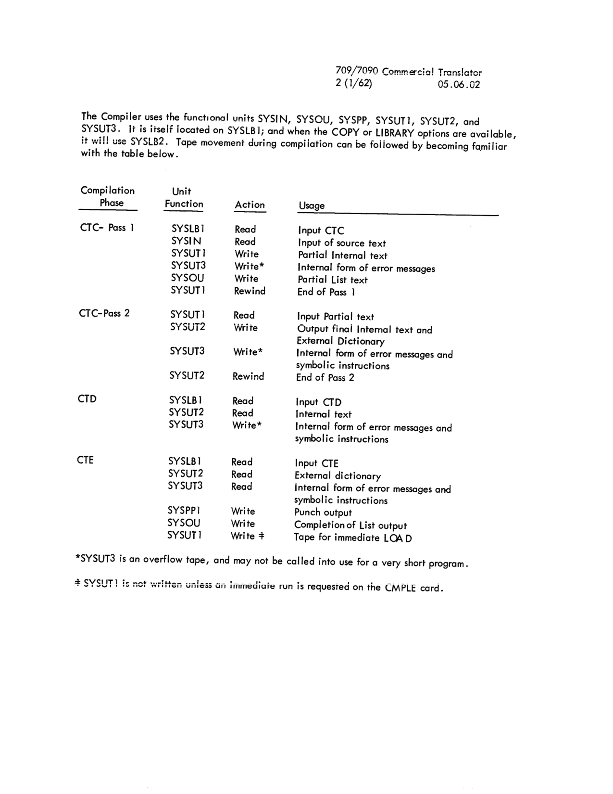
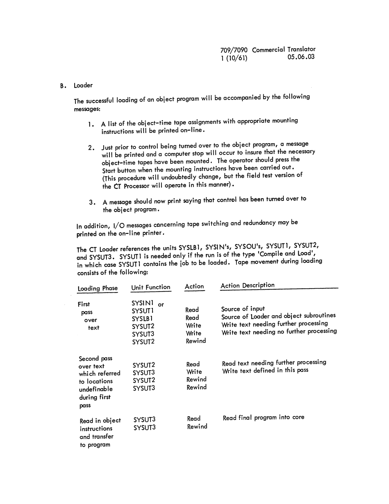

# Section 05: Systems Operation

<!-- 05.00.00 | PDF 96 -->
**[05.00.00]**

## SECTION 05. SYSTEMS OPERATIONS

### INTRODUCTION

The information in this section is intended to orient a machine operator with the physical operation of the Commercial Translator Processor. The information includes:

1. Peripheral Equipment Used
2. Peripheral Equipment Assignment
3. System Set-Up Procedure
4. System Restart Procedure
5. Output From System
6. Program Flow and Operator Messages
7. Object-Time Tape Assignment

Further clarification of systems operation may be obtained by reading Section 04, SUPERVISORY SYSTEM; and Section 06, SYSTEMS MAINTENANCE.

<!-- 05.01.01 | PDF 97 -->
**[05.01.01]**

## 05.01 PERIPHERAL EQUIPMENT USED

The Commercial Translator Compiler uses the following peripheral components:

1. One on-line printer.
2. A minimum of 5 tapes:
   a. One System tape (binary).
   b. One listing output tape.
   c. Three utility (scratch) tapes.
3. One tape or card reader for input.
4. One tape or punch for punch output.

The above represents the minimum machine configuration for compilation of a Commercial Translator source program.

The Loading of a CT object program (excluding the tapes used by the Object program) requires:

1. One on-line printer.
2. Possibly three tapes:
   a. One system tape (binary).
   b. Possibly two utility tapes (Used temporarily during the loading of large programs. Small programs will not require these two tapes).
3. One tape or card reader for input.

File Maintenance on the symbolic system tape(s) requires:

1. One on-line printer.
2. One system tape (binary).
3. One tape or card reader for input.
4. Symbolic system tapes to be maintained and enough blank tapes to contain the new symbolic system.
5. Possibly several blank tapes to contain output from this maintenance procedure which will be used as input to an assembly routine, also on the binary system tape.

<!-- 05.02.01 | PDF 98 -->
**[05.02.01]**

## 05.02 PERIPHERAL EQUIPMENT ASSIGNMENT

In describing the assignment of peripheral equipment, a symbolic notation is used. All I/O units have been given symbolic names. The names chosen for units by the CT Processor are all six characters in length and the first three characters are always SYS. In this manner the following names were chosen to represent I/O units that are referenced by the CT Processor.

| Name | Usage by CT Processor |
|---|---|
| SYSLB1 | System Library Tape Number 1 |
| SYSLB2 | System Library Tape Number 2 |
| SYSLB3 | System Library Tape Number 3 |
| SYSLB4 | System Library Tape Number 4 |
| SYSOU1 | System Listing Output - First Tape Unit |
| SYSOU2 | System Listing Output - Second Tape Unit |
| SYSIN1 | System Input - First Unit, Card Reader or Tape |
| SYSIN2 | System Input - Second Unit, Card Reader or Tape |
| SYSPP1 | System Punch - First Unit, Punch or Tape |
| SYSPP2 | System Punch - Second Unit, Punch or Tape |
| SYSUT1 | System Utility Tape Number 1 |
| SYSUT2 | System Utility Tape Number 2 |
| SYSUT3 | System Utility Tape Number 3 |
| SYSUT4 | System Utility Tape Number 4 |

(See the table in Section 06.02 showing the references to these SYStem units by the various parts of the CT Processor).

The physical units assigned to each of the SYStem units will vary from installation to installation. It may well be, for instance, that a particular installation does not want to have two different units assigned for punching purposes. In this case, both SYSPP1 and SYSPP2 would be assigned the same physical unit.

The assignment of physical units to SYStem units is made through a table which is part of the CT Processor which remains in core during all CT Processing.

Temporary changes to the table may be made through the use of Basic Monitor Control Cards. These control cards precede a particular job or group of jobs, for which a 'non-standard' SYStem units assignment is desired. This method of changing the table is described in Section 04.01.

<!-- 05.03.01 | PDF 99 -->
**[05.03.01]**

## 05.03 SYSTEM SET-UP PROCEDURE

#### A. Preparing the system input -- SYSIN1 and SYSIN2.

Since Subroutine updating and File Maintenance will be performed rarely, the input to the Commercial Translator Processor will usually consist of one or more of the following job types:

1. Compile
2. Load and run
3. Compile, load, and run.

Each job on SYSIN (1 or 2) must be preceded by a control card which specifies the action to be performed on the following deck. (For format of job control cards see Section 04.02). Also, each job must be separated from other jobs by an end-of-file. The end-of-file separation should be obtained by placing an end-of-file card in back of each job deck. This card when read by an off-line 714 card-to-tape converter causes an end-of-file to be written on the tape. The same card is recognized as an end-of-file by the CT Processor whenever the input is read through the on-line card reader. This end-of-file card then, should be thought of as an integral part of every job deck. The format of the end-of-file card is:

| Columns | Punches in rows |
|---|---|
| 1 and 2 | 8 and 7 |
| 3 and 4 | 7, 4, 1, and 12 |

If there are input cards associated with a particular object program (i.e. if the object program references SYSIN), the input cards must be placed in a separate file immediately following the job to be run.

The end-of-file mark used with a 1401 card to tape set-up may have a different punch combination. Refer to the utility program write up when this set-up is being used.

<!-- 05.03.02 | PDF 100 -->
**[05.03.02]**

The group of stacked Commercial Translator jobs must be preceded and followed by Basic Monitor Control Cards. (See Section 04.01 for format and function of Basic Monitor Control Cards). An example of the format of stacked input to be run on-line might be:

```
Cards                              Explanation

$DATE          mmddyy              Provides current date for system use
$ATTACH        RDA                 Temporarily resets standard SYSIN assignment
$AS            SYSIN1
$EXECUTE       CT                  Control turned over to CT Processor
$ID            JOB1                Accounting card is optional
$CMPLE
                BCD
                Source
                Program
                Cards
        *FINISH                    This card precedes end-of-file on COMPILE jobs.
End-of-file-card
$ID            JOB2                Accounting card is optional
$LOAD
                Object
                Deck
End-of-file card
                Object-time
                Input cards
End-of-file card
$IBSYS                              Return control to Basic Monitor
$ENDFILE       SYSOU1              Write end-of-file on list tape
$REMOVE        SYSOU1              Rewind and unload list tape
$ENDFILE       SYSPP1              Write end-of-file on punch tape
$REMOVE        SYSPP1              Rewind and unload punch tape
$PAUSE                              Temporary Halt
```

Normally, only two Basic Monitor Control Cards will precede the stacked jobs:

```
$DATE          mmddyy
$EXECUTE       CT
```

<!-- 05.03.03 | PDF 101 -->
**[05.03.03]**

#### B. Starting Procedure

After a job run is started, no action is required on the part of the operator except to follow specific instructions displayed on the printer. To start initially, the following procedure is used:

1. Mount the System Library SYSLB1 on some unit. It should be rewound and set for high density.
2. Mount blank tapes on SYSUT1, SYSUT2, SYSUT3. Ready SYSIN, SYSOU, and SYSPP. (It is not necessary to set the density on any of these units on 7090's. They will set by the CT Processor).
3. Clear the entry keys and set sense switch 1. This switch determines where the Basic Monitor expects to find its first control card. If up, the system input units, (SYSIN1) is used; if down, the system card reader, (SYSCRD) is used.
4. If SYSLB1 is on unit A1, depress the load tape button. If it is on any other unit, load tape on that unit must be simulated by some self-loading program. Normal processing should begin.
5. If it does not, check all units for ready status, and the unit on the System Library for correct density setting.

<!-- 05.04.01 | PDF 102 -->
**[05.04.01]**

## 05.04 SYSTEM RESTART PROCEDURE

If for any reason the computer should loop or come to a complete stop during processing of a CT job, the following action should be taken:

1. Enter the instruction STR (500000000000) in the Entry Keys
2. Set to manual and press the Enter Instruction button
3. Set to automatic and press the Start button

The above procedure will serve to get to the next job whenever the program in core which accomplishes this function has not been destroyed. When the above procedure results in another computer loop or stop, the action taken should be similar to the initial starting procedure:

1. Rewind SYSLB1 (A1)
2. Place sense switch 1 down
3. Place a 'RESTART' deck in the on-line card reader of the form:

   ```
   $DATE          mmddyy
   $EXECUTE       CT
   ```

   If there were Basic Monitor Control Cards causing a temporary SYStem units change as part of the stacked jobs, the same cards should be placed between the $DATE and $EXECUTE cards to effect the same SYStem configuration as was in operation when the program malfunctioned.
4. Clear and depress the Load Tape button.

The above procedure will cause the CT Processor to process the next job on SYSIN.

<!-- 05.05.01 | PDF 103 -->
**[05.05.01]**

## 05.05 OUTPUT FROM SYSTEM

#### A. Compiler

The CT Compiler output consists of:

1. A list of the source program and error messages concerning the source program is written on the SYSOU tape. In addition, the programmer may obtain on SYSOU a listing of the object program generated by the Compiler. SYSOU must be a tape unit. Attaching the on-line printer as SYSOU will _not_ work.
2. Punch output is placed on SYSPP. SYSPP may be a tape for off-line punching or the on-line punch.
3. Operator messages are written on-line printer. End-of-file marks are put on SYSOU and SYSPP as part of the reel switching operation and through the use of Basic Monitor Control Cards. The separation of decks from off-line punching must be accomplished by means of the deck identification punched in columns 73-77, and a card sequence number punched in columns 78-80. The deck identification comes from columns 8 through 12 of the $CMPLE card.

#### B. Loader

The CT Loader during the loading operation may write on SYSOU. No other output will occur except operator messages on the on-line printer.

#### C. Subroutine Files Updater

The Subroutine Files Updater produces new subroutine files on SYSUT2 and may produce a map of these subroutine files on SYSOU, and/or messages on the on-line printer.

#### D. File Maintenance

The CT File Maintenance produces a new BCD system master tape on SYSLB4, an input tape for the assembler on SYSUT4 and SYSUT3, and writes error messages on the on-line printer.

**\*NOTE** The output written on SYSOU from the Compiler and Loader is grouped 5 lines per physical record with record marks after each of the first 4 lines. If a 720 printer is used to list the tape, the group switch must be set to 5.

<!-- 05.06.01 | PDF 104 -->
**[05.06.01]**

## 05.06 PROGRAM FLOW AND OPERATOR MESSAGES

The field test version of the CT Processor will write on-line messages concerning the progress of compilation, loading, and execution, of a CT program, through the various phases. In addition, tape switching and redundancy information may be issued by IOCS.

#### A. Compiler

The ability to interpret the significance of various conditions is helpful to the operator in determining if a compilation is progressing satisfactorily.

For this reason, a brief resume of compiler action is as follows:

1. Phase 1 translates from the external statements to a condensed internal form.
   a. The first pass scans for data and procedure names, entering them and their descriptions into a dictionary.
   b. The second pass completes conversion of the text, determining the exact meaning of qualified names, and builds other tables of information necessary for the generation of instructions.

   The letters CTC are printed on-line when this phase is entered.

2. Phase 2 consists of the generation of instructions, and the initial pass of their assembly. The letters CTD are printed on-line when this phase is entered.

3. Phase 3 completes the assembly process, defining the relative locations of instructions and data, the listing of error messages, and the punching of the object deck. The letters CTE are printed on-line when this phase is entered.

Finally the word DONE is printed on-line when control is returned to CTM from the Compiler.

Unless a catastrophic error occurs (e.g., the omission of a division header), compilation will be completed regardless of the number of errors encountered. If a catastrophic error occurs, a standard end-of-job message will be printed and control will be passed to the CTM supervisor.

<!-- 05.06.02 | PDF 105 -->
**[05.06.02]**

The Compiler uses the functional units SYSIN, SYSOU, SYSPP, SYSUT1, SYSUT2, and SYSUT3. It is itself located on SYSLB1; and when the COPY or LIBRARY options are available, it will use SYSLB2. Tape movement during compilation can be followed by becoming familiar with the table below.

| Compilation Phase | Unit Function | Action | Usage |
|---|---|---|---|
| CTC- Pass 1 | SYSLB1 | Read | Input CTC |
| | SYSIN | Read | Input of source text |
| | SYSUT1 | Write | Partial Internal text |
| | SYSUT3 | Write\* | Internal form of error messages |
| | SYSOU | Write | Partial List text |
| | SYSUT1 | Rewind | End of Pass 1 |
| CTC-Pass 2 | SYSUT1 | Read | Input Partial text |
| | SYSUT2 | Write | Output final Internal text and External Dictionary |
| | SYSUT3 | Write\* | Internal form of error messages and symbolic instructions |
| | SYSUT2 | Rewind | End of Pass 2 |
| CTD | SYSLB1 | Read | Input CTD |
| | SYSUT2 | Read | Internal text |
| | SYSUT3 | Write\* | Internal form of error messages and symbolic instructions |
| CTE | SYSLB1 | Read | Input CTE |
| | SYSUT2 | Read | External dictionary |
| | SYSUT3 | Read | Internal form of error messages and symbolic instructions |
| | SYSPP1 | Write | Punch output |
| | SYSOU | Write | Completion of List output |
| | SYSUT1 | Write ‡ | Tape for immediate LOAD |


*Compilation-phase tape usage table (page 105).*

\*SYSUT3 is an overflow tape, and may not be called into use for a very short program.

‡ SYSUT1 is not written unless an immediate run is requested on the CMPLE card.

<!-- 05.06.03 | PDF 106 -->
**[05.06.03]**

#### B. Loader

The successful loading of an object program will be accompanied by the following messages:

1. A list of the object-time tape assignments with appropriate mounting instructions will be printed on-line.
2. Just prior to control being turned over to the object program, a message will be printed and a computer stop will occur to insure that the necessary object-time tapes have been mounted. The operator should press the Start button when the mounting instructions have been carried out. (This procedure will undoubtedly change, but the field test version of the CT Processor will operate in this manner).
3. A message should now print saying that control has been turned over to the object program.

In addition, I/O messages concerning tape switching and redundancy may be printed on the on-line printer.

The CT Loader references the units SYSLB1, SYSIN's, SYSOU's, SYSUT1, SYSUT2, and SYSUT3. SYSUT1 is needed only if the run is of the type 'Compile and Load', in which case SYSUT1 contains the job to be loaded. Tape movement during loading consists of the following:

| Loading Phase | Unit Function | Action | Action Description |
|---|---|---|---|
| First pass over text | SYSIN1 or SYSUT1 | Read | Source of input |
| | SYSLB1 | Read | Source of Loader and object subroutines |
| | SYSUT2 | Write | Write text needing further processing |
| | SYSUT3 | Write | Write text needing no further processing |
| | SYSUT2 | Rewind | |
| Second pass over text which referred to locations undefinable during first pass | SYSUT2 | Read | Read text needing further processing |
| | SYSUT3 | Write | Write text defined in this pass |
| | SYSUT2 | Rewind | |
| | SYSUT3 | Rewind | |
| Read in object instructions and transfer to program | SYSUT3 | Read | Read final program into core |
| | SYSUT3 | Rewind | |


*Loading-phase tape usage table (page 106).*

<!-- 05.06.04 | PDF 107 -->
**[05.06.04]**

A large section of core is reserved during the first two passes for text information (i.e. program instructions). It is only when this section cannot contain all the text information, that overflow text is written on SYSUT2 and SYSUT3. Also, it is more unlikely that SYSUT2 will be written upon than SYSUT3. For short programs, therefore, the only tape movement may occur on SYSLB1, SYSOU and the input tape (SYSIN or SYSUT1); and the loading process will appear to be a single pass operation.

#### C. Object-program execution

During the execution of an object-program, four different types of messages may appear on the on-line printer.

1. IOCS tape switching and redundancy information.
2. Items which are printed as the result of a source language 'DISPLAY' statement. The programmer may use this device to follow the flow of the object-program.
3. 'STOP' statements.

   The STOP messages may be of two forms:
   a. STOP nnnnnn where nnnnnn is any number 6 digits or less. The computer will stop, and hitting the START key will cause the object program to continue in execution. (It is hoped that the programmer uses this instruction sparingly, if at all).
   b. STOP RUN

      This message means that object-time processing of the job is completed and control has returned to the CTM supervisor.

   The STOP messages will be accompanied by the source language statement number at which the STOP occurred, i.e. AT xxxxx,yy STOP nnnnnn where xxxxx,yy is the statement number.

4. Object program error messages, usually concerning I/O errors. Object-time processing will terminate and control will revert back to the CT Monitor.

The Field Test version of the CT Processor will use the on-line printer for the DISPLAY, STOP statements, and object program error messages. (not SYSOU)

#### D. Subroutine Files Updater

The messages written on the on-line printer will be of two types:

1. Messages concerning any I/O redundancy and tape switching information.
2. A message signaling the successful or unsuccesful completion of the updating process.

<!-- 05.06.05 | PDF 108 -->
**[05.06.05]**

The CT Subroutine Files Updater references the CT system tape, SYSUT2 and SYSUT3 (utility). The CT system tape is the input tape and SYSUT2 is the output tape.

#### E. File Maintenance

Messages written on the on-line printer will be of two types:

1. If errors occur during the File Maintenance procedure, a message of the form:

   ```
   (MESSAGE) LAST CHANGE AT Namennnn PRESS START TO CONTINUE
   ```

   is printed, and a pause occurs to allow operator action. Each (MESSAGE) which may print is described under Section 06.04.

2. At the end of the maintenance procedure a list of all files on the new BCD master tape in order of appearance is printed on-line.

The File Maintenance routine contains references to SYSLB3, SYSLB4, SYSIN, SYSUT3 and SYSUT4. Tape movement consists of reading the two input tapes SYSLB3 and SYSIN and writing the two (or three) output tapes SYSLB4, SYSUT4, and SYSUT3. At conclusion both SYSLB3 and SYSLB4 will rewind and unload, and SYSUT's will rewind.

<!-- 05.07.01 | PDF 109 -->
**[05.07.01]**

## 05.07 OBJECT-TIME TAPE ASSIGNMENT

The assignment of units by the Loader for use by the object program depends on three variables:

1. The channel and unit arrangement at each installation.
2. The configuration of the SYStem units table at the time of the object-time assignment.
3. The object-programs' requested assignment.

The procedure by which the Loader assigns specific units to the various object-time files based upon the above variables is discussed in Section 06.02. Without prior knowledge of how the assignment is made for each job, the machine operator will have to wait for the tape mounting instructions given by the Loader before he can mount the tapes to be used by the object program. However, prior knowledge may be obtained by one of the following:

1. Repeated running of the object program without changing any of the above variables.
2. Understanding the method by which the Loader makes unit assignments. The method is simple and can be easily learned.
3. If a 1401 is available, a program can be written for the 1401 that will give the operator tape mounting and running instructions for the batch of jobs being card-to-taped on SYSIN.

<!-- conversion notes: All 14 pages (PDF 96-109) transcribed and checked against page images; no pages required image-only fallback. Pages 105 and 106 contain complex ruled tables with merged "phase" cells describing tape movement during compilation and loading respectively; these were reproduced as best-effort Markdown tables and the source page images were also embedded per spec for those two pages. The stacked-job card listing on PDF 100 and the RESTART deck listing on PDF 102 were rendered as fenced code blocks to preserve column layout. Minor OCR misreadings corrected against the page images throughout (e.g., "SYSUTI"→"SYSUT1", "tne"→"the", "uni s"→"units", garbled table cells on 05.06.02/05.06.03 reconstructed from the image). No overpunched/overbar digits or bracket/brace syntax notation appeared in this chunk. -->
