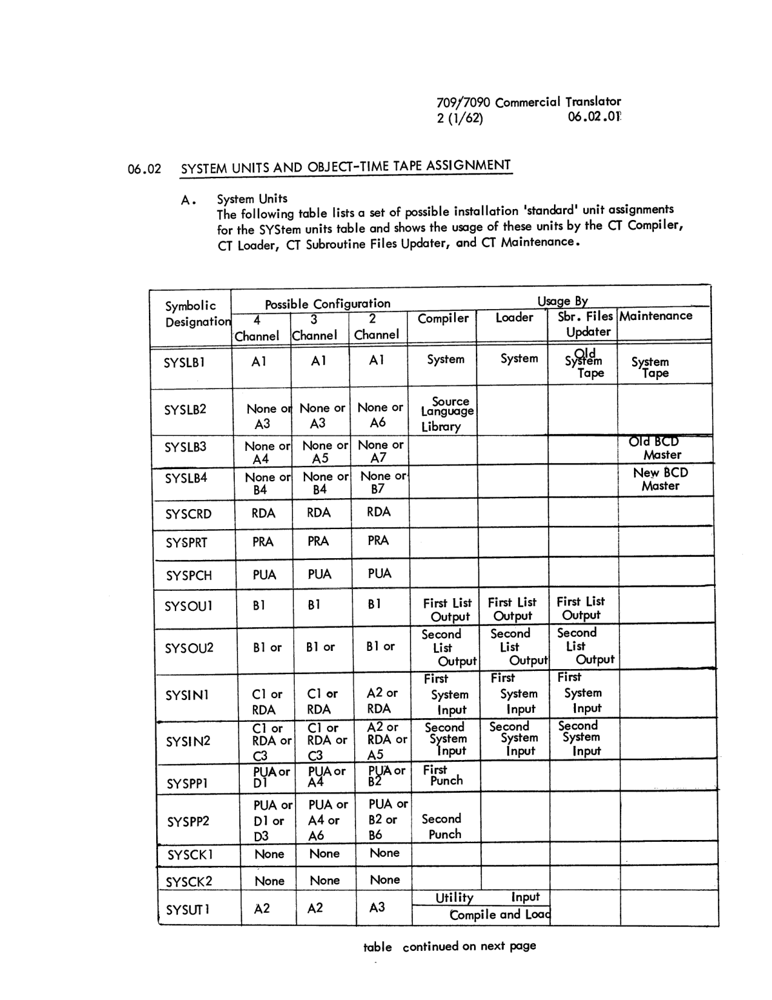
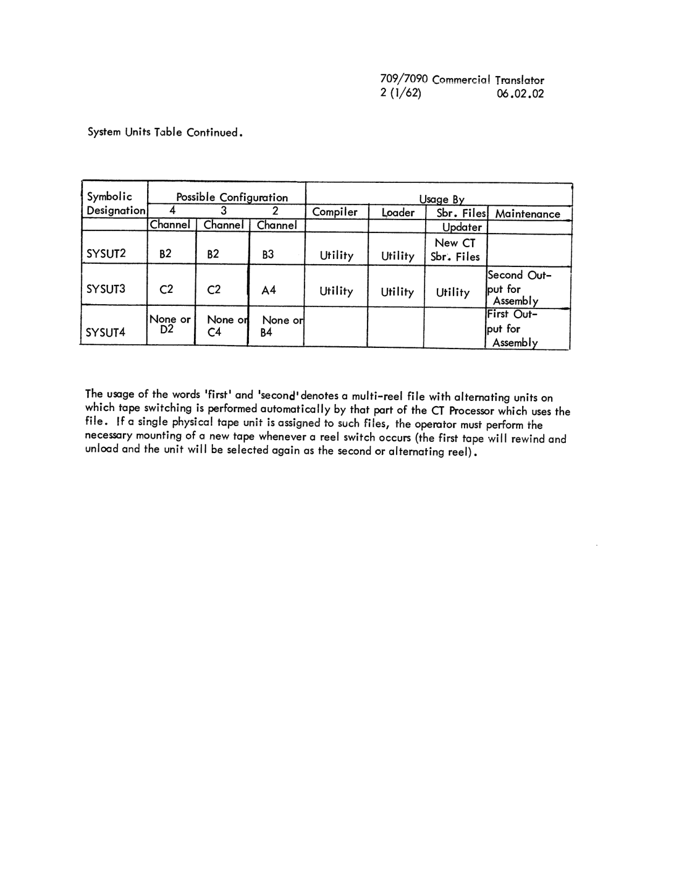

# Section 06: Systems Maintenance

<!-- 06.00.00 | PDF 110 -->
**[06.00.00]**

## Introduction

The information in this section is intended for the person or persons at each installation responsible for installing and maintaining the Commercial Translator Processing System. This section contains information concerning:

1. Mimimum Machine Requirements
2. System Units and Object-time Tape Assignment
3. Updating Subroutine Files of System Tape
4. Symbolic Tape Maintenance

It is assumed in this section, that the reader is familiar with the contents of Section 04 and Section 05.

<!-- 06.01.01 | PDF 111 -->
**[06.01.01]**

## 06.01 Minimum Machine Requirements

The minimum machine requirements for 709/7090 Commercial Translator processing are:

1. 32,768 words of core storage.

2. Data-Channel-Trap

3. One on-line printer (Channel A)

4. Five tape units

    A. One Binary System tape
    B. One Listing Output tape
    C. Three utility tapes

5. Two additional units

    A. One on-line card punch or one more tape unit
    B. One on-line card reader or one more tape unit

<!-- 06.02.01 | PDF 112 -->
**[06.02.01]**

## 06.02 System Units and Object-Time Tape Assignment

#### A. System Units

The following table lists a set of possible installation 'standard' unit assignments for the SYStem units table and shows the usage of these units by the CT Compiler, CT Loader, CT Subroutine Files Updater, and CT Maintenance.

| Symbolic Designation | 4 Channel | 3 Channel | 2 Channel | Compiler | Loader | Sbr. Files Updater | Maintenance |
|---|---|---|---|---|---|---|---|
| SYSLB1 | A1 | A1 | A1 | System | System | Old System Tape | System Tape |
| SYSLB2 | None or A3 | None or A3 | None or A6 | Source Language Library | | | |
| SYSLB3 | None or A4 | None or A5 | None or A7 | | | | Old BCD Master |
| SYSLB4 | None or B4 | None or B4 | None or B7 | | | | New BCD Master |
| SYSCRD | RDA | RDA | RDA | | | | |
| SYSPRT | PRA | PRA | PRA | | | | |
| SYSPCH | PUA | PUA | PUA | | | | |
| SYSOU1 | B1 | B1 | B1 | First List Output | First List Output | First List Output | |
| SYSOU2 | B1 or | B1 or | B1 or | Second List Output | Second List Output | Second List Output | |
| SYSIN1 | C1 or RDA | C1 or RDA | A2 or RDA | First System Input | First System Input | First System Input | |
| SYSIN2 | C1 or RDA or C3 | C1 or RDA or C3 | A2 or RDA or A5 | Second System Input | Second System Input | Second System Input | |
| SYSPP1 | PUA or D1 | PUA or A4 | PUA or B2 | First Punch | | | |
| SYSPP2 | PUA or D1 or D3 | PUA or A4 or A6 | PUA or B2 or B6 | Second Punch | | | |
| SYSCK1 | None | None | None | | | | |
| SYSCK2 | None | None | None | | | | |
| SYSUT1 | A2 | A2 | A3 | Utility<br>Input<br>Compile and Load | | | |

*table continued on next page*


*System Units table (page 112).*

<!-- 06.02.02 | PDF 113 -->
**[06.02.02]**

System Units Table Continued.

| Symbolic Designation | 4 Channel | 3 Channel | 2 Channel | Compiler | Loader | Sbr. Files Updater | Maintenance |
|---|---|---|---|---|---|---|---|
| SYSUT2 | B2 | B2 | B3 | Utility | Utility | New CT Sbr. Files | |
| SYSUT3 | C2 | C2 | A4 | Utility | Utility | Utility | Second Output for Assembly |
| SYSUT4 | None or D2 | None or C4 | None or B4 | | | | First Output for Assembly |


*System Units table, continued (page 113).*

The usage of the words 'first' and 'second' denotes a multi-reel file with alternating units on which tape switching is performed automatically by that part of the CT Processor which uses the file. If a single physical tape unit is assigned to such files, the operator must perform the necessary mounting of a new tape whenever a reel switch occurs (the first tape will rewind and unload and the unit will be selected again as the second or alternating reel).

<!-- 06.02.03 | PDF 114 -->
**[06.02.03]**

The distributed system tape has the following assignment assembled into the system units table.

| Symbolic Unit | Physical Assignment |
|---|---|
| SYSLB1 | A1 |
| SYSLB2 | (No unit provided) |
| SYSLB3 | (No unit provided) |
| SYSLB4 | (No unit provided) |
| SYSCRD | Card Reader Channel A |
| SYSPRT | Printer Channel A |
| SYSPCH | Punch Channel A |
| SYSOU1 | B1 |
| SYSOU2 | B1 |
| SYSIN1 | A2 |
| SYSIN2 | A2 |
| SYSPP1 | B2 |
| SYSPP2 | B2 |
| SYSCK1 | (No unit provided) |
| SYSCK2 | (No unit provided) |
| SYSUT1 | A3 |
| SYSUT2 | B3 |
| SYSUT3 | A4 |
| SYSUT4 | B4 (Not used by CT SYSTEM) |

The above assignment will suffice for Compiling and Loading Commercial Translator programs. The assignment was made to leave as many tapes free for object-time program tape assignment as possible. If units are assigned to SYSLB's the units assigned are not available for object-time assignment. Since the above configuration does not include unit assignments for SYSLB2, SYSLB4, SYSCK1, and SYSCK2, these SYStem units will be assigned by Basic Monitor Control Cards whenever corrections are sent to the installation involving these SYStem units.

<!-- 06.02.04 | PDF 115 -->
**[06.02.04]**

#### B. Object-Time Tape Assignment

The assignment of physical units to the various files in the object program is performed by the Loader by processing the symbolic 'unit' columns (18-21 and 22-25) in the FILE cards which precede the binary object deck. For referencing purposes, the following definition of permissible symbolic units which may appear on the FILE cards is repeated. In the definition of permissible symbolic units requested by the programmer, the notation is as follows:

| Symbol | Meaning |
|---|---|
| X | is a true channel request and may be A, B, C, D, E, F, G, H. |
| Y | is a symbolic channel request and may be S, T, U, V, W, X, Y, Z. |
| k | is a relative unit request and may be 1, 2, 3, 4, 5, 6, 7, 8, 9, 0. |
| M | is a true tape model request and may be II or IV |

The permitted unit requests are:

| | | |
|---|---|---|
| a. | blank | |
| b. | Model only | M |
| c. | True channel | X |
| d. | Symbolic channel | Y |
| e. | True channel, Model | XM |
| f. | True channel, Relative unit | X(k) |
| g. | Symbolic channel, Model | YM |
| h. | Symbolic channel, Relative unit | YK or Y(k) |
| i. | Symbolic channel, Relative unit, Model | YKM |
| j. | For secondary unit assignment after all other requests have been fulfilled | * |

In addition, the programmer may request the following SYStem units and card equipment.

| Symbolic Unit(s) | Meaning |
|---|---|
| IN, IN1, IN2 | System input units |
| OU, OU1, OU2 | System output units |
| PP, PP1, PP2 | System punch units |
| UT1, UT2, UT3, UT4 | System Utility tapes |
| RDX | Card reader, channel X |
| PRX | Printer, channel X |
| PUX | Punch, channel X |

<!-- 06.02.05 | PDF 116 -->
**[06.02.05]**

It should be noted that no true unit assignments may be requested. This follows from the fact that any given unit may be performing a SYStem function, and therefore not available for assignment as an object-time unit. However, the programmer is allowed to request relative units on channels. In explaining the meaning of relative units, the following example is given.

In sorting problems, a programmer may use many tapes, alternately reading several and then writing several. From the logical flow the program, the programmer may decide that 3 files (for example) should logically be on one channel and 3 other files should logically be on another channel for best operating efficiency. The programmer might then use the symbolic unit designations A(1), A(2), and A(3) to refer to three of the files and B(1), B(2), and B(3), to refer to the other three files. The numbers (1), (2), and (3), are the programmers' indicies or relative unit assignment. The loader tape-assignment-routine will try to find three available units on channels A and B. Available, used in this sense, means units attached to the computer and not referenced in the SYStem units table (i.e. not used by the system). Using the distributed version of the SYStem units table as an example, the following assignment would be made:

| Symbolic | Assignment Made by Loader |
|---|---|
| A(1) | A5 |
| A(2) | A6 |
| A(3) | A7 |
| B(1) | B4 |
| B(2) | B5 |
| B(3) | B6 |

(This assumes there are at least 7 units attached on Channel A, and at least 6 units attached on Channel B).

The logical process by which symbolic unit requests are converted to physical unit assignments in the order of priority is:

1. All card units, SYStem units, and true-channel relative units are assigned first. The symbolic units OU, OU1, OU2, IN, IN1, IN2, PP, PP1, and PP2 when assigned to SYStem units take on the characteristics of the SYStem units. They are considered multi-reel alternating units with no labels, and any programmer rewind options are ignored. In this respect, for example, OU, OU1, OU2, are synonomous. The symbolic units UT1, UT2, UT3 should use the 'DEFER' mounting option as SYSUT1, SYSUT2, SYSUT3 are used by the loader. (Mounting instructions occur at object-time OPEN).

<!-- 06.02.06 | PDF 117 -->
**[06.02.06]**

2. True channel, no specified units are assigned next.

    If, during steps 1 and 2, there are insufficient units on the requested channels, a message prints to the effect that object-time tape assignment could not be completed because there were not enough units on the specified channels.

3. Symbolic channel assignment is now made on the basis of those symbolic channels with the largest requirement being handled first. Starting with the highest true channel, the channels are processed to see if they will handle the symbolic channel requirements. When a true channel is found that contains sufficient available units to handle the symbolic channel, that true channel is chosen. If there is no true channel which will handle the symbolic channel requirements, a true channel is chosen to assign as many of the symbolic units to the channel as possible. The remaining symbolic units are now assigned by repeating the same process (i.e. finding the symbolic channel with the greatest requirement etc.).

4. Model only specifications are now processed. Units are chosen starting at the highest channel number, first available unit.

5. Symbolic units with no specification in the UNIT1 columns on the file card are now assigned.

    If during steps 3, 4, or 5 there are insufficient tapes available for assignment a message prints saying there are not enough units on the system, and tape assignment could not be completed.

6. \* Secondary units are assigned last and on the same channel as the first unit where this is possible.

When the UNIT2 columns on the file card are blank the unit assigned is always the same as the unit assigned to UNIT1.

<!-- 06.03.01 | PDF 118 -->
**[06.03.01]**

## 06.03 Updating Subroutine Files of System Tape

The Subroutine Files will be updated by the SUBUP routine. The input tape is the tape from which SUBUP is called. The output tape is SYSUT2. SYSUT3 is used as a scratch tape for the updating of the subroutine files. Control will be given to the routine which updates the subroutine files when CTM recognizes a card of the form:

```
1        16
$SUBUP   [MAP]   [,nn]
```

This card is interpreted as follows:

**[MAP]** — The MAP option produces on SYSOU1 a list containing pertinent facts concerning the Commercial Translator object-time subroutines.

**[nn]** — This option causes a test to be made to insure that the proper number of processing cards were read. This is a numeric field containing the count of the number of update cards. This count does not include the $SUBUP card. The maximum number of cards which can be handled is 32,767. If the option is not used no check is made.

The Commercial Translator object-time subroutines consist of two files; the first containing a dictionary, and the second the subroutines themselves. The records in these files have the general form:

```
IORXN      K
BCI        1, Name
Record
```

All records have the same maximum blocksize. The X in the I/O word is P for all records of the same subroutine (i.e. same name) except the last, for which X=T. K is the number of the subroutine starting with zero for the dictionary, which has the name 'SRDICT'.

<!-- 06.03.02 | PDF 119 -->
**[06.03.02]**

### Control Cards

The functions available in the maintenance process are described under the various control cards.

#### \*INSERT Card

The format of this card is

```
7          16
*INSERT    SR ( subroutine.name )   [ ,type ]
```

A subroutine composed of the cards following the \*INSERT control card is output onto SYSUT2.

#### \*REPLACE Card

A card of the form

```
7          16
*REPLACE   SR ( subroutine.name )   [ ,type ]
```

replaces the entire subroutine names 'subroutine.name' on the old system tape by a new subroutine formed entirely from the alteration cards following the \*REPLACE card.

\*INSERT and \*REPLACE permit a second variable field parameter, 'Type', which can have the following values:

'SECONDARY' — This is to be treated as a Secondary subroutine during loading. This value is assumed if the field is left blank.

'PRIMARY' — This is to be treated as a Primary subroutine during loading.

Octal Location — This is to be treated as a Fixed subroutine and will begin at the given fixed octal location when loaded.

Secondary, Primary, and Fixed, subroutines are discussed in Section 03.

#### \*REMOVE Card

If the card

```
7          16
*REMOVE    SR ( subroutine.name )
```

is used, the subroutine named is omitted in the output on SYSUT2.

<!-- 06.03.03 | PDF 120 -->
**[06.03.03]**

#### \*AFTER Card

The card

```
7        16
*AFTER   SR ( subroutine.name )
```

suspends control card reading until the record named has been copied on the new system tape.

#### \*REMARK Card

A card of the form

```
7          16
*REMARK    SR ( subroutine.name )
```

causes the characters in columns 16-72 of this card to be printed on-line at the time the card is encountered.

The opening parenthesis, subroutine.name, and closing parenthesis must immediately follow the 'SR' in all of the control cards described above.

<!-- 06.03.04 | PDF 121 -->
**[06.03.04]**

Subroutine control cards must occur in the correct position in the modification deck and in the proper order. The subroutine deck which follows an \*INSERT or \*REPLACE control card must be a complete CT Relative binary deck, preceded by a \*CTEXT card followed by a \*CTEND card.

A scratch tape may be required for subroutine modification and SYSUT3 is used for this purpose. (Not currently required).

When the last subroutine modification has been processed, the library tape is positioned beyond the file mark which terminates the old subroutine file.

### Updating Procedure

The following procedure is used in preparing a new system tape:

1. Prepare the input as described. A typical sequence might be:

    ```
    1                7                 16

    $DATE                      mmddyy                any number of unit reassignments
    $ATTACH                    unit                  if and as needed by installation
    $AS                        function.name
    $EXECUTE                   CT
    $SUBUP
        subroutine decks
    ```

    This updates the subroutine files and puts them on SYSUT2. They are placed on the new system tape by the following sequence:

    ```
    $IBSYS
    $IBEDT
             *EDIT      options
             *AFTER     LOAD
             *DUP       SYSUT2, SYSUT1, 2

    end-of-file card

    $IBSYS
    ```

    The control cards must be so ordered that their record name references are in the same sequence as the records on the tape. If a record is referenced out of sequence in the update deck, a message will be printed, and its effect will be nullified.

2. Load and set tape units in accordance with the standart (or altered) settings of the SYStem units table.

3. Follow Basic Monitor operating instructions. Refer to the manual, IBM 7090 Operating Systems: Basic Monitor (IBSYS) Form J28-8086-0.

<!-- conversion notes: Pages 112 and 113 carry a complex ruled table (merged/blank cells for multi-line usage descriptions) reproduced as best-effort Markdown tables with the source page image embedded immediately below each for ground truth. jmap.json section codes for PDF pages 112, 113, 114, and 120 were null (OCR misread) and PDF page 115 was misread as "06.02.74"; all were read directly from the page-image headers per the chunk-specific notes (112=06.02.01, 113=06.02.02, 114=06.02.03, 115=06.02.04, 120=06.03.03). The word "standart" (PDF p.121, step 2) and "synonomous" (PDF p.116) and "indicies" (PDF p.116) and "Mimimum" (PDF p.110, item 1) are reproduced exactly as printed in the source (apparent period typos/spelling variants), per the fidelity rule. Card-format optional-field notation (drawn in the original as partial corner brackets around MAP, nn, and type) is rendered here as standard square brackets `[ ]`, consistent with the OCR draft's own reading. No overpunched/overbar digits appeared in this chunk. No pages required image-only fallback for body text. -->

<!-- 06.03.05 | PDF 122 -->
**[06.03.05]**

A map of the system tape may be obtained on SYSOU by specifying MAP on the *EDIT card to IBEDT. CT may be located any place on any of the system library tapes. The output map of CT is as follows:

| File | Name | Purpose |
|---|---|---|
| n | CTM | Comm. Trans. Supvsr: |
| n + 1 | BASIC | Basic IOCS |
| n + 2 | CTB | CT Compiler Service |
| | CTC | CT Compiler, Phase 1 |
| | CTD | CT Compiler, Phase 2 |
| | CTE | CT Compiler, Phase 3 |
| n + 3 | IOCS | Label IOCS |
| n + 4 | LOAD | Loader |
| n + 5 | SRDICT | CT Subr. Dictionary |
| n + 6 | CTSUBT | CT Subroutine Texts |
| n + 7 | IOBB | Basic IOCS Overlay |
| | IOBM | Minimum IOCS Overlay |
| | NOBS | No IOCS Overlay |
| n + 8 | SUBUP | Subroutine Updater |
| n + 9 | MAIN | Symbolic Maintenance |

<!-- 06.04.01 | PDF 123 -->
**[06.04.01]**

## 06.04 SYMBOLIC TAPE MAINTENANCE

The Symbolic Tape Maintenance program will update a master tape of card files, optionally producing a new master tape, and selectively producing a second output tape intended for assembly or job input. Information, as directed, is taken from the master tape (SYSLB3) or from control and alteration cards on the input tape (SYSIN1). If a new master is created, it is written on (SYSLB4); while the second output is written on SYSUT4, and, as an alternate unit, SYSUT3. SYSLB3, and SYSLB4 must be single-reel files. No provision is made for end-of-reel tape switching on SYSLB3.

Control is given to the Symbolic Maintenance program when CTM recognizes a control card of the form:

```
1              16
$MAIN   [M]   [,B]   [,C]
```

The interpretation applied to the variable field of this card is:

`[M]` — Create a new master tape.

`[B]` — The second output tape is to be blocked 10 records per block.

`[C]` — This specifies that the second output tape is going to serve as input to the Commercial Translator Compiler. The B option should not be used when the tape is intended for input to the Compiler.

### Tape Formats

Each file on the master tape consists of 14 word card records, the first of which may have either of the following formats:

```
1        7        15
*       *FILE     Name        or
         8
Name    *FILE
```

Only the latter form will be written on the new master tape where 'Name' is a four character (or less) identifier for the file. The identifier is used to reference a given file, and forms part of the sequence numbers attached to the cards of the file.

The sequence numbers are created by the routines when this file is first placed on the master tape. Their form is:

```
Namennn
```

and they occupy positions corresponding to columns 73-80 of the card. Individual cards of a file are referenced by these numbers, in order to indicate the nature and extent of any changes which are to be made. Enumeration begins with 1, on the first card following the *FILE card, and is in unbroken sequence. Since there are only four digits, numbers from 10,000 to 10,999 use + as the first digit, numbers from 11,000

<!-- 06.04.02 | PDF 124 -->
**[06.04.02]**

to 11,999 use A as the first digit, numbers from 12,000 to 12,999 use B as the first digit, etc. A single file is limited to 99,999 cards. When a file is modified, new sequence numbers are automatically created reflecting the re-ordering necessary to account for any insertion and deletions. The *FILE card is never written on the second output tape.

The last file of a master tape is exceptional. It must consist of a single card which may have either of the following formats:

```
1        7
*       *END              or
         8
        *END
```

which serves to delimit the extent of the tape. Only the latter form will be written on the new master.

An end-of-file mark must follow the last card of every file on the master tape.

A master tape created by the program is alwyas blocked 10 records per block, and may be listed on the 720A with the group switch set in the "10" position. If the blocking option B is chosen for the second output tape, however, it cannot be listed on the 720A. The input tapes, both master and alteration, will process correctly with any blocking factor of 10 or less.

If the C option is used on the $MAIN card, the second output tape, SYSUT4, if of the following form:

1. The first record on SYSUT4 is $EXECUTE CT
2. Three additional records are placed after the last end-of-file on the SYSUT4 tape:

```
$IBSYS
$*MAIN JOB STACK COMPLETED
$SWITCH        SYSIN1, SYSUT4
```

<!-- 06.04.03 | PDF 125 -->
**[06.04.03]**

The first record of each file on SYSUT4 after the $EXECUTE card should be a CTM control card (usually $CMPLE card). By this method, it is possible to maintain source programs on BCD master tapes; and, as desired, change, compile, and execute particular programs in one operation. The form of SYSIN for this type of use of the Commercial Translator Processor might be:

```
$DATE          mmddyy              Current Date
$ATTACH        D2
$AS            SYSUT4              (Low Density)
$EXECUTE       CT
    *MAIN      C                   Go to Maintenance Routine
    *FILE      A                   Changes to source program on master tape
changes
    .
End-of-file card
$IBSYS                             Return to Basic Monitor
$SWITCH        SYSIN1,SYSUT4       Switch input units and process the source program
$PAUSE
```

### Control Cards

The control cards used to direct the Symbolic Maintenance program fall into two categories.

1. Cards used to initiate action on a given file are called major control cards. Their format follows this general pattern:

   ```
   1        8          16
   Name    {operation}  [option]
   ```

   Changes to the file 'Name' can be made only if it is referenced by one of these cards. If not, the file is copied, exactly as it stands, onto the new master tape: or, if there is no new master, it is simply ignored.

2. Modifications within a file are described by the minor control cards. The format pattern of these cards is:

   ```
   1        8          16
   Name    {operation}  mmmm,nnnn
   ```

   A card of this form following a major control card which references file 'Name indicates that modification is to occur from sequence numbers mmmm to nnnn inclusive. Cards following the minor control card are used for the modification; their extent being delimited by the occurrence of another control card.

<!-- 06.04.04 | PDF 126 -->
**[06.04.04]**

Any number of non-control cards may follow a minor control card; and any number of minor control card sets may follow a major control card. Ordering of these cards, however, is essential. Major control cards must refer to the files in their order of appearance on the master tape. Minor control cards must be ordered by sequence within a file; and the sequence numbers cannot overlap. Cards which occur out of order result in an error message (see below), and are ignored if updating continues.

It should be noted that a card with an * in column 1 is not recognized as a control card, irrespective of the content of the remainder of the card. This permits commentary to pass through the system without accidentally being treated as a control card. A consequence of this, or course, is that file identifiers cannot begin with the character *, they are otherwise unrestricted, however.

#### *FILE CARD

The major control card

```
1        8       16
Name    *FILE    [{A}]
                 [{M}]
```

initiates action of the file 'Name.' If in the varable field:

1. A is chosen, the updated file is written onto the second output tape, SYSUT4.
2. M is chosen, the updated file is written onto the second output tape, SYSUT4, and an end-of-file mark is placed behind it.

If neither option is exercised, the updated file is not written onto the second output tape.

If the *FILE card is not followed by minor control cards, the result is simply to produce sequence numbers on the cards of the file. In this way, a master tape prepared by some non-system program or method (card-to-tape, for example) can be easily converted to the standard format.

#### *RENAME CARD

A file may be renamed at the same time it is modified by means of the major control card:

```
1        8         16       36
Nam1    *RENAME    [{A}]    Nam2
                    [{M}]
```

"Nam2" replaces "Nam1" as the name of the modified file. In all other respects the *RENAME card functions exactly like the *FILE card.

<!-- 06.04.05 | PDF 127 -->
**[06.04.05]**

#### *NEW CARD

A file may be added to the master tape by means of the major control card:

```
1        8       16
Name    *NEW     [ {A}
                   {M} ]
```

'Name' becomes the file identifier, and the options are the same as described under the *FILE card.

When the *NEW card is encountered, a master tape identifier (*FILE) card is generated and placed on the output tape(s). Cards following the *NEW card become the content of the new file, their extent being determined by the occurrence of another (major) control card. A minor control will also terminate the file, but should not be used in as much as the maintenance program assumes that the new file is not sequenced and, consequently, not subject to modification.

#### *DELETE CARD

An entire file, including the *FILE identifier card, is removed from the tape by use of the major control card:

```
1        8
Name    *DELETE
```

A file which is being deleted is not written on any output tape, and is not subject to any modification.

#### *ALTER CARD

Changes on a given file are described most often using the minor control card:

```
1        8         16
Name    *ALTER     mmmm [,nnnn]
```

When this *ALTER card is recognized, the modification process is as follows:

1. Cards up to, but not including, sequence numbers mmmm are placed on the output tape(s), with sequence number adjustment if required.
2. If nnnn appears, cards sequenced from mmmm through nnnn inclusive are deleted, and the cards which follow the *ALTER card are put in their place, until the occurrence of another control card. The number of cards inserted need not be the same as the number deleted.

<!-- 06.04.06 | PDF 128 -->
**[06.04.06]**

3. If nnnn does not appear, no deletion occurs, and the cards are simply inserted before the card sequenced mmmm.

'Name' must agree with the file identifier or the card is not effective. Leading zeros may be suppressed in the variable field for both mmmm and nnnn, and a blank may be used in place of the comma. For convenience, the operation may also be written *A instead of *ALTER.

#### *INSAS CARD

The minor control card

```
1        8          16
Name    *INSAS      mmmm
```

is used when an insertion is to be made only on the second output tape. Cards following the *INSAS card are inserted on this tape prior to the card sequenced mmmm. The sequence number is not advanced during the insertion, so that the sequence numbers of cards which appear on both the master and second output tapes always agree. For convenience the operation may also be written *IA instead of *INSAS.

This type of insertion is useful if the second output tape is intended for assembly input, since LIST, UNLIST, END and other special cards can be placed where desired, without affecting the file kept on the master tape.

Another very important use is to create *MAIN type control cards when the second output tape is intended for use as the input of another symbolic update. A control card cannot normally be placed on an output tape, since recognition of such a card terminates any modification sequence and begins another. For this reason, a card under the scope of an *IA card which has the character combination *+* in columns 1-3 is special. For such a card, columns 1-6 are replaced by columns 25-30, and columns 25-30 are blanked out before the card is placed on the second output tape.

#### *NOTES CARD

When modifying a file of symbolic instruction cards, it is sometimes convenient to replace only the commentary field of certain cards. The minor control card

```
1        8         16
Name    *NOTES     mmmm [,nnnn]
```

is for this purpose, and functions as follows:

1. Cards up to, but not including, sequence mmmm are placed on the output tape(s).

<!-- 06.04.07 | PDF 129 -->
**[06.04.07]**

2. If nnnn appears, the cards sequenced from mmmm to nnnn inclusive are deleted. Cards which follow the *NOTES card are then matched one-for-one with cards on the master file following sequence number nnnn. Columns 36-72 of these cards replace columns 36-72 of the corresponding master file card. Columns 1-35 of the card are not disturbed.
3. If nnnn does not appear, the commentary replacement begins with the card sequenced mmmm.
4. The process terminates with occurrence of another control card, or when the file 'name' is exhausted of cards.

Care should be exercised in using the *NOTES card in order to avoid intrusion into the scope of a minor control card which follows. For, since the *NOTES card results in passing cards of the master tape beyond the deletion (if any), the first sequence number which can enter into the next change is:

```
p+mmmm or p+nnnn+1
```

where p is the number of cards within the scope of the *NOTES card. For convenience, the operation may be written *N instead of *NOTES.

#### *END CARD

Upon recognition of the major control card:

```
8
*END
```

the changes applicable to the last file referenced by a major control are completed, the remainder of the master tape is copied onto the new master (is any) and control is returned to CTM. An *END card is simulated if an end-of-file condition is encountered in the input.

### CHANGE STATUS INDICATORS

For convenience in comparing the updated tape with the old, the change status of every card in the file referenced by a major control card is indicated in column 83 on both the new master and second output tapes. If this column contains:

1. A blank, the card was not changed;
2. An asterisk (*), the card was inserted;
3. A dollar sign ($), the card was commented;
4. A plus sign (+), the card is an insert on the second output tape only;
5. A slash (/), the card is the first one following a deletion.

<!-- 06.04.08 | PDF 130 -->
**[06.04.08]**

### MESSAGES

Just prior to return to CTM, if a new master tape was created, a list of the files in order of appearance on the tape is printed on-line. If an error is detected, a message of the form:

```
(MESSAGE) LAST CHANGE AT Name Nnnn PRESS START TO CONTINUE
```

is printed, and a pause occurs to allow operator action. The messages which may print are:

1. **CANNOT FIND FILE 'name'**

   Either 'name' is mis-spelled or the *FILE card is out of order. In either case, if the start button is depressed, the program continues as if an *END card had been encountered.

2. **CHANGE READ ERROR**

   Permanent read redundancy on the input tape. The program will continue, accepting the input as it stands, if the start button is depressed.

3. **OLD MASTER READ ERROR**

   Permanent read redundancy on the input tape. The program will continue, accepting the input as it stands, if the start button is depressed.

4. **\*FILE CARD MISSING**

   The first card of a file on the master tape is not a *FILE identifier or an *END card. The program will continue normal operation if the start button is depressed. The master tape should be replaced, however, since modifications to the file with the missing identifier are not possible.

5. **\*ALTER OUT OF SEQUENCE**

   If the start button is depressed, the out of sequence set is ignored and normal operation continues.

6. **MAJOR CONTROL MISSING**

   The first card of the change sequence is not a major control card. If the start button is depressed, the program continues normally, ignoring all changes cards prior to the first major control card. This occurrence is normal if the input tape was prepared as the second output of a previous update for which the C option was not used, since some *FILE identifier card must alwyas be first on such a tape.

<!-- 06.04.09 | PDF 131 -->
**[06.04.09]**

7. **MINOR CONTROL MISSING**

   The first card following a major control card is not a minor control card. If the start button is depressed, the program continues normally, ignoring all cards on the input tape until the next control card.

8. **MINOR CONTROL ERROR**

   The identifier 'name' on the minor control card does not agree with the identifier of the file. If the start button is depressed, the program continues normally, ignoring all cards on the input tape until the next control card.

9. **SEQ ERROR ON MASTER FILE**

   A gap in the sequence numbers was found while positioning a file to the first card involved in some modification set. If the start button is depressed, the program continues normally, ignoring all cards on the input tape until the next control card. The sequence number gap will be repaired. Such an error can only occur on a master tape which was not prepared by the system.

10. **UNEXPECTED END OF FILE**

    The master tape contains some end-of-file mark other than the normal file separators. If the start button is depressed, operation will be continued, although recovery is probably not possible. The master tape should be replaced.

<!-- 90.01.00 | PDF 132 -->
**[90.01.00]**

## APPENDIX 90.01

### DEFERRED FEATURES, RESTRICTIONS, AND LIMITATIONS

<!-- conversion notes:
- No pages in this chunk (PDF 122-132) required image-only fallback; all body text and syntax formulas were legible from the page images and transcribed as fenced code blocks.
- PDF 122 header code was misread by OCR ("06 .03 .05"); confirmed from the page image as 06.03.05.
- PDF 132 header printed as "90.01.CO" (OCR of "90.01.00"); normalized to 90.01.00 per digits-only convention. This page is the Appendix 90.01 divider/title page only — the appendix body begins at PDF 133 in the next part.
- The sequence-number form on PDF 123 is printed in the source as "Namennn" (three n's) even though the surrounding text describes a four-digit numbering scheme; transcribed exactly as printed rather than corrected to "Namennnn".
- Bracket/brace card-format diagrams (*MAIN, *FILE, *RENAME, *NEW, *ALTER, *INSAS, *NOTES, *END) are hand-drawn multi-line brackets enclosing braced A/M choices in the original; rendered here as stacked plain-text bracket/brace notation inside fenced code blocks, preserving the optional-bracket and choice-brace semantics rather than the exact hand-drawn glyph shapes.
- No overpunched/overbar digits appeared in this page range.
-->
