# Appendix 90.05: Sample Program

<!-- 90.05.00 | PDF 187 -->
**[90.05.00]**

## APPENDIX 90.05

### SAMPLE PROBLEM

#### INTRODUCTION

This section defines a sample problem and gives actual results from compilation
and execution of the problem.

<!-- 90.05.01 | PDF 188 -->
**[90.05.01]**

## 90.05 Sample Problem

### A. Introduction

The following sample problem is provided to illustrate various features and
characteristics of the Commercial Translator system. The problem presented
here is essentially the example described in the Commercial Translator
General Information Manual. Modifications of two types have been made:
those which were necessary for operation on the 7090, and those which improved
the organization and efficiency of the problem.

### B. General Problem Statement

The problem presented here is a simple payroll application. A master file and
a detail file containing records for each employee are input and matched. A
check, an updated master record, and possibly a bond order are output for each
master-detail match. An error notice is given for unmatched masters or details.
In addition to individual pay records, the payroll register produced contains
departmental totals and a final summation of the run.

### C. The MASTER File

For each employee on the payroll there is in the master file a record containing
indicative information such as name, rate of pay, and number of exemptions.
Accumulated year-to-date totals are also carried in the record.

#### 1. Data Description

Data Description entries detail the structure of individual records and the
formats of component fields. The fields which are used in arithmetic
expressions are maintained in internal format; right justification is specified
for increased operating efficiency.

The smallest unit of information which may be described by a Data
Description entry and referenced by a procedure statement is the character
composed of six bits. Individual bits may not be described or referenced in
the language of Commercial Translator. The 9's which describe a field in
internal mode inform the processor of the largest magnitude a field may attain
and of the number of words (when R is specified) or the number of characters
(when L or no justification is specified) required to contain the field.

Master records on tape or in storage occupy 709/7090 words in the
following manner:

<!-- 90.05.02 | PDF 189 -->
**[90.05.02]**

| Word | Field |
|---|---|
| Word 1 | EMPLOYEE.NUMBER |
| Word 2 | first 6 characters of NAME |
| Word 3 | second 6 characters of NAME |
| Word 4 | last 3 characters of NAME |
| Word 5 | RATE |
| Word 6 | DATE |
| Word 7 | EXEMPTIONS |
| Word 8 | GROSS |
| Word 9 | RETIREMENT |
| Word 10 | INSURANCE |
| Word 11 | FICA |
| Word 12 | WHT |
| Word 13 | BONDEDUCTION |
| Word 14 | BONDACCUMULATION |
| Word 15 | BONDENOMINATION |

#### 2. Environment for MASTER Records

The master file is a standard binary tape file containing only MASTER
records. Twenty 15-word records are grouped to form 300-word blocks
on tape, with each record complete within a block, since it is desired
to process input records in the buffer area, in the locate mode. The FILE
and SPECIF cards for INPUTMASTER and OUTPUTMASTER, provide the
system with these characteristics.

### D. The DETAIL File

The detail input file, DETAILFILE, consists of records containing a date, total
hours worked during a pay period, and the employee number of an employee on
the payroll.

#### 1. Data Description

Data Description entries specify that all fields of the detail records are
in external mode since they are generated on a card punch. HOURS is
the only field upon which arithmetic operations are performed, and
consequently, is the only field specified as numeric (9's in description).
Detail records consist of the following 709/7090 words:

| Word | Field |
|---|---|
| Word 1 | EMPLOYEE NUMBER |
| Word 2 | DATE |
| Word 3 | HOURS in the first three characters; 3 blanks (supplied automatically) |

<!-- 90.05.03 | PDF 190 -->
**[90.05.03]**

#### 2. Environment Description

The detail input file is a non-labeled, ungrouped, BCD tape file produced
on card-to-tape equipment. On the input tape a 3-word record occupies
the first portion of tape blocks 14 words long.

Only the 3-word record is to be brought into storage and processed, and
the specification BLOCKSIZE 3 on the DETAILFILE FILE cards accomplishes
this aim. Alternatively, BEGIN and BLOCKSIZE 14 might have been
specified on the FILE card which would have enabled correct processing
but allowed the full 14-word block to enter core.

### E. Output Report Files

In this problem four output files are prepared for listing: CHECKFILE,
BONDORDERFILE, PAYFILE, ERRORFILE.

#### 1. The CHECKFILE

##### a) Data Description

The Data Description of CHECK records in the CHECKFILE specifies
a 2-line check to be printed under carriage control on a 720 printer.
A standard carriage control tape is assumed with Channel 1
associated with the first check line and Channel 2 four spaces away
for the second line. The two check lines are grouped in one record,
separated by a record mark (signalled by type RCDMRK) for printer
control.

The CHECK records would be composed of:

- Word 1 — carriage control character; 2 characters for MONTH; a dash; 2 characters for DAY
- Word 2 — a dash; 2 characters for YEAR; 3 blanks
- Word 3 — 6 blanks
- Word 4 — 6 blanks
- Word 5 — 6 blanks
- Word 6 — 6 blanks
- Word 7 — 3 blanks; first 3 characters of EMPLOYEE.NUMBER
- Word 8 — last 3 characters of EMPLOYEE.NUMBER; record mark; carriage control character; first character of NAME

<!-- 90.05.04 | PDF 191 -->
**[90.05.04]**

- Word 9 — next 6 characters of NAME
- Word 10 — next 6 characters of NAME
- Word 11 — last 5 characters of NAME; 1 blank
- Word 12 — 6 blanks
- Word 13 — 6 blanks
- Word 14 — 6 blanks
- Word 15 — 1 blank; first 5 characters of AMOUNT
- Word 16 — last 3 characters of AMOUNT; 3 blanks (supplied automatically)

##### b) Environment

The CHECKFILE is a BCD output tape file. A single record
composed of the two lines is output as a block as specified by
BLOCKSIZE 20 on the FILE card.

#### 2. The PAYFILE

##### a) Data Description

Two types of records appear in the PAYFILE: an individual
PAYRECORD which corresponds with each check issued, and
DEPARTMENT.TOTAL summations. Department totals are
accumulated in the internally formatted working area,
INTERNAL.TOTALS, until a change in department number
occurs; the fields of DEPARTMENT.TOTAL are external edited
versions of INTERNAL.TOTALS.

In output report records blanks may be specified as a constant.
If the format specification indicates the length of the field, it
is unnecessary to provide the proper number of blanks between
quote marks.

##### b) Environment Description

The FILE card for the PAYFILE describes an output, BCD tape
file which may contain records PAYRECORD and DEPARTMENT.TOTAL.
A BLOCKSIZE of 20 is specified to accommodate PAYRECORD. The
shorter records, DEPARTMENT.TOTAL, will be written with proper
length, and will always begin a new buffer. If this short record was
only 10 words long, it would be necessary to specify BEGIN in the
File Card to avoid grouping of the short records.

---

The pages that follow (PDF pp. 192–197) reproduce, as a landscape printer
listing, the actual compilation of the sample problem's source deck — the
DATA DIVISION, ENVIRONMENT DIVISION, and PROCEDURE DIVISION entries as
echoed by the COMTRAN processor, together with generated statement
addresses and the compiler's assigned names for literal/constant fields
(shown as `GN)nnn`). These pages carry no section-code header; each is
marked by its PDF page number.

<!-- 90.05 listing | PDF 192 -->
**[90.05 sample-program listing, PDF p.192]**

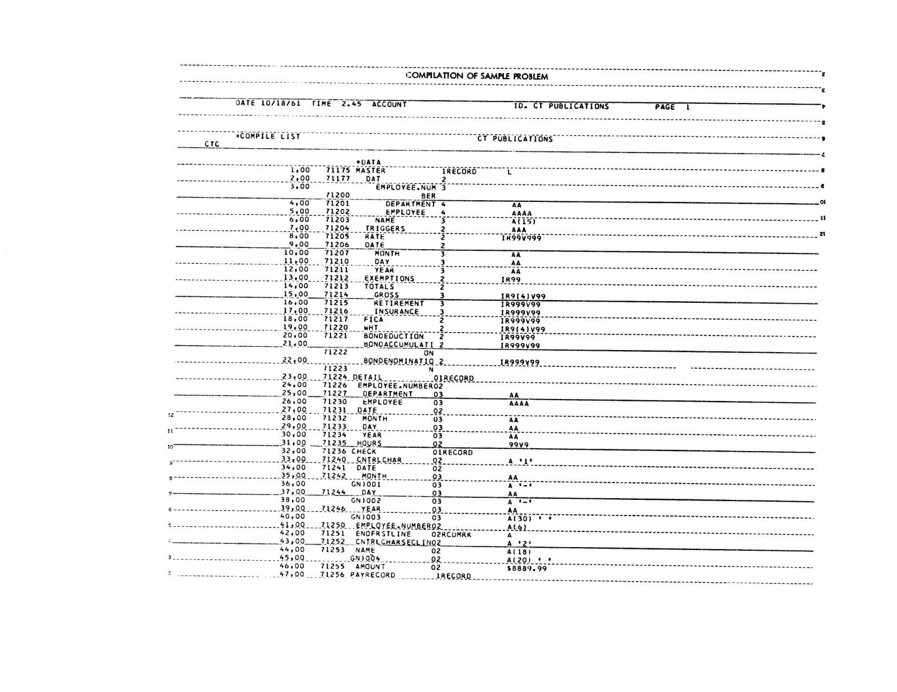
*Compilation of Sample Problem, printer listing page 1 (PDF p.192).*

```
                                    COMPILATION OF SAMPLE PROBLEM

        DATE 10/18/61   TIME  2.45   ACCOUNT                    ID. CT PUBLICATIONS        PAGE   1

        *COMPILE LIST                                             CT PUBLICATIONS
        CTC
                                  *DATA
          1,00   71175  MASTER                    1RECORD          L
          2,00   71177    DAT                         2
          3,00                  EMPLOYEE.NUM          3
                 71200            BER
          4,00   71201    DEPARTMENT                 4        AA
          5,00   71202    EMPLOYEE                   4        AAAA
          6,00   71203    NAME                       3        A(15)
          7,00   71204    TRIGGERS                   2        AAA
          8,00   71205    RATE                       2        IR99V999
          9,00   71206    DATE                       2
         10,00   71207      MONTH                    3        AA
         11,00   71210      DAY                      3        AA
         12,00   71211      YEAR                     3        AA
         13,00   71212    EXEMPTIONS                 2        IR99
         14,00   71213    TOTALS                     2
         15,00   71214      GROSS                    3        IR9(4)V99
         16,00   71215      RETIREMENT               3        IR999V99
         17,00   71216      INSURANCE                3        IR999V99
         18,00   71217    FICA                       2        IR999V99
         19,00   71220    WHT                        2        IR9(4)V99
         20,00   71221    BONDEDUCTION               2        IR99V99
         21,00              BONDACCUMULATI           2        IR999V99
                 71222              ON
         22,00              BONDENOMINATIO           2        IR999V99
                 71223              N
         23,00   71224  DETAIL                   01RECORD
         24,00   71226    EMPLOYEE.NUMBER            02
         25,00   71227    DEPARTMENT                 03       AA
         26,00   71230    EMPLOYEE                   03       AAAA
         27,00   71231    DATE                       02
         28,00   71232      MONTH                    03       AA
         29,00   71233      DAY                      03       AA
         30,00   71234      YEAR                     03       AA
         31,00   71235    HOURS                      02       99V9
         32,00   71236  CHECK                    01RECORD
         33,00   71240    CNTRLCHAR                  02       A '1'
         34,00   71241    DATE                       02
         35,00   71242      MONTH                    03       AA
         36,00           GN)001                      03       A '-'
         37,00   71244      DAY                      03       AA
         38,00           GN)002                      03       A '-'
         39,00   71246      YEAR                     03       AA
         40,00           GN)003                      03       A(30) ' '
         41,00   71250    EMPLOYEE.NUMBER            02       A(6)
         42,00   71251    ENDFRSTLINE              02RCDMRK    A
         43,00   71252    CNTRLCHARSECLINE           02        A '2'
         44,00   71253    NAME                       02        A(18)
         45,00           GN)004                      02        A(20) ' '
         46,00   71255    AMOUNT                     02        $8889.99
         47,00   71256  PAYRECORD                1RECORD
```

<!-- 90.05 listing | PDF 193 -->
**[90.05 sample-program listing, PDF p.193]**

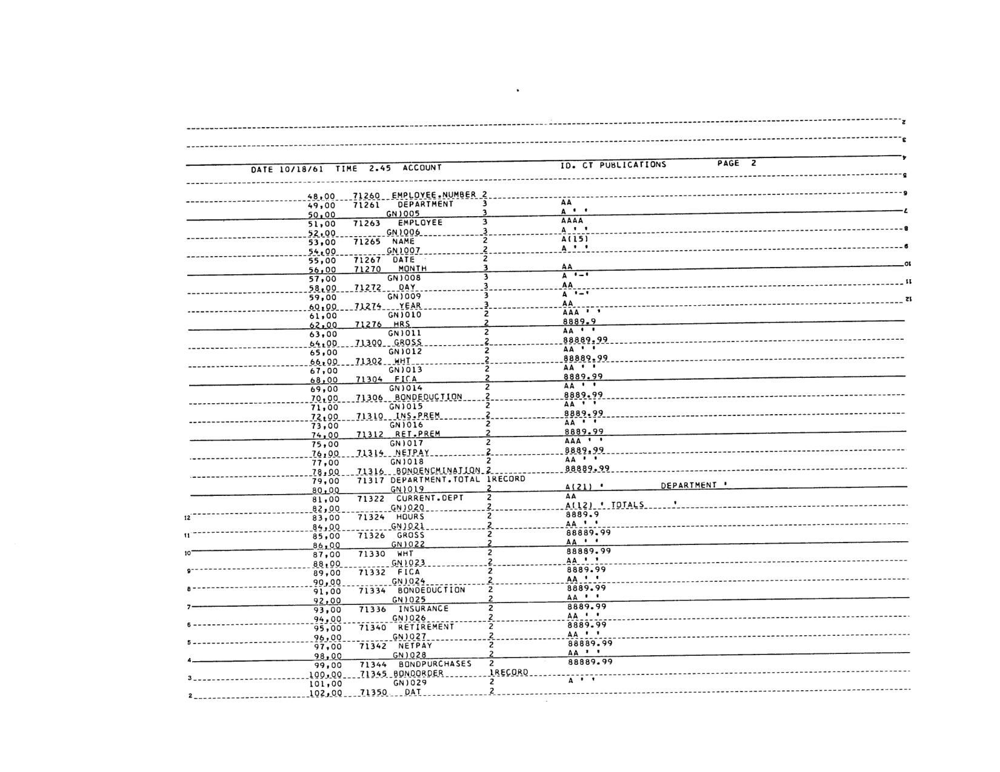
*Compilation of Sample Problem, printer listing page 2 (PDF p.193).*

```
        DATE 10/18/61   TIME  2.45   ACCOUNT                    ID. CT PUBLICATIONS        PAGE   2

         48,00   71260    EMPLOYEE.NUMBER            2
         49,00   71261      DEPARTMENT               3        AA
         50,00           GN)005                      3        A ' '
         51,00   71263      EMPLOYEE                 3        AAAA
         52,00           GN)006                      3        A ' '
         53,00   71265      NAME                     2        A(15)
         54,00           GN)007                      2        A ' '
         55,00   71267      DATE                     2
         56,00   71270        MONTH                  3        AA
         57,00           GN)008                      3        A '-'
         58,00   71272        DAY                    3        AA
         59,00           GN)009                      3        A '-'
         60,00   71274        YEAR                   3        AA
         61,00           GN)010                      2        AAA ' '
         62,00   71276      HRS                      2        8889.9
         63,00           GN)011                      2        AA ' '
         64,00   71300      GROSS                    2        88889.99
         65,00           GN)012                      2        AA ' '
         66,00   71302      WHT                      2        88889.99
         67,00           GN)013                      2        AA ' '
         68,00   71304      FICA                     2        8889.99
         69,00           GN)014                      2        AA ' '
         70,00   71306      BONDEDUCTION             2        8889.99
         71,00           GN)015                      2        AA ' '
         72,00   71310      INS.PREM                 2        8889.99
         73,00           GN)016                      2        AA ' '
         74,00   71312      RET.PREM                 2        8889.99
         75,00           GN)017                      2        AAA ' '
         76,00   71314      NETPAY                   2        8889.99
         77,00           GN)018                      2        AA ' '
         78,00   71316      BONDENOMINATION          2        88889.99
         79,00   71317  DEPARTMENT.TOTAL          1RECORD
         80,00           GN)019                      2        A(21) '          DEPARTMENT '
         81,00   71322    CURRENT.DEPT               2        AA
         82,00           GN)020                      2        A(12) ' TOTALS     '
         83,00   71324    HOURS                      2        8889.9
         84,00           GN)021                      2        AA ' '
         85,00   71326    GROSS                      2        88889.99
         86,00           GN)022                      2        AA ' '
         87,00   71330    WHT                        2        88889.99
         88,00           GN)023                      2        AA ' '
         89,00   71332    FICA                       2        8889.99
         90,00           GN)024                      2        AA ' '
         91,00   71334    BONDEDUCTION               2        8889.99
         92,00           GN)025                      2        AA ' '
         93,00   71336    INSURANCE                  2        8889.99
         94,00           GN)026                      2        AA ' '
         95,00   71340    RETIREMENT                 2        8889.99
         96,00           GN)027                      2        AA ' '
         97,00   71342    NETPAY                     2        88889.99
         98,00           GN)028                      2        AA ' '
         99,00   71344    BONDPURCHASES              2        88889.99
        100,00   71345  BONDORDER                1RECORD
        101,00           GN)029                      2        A ' '
        102,00   71350    DAT                        2
```

<!-- 90.05 listing | PDF 194 -->
**[90.05 sample-program listing, PDF p.194]**

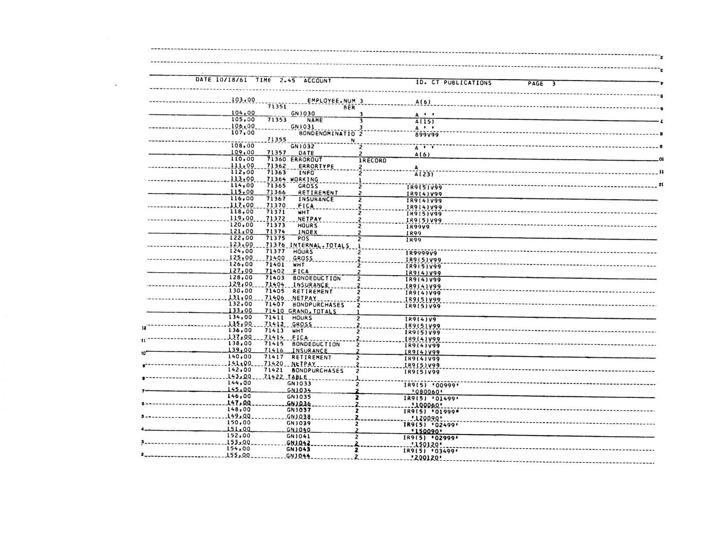
*Compilation of Sample Problem, printer listing page 3 (PDF p.194).*

```
        DATE 10/18/61   TIME  2.45   ACCOUNT                    ID. CT PUBLICATIONS        PAGE   3

        103,00                EMPLOYEE.NUM            3        A(6)
                 71351            BER
        104,00           GN)030                       3        A ' '
        105,00   71353    NAME                        3        A(15)
        106,00           GN)031                       3        A ' '
        107,00           BONDENOMINATIO               2        899V99
                 71355            N
        108,00           GN)032                       2        A ' '
        109,00   71357    DATE                        2        A(6)
        110,00   71360  ERROROUT                  1RECORD
        111,00   71362    ERRORTYPE                   2        A
        112,00   71363    INFO                        2        A(23)
        113,00   71364  WORKING                       1
        114,00   71365    GROSS                       2        IR9(5)V99
        115,00   71366    RETIREMENT                  2        IR9(4)V99
        116,00   71367    INSURANCE                   2        IR9(4)V99
        117,00   71370    FICA                        2        IR9(4)V99
        118,00   71371    WHT                         2        IR9(5)V99
        119,00   71372    NETPAY                      2        IR9(5)V99
        120,00   71373    HOURS                       2        IR99V9
        121,00   71374    INDEX                       2        IR99
        122,00   71375    POS                         2        IR99
        123,00   71376  INTERNAL.TOTALS               1
        124,00   71377    HOURS                       2        IR9999V9
        125,00   71400    GROSS                       2        IR9(5)V99
        126,00   71401    WHT                         2        IR9(5)V99
        127,00   71402    FICA                        2        IR9(4)V99
        128,00   71403    BONDEDUCTION                2        IR9(4)V99
        129,00   71404    INSURANCE                   2        IR9(4)V99
        130,00   71405    RETIREMENT                  2        IR9(4)V99
        131,00   71406    NETPAY                      2        IR9(5)V99
        132,00   71407    BONDPURCHASES               2        IR9(5)V99
        133,00   71410  GRAND.TOTALS                  1
        134,00   71411    HOURS                       2        IR9(4)V9
        135,00   71412    GROSS                       2        IR9(5)V99
        136,00   71413    WHT                         2        IR9(5)V99
        137,00   71414    FICA                        2        IR9(4)V99
        138,00   71415    BONDEDUCTION                2        IR9(4)V99
        139,00   71416    INSURANCE                   2        IR9(4)V99
        140,00   71417    RETIREMENT                  2        IR9(4)V99
        141,00   71420    NETPAY                      2        IR9(5)V99
        142,00   71421    BONDPURCHASES               2        IR9(5)V99
        143,00   71422  TABLE                         1
        144,00           GN)033                       2        IR9(5) '00999'
        145,00           GN)034                       2                 '080060'
        146,00           GN)035                       2        IR9(5) '01499'
        147,00           GN)036                       2                 '100060'
        148,00           GN)037                       2        IR9(5) '01999'
        149,00           GN)038                       2                 '120090'
        150,00           GN)039                       2        IR9(5) '02499'
        151,00           GN)040                       2                 '150090'
        152,00           GN)041                       2        IR9(5) '02999'
        153,00           GN)042                       2                 '150120'
        154,00           GN)043                       2        IR9(5) '03499'
        155,00           GN)044                       2                 '200120'
```

*Note: statement 107's field name (`BONDENOMINATIO`/`N`, wrapped) is the BONDORDER
record's external, non-right-justified picture (`899V99`), distinct from the
internally-formatted `IR999V99` BONDENOMINATION field of the MASTER record on
p.192. `TABLE` (statement 143) is a 12-entry rate/premium table whose literal
initial values continue as GN)033–GN)056 across this page and the next; each
pair of generated names packs one `TABLE.ITEM` entry (RATE, then INS.PREM and
RET.PREM together) — see PDF p.196 statements 169–172 for the redefinition.*

<!-- 90.05 listing | PDF 195 -->
**[90.05 sample-program listing, PDF p.195]**

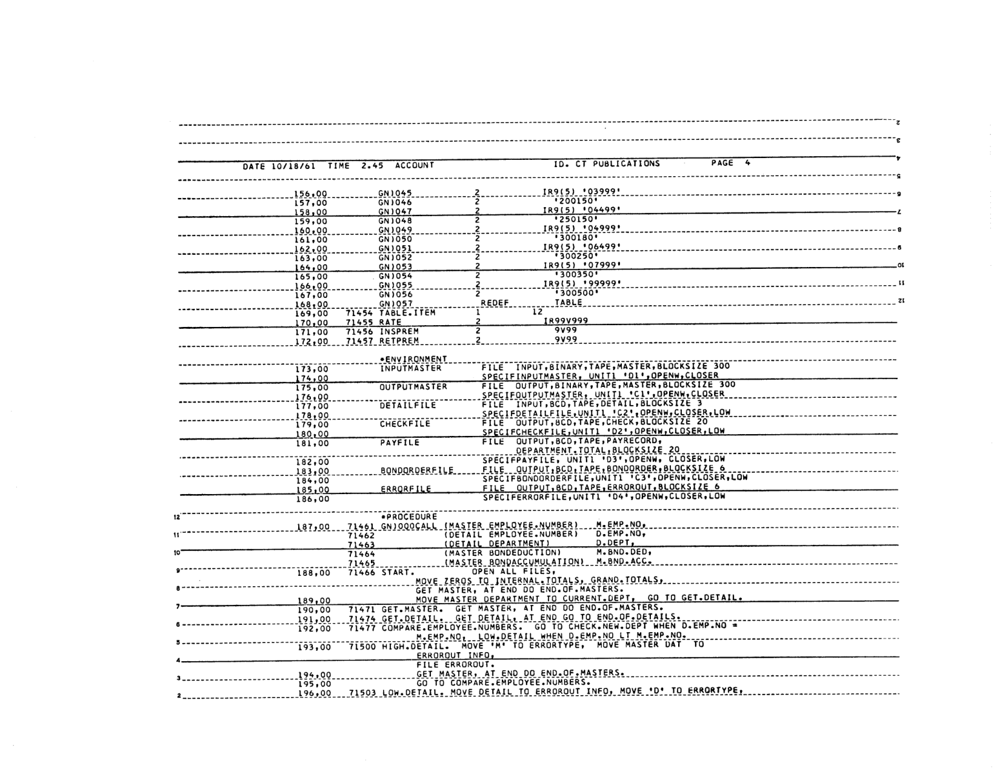
*Compilation of Sample Problem, printer listing page 4 (PDF p.195).*

```
        DATE 10/18/61   TIME  2.45   ACCOUNT                    ID. CT PUBLICATIONS        PAGE   4

        156,00           GN)045                       2        IR9(5) '03999'
        157,00           GN)046                       2                 '200150'
        158,00           GN)047                       2        IR9(5) '04499'
        159,00           GN)048                       2                 '250150'
        160,00           GN)049                       2        IR9(5) '04999'
        161,00           GN)050                       2                 '300180'
        162,00           GN)051                       2        IR9(5) '06499'
        163,00           GN)052                       2                 '300250'
        164,00           GN)053                       2        IR9(5) '07999'
        165,00           GN)054                       2                 '300350'
        166,00           GN)055                       2        IR9(5) '99999'
        167,00           GN)056                       2                 '300500'
        168,00           GN)057                    REDEF        TABLE
        169,00   71454  TABLE.ITEM                    1        12
        170,00   71455    RATE                        2        IR99V999
        171,00   71456    INSPREM                     2        9V99
        172,00   71457    RETPREM                     2        9V99

                                    *ENVIRONMENT

        173,00           INPUTMASTER      FILE   INPUT,BINARY,TAPE,MASTER,BLOCKSIZE 300
        174,00                            SPECIFINPUTMASTER, UNIT1 'D1',OPENW,CLOSER
        175,00           OUTPUTMASTER     FILE   OUTPUT,BINARY,TAPE,MASTER,BLOCKSIZE 300
        176,00                            SPECIFOUTPUTMASTER, UNIT1 'C1',OPENW,CLOSER
        177,00           DETAILFILE       FILE   INPUT,BCD,TAPE,DETAIL,BLOCKSIZE 3
        178,00                            SPECIFDETAILFILE,UNIT1 'C2',OPENW,CLOSER,LOW
        179,00           CHECKFILE        FILE   OUTPUT,BCD,TAPE,CHECK,BLOCKSIZE 20
        180,00                            SPECIFCHECKFILE,UNIT1 'D2',OPENW,CLOSER,LOW
        181,00           PAYFILE          FILE   OUTPUT,BCD,TAPE,PAYRECORD,
                                                  DEPARTMENT.TOTAL,BLOCKSIZE 20
        182,00                            SPECIFPAYFILE, UNIT1 'D3',OPENW,CLOSER,LOW
        183,00           BONDORDERFILE    FILE   OUTPUT,BCD,TAPE,BONDORDER,BLOCKSIZE 6
        184,00                            SPECIFBONDORDERFILE,UNIT1 'C3',OPENW,CLOSER,LOW
        185,00           ERRORFILE        FILE   OUTPUT,BCD,TAPE,ERROROUT,BLOCKSIZE 6
        186,00                            SPECIFERRORFILE,UNIT1 'D4',OPENW,CLOSER,LOW

                                    *PROCEDURE

        187,00   71461  GN)000CALL  (MASTER EMPLOYEE.NUMBER)   M.EMP.NO,
                 71462                (DETAIL EMPLOYEE.NUMBER)   D.EMP.NO,
                 71463                (DETAIL DEPARTMENT)        D.DEPT,
                 71464                (MASTER BONDEDUCTION)      M.BND.DED,
                 71465                (MASTER BONDACCUMULATION)  M.BND.ACC.
        188,00   71466  START.          OPEN ALL FILES,
                                         MOVE ZEROS TO INTERNAL.TOTALS, GRAND.TOTALS,
                                         GET MASTER, AT END DO END.OF.MASTERS.
        189,00                          MOVE MASTER DEPARTMENT TO CURRENT.DEPT,  GO TO GET.DETAIL.
        190,00   71471  GET.MASTER.     GET MASTER, AT END DO END.OF.MASTERS.
        191,00   71474  GET.DETAIL.     GET DETAIL, AT END GO TO END.OF.DETAILS.
        192,00   71477  COMPARE.EMPLOYEE.NUMBERS.  GO TO CHECK.NEW.DEPT WHEN D.EMP.NO =
                                         M.EMP.NO,  LOW.DETAIL WHEN D.EMP.NO LT M.EMP.NO.
        193,00   71500  HIGH.DETAIL.    MOVE 'M' TO ERRORTYPE, MOVE MASTER DAT TO
                                         ERROROUT INFO,
                                         FILE ERROROUT.
        194,00                          GET MASTER, AT END DO END.OF.MASTERS.
        195,00                          GO TO COMPARE.EMPLOYEE.NUMBERS.
        196,00   71503  LOW.DETAIL.     MOVE DETAIL TO ERROROUT INFO, MOVE 'D' TO ERRORTYPE,
```

*Note: `MASTER DAT` (statement 193) refers to the level-2 group field named
`DAT` declared under MASTER on PDF p.192 (statement 2,00), which contains the
MASTER's EMPLOYEE.NUM(BER) group — not a truncation.*

<!-- 90.05 listing | PDF 196 -->
**[90.05 sample-program listing, PDF p.196]**

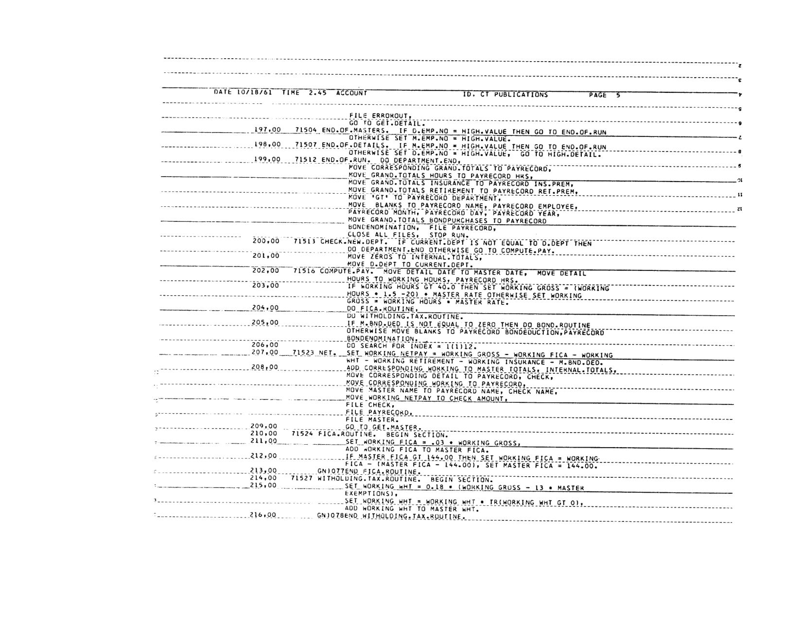
*Compilation of Sample Problem, printer listing page 5 (PDF p.196).*

```
        DATE 10/18/61   TIME  2.45   ACCOUNT                    ID. CT PUBLICATIONS        PAGE   5

                                         FILE ERROROUT,
                                         GO TO GET.DETAIL.
        197,00   71504  END.OF.MASTERS. IF D.EMP.NO = HIGH.VALUE THEN GO TO END.OF.RUN
                                         OTHERWISE SET M.EMP.NO = HIGH.VALUE.
        198,00   71507  END.OF.DETAILS. IF M.EMP.NO = HIGH.VALUE THEN GO TO END.OF.RUN
                                         OTHERWISE SET D.EMP.NO = HIGH.VALUE, GO TO HIGH.DETAIL.
        199,00   71512  END.OF.RUN.     DO DEPARTMENT.END,
                                         MOVE CORRESPONDING GRAND.TOTALS TO PAYRECORD,
                                         MOVE GRAND.TOTALS HOURS TO PAYRECORD HRS,
                                         MOVE GRAND.TOTALS INSURANCE TO PAYRECORD INS.PREM,
                                         MOVE GRAND.TOTALS RETIREMENT TO PAYRECORD RET.PREM,
                                         MOVE 'GT' TO PAYRECORD DEPARTMENT,
                                         MOVE BLANKS TO PAYRECORD NAME, PAYRECORD EMPLOYEE,
                                         PAYRECORD MONTH, PAYRECORD DAY, PAYRECORD YEAR,
                                         MOVE GRAND.TOTALS BONDPURCHASES TO PAYRECORD
                                         BONDENOMINATION,  FILE PAYRECORD,
                                         CLOSE ALL FILES, STOP RUN.
        200,00   71513  CHECK.NEW.DEPT. IF CURRENT.DEPT IS NOT EQUAL TO D.DEPT THEN
                                         DO DEPARTMENT.END OTHERWISE GO TO COMPUTE.PAY.
        201,00                          MOVE ZEROS TO INTERNAL.TOTALS,
                                         MOVE D.DEPT TO CURRENT.DEPT.
        202,00   71516  COMPUTE.PAY.    MOVE DETAIL DATE TO MASTER DATE,  MOVE DETAIL
                                         HOURS TO WORKING HOURS, PAYRECORD HRS.
        203,00                          IF WORKING HOURS GT 40.0 THEN SET WORKING GROSS = (WORKING
                                         HOURS * 1.5 - 20) * MASTER RATE OTHERWISE SET WORKING
                                         GROSS = WORKING HOURS * MASTER RATE.
        204,00                          DO FICA.ROUTINE,
                                         DO WITHOLDING.TAX.ROUTINE.
        205,00                          IF M.BND.DED IS NOT EQUAL TO ZERO THEN DO BOND.ROUTINE
                                         OTHERWISE MOVE BLANKS TO PAYRECORD BONDEDUCTION,PAYRECORD
                                         BONDENOMINATION.
        206,00                          DO SEARCH FOR INDEX = 1(1)12.
        207,00   71523  NET.            SET WORKING NETPAY = WORKING GROSS - WORKING FICA - WORKING
                                         WHT - WORKING RETIREMENT - WORKING INSURANCE - M.BND.DED.
        208,00                          ADD CORRESPONDING WORKING TO MASTER TOTALS, INTERNAL.TOTALS,
                                         MOVE CORRESPONDING DETAIL TO PAYRECORD, CHECK,
                                         MOVE CORRESPONDING WORKING TO PAYRECORD,
                                         MOVE MASTER NAME TO PAYRECORD NAME, CHECK NAME,
                                         MOVE WORKING NETPAY TO CHECK AMOUNT,
                                         FILE CHECK,
                                         FILE PAYRECORD,
                                         FILE MASTER.
        209,00                          GO TO GET.MASTER.
        210,00   71524  FICA.ROUTINE.   BEGIN SECTION.
        211,00                          SET WORKING FICA = .03 * WORKING GROSS,
                                         ADD WORKING FICA TO MASTER FICA.
        212,00                          IF MASTER FICA GT 144.00 THEN SET WORKING FICA = WORKING
                                         FICA - (MASTER FICA - 144.00), SET MASTER FICA = 144.00.
        213,00           GN)077END FICA.ROUTINE.
        214,00   71527  WITHOLDING.TAX.ROUTINE.  BEGIN SECTION.
        215,00                          SET WORKING WHT = 0.18 * (WORKING GROSS - 13 * MASTER
                                         EXEMPTIONS),
                                         SET WORKING WHT = WORKING WHT * TR(WORKING WHT GT 0),
                                         ADD WORKING WHT TO MASTER WHT.
        216,00           GN)078END WITHOLDING.TAX.ROUTINE.
```

*Transcriber’s note: `WITHOLDING` (statements 214–216) is reproduced exactly as printed by
the compiler (the source deck's own spelling), not a transcription error.
The generated labels (`GN)077`, `GN)078`, …) abut the following keyword with
no space, exactly as printed.*

<!-- 90.05 listing | PDF 197 -->
**[90.05 sample-program listing, PDF p.197]**

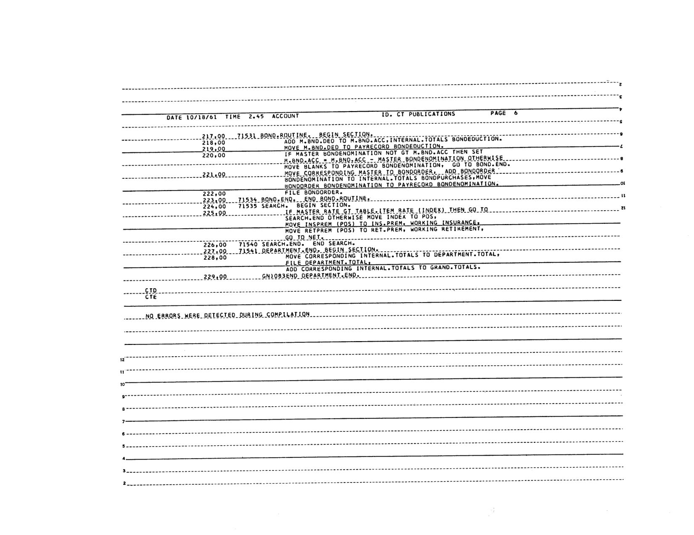
*Compilation of Sample Problem, printer listing page 6 (PDF p.197), the final page of the compilation listing.*

```
        DATE 10/18/61   TIME  2.45   ACCOUNT                    ID. CT PUBLICATIONS        PAGE   6

        217,00   71531  BOND.ROUTINE.   BEGIN SECTION.
                                         ADD M.BND.DED TO M.BND.ACC,INTERNAL.TOTALS BONDEDUCTION.
        218,00                          MOVE M.BND.DED TO PAYRECORD BONDEDUCTION.
        219,00                          IF MASTER BONDENOMINATION NOT GT M.BND.ACC THEN SET
        220,00                          M.BND.ACC = M.BND.ACC - MASTER BONDENOMINATION OTHERWISE
                                         MOVE BLANKS TO PAYRECORD BONDENOMINATION, GO TO BOND.END.
                                         MOVE CORRESPONDING MASTER TO BONDORDER,  ADD BONDORDER
        221,00                          BONDENOMINATION TO INTERNAL.TOTALS BONDPURCHASES,MOVE
                                         BONDORDER BONDENOMINATION TO PAYRECORD BONDENOMINATION.
        222,00                          FILE BONDORDER.
        223,00   71534  BOND.END.       END BOND.ROUTINE.
        224,00   71535  SEARCH.         BEGIN SECTION.
        225,00                          IF MASTER RATE GT TABLE.ITEM RATE (INDEX) THEN GO TO
                                         SEARCH.END OTHERWISE MOVE INDEX TO POS,
                                         MOVE INSPREM (POS) TO INS.PREM, WORKING INSURANCE,
                                         MOVE RETPREM (POS) TO RET.PREM, WORKING RETIREMENT,
                                         GO TO NET.
        226,00   71540  SEARCH.END.     END SEARCH.
        227,00   71541  DEPARTMENT.END. BEGIN SECTION.
                                         MOVE CORRESPONDING INTERNAL.TOTALS TO DEPARTMENT.TOTAL,
        228,00                          FILE DEPARTMENT.TOTAL,
                                         ADD CORRESPONDING INTERNAL.TOTALS TO GRAND.TOTALS.
        229,00           GN)083END DEPARTMENT.END.

        CTD
        CTE

        NO ERRORS WERE DETECTED DURING COMPILATION
```

<!-- conversion notes: ...
- Pages 187–191 (PDF): portrait body-text pages; OCR draft was largely
  accurate and was corrected against the page images only in minor spots
  (line-wraps, headings). No images embedded for these pages since they
  contain plain paragraph text and simple word/field lists, no figures.
- Pages 192–197 (PDF): landscape printer-output pages reproducing the actual
  compilation listing of the sample problem's DATA, ENVIRONMENT, and
  PROCEDURE divisions. The supplied OCR text for these six pages was
  essentially unusable (garbled), so all six were transcribed directly from
  the page images (embedded above each block) at high zoom. These carry no
  90.xx.xx section-code header in the manual's running head, so PDF-number
  markers were used per the chunk instructions.
- On the compilation-listing pages, small numerals (2–12) with tick marks
  printed in the left/right margins are the tractor-feed paper's own ruler
  scale, not part of the compiler output; they were omitted as page
  furniture, along with the printer's row of dashes/underscores used purely
  as visual rules.
- Two wrapped field names spanning two physical print lines (statement 21/22
  "BONDACCUMULATI"/"ON" and "BONDENOMINATIO"/"N" on PDF p.192; similarly
  statement 103/107 on PDF p.194) are reproduced exactly as the compiler
  printed them, split across lines, rather than silently rejoined, since
  this reflects the compiler's actual column-width wrapping behavior in the
  listing and the location (LOC) value prints only on the line where the
  name's wrap completes.
- Interior spacing of quoted literal/constant strings used for output-report
  column headers (e.g. statement 80's `A(21) '          DEPARTMENT '` and
  statement 82's `A(12) ' TOTALS     '` on PDF p.193) is a best-effort
  reconstruction from the image sized to match the stated field length
  (A(n)); exact interior space counts could not be verified pixel-by-pixel
  with certainty beyond field-length arithmetic.
- The level-2 MASTER field named `DAT` (PDF p.192, statement 2,00) and its
  external-record counterpart on PDF p.193 (statement 102,00) are transcribed
  exactly as printed (three letters, no trailing period) and are not OCR
  truncations of "DATE" — this is confirmed by procedure-division statement
  193 on PDF p.195, which references "MASTER DAT" as a qualified field name.
-->

<!-- 90.05 listing | PDF 198 -->
**[90.05 sample-program listing, PDF p.198]**

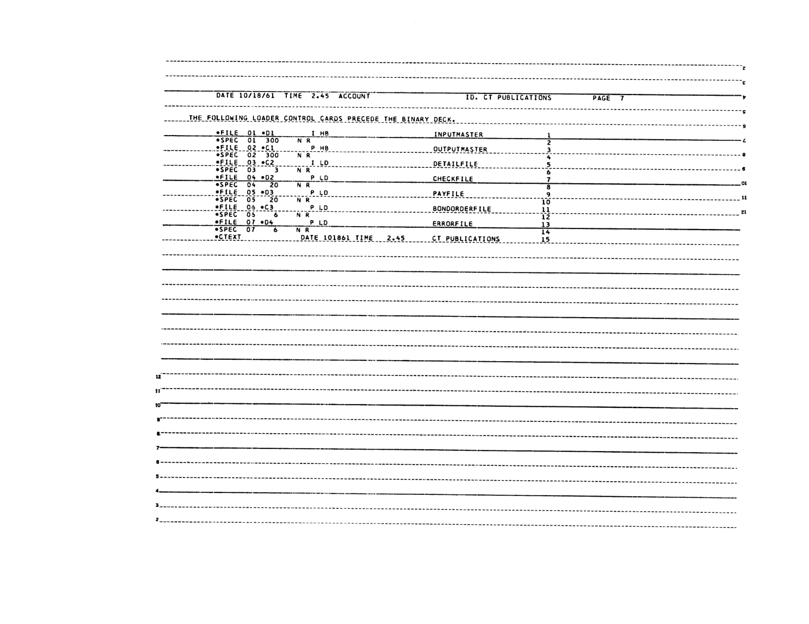
*Sample-program compilation listing — printer output page 7 of 16: loader control cards (PDF p.198).*

```
DATE 10/18/61   TIME 2.45   ACCOUNT                         ID. CT PUBLICATIONS         PAGE 7

THE FOLLOWING LOADER CONTROL CARDS PRECEDE THE BINARY DECK.

    *FILE  01 *D1        I HB              INPUTMASTER                     1
    *SPEC  01  300       N R                                               2
    *FILE  02 *C1        P HB              OUTPUTMASTER                    3
    *SPEC  02  300       N R                                               4
    *FILE  03 *C2        I LD              DETAILFILE                      5
    *SPEC  03    3       N R                                               6
    *FILE  04 *D2        P LD              CHECKFILE                       7
    *SPEC  04   20       N R                                               8
    *FILE  05 *D3        P LD              PAYFILE                         9
    *SPEC  05   20       N R                                              10
    *FILE  06 *C3        P LD              BONDORDERFILE                  11
    *SPEC  05    6       N R                                              12
    *FILE  07 *D4        P LD              ERRORFILE                      13
    *SPEC  07    6       N R                                              14
    *CTEXT             DATE 101861 TIME 2.45   CT PUBLICATIONS             15
```

<!-- 90.05 listing | PDF 199 -->
**[90.05 sample-program listing, PDF p.199]**

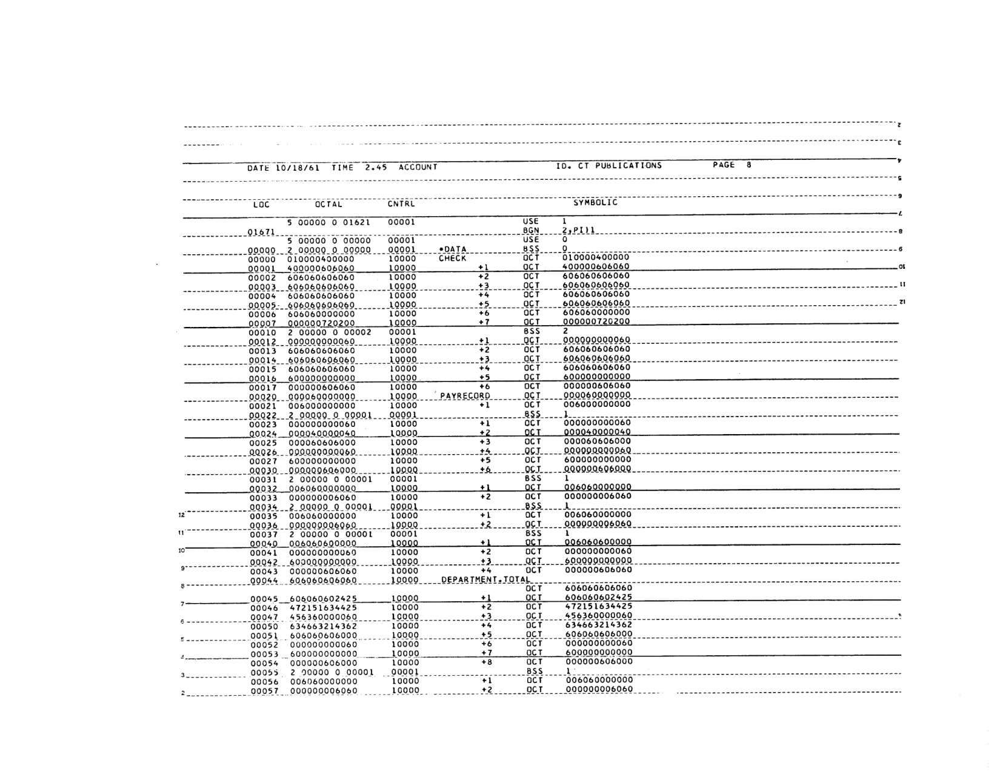
*Sample-program compilation listing — printer output page 8 of 16: octal/symbolic storage dump (PDF p.199).*

```
DATE 10/18/61   TIME 2.45   ACCOUNT                    ID. CT PUBLICATIONS      PAGE 8

LOC        OCTAL          CNTRL                       SYMBOLIC

           5 00000 0 01621   00001                    USE   1
01671                                                  BGN   2,PI)1
           5 00000 0 00000   00001                    USE   0
00000      2 00000 0 00000   00001    *DATA           BSS   0
00000      010000400000      10000    CHECK           OCT   010000400000
00001      400000606060      10000            +1      OCT   400000606060
00002      606060606060      10000            +2      OCT   606060606060
00003      606060606060      10000            +3      OCT   606060606060
00004      606060606060      10000            +4      OCT   606060606060
00005      606060606060      10000            +5      OCT   606060606060
00006      606060000000      10000            +6      OCT   606060000000
00007      000000720200      10000            +7      OCT   000000720200
00010      2 00000 0 00002   00001                    BSS   2
00012      000000000060      10000            +1      OCT   000000000060
00013      606060606060      10000            +2      OCT   606060606060
00014      606060606060      10000            +3      OCT   606060606060
00015      606060606060      10000            +4      OCT   606060606060
00016      600000000000      10000            +5      OCT   600000000000
00017      000000606060      10000            +6      OCT   000000606060
00020      000060000000      10000    PAYRECORD       OCT   000060000000
00021      006000000000      10000            +1      OCT   006000000000
00022      2 00000 0 00001   00001                    BSS   1
00023      000000000060      10000            +1      OCT   000000000060
00024      000040000040      10000            +2      OCT   000040000040
00025      000060606000      10000            +3      OCT   000060606000
00026      000000000060      10000            +4      OCT   000000000060
00027      600000000000      10000            +5      OCT   600000000000
00030      000000606000      10000            +6      OCT   000000606000
00031      2 00000 0 00001   00001                    BSS   1
00032      006060000000      10000            +1      OCT   006060000000
00033      000000006060      10000            +2      OCT   000000006060
00034      2 00000 0 00001   00001                    BSS   1
00035      006060000000      10000            +1      OCT   006060000000
00036      000000006060      10000            +2      OCT   000000006060
00037      2 00000 0 00001   00001                    BSS   1
00040      006060600000      10000            +1      OCT   006060600000
00041      000000000060      10000            +2      OCT   000000000060
00042      600000000000      10000            +3      OCT   600000000000
00043      000000606060      10000            +4      OCT   000000606060
00044      606060606060      10000    DEPARTMENT.TOTAL
                                                        OCT   606060606060
00045      606060602425      10000            +1      OCT   606060602425
00046      472151634425      10000            +2      OCT   472151634425
00047      456360000060      10000            +3      OCT   456360000060
00050      634663214362      10000            +4      OCT   634663214362
00051      606060606000      10000            +5      OCT   606060606000
00052      000000000060      10000            +6      OCT   000000000060
00053      600000000000      10000            +7      OCT   600000000000
00054      000000606000      10000            +8      OCT   000000606000
00055      2 00000 0 00001   00001                    BSS   1
00056      006060000000      10000            +1      OCT   006060000000
00057      000000006060      10000            +2      OCT   000000006060
```

<!-- 90.05 listing | PDF 200 -->
**[90.05 sample-program listing, PDF p.200]**

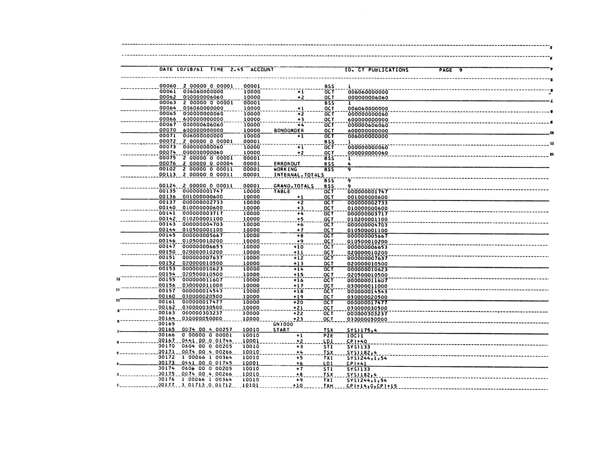
*Sample-program compilation listing — printer output page 9 of 16: end of storage dump and start of the symbolic assembly listing (label START, PDF p.200).*

```
DATE 10/18/61   TIME 2.45   ACCOUNT                    ID. CT PUBLICATIONS      PAGE 9

00060      2 00000 0 00001   00001                    BSS   1
00061      006060000000      10000            +1      OCT   006060000000
00062      000000006060      10000            +2      OCT   000000006060
00063      2 00000 0 00001   00001                    BSS   1
00064      006060000000      10000            +1      OCT   006060000000
00065      000000000060      10000            +2      OCT   000000000060
00066      600000000000      10000            +3      OCT   600000000000
00067      000000606060      10000            +4      OCT   000000606060
00070      600000000000      10000    BONDORDER       OCT   600000000000
00071      006000000000      10000            +1      OCT   006000000000
00072      2 00000 0 00001   00001                    BSS   1
00073      000000000060      10000            +1      OCT   000000000060
00074      000000000060      10000            +2      OCT   000000000060
00075      2 00000 0 00001   00001                    BSS   1
00076      2 00000 0 00004   00001    ERROROUT        BSS   4
00102      2 00000 0 00011   00001    WORKING         BSS   9
00113      2 00000 0 00011   00001    INTERNAL.TOTALS
                                                        BSS   9
00124      2 00000 0 00011   00001    GRAND.TOTALS    BSS   9
00135      000000001747      10000    TABLE           OCT   000000001747
00136      001000000600      10000            +1      OCT   001000000600
00137      000000002733      10000            +2      OCT   000000002733
00140      010000000600      10000            +3      OCT   010000000600
00141      000000003717      10000            +4      OCT   000000003717
00142      010200001100      10000            +5      OCT   010200001100
00143      000000004703      10000            +6      OCT   000000004703
00144      010500001100      10000            +7      OCT   010500001100
00145      000000005667      10000            +8      OCT   000000005667
00146      010500010200      10000            +9      OCT   010500010200
00147      000000006653      10000            +10     OCT   000000006653
00150      020000010200      10000            +11     OCT   020000010200
00151      000000007637      10000            +12     OCT   000000007637
00152      020000010500      10000            +13     OCT   020000010500
00153      000000010623      10000            +14     OCT   000000010623
00154      020500010500      10000            +15     OCT   020500010500
00155      000000011607      10000            +16     OCT   000000011607
00156      030000011000      10000            +17     OCT   030000011000
00157      000000014543      10000            +18     OCT   000000014543
00160      030000020500      10000            +19     OCT   030000020500
00161      000000017477      10000            +20     OCT   000000017477
00162      030000030500      10000            +21     OCT   030000030500
00163      000000303237      10000            +22     OCT   000000303237
00164      030000050000      10000            +23     OCT   030000050000
00165                                 GN)000
00165      0074 00 4 00257   10010    START           TSX   SYS)175,4
00166      0 00000 0 00001   10010            +1      PZE   IOC)1
00167      0441 00 0 01744   10001            +2      LDI   CP)+40
00170      0604 00 0 00205   10010            +3      STI   SYS)133
00171      0074 00 4 00266   10010            +4      TSX   SYS)182,4
00172      1 00066 1 00364   10010            +5      TXI   SYS)244,1,54
00173      0441 00 0 01745   10001            +6      LDI   CP)+41
00174      0604 00 0 00205   10010            +7      STI   SYS)133
00175      0074 00 4 00266   10010            +8      TSX   SYS)182,4
00176      1 00066 1 00364   10010            +9      TXI   SYS)244,1,54
00177      3 01713 0 01712   10101            +10     TXH   CP)+14,0,CP)+15
```

<!-- 90.05 listing | PDF 201 -->
**[90.05 sample-program listing, PDF p.201]**

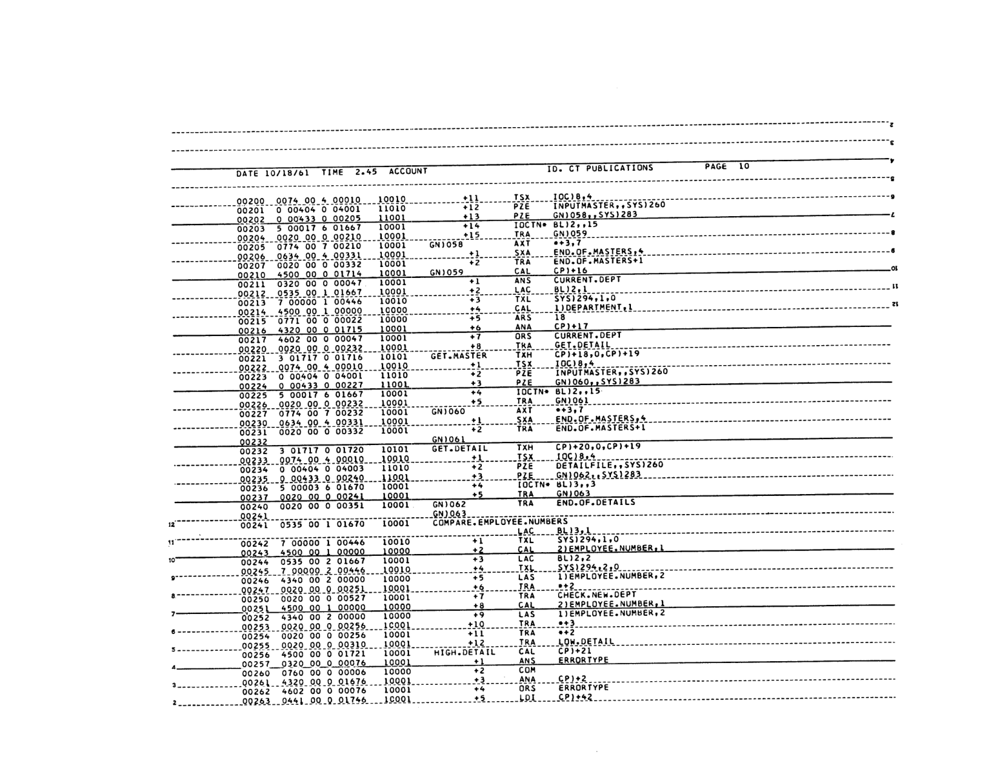
*Sample-program compilation listing — printer output page 10 of 16 (labels GN)058–GN)063, GET.MASTER, GET.DETAIL, COMPARE.EMPLOYEE.NUMBERS, HIGH.DETAIL) (PDF p.201).*

```
DATE 10/18/61   TIME 2.45   ACCOUNT                    ID. CT PUBLICATIONS      PAGE 10

00200      0074 00 4 00010   10010            +11     TSX   IOC)8,4
00201      0 00404 0 04001   11010            +12     PZE   INPUTMASTER,,SYS)260
00202      0 00433 0 00205   11001            +13     PZE   GN)058,,SYS)283
00203      5 00017 6 01667   10001            +14     IOCTN*  BL)2,,15
00204      0020 00 0 00210   10001            +15     TRA   GN)059
00205      0774 00 7 00210   10001    GN)058          AXT   *+3,7
00206      0634 00 4 00331   10001            +1      SXA   END.OF.MASTERS,4
00207      0020 00 0 00332   10001            +2      TRA   END.OF.MASTERS+1
00210      4500 00 0 01714   10001    GN)059          CAL   CP)+16
00211      0320 00 0 00047   10001            +1      ANS   CURRENT.DEPT
00212      0535 00 1 01667   10001            +2      LAC   BL)2,1
00213      7 00000 1 00446   10010            +3      TXL   SYS)294,1,0
00214      4500 00 1 00000   10000            +4      CAL   1)DEPARTMENT,1
00215      0771 00 0 00022   10000            +5      ARS   18
00216      4320 00 0 01715   10001            +6      ANA   CP)+17
00217      4602 00 0 00047   10001            +7      ORS   CURRENT.DEPT
00220      0020 00 0 00232   10001            +8      TRA   GET.DETAIL
00221      3 01717 0 01716   10101    GET.MASTER      TXH   CP)+18,0,CP)+19
00222      0074 00 4 00010   10010            +1      TSX   IOC)8,4
00223      0 00404 0 04001   11010            +2      PZE   INPUTMASTER,,SYS)260
00224      0 00433 0 00227   11001            +3      PZE   GN)060,,SYS)283
00225      5 00017 6 01667   10001            +4      IOCTN*  BL)2,,15
00226      0020 00 0 00232   10001            +5      TRA   GN)061
00227      0774 00 7 00232   10001    GN)060          AXT   *+3,7
00230      0634 00 4 00331   10001            +1      SXA   END.OF.MASTERS,4
00231      0020 00 0 00332   10001            +2      TRA   END.OF.MASTERS+1
00232                                 GN)061
00232      3 01717 0 01720   10101    GET.DETAIL      TXH   CP)+20,0,CP)+19
00233      0074 00 4 00010   10010            +1      TSX   IOC)8,4
00234      0 00404 0 04003   11010            +2      PZE   DETAILFILE,,SYS)260
00235      0 00433 0 00240   11001            +3      PZE   GN)062,,SYS)283
00236      5 00003 6 01670   10001            +4      IOCTN*  BL)3,,3
00237      0020 00 0 00241   10001            +5      TRA   GN)063
00240      0020 00 0 00351   10001    GN)062          TRA   END.OF.DETAILS
00241                                 GN)063
00241      0535 00 1 01670   10001    COMPARE.EMPLOYEE.NUMBERS
                                                        LAC   BL)3,1
00242      7 00000 1 00446   10010            +1      TXL   SYS)294,1,0
00243      4500 00 1 00000   10000            +2      CAL   2)EMPLOYEE.NUMBER,1
00244      0535 00 2 01667   10001            +3      LAC   BL)2,2
00245      7 00000 2 00446   10010            +4      TXL   SYS)294,2,0
00246      4340 00 2 00000   10000            +5      LAS   1)EMPLOYEE.NUMBER,2
00247      0020 00 0 00251   10001            +6      TRA   *+2
00250      0020 00 0 00527   10001            +7      TRA   CHECK.NEW.DEPT
00251      4500 00 1 00000   10000            +8      CAL   2)EMPLOYEE.NUMBER,1
00252      4340 00 2 00000   10000            +9      LAS   1)EMPLOYEE.NUMBER,2
00253      0020 00 0 00256   10001            +10     TRA   *+3
00254      0020 00 0 00256   10001            +11     TRA   *+2
00255      0020 00 0 00310   10001            +12     TRA   LOW.DETAIL
00256      4500 00 0 01721   10001    HIGH.DETAIL     CAL   CP)+21
00257      0320 00 0 00076   10001            +1      ANS   ERRORTYPE
00260      0760 00 0 00006   10000            +2      COM
00261      4320 00 0 01676   10001            +3      ANA   CP)+2
00262      4602 00 0 00076   10001            +4      ORS   ERRORTYPE
00263      0441 00 0 01746   10001            +5      LDI   CP)+42
```

<!-- 90.05 listing | PDF 202 -->
**[90.05 sample-program listing, PDF p.202]**

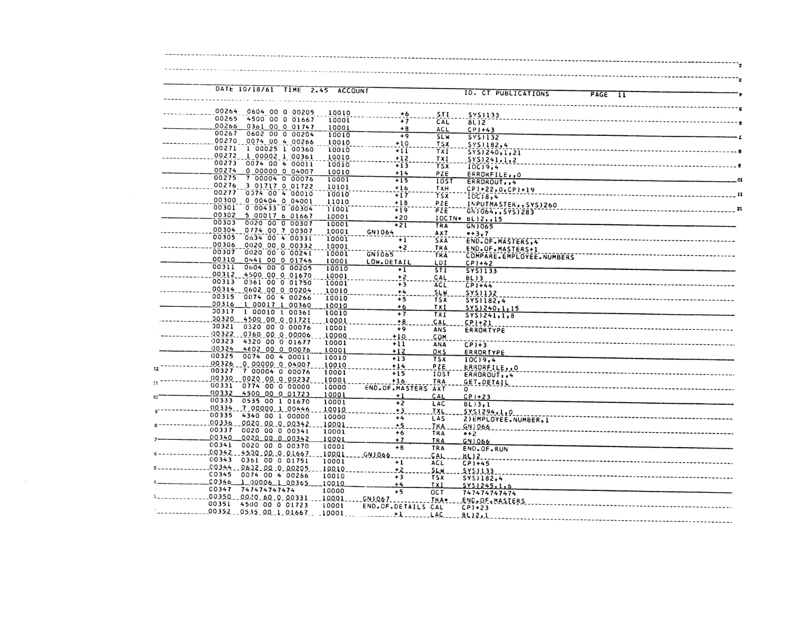
*Sample-program compilation listing — printer output page 11 of 16 (labels GN)064–GN)067, LOW.DETAIL, END.OF.MASTERS, END.OF.DETAILS) (PDF p.202).*

```
DATE 10/18/61   TIME 2.45   ACCOUNT                    ID. CT PUBLICATIONS      PAGE 11

00264      0604 00 0 00205   10010            +6      STI   SYS)133
00265      4500 00 0 01667   10001            +7      CAL   BL)2
00266      0361 00 0 01747   10001            +8      ACL   CP)+43
00267      0602 00 0 00204   10010            +9      SLW   SYS)132
00270      0074 00 4 00266   10010            +10     TSX   SYS)182,4
00271      1 00025 1 00360   10010            +11     TXI   SYS)240,1,21
00272      1 00002 1 00361   10010            +12     TXI   SYS)241,1,2
00273      0074 00 4 00011   10010            +13     TSX   IOC)9,4
00274      0 00000 0 04007   10010            +14     PZE   ERRORFILE,,0
00275      7 00004 0 00076   10001            +15     IOST  ERROROUT,,4
00276      3 01717 0 01722   10101            +16     TXH   CP)+22,0,CP)+19
00277      0074 00 4 00010   10010            +17     TSX   IOC)8,4
00300      0 00404 0 04001   11010            +18     PZE   INPUTMASTER,,SYS)260
00301      0 00433 0 00304   11001            +19     PZE   GN)064,,SYS)283
00302      5 00017 6 01667   10001            +20     IOCTN*  BL)2,,15
00303      0020 00 0 00307   10001            +21     TRA   GN)065
00304      0774 00 7 00307   10001    GN)064          AXT   *+3,7
00305      0634 00 4 00331   10001            +1      SXA   END.OF.MASTERS,4
00306      0020 00 0 00332   10001            +2      TRA   END.OF.MASTERS+1
00307      0020 00 0 00241   10001    GN)065          TRA   COMPARE.EMPLOYEE.NUMBERS
00310      0441 00 0 01746   10001    LOW.DETAIL      LDI   CP)+42
00311      0604 00 0 00205   10010            +1      STI   SYS)133
00312      4500 00 0 01670   10001            +2      CAL   BL)3
00313      0361 00 0 01750   10001            +3      ACL   CP)+44
00314      0602 00 0 00204   10010            +4      SLW   SYS)132
00315      0074 00 4 00266   10010            +5      TSX   SYS)182,4
00316      1 00017 1 00360   10010            +6      TXI   SYS)240,1,15
00317      1 00010 1 00361   10010            +7      TXI   SYS)241,1,8
00320      4500 00 0 01721   10001            +8      CAL   CP)+21
00321      0320 00 0 00076   10001            +9      ANS   ERRORTYPE
00322      0760 00 0 00006   10000            +10     COM
00323      4320 00 0 01677   10001            +11     ANA   CP)+3
00324      4602 00 0 00076   10001            +12     ORS   ERRORTYPE
00325      0074 00 4 00011   10010            +13     TSX   IOC)9,4
00326      0 00000 0 04007   10010            +14     PZE   ERRORFILE,,0
00327      7 00004 0 00076   10001            +15     IOST  ERROROUT,,4
00330      0020 00 0 00232   10001            +16     TRA   GET.DETAIL
00331      0774 00 0 00000   10000    END.OF.MASTERS  AXT   0
00332      4500 00 0 01723   10001            +1      CAL   CP)+23
00333      0535 00 1 01670   10001            +2      LAC   BL)3,1
00334      7 00000 1 00446   10010            +3      TXL   SYS)294,1,0
00335      4340 00 1 00000   10000            +4      LAS   2)EMPLOYEE.NUMBER,1
00336      0020 00 0 00342   10001            +5      TRA   GN)066
00337      0020 00 0 00341   10001            +6      TRA   *+2
00340      0020 00 0 00342   10001            +7      TRA   GN)066
00341      0020 00 0 00370   10001            +8      TRA   END.OF.RUN
00342      4500 00 0 01667   10001    GN)066          CAL   BL)2
00343      0361 00 0 01751   10001            +1      ACL   CP)+45
00344      0602 00 0 00205   10010            +2      SLW   SYS)133
00345      0074 00 4 00266   10010            +3      TSX   SYS)182,4
00346      1 00006 1 00365   10010            +4      TXI   SYS)245,1,6
00347      747474747474      10000            +5      OCT   747474747474
00350      0020 60 0 00331   10001    GN)067          TRA*  END.OF.MASTERS
00351      4500 00 0 01723   10001    END.OF.DETAILS  CAL   CP)+23
00352      0535 00 1 01667   10001            +1      LAC   BL)2,1
```

*Transcriber’s note — row 00350's tag field (`60`) and the asterisk following `TRA` are as printed; verified against an enlarged crop of the page image.*

<!-- 90.05 listing | PDF 203 -->
**[90.05 sample-program listing, PDF p.203]**

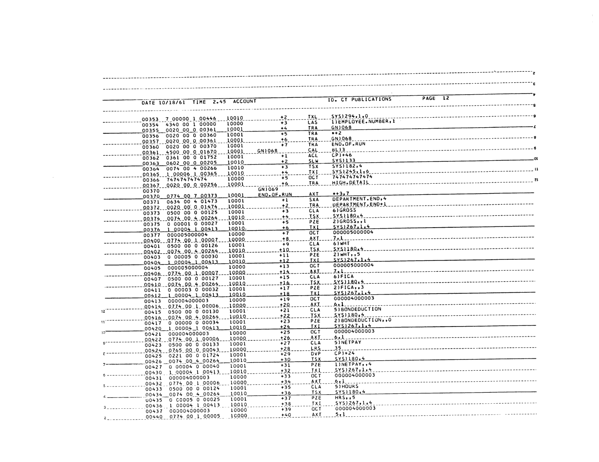
*Sample-program compilation listing — printer output page 12 of 16 (labels GN)068–GN)069, END.OF.RUN) (PDF p.203).*

```
DATE 10/18/61   TIME 2.45   ACCOUNT                    ID. CT PUBLICATIONS      PAGE 12

00353      7 00000 1 00446   10010            +2      TXL   SYS)294,1,0
00354      4340 00 1 00000   10000            +3      LAS   1)EMPLOYEE.NUMBER,1
00355      0020 00 0 00361   10001            +4      TRA   GN)068
00356      0020 00 0 00360   10001            +5      TRA   *+2
00357      0020 00 0 00361   10001            +6      TRA   GN)068
00360      0020 00 0 00370   10001            +7      TRA   END.OF.RUN
00361      4500 00 0 01670   10001    GN)068          CAL   BL)3
00362      0361 00 0 01752   10001            +1      ACL   CP)+46
00363      0602 00 0 00205   10010            +2      SLW   SYS)133
00364      0074 00 4 00266   10010            +3      TSX   SYS)182,4
00365      1 00006 1 00365   10010            +4      TXI   SYS)245,1,6
00366      747474747474      10000            +5      OCT   747474747474
00367      0020 00 0 00256   10001            +6      TRA   HIGH.DETAIL
00370                                 GN)069
00370      0774 00 7 00373   10001    END.OF.RUN      AXT   *+3,7
00371      0634 00 4 01473   10001            +1      SXA   DEPARTMENT.END,4
00372      0020 00 0 01474   10001            +2      TRA   DEPARTMENT.END+1
00373      0500 00 0 00125   10001            +3      CLA   6)GROSS
00374      0074 00 4 00264   10010            +4      TSX   SYS)180,4
00375      0 00001 0 00027   10001            +5      PZE   2)GROSS,,1
00376      1 00004 1 00413   10010            +6      TXI   SYS)267,1,4
00377      000005000004      10000            +7      OCT   000005000004
00400      0774 00 1 00007   10000            +8      AXT   7,1
00401      0500 00 0 00126   10001            +9      CLA   6)WHT
00402      0074 00 4 00264   10010            +10     TSX   SYS)180,4
00403      0 00005 0 00030   10001            +11     PZE   2)WHT,,5
00404      1 00004 1 00413   10010            +12     TXI   SYS)267,1,4
00405      000005000004      10000            +13     OCT   000005000004
00406      0774 00 1 00007   10000            +14     AXT   7,1
00407      0500 00 0 00127   10001            +15     CLA   6)FICA
00410      0074 00 4 00264   10010            +16     TSX   SYS)180,4
00411      0 00003 0 00032   10001            +17     PZE   2)FICA,,3
00412      1 00004 1 00413   10010            +18     TXI   SYS)267,1,4
00413      000004000003      10000            +19     OCT   000004000003
00414      0774 00 1 00006   10000            +20     AXT   6,1
00415      0500 00 0 00130   10001            +21     CLA   5)BONDEDUCTION
00416      0074 00 4 00264   10010            +22     TSX   SYS)180,4
00417      0 00000 0 00034   10001            +23     PZE   2)BONDEDUCTION,,0
00420      1 00004 1 00413   10010            +24     TXI   SYS)267,1,4
00421      000004000003      10000            +25     OCT   000004000003
00422      0774 00 1 00006   10000            +26     AXT   6,1
00423      0500 00 0 00133   10001            +27     CLA   5)NETPAY
00424      0765 00 0 00043   10000            +28     LRS   35
00425      0221 00 0 01724   10001            +29     DVP   CP)+24
00426      0074 00 4 00264   10010            +30     TSX   SYS)180,4
00427      0 00004 0 00040   10001            +31     PZE   1)NETPAY,,4
00430      1 00004 1 00413   10010            +32     TXI   SYS)267,1,4
00431      000004000003      10000            +33     OCT   000004000003
00432      0774 00 1 00006   10000            +34     AXT   6,1
00433      0500 00 0 00124   10001            +35     CLA   5)HOURS
00434      0074 00 4 00264   10010            +36     TSX   SYS)180,4
00435      0 00005 0 00025   10001            +37     PZE   HRS,,5
00436      1 00004 1 00413   10010            +38     TXI   SYS)267,1,4
00437      000004000003      10000            +39     OCT   000004000003
00440      0774 00 1 00005   10000            +40     AXT   5,1
```

<!-- 90.05 listing | PDF 204 -->
**[90.05 sample-program listing, PDF p.204]**

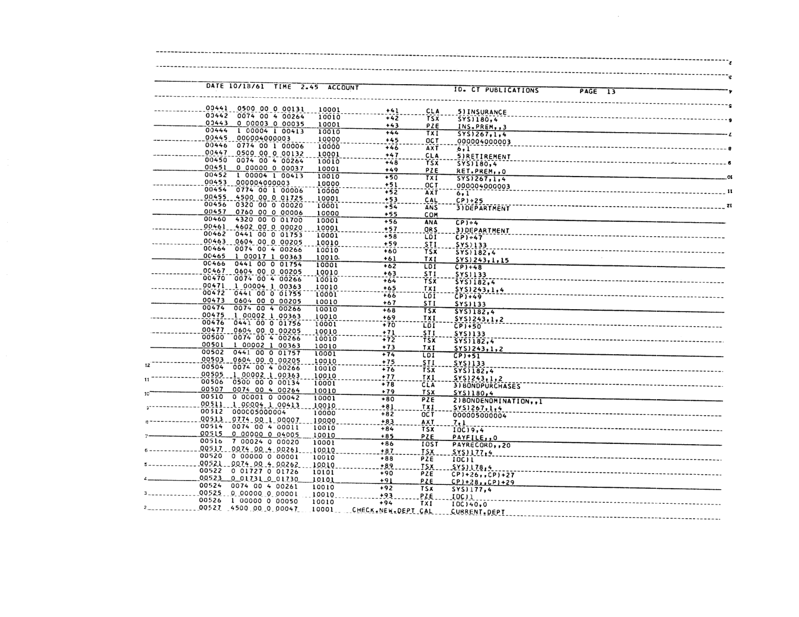
*Sample-program compilation listing — printer output page 13 of 16 (label CHECK.NEW.DEPT) (PDF p.204).*

```
DATE 10/18/61   TIME 2.45   ACCOUNT                    ID. CT PUBLICATIONS      PAGE 13

00441      0500 00 0 00131   10001            +41     CLA   5)INSURANCE
00442      0074 00 4 00264   10010            +42     TSX   SYS)180,4
00443      0 00003 0 00035   10001            +43     PZE   INS.PREM,,3
00444      1 00004 1 00413   10010            +44     TXI   SYS)267,1,4
00445      000004000003      10000            +45     OCT   000004000003
00446      0774 00 1 00006   10000            +46     AXT   6,1
00447      0500 00 0 00132   10001            +47     CLA   5)RETIREMENT
00450      0074 00 4 00264   10010            +48     TSX   SYS)180,4
00451      0 00000 0 00037   10001            +49     PZE   RET.PREM,,0
00452      1 00004 1 00413   10010            +50     TXI   SYS)267,1,4
00453      000004000003      10000            +51     OCT   000004000003
00454      0774 00 1 00006   10000            +52     AXT   6,1
00455      4500 00 0 01725   10001            +53     CAL   CP)+25
00456      0320 00 0 00020   10001            +54     ANS   3)DEPARTMENT
00457      0760 00 0 00006   10000            +55     COM
00460      4320 00 0 01700   10001            +56     ANA   CP)+4
00461      4602 00 0 00020   10001            +57     ORS   3)DEPARTMENT
00462      0441 00 0 01753   10001            +58     LDI   CP)+47
00463      0604 00 0 00205   10010            +59     STI   SYS)133
00464      0074 00 4 00266   10010            +60     TSX   SYS)182,4
00465      1 00017 1 00363   10010            +61     TXI   SYS)243,1,15
00466      0441 00 0 01754   10001            +62     LDI   CP)+48
00467      0604 00 0 00205   10010            +63     STI   SYS)133
00470      0074 00 4 00266   10010            +64     TSX   SYS)182,4
00471      1 00004 1 00363   10010            +65     TXI   SYS)243,1,4
00472      0441 00 0 01755   10001            +66     LDI   CP)+49
00473      0604 00 0 00205   10010            +67     STI   SYS)133
00474      0074 00 4 00266   10010            +68     TSX   SYS)182,4
00475      1 00002 1 00363   10010            +69     TXI   SYS)243,1,2
00476      0441 00 0 01756   10001            +70     LDI   CP)+50
00477      0604 00 0 00205   10010            +71     STI   SYS)133
00500      0074 00 4 00266   10010            +72     TSX   SYS)182,4
00501      1 00002 1 00363   10010            +73     TXI   SYS)243,1,2
00502      0441 00 0 01757   10001            +74     LDI   CP)+51
00503      0604 00 0 00205   10010            +75     STI   SYS)133
00504      0074 00 4 00266   10010            +76     TSX   SYS)182,4
00505      1 00002 1 00363   10010            +77     TXI   SYS)243,1,2
00506      0500 00 0 00134   10001            +78     CLA   3)BONDPURCHASES
00507      0074 00 4 00264   10010            +79     TSX   SYS)180,4
00510      0 00001 0 00042   10001            +80     PZE   2)BONDENOMINATION,,1
00511      1 00004 1 00413   10010            +81     TXI   SYS)267,1,4
00512      000005000004      10000            +82     OCT   000005000004
00513      0774 00 1 00007   10000            +83     AXT   7,1
00514      0074 00 4 00011   10010            +84     TSX   IOC)9,4
00515      0 00000 0 04005   10010            +85     PZE   PAYFILE,,0
00516      7 00024 0 00020   10001            +86     IOST  PAYRECORD,,20
00517      0074 00 4 00261   10010            +87     TSX   SYS)177,4
00520      0 00000 0 00001   10010            +88     PZE   IOC)1
00521      0074 00 4 00262   10010            +89     TSX   SYS)178,4
00522      0 01727 0 01726   10101            +90     PZE   CP)+26,,CP)+27
00523      0 01731 0 01730   10101            +91     PZE   CP)+28,,CP)+29
00524      0074 00 4 00261   10010            +92     TSX   SYS)177,4
00525      0 00000 0 00001   10010            +93     PZE   IOC)1
00526      1 00000 0 00050   10010            +94     TXI   IOC)40,0
00527      4500 00 0 00047   10001    CHECK.NEW.DEPT  CAL   CURRENT.DEPT
```

<!-- 90.05 listing | PDF 205 -->
**[90.05 sample-program listing, PDF p.205]**

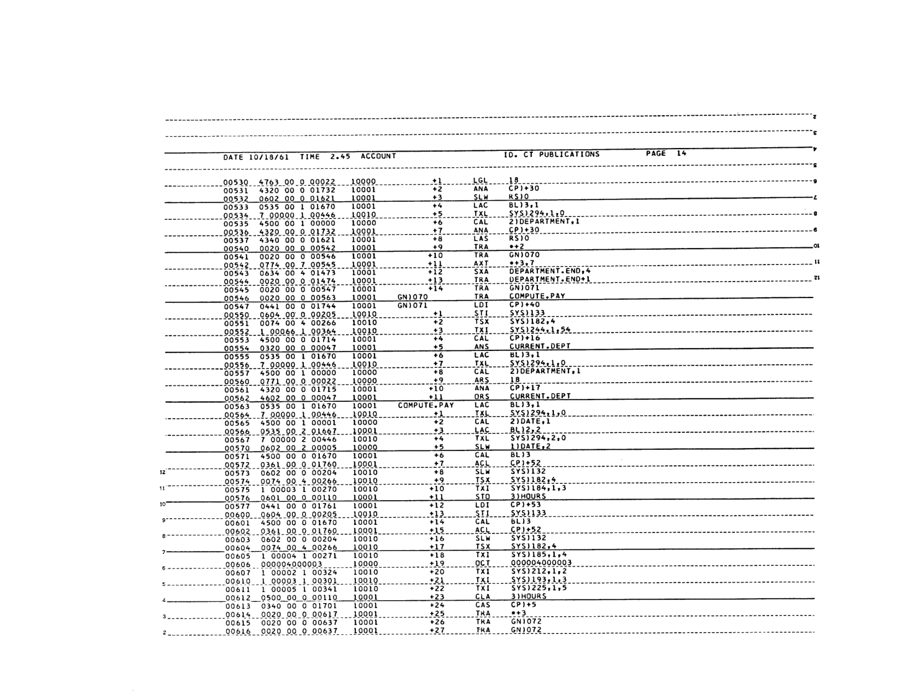
*Sample-program compilation listing — printer output page 14 of 16 (labels GN)070–GN)071, COMPUTE.PAY) (PDF p.205).*

```
DATE 10/18/61   TIME 2.45   ACCOUNT                    ID. CT PUBLICATIONS      PAGE 14

00530      4763 00 0 00022   10000            +1      LGL   18
00531      4320 00 0 01732   10001            +2      ANA   CP)+30
00532      0602 00 0 01621   10001            +3      SLW   RS)0
00533      0535 00 1 01670   10001            +4      LAC   BL)3,1
00534      7 00000 1 00446   10010            +5      TXL   SYS)294,1,0
00535      4500 00 1 00000   10000            +6      CAL   2)DEPARTMENT,1
00536      4320 00 0 01732   10001            +7      ANA   CP)+30
00537      4340 00 0 01621   10001            +8      LAS   RS)0
00540      0020 00 0 00542   10001            +9      TRA   *+2
00541      0020 00 0 00546   10001            +10     TRA   GN)070
00542      0774 00 7 00545   10001            +11     AXT   *+3,7
00543      0634 00 4 01473   10001            +12     SXA   DEPARTMENT.END,4
00544      0020 00 0 01474   10001            +13     TRA   DEPARTMENT.END+1
00545      0020 00 0 00547   10001            +14     TRA   GN)071
00546      0020 00 0 00563   10001    GN)070          TRA   COMPUTE.PAY
00547      0441 00 0 01744   10001    GN)071          LDI   CP)+40
00550      0604 00 0 00205   10010            +1      STI   SYS)133
00551      0074 00 4 00266   10010            +2      TSX   SYS)182,4
00552      1 00066 1 00364   10010            +3      TXI   SYS)244,1,54
00553      4500 00 0 01714   10001            +4      CAL   CP)+16
00554      0320 00 0 00047   10001            +5      ANS   CURRENT.DEPT
00555      0535 00 1 01670   10001            +6      LAC   BL)3,1
00556      7 00000 1 00446   10010            +7      TXL   SYS)294,1,0
00557      4500 00 1 00000   10000            +8      CAL   2)DEPARTMENT,1
00560      0771 00 0 00022   10000            +9      ARS   18
00561      4320 00 0 01715   10001            +10     ANA   CP)+17
00562      4602 00 0 00047   10001            +11     ORS   CURRENT.DEPT
00563      0535 00 1 01670   10001    COMPUTE.PAY     LAC   BL)3,1
00564      7 00000 1 00446   10010            +1      TXL   SYS)294,1,0
00565      4500 00 1 00001   10000            +2      CAL   2)DATE,1
00566      0535 00 2 01667   10001            +3      LAC   BL)2,2
00567      7 00000 2 00446   10010            +4      TXL   SYS)294,2,0
00570      0602 00 2 00005   10000            +5      SLW   1)DATE,2
00571      4500 00 0 01670   10001            +6      CAL   BL)3
00572      0361 00 0 01760   10001            +7      ACL   CP)+52
00573      0602 00 0 00204   10010            +8      SLW   SYS)132
00574      0074 00 4 00266   10010            +9      TSX   SYS)182,4
00575      1 00003 1 00270   10010            +10     TXI   SYS)184,1,3
00576      0601 00 0 00110   10001            +11     STO   3)HOURS
00577      0441 00 0 01761   10001            +12     LDI   CP)+53
00600      0604 00 0 00205   10010            +13     STI   SYS)133
00601      4500 00 0 01670   10001            +14     CAL   BL)3
00602      0361 00 0 01760   10001            +15     ACL   CP)+52
00603      0602 00 0 00204   10010            +16     SLW   SYS)132
00604      0074 00 4 00266   10010            +17     TSX   SYS)182,4
00605      1 00004 1 00271   10010            +18     TXI   SYS)185,1,4
00606      000004000003      10000            +19     OCT   000004000003
00607      1 00002 1 00324   10010            +20     TXI   SYS)212,1,2
00610      1 00003 1 00301   10010            +21     TXI   SYS)193,1,3
00611      1 00005 1 00341   10010            +22     TXI   SYS)225,1,5
00612      0500 00 0 00110   10001            +23     CLA   3)HOURS
00613      0340 00 0 01701   10001            +24     CAS   CP)+5
00614      0020 00 0 00617   10001            +25     TRA   *+3
00615      0020 00 0 00637   10001            +26     TRA   GN)072
00616      0020 00 0 00637   10001            +27     TRA   GN)072
```

<!-- 90.05 listing | PDF 206 -->
**[90.05 sample-program listing, PDF p.206]**

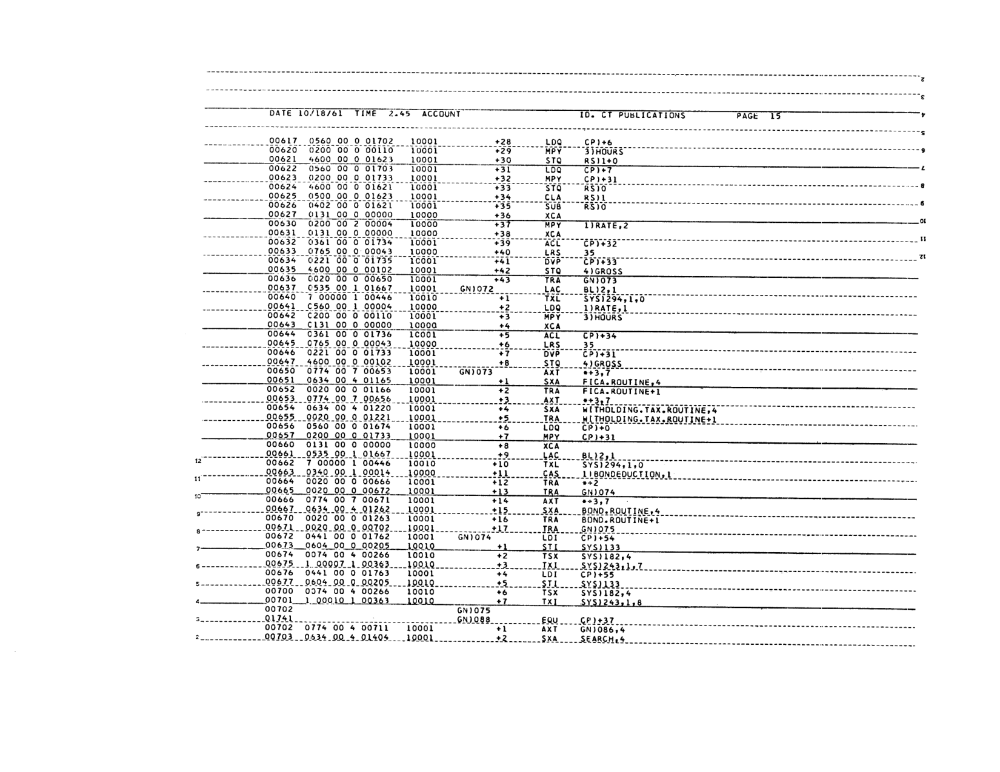
*Sample-program compilation listing — printer output page 15 of 16 (labels GN)072–GN)075) (PDF p.206).*

```
DATE 10/18/61   TIME 2.45   ACCOUNT                    ID. CT PUBLICATIONS      PAGE 15

00617      0560 00 0 01702   10001            +28     LDQ   CP)+6
00620      0200 00 0 00110   10001            +29     MPY   3)HOURS
00621      4600 00 0 01623   10001            +30     STQ   RS)1+0
00622      0560 00 0 01703   10001            +31     LDQ   CP)+7
00623      0200 00 0 01733   10001            +32     MPY   CP)+31
00624      4600 00 0 01621   10001            +33     STQ   RS)0
00625      0500 00 0 01623   10001            +34     CLA   RS)1
00626      0402 00 0 01621   10001            +35     SUB   RS)0
00627      0131 00 0 00000   10000            +36     XCA
00630      0200 00 2 00004   10000            +37     MPY   1)RATE,2
00631      0131 00 0 00000   10000            +38     XCA
00632      0361 00 0 01734   10001            +39     ACL   CP)+32
00633      0765 00 0 00043   10000            +40     LRS   35
00634      0221 00 0 01735   10001            +41     DVP   CP)+33
00635      4600 00 0 00102   10001            +42     STQ   4)GROSS
00636      0020 00 0 00650   10001            +43     TRA   GN)073
00637      0535 00 1 01667   10001    GN)072          LAC   BL)2,1
00640      7 00000 1 00446   10010            +1      TXL   SYS)294,1,0
00641      0560 00 1 00004   10000            +2      LDQ   1)RATE,1
00642      0200 00 0 00110   10001            +3      MPY   3)HOURS
00643      0131 00 0 00000   10000            +4      XCA
00644      0361 00 0 01736   10001            +5      ACL   CP)+34
00645      0765 00 0 00043   10000            +6      LRS   35
00646      0221 00 0 01733   10001            +7      DVP   CP)+31
00647      4600 00 0 00102   10001            +8      STQ   4)GROSS
00650      0774 00 7 00653   10001    GN)073          AXT   *+3,7
00651      0634 00 4 01165   10001            +1      SXA   FICA.ROUTINE,4
00652      0020 00 0 01166   10001            +2      TRA   FICA.ROUTINE+1
00653      0774 00 7 00656   10001            +3      AXT   *+3,7
00654      0634 00 4 01220   10001            +4      SXA   WITHOLDING.TAX.ROUTINE,4
00655      0020 00 0 01221   10001            +5      TRA   WITHOLDING.TAX.ROUTINE+1
00656      0560 00 0 01674   10001            +6      LDQ   CP)+0
00657      0200 00 0 01733   10001            +7      MPY   CP)+31
00660      0131 00 0 00000   10000            +8      XCA
00661      0535 00 1 01667   10001            +9      LAC   BL)2,1
00662      7 00000 1 00446   10010            +10     TXL   SYS)294,1,0
00663      0340 00 1 00014   10000            +11     CAS   1)BONDEDUCTION,1
00664      0020 00 0 00666   10001            +12     TRA   *+2
00665      0020 00 0 00672   10001            +13     TRA   GN)074
00666      0774 00 7 00671   10001            +14     AXT   *+3,7
00667      0634 00 4 01262   10001            +15     SXA   BOND.ROUTINE,4
00670      0020 00 0 01263   10001            +16     TRA   BOND.ROUTINE+1
00671      0020 00 0 00702   10001            +17     TRA   GN)075
00672      0441 00 0 01762   10001    GN)074          LDI   CP)+54
00673      0604 00 0 00205   10010            +1      STI   SYS)133
00674      0074 00 4 00266   10010            +2      TSX   SYS)182,4
00675      1 00007 1 00363   10010            +3      TXI   SYS)243,1,7
00676      0441 00 0 01763   10001            +4      LDI   CP)+55
00677      0604 00 0 00205   10010            +5      STI   SYS)133
00700      0074 00 4 00266   10010            +6      TSX   SYS)182,4
00701      1 00010 1 00363   10010            +7      TXI   SYS)243,1,8
00702                                 GN)075
01741                                 GN)088          EQU   CP)+37
00702      0774 00 4 00711   10001            +1      AXT   GN)086,4
00703      0634 00 4 01404   10001            +2      SXA   SEARCH,4
```

Note — the entry "GN)088  EQU  CP)+37" is printed out of location-counter sequence (between the GN)075 label line and LOC 00702), directly beneath GN)075, as an equated symbol reference rather than a stored instruction; reproduced in the position printed.

<!-- 90.05 listing | PDF 207 -->
**[90.05 sample-program listing, PDF p.207]**

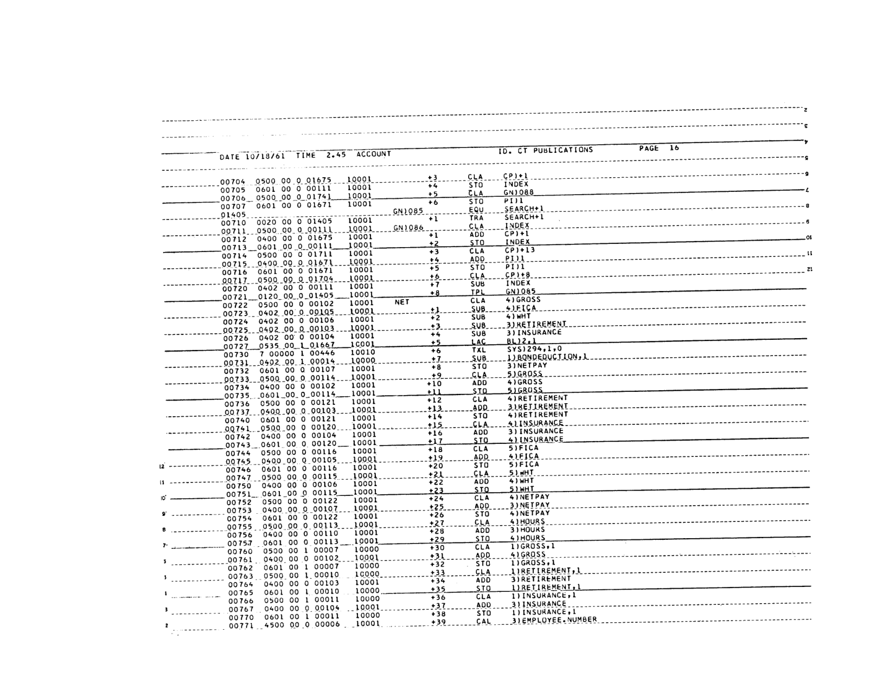
*Sample-program compilation listing — printer output page 16 of 16 (labels GN)085, GN)086, NET) (PDF p.207).*

```
DATE 10/18/61   TIME 2.45   ACCOUNT                    ID. CT PUBLICATIONS      PAGE 16

00704      0500 00 0 01675   10001            +3      CLA   CP)+1
00705      0601 00 0 00111   10001            +4      STO   INDEX
00706      0500 00 0 01741   10001            +5      CLA   GN)088
00707      0601 00 0 01671   10001            +6      STO   PI)1
01405                                 GN)085          EQU   SEARCH+1
00710      0020 00 0 01405   10001            +1      TRA   SEARCH+1
00711      0500 00 0 00111   10001    GN)086          CLA   INDEX
00712      0400 00 0 01675   10001            +1      ADD   CP)+1
00713      0601 00 0 00111   10001            +2      STO   INDEX
00714      0500 00 0 01711   10001            +3      CLA   CP)+13
00715      0400 00 0 01671   10001            +4      ADD   PI)1
00716      0601 00 0 01671   10001            +5      STO   PI)1
00717      0500 00 0 01704   10001            +6      CLA   CP)+8
00720      0402 00 0 00111   10001            +7      SUB   INDEX
00721      0120 00 0 01405   10001            +8      TPL   GN)085
00722      0500 00 0 00102   10001    NET             CLA   4)GROSS
00723      0402 00 0 00105   10001            +1      SUB   4)FICA
00724      0402 00 0 00106   10001            +2      SUB   4)WHT
00725      0402 00 0 00103   10001            +3      SUB   3)RETIREMENT
00726      0402 00 0 00104   10001            +4      SUB   3)INSURANCE
00727      0535 00 1 01667   10001            +5      LAC   BL)2,1
00730      7 00000 1 00446   10010            +6      TXL   SYS)294,1,0
00731      0402 00 1 00014   10000            +7      SUB   1)BONDEDUCTION,1
00732      0601 00 0 00107   10001            +8      STO   3)NETPAY
00733      0500 00 0 00114   10001            +9      CLA   5)GROSS
00734      0400 00 0 00102   10001            +10     ADD   4)GROSS
00735      0601 00 0 00114   10001            +11     STO   5)GROSS
00736      0500 00 0 00121   10001            +12     CLA   4)RETIREMENT
00737      0400 00 0 00103   10001            +13     ADD   3)RETIREMENT
00740      0601 00 0 00121   10001            +14     STO   4)RETIREMENT
00741      0500 00 0 00120   10001            +15     CLA   4)INSURANCE
00742      0400 00 0 00104   10001            +16     ADD   3)INSURANCE
00743      0601 00 0 00120   10001            +17     STO   4)INSURANCE
00744      0500 00 0 00116   10001            +18     CLA   5)FICA
00745      0400 00 0 00105   10001            +19     ADD   4)FICA
00746      0601 00 0 00116   10001            +20     STO   5)FICA
00747      0500 00 0 00115   10001            +21     CLA   5)WHT
00750      0400 00 0 00106   10001            +22     ADD   4)WHT
00751      0601 00 0 00115   10001            +23     STO   5)WHT
00752      0500 00 0 00122   10001            +24     CLA   4)NETPAY
00753      0400 00 0 00107   10001            +25     ADD   3)NETPAY
00754      0601 00 0 00122   10001            +26     STO   4)NETPAY
00755      0500 00 0 00113   10001            +27     CLA   4)HOURS
00756      0400 00 0 00110   10001            +28     ADD   3)HOURS
00757      0601 00 0 00113   10001            +29     STO   4)HOURS
00760      0500 00 1 00007   10000            +30     CLA   1)GROSS,1
00761      0400 00 0 00102   10001            +31     ADD   4)GROSS
00762      0601 00 1 00007   10000            +32     STO   1)GROSS,1
00763      0500 00 1 00010   10000            +33     CLA   1)RETIREMENT,1
00764      0400 00 0 00103   10001            +34     ADD   3)RETIREMENT
00765      0601 00 1 00010   10000            +35     STO   1)RETIREMENT,1
00766      0500 00 1 00011   10000            +36     CLA   1)INSURANCE,1
00767      0400 00 0 00104   10001            +37     ADD   3)INSURANCE
00770      0601 00 1 00011   10000            +38     STO   1)INSURANCE,1
00771      4500 00 0 00006   10001            +39     CAL   3)EMPLOYEE.NUMBER
```

<!-- conversion notes: pages 198-207 (PDF), continuing the 90.05 sample-program compilation listing (part 1 of this appendix precedes PDF p.198; part 3 continues after PDF p.207). All ten pages carry no top-of-page section code in jmap.json (null) since they are raw printer output; each is marked with the PDF-number form per the spec's convention for full-page listings, with the printout's own internal page number (7-16 of this listing) noted in the caption for orientation. No page in this range was blank.

Treatment: given the extreme density of the octal/symbolic storage-dump and symbolic-assembly listing (PDF pp.199-207, roughly 480 printed lines of near-continuous octal digit strings), each page image was cropped into top/bottom halves and re-rendered at 2x scale to verify legibility before transcription, and full line-by-line transcription was attempted (not merely image-only fallback) because the print, while faint in places, proved consistently legible under magnification. The page image is embedded above each transcription as the authoritative source.

Typographic notes:
- Throughout this listing the print chain renders what is almost certainly a period (`.`) as a right parenthesis `)` wherever a symbol-class prefix is joined to a name or number — e.g. SYS)133, GN)058, BL)2, CP)+16, IOC)8,4, RS)0, PI)1. This is reproduced literally as printed (SYS), GN), BL), CP), IOC), RS), PI)) rather than silently "corrected" to a period, since the source convention is unverified and consistent throughout.
- The font's "0" glyph prints with a small gap that can resemble "C" at low resolution (confirmed on PDF p.206, "0560"/"0200" misread as "C560"/"C200" before magnification); all such instances were re-verified against zoomed crops.
- PDF p.198, line 12 ("*SPEC 05 6"): the FILE number preceding this SPEC entry is *FILE 06, so a matching "*SPEC 06" would be expected, but both the page image (at 8x zoom) and the independent OCR draft agree the printed digits read "05" — transcribed exactly as printed; likely a keying anomaly in the original 1961 listing, not a transcription error.
- PDF p.202, LOC 00350 ("0020 60 0 00331 ... TRA* END.OF.MASTERS"): the tag-field value "60" (versus "00" on structurally similar TRA rows) and the asterisk suffix on the mnemonic were both verified against an 8x-zoomed crop and are reproduced as printed.
- PDF p.206, LOC 00702/01741: the line "GN)088 EQU CP)+37" prints out of location-counter order, positioned directly under the "GN)075" label line rather than at its own incrementing LOC; reproduced in the position printed (a listing convention for symbols defined by EQU rather than assigned storage).
- Overpunched/overbar digits: none observed in this page range.

No pages in this range required full image-only fallback; all ten were transcribed in full. -->

<!-- 90.05 listing | PDF 208 -->
**[90.05 sample-program listing, PDF p.208]**

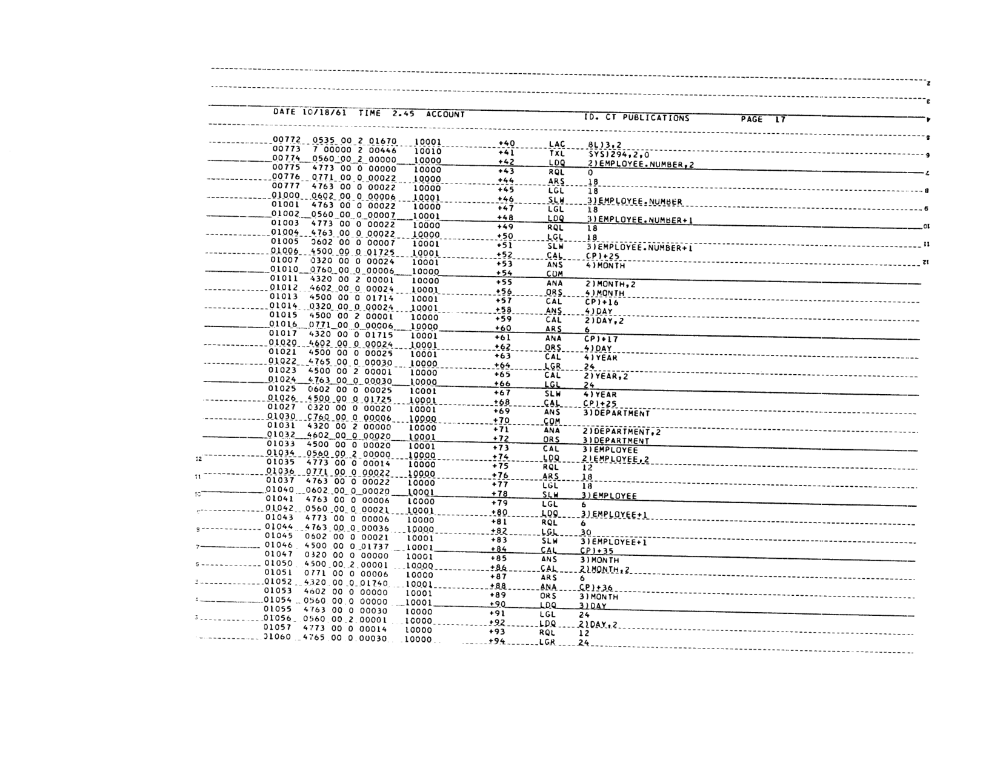
*Compiler listing page, Appendix 90.05 (PDF p.208).*
```
                                                              ID. CT PUBLICATIONS        PAGE  17
    DATE 10/18/61  TIME  2.45  ACCOUNT

    00772  0535 00 2 01670   10001        +40   LAC    BL)3,2
    00773  7 00000 2 00446   10010        +41   TXL    SYS)294,2,0
    00774  0560 00 2 00000   10000        +42   LDQ    2)EMPLOYEE.NUMBER,2
    00775  4773 00 0 00000   10000        +43   RQL    0
    00776  0771 00 0 00022   10000        +44   ARS    18
    00777  4763 00 0 00022   10000        +45   LGL    18
    01000  0602 00 0 00006   10001        +46   SLW    3)EMPLOYEE.NUMBER
    01001  4763 00 0 00022   10000        +47   LGL    18
    01002  0560 00 0 00007   10001        +48   LDQ    3)EMPLOYEE.NUMBER+1
    01003  4773 00 0 00022   10000        +49   RQL    18
    01004  4763 00 0 00022   10000        +50   LGL    18
    01005  0602 00 0 00007   10001        +51   SLW    3)EMPLOYEE.NUMBER+1
    01006  4500 00 0 01725   10001        +52   CAL    CP)+25
    01007  0320 00 0 00024   10001        +53   ANS    4)MONTH
    01010  0760 00 0 00006   10000        +54   COM
    01011  4320 00 2 00001   10000        +55   ANA    2)MONTH,2
    01012  4602 00 0 00024   10001        +56   ORS    4)MONTH
    01013  4500 00 0 01714   10001        +57   CAL    CP)+16
    01014  0320 00 0 00024   10001        +58   ANS    4)DAY
    01015  4500 00 2 00001   10000        +59   CAL    2)DAY,2
    01016  0771 00 0 00006   10000        +60   ARS    6
    01017  4320 00 0 01715   10001        +61   ANA    CP)+17
    01020  4602 00 0 00024   10001        +62   ORS    4)DAY
    01021  4500 00 0 00025   10001        +63   CAL    4)YEAR
    01022  4765 00 0 00030   10000        +64   LGR    24
    01023  4500 00 2 00001   10000        +65   CAL    2)YEAR,2
    01024  4763 00 0 00030   10000        +66   LGL    24
    01025  0602 00 0 00025   10001        +67   SLW    4)YEAR
    01026  4500 00 0 01725   10001        +68   CAL    CP)+25
    01027  0320 00 0 00020   10001        +69   ANS    3)DEPARTMENT
    01030  0760 00 0 00006   10000        +70   COM
    01031  4320 00 2 00000   10000        +71   ANA    2)DEPARTMENT,2
    01032  4602 00 0 00020   10001        +72   ORS    3)DEPARTMENT
    01033  4500 00 0 00020   10001        +73   CAL    3)EMPLOYEE
    01034  0560 00 2 00000   10000        +74   LDQ    2)EMPLOYEE,2
    01035  4773 00 0 00014   10000        +75   RQL    12
    01036  0771 00 0 00022   10000        +76   ARS    18
    01037  4763 00 0 00022   10000        +77   LGL    18
    01040  0602 00 0 00020   10001        +78   SLW    3)EMPLOYEE
    01041  4763 00 0 00006   10000        +79   LGL    6
    01042  0560 00 0 00021   10001        +80   LDQ    3)EMPLOYEE+1
    01043  4773 00 0 00006   10000        +81   RQL    6
    01044  4763 00 0 00036   10000        +82   LGL    30
    01045  0602 00 0 00021   10001        +83   SLW    3)EMPLOYEE+1
    01046  4500 00 0 01737   10001        +84   CAL    CP)+35
    01047  0320 00 0 00000   10001        +85   ANS    3)MONTH
    01050  4500 00 2 00001   10000        +86   CAL    2)MONTH,2
    01051  0771 00 0 00006   10000        +87   ARS    6
    01052  4320 00 0 01740   10001        +88   ANA    CP)+36
    01053  4602 00 0 00000   10001        +89   ORS    3)MONTH
    01054  0560 00 0 00000   10001        +90   LDQ    3)DAY
    01055  4763 00 0 00030   10000        +91   LGL    24
    01056  0560 00 2 00001   10000        +92   LDQ    2)DAY,2
    01057  4773 00 0 00014   10000        +93   RQL    12
    01060  4765 00 0 00030   10000        +94   LGR    24
```

<!-- 90.05 listing | PDF 209 -->
**[90.05 sample-program listing, PDF p.209]**

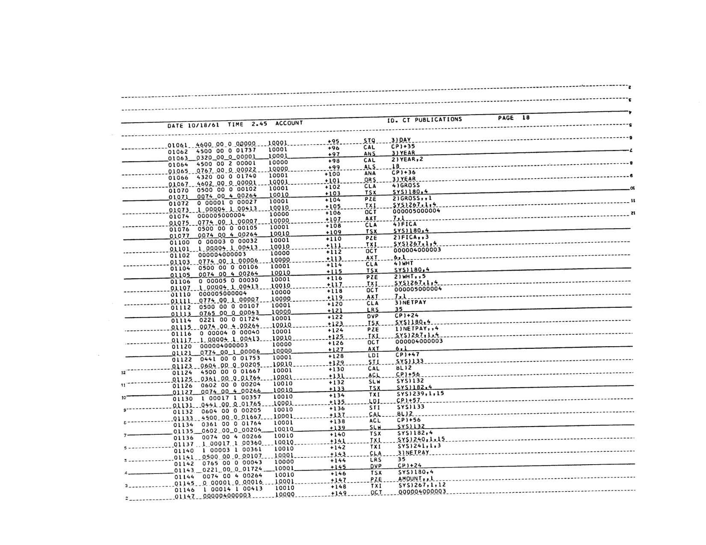
*Compiler listing page, Appendix 90.05 (PDF p.209).*
```
    DATE 10/18/61  TIME  2.45  ACCOUNT                          ID. CT PUBLICATIONS        PAGE  18

    01061  4600 00 0 00000   10001        +95   STQ    3)DAY
    01062  4500 00 0 01737   10001        +96   CAL    CP)+35
    01063  0320 00 0 00001   10001        +97   ANS    3)YEAR
    01064  4500 00 2 00001   10000        +98   CAL    2)YEAR,2
    01065  0767 00 0 00022   10000        +99   ALS    18
    01066  4320 00 0 01740   10001       +100   ANA    CP)+36
    01067  4602 00 0 00001   10001       +101   ORS    3)YEAR
    01070  0500 00 0 00102   10001       +102   CLA    4)GROSS
    01071  0074 00 4 00264   10010       +103   TSX    SYS)180,4
    01072  0 00001 0 00027   10001       +104   PZE    2)GROSS,,1
    01073  1 00004 1 00413   10010       +105   TXI    SYS)267,1,4
    01074  000005000004      10000       +106   OCT    000005000004
    01075  0774 00 1 00007   10000       +107   AXT    7,1
    01076  0500 00 0 00105   10001       +108   CLA    4)FICA
    01077  0074 00 4 00264   10010       +109   TSX    SYS)180,4
    01100  0 00003 0 00032   10001       +110   PZE    2)FICA,,3
    01101  1 00004 1 00413   10010       +111   TXI    SYS)267,1,4
    01102  000004000003      10000       +112   OCT    000004000003
    01103  0774 00 1 00006   10000       +113   AXT    6,1
    01104  0500 00 0 00106   10001       +114   CLA    4)WHT
    01105  0074 00 4 00264   10010       +115   TSX    SYS)180,4
    01106  0 00005 0 00030   10001       +116   PZE    2)WHT,,5
    01107  1 00004 1 00413   10010       +117   TXI    SYS)267,1,4
    01110  000005000004      10000       +118   OCT    000005000004
    01111  0774 00 1 00007   10000       +119   AXT    7,1
    01112  0500 00 0 00107   10001       +120   CLA    3)NETPAY
    01113  0765 00 0 00043   10000       +121   LRS    35
    01114  0221 00 0 01724   10001       +122   DVP    CP)+24
    01115  0074 00 4 00264   10010       +123   TSX    SYS)180,4
    01116  0 00004 0 00040   10001       +124   PZE    1)NETPAY,,4
    01117  1 00004 1 00413   10010       +125   TXI    SYS)267,1,4
    01120  000004000003      10000       +126   OCT    000004000003
    01121  0774 00 1 00006   10000       +127   AXT    6,1
    01122  0441 00 0 01753   10001       +128   LDI    CP)+47
    01123  0604 00 0 00205   10010       +129   STI    SYS)133
    01124  4500 00 0 01667   10001       +130   CAL    BL)2
    01125  0361 00 0 01764   10001       +131   ACL    CP)+56
    01126  0602 00 0 00204   10010       +132   SLW    SYS)132
    01127  0074 00 4 00266   10010       +133   TSX    SYS)182,4
    01130  1 00017 1 00357   10010       +134   TXI    SYS)239,1,15
    01131  0441 00 0 01765   10001       +135   LDI    CP)+57
    01132  0604 00 0 00205   10010       +136   STI    SYS)133
    01133  4500 00 0 01667   10001       +137   CAL    BL)2
    01134  0361 00 0 01764   10001       +138   ACL    CP)+56
    01135  0602 00 0 00204   10010       +139   SLW    SYS)132
    01136  0074 00 4 00266   10010       +140   TSX    SYS)182,4
    01137  1 00017 1 00360   10010       +141   TXI    SYS)240,1,15
    01140  1 00003 1 00361   10010       +142   TXI    SYS)241,1,3
    01141  0500 00 0 00107   10001       +143   CLA    3)NETPAY
    01142  0765 00 0 00043   10000       +144   LRS    35
    01143  0221 00 0 01724   10001       +145   DVP    CP)+24
    01144  0074 00 4 00264   10010       +146   TSX    SYS)180,4
    01145  0 00001 0 00016   10001       +147   PZE    AMOUNT,,1
    01146  1 00014 1 00413   10010       +148   TXI    SYS)267,1,12
    01147  000004000003      10000       +149   OCT    000004000003
```

<!-- 90.05 listing | PDF 210 -->
**[90.05 sample-program listing, PDF p.210]**

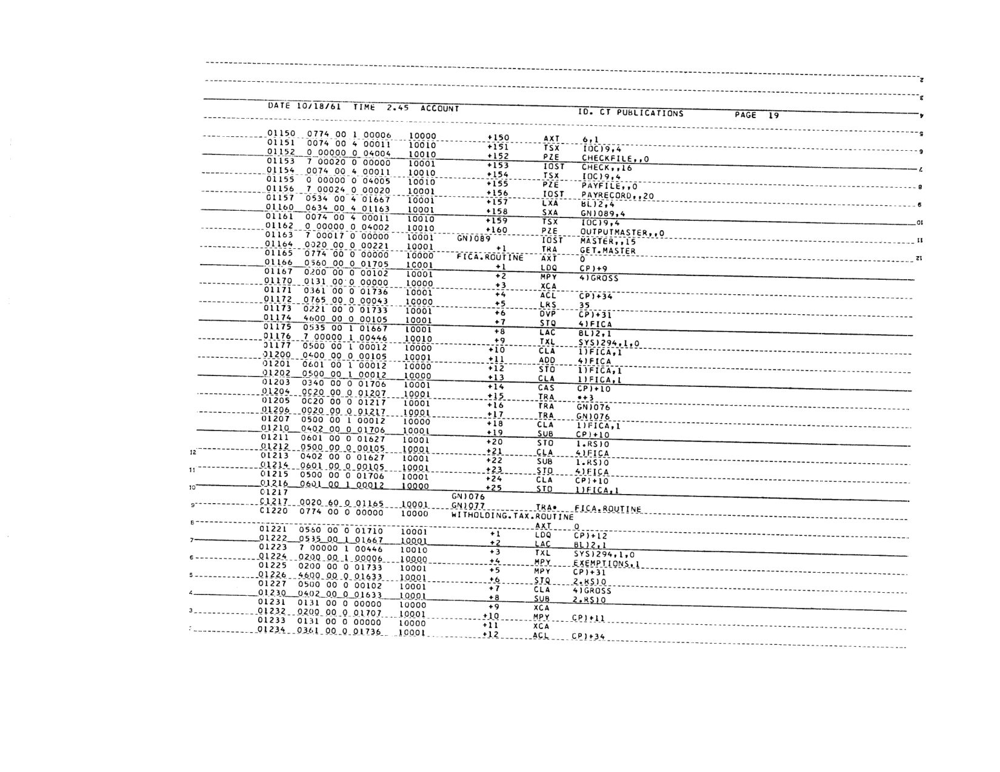
*Compiler listing page, Appendix 90.05 (PDF p.210).*
```
    DATE 10/18/61  TIME  2.45  ACCOUNT                          ID. CT PUBLICATIONS        PAGE  19

    01150  0774 00 1 00006   10000       +150   AXT    6,1
    01151  0074 00 4 00011   10010       +151   TSX    IOC)9,4
    01152  0 00000 0 04004   10010       +152   PZE    CHECKFILE,,0
    01153  7 00020 0 00000   10001       +153   IOST   CHECK,,16
    01154  0074 00 4 00011   10010       +154   TSX    IOC)9,4
    01155  0 00000 0 04005   10010       +155   PZE    PAYFILE,,0
    01156  7 00024 0 00020   10001       +156   IOST   PAYRECORD,,20
    01157  0534 00 4 01667   10001       +157   LXA    BL)2,4
    01160  0634 00 4 01163   10001       +158   SXA    GN)089,4
    01161  0074 00 4 00011   10010       +159   TSX    IOC)9,4
    01162  0 00000 0 04002   10010       +160   PZE    OUTPUTMASTER,,0
    01163  7 00017 0 00000   10001  GN)089       IOST   MASTER,,15
    01164  0020 00 0 00221   10001         +1   TRA    GET.MASTER
    01165  0774 00 0 00000   10000  FICA.ROUTINE  AXT   0
    01166  0560 00 0 01705   10001         +1   LDQ    CP)+9
    01167  0200 00 0 00102   10001         +2   MPY    4)GROSS
    01170  0131 00 0 00000   10000         +3   XCA
    01171  0361 00 0 01736   10001         +4   ACL    CP)+34
    01172  0765 00 0 00043   10000         +5   LRS    35
    01173  0221 00 0 01733   10001         +6   DVP    CP)+31
    01174  4600 00 0 00105   10001         +7   STQ    4)FICA
    01175  0535 00 1 01667   10001         +8   LAC    BL)2,1
    01176  7 00000 1 00446   10010         +9   TXL    SYS)294,1,0
    01177  0500 00 1 00012   10000        +10   CLA    1)FICA,1
    01200  0400 00 0 00105   10001        +11   ADD    4)FICA
    01201  0601 00 1 00012   10000        +12   STO    1)FICA,1
    01202  0500 00 1 00012   10000        +13   CLA    1)FICA,1
    01203  0340 00 0 01706   10001        +14   CAS    CP)+10
    01204  0020 00 0 01207   10001        +15   TRA    *+3
    01205  0020 00 0 01217   10001        +16   TRA    GN)076
    01206  0020 00 0 01217   10001        +17   TRA    GN)076
    01207  0500 00 1 00012   10000        +18   CLA    1)FICA,1
    01210  0402 00 0 01706   10001        +19   SUB    CP)+10
    01211  0601 00 0 01627   10001        +20   STO    1.RS)0
    01212  0500 00 0 00105   10001        +21   CLA    4)FICA
    01213  0402 00 0 01627   10001        +22   SUB    1.RS)0
    01214  0601 00 0 00105   10001        +23   STO    4)FICA
    01215  0500 00 0 01706   10001        +24   CLA    CP)+10
    01216  0601 00 1 00012   10000        +25   STO    1)FICA,1
    01217                                 GN)076
    01217  0020 60 0 01165   10001  GN)077       TRA*   FICA.ROUTINE
    01220  0774 00 0 00000   10000  WITHOLDING.TAX.ROUTINE   AXT   0
    01221  0560 00 0 01710   10001         +1   LDQ    CP)+12
    01222  0535 00 1 01667   10001         +2   LAC    BL)2,1
    01223  7 00000 1 00446   10010         +3   TXL    SYS)294,1,0
    01224  0200 00 1 00006   10000         +4   MPY    EXEMPTIONS,1
    01225  0200 00 0 01733   10001         +5   MPY    CP)+31
    01226  4600 00 0 01633   10001         +6   STQ    2.RS)0
    01227  0500 00 0 00102   10001         +7   CLA    4)GROSS
    01230  0402 00 0 01633   10001         +8   SUB    2.RS)0
    01231  0131 00 0 00000   10000         +9   XCA
    01232  0200 00 0 01707   10001        +10   MPY    CP)+11
    01233  0131 00 0 00000   10000        +11   XCA
    01234  0361 00 0 01736   10001        +12   ACL    CP)+34
```

<!-- 90.05 listing | PDF 211 -->
**[90.05 sample-program listing, PDF p.211]**

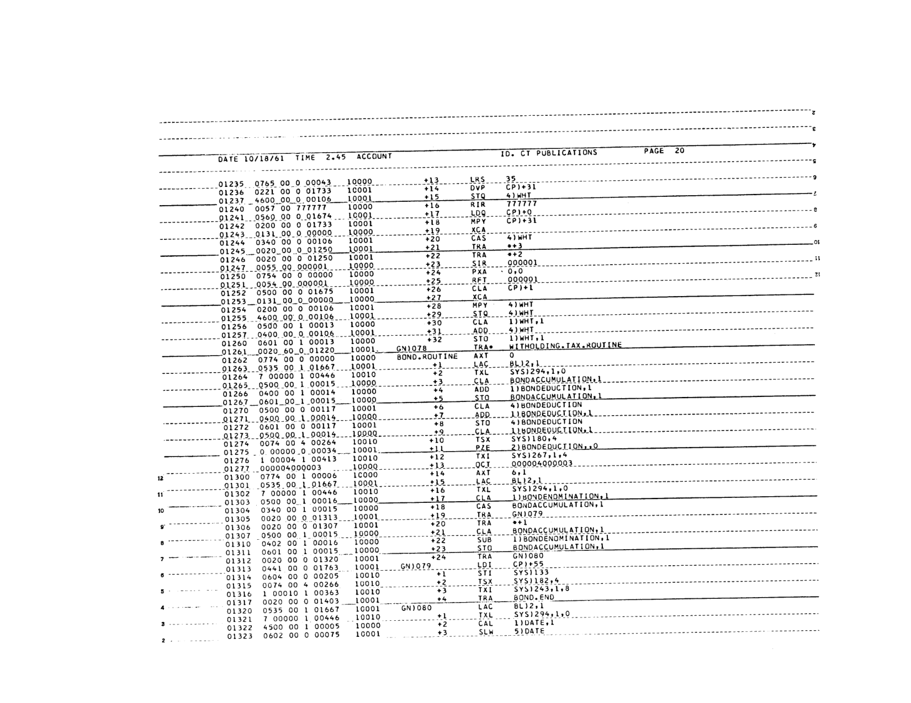
*Compiler listing page, Appendix 90.05 (PDF p.211).*
```
    DATE 10/18/61  TIME  2.45  ACCOUNT                          ID. CT PUBLICATIONS        PAGE  20

    01235  0765 00 0 00043   10000        +13   LRS    35
    01236  0221 00 0 01733   10001        +14   DVP    CP)+31
    01237  4600 00 0 00106   10001        +15   STQ    4)WHT
    01240  0057 00 777777    10000        +16   RIR    777777
    01241  0560 00 0 01674   10001        +17   LDQ    CP)+0
    01242  0200 00 0 01733   10001        +18   MPY    CP)+31
    01243  0131 00 0 00000   10000        +19   XCA
    01244  0340 00 0 00106   10001        +20   CAS    4)WHT
    01245  0020 00 0 01250   10001        +21   TRA    *+3
    01246  0020 00 0 01250   10001        +22   TRA    *+2
    01247  0055 00 000001    10000        +23   SIR    000001
    01250  0754 00 0 00000   10000        +24   PXA    0,0
    01251  0054 00 000001    10000        +25   RFT    000001
    01252  0500 00 0 01675   10001        +26   CLA    CP)+1
    01253  0131 00 0 00000   10000        +27   XCA
    01254  0200 00 0 00106   10001        +28   MPY    4)WHT
    01255  4600 00 0 00106   10001        +29   STQ    4)WHT
    01256  0500 00 1 00013   10000        +30   CLA    1)WHT,1
    01257  0400 00 0 00106   10001        +31   ADD    4)WHT
    01260  0601 00 1 00013   10000        +32   STO    1)WHT,1
    01261  0020 60 0 01220   10001  GN)078       TRA*   WITHOLDING.TAX.ROUTINE
    01262  0774 00 0 00000   10000  BOND.ROUTINE  AXT   0
    01263  0535 00 1 01667   10001         +1   LAC    BL)2,1
    01264  7 00000 1 00446   10010         +2   TXL    SYS)294,1,0
    01265  0500 00 1 00015   10000         +3   CLA    BONDACCUMULATION,1
    01266  0400 00 1 00014   10000         +4   ADD    1)BONDEDUCTION,1
    01267  0601 00 1 00015   10000         +5   STO    BONDACCUMULATION,1
    01270  0500 00 0 00117   10001         +6   CLA    4)BONDEDUCTION
    01271  0400 00 1 00014   10000         +7   ADD    1)BONDEDUCTION,1
    01272  0601 00 0 00117   10001         +8   STO    4)BONDEDUCTION
    01273  0500 00 1 00014   10000         +9   CLA    1)BONDEDUCTION,1
    01274  0074 00 4 00264   10010        +10   TSX    SYS)180,4
    01275  0 00000 0 00034   10001        +11   PZE    2)BONDEDUCTION,,0
    01276  1 00004 1 00413   10010        +12   TXI    SYS)267,1,4
    01277  000004000003      10000        +13   OCT    000004000003
    01300  0774 00 1 00006   10000        +14   AXT    6,1
    01301  0535 00 1 01667   10001        +15   LAC    BL)2,1
    01302  7 00000 1 00446   10010        +16   TXL    SYS)294,1,0
    01303  0500 00 1 00016   10000        +17   CLA    1)BONDENOMINATION,1
    01304  0340 00 1 00015   10000        +18   CAS    BONDACCUMULATION,1
    01305  0020 00 0 01313   10001        +19   TRA    GN)079
    01306  0020 00 0 01307   10001        +20   TRA    *+1
    01307  0500 00 1 00015   10000        +21   CLA    BONDACCUMULATION,1
    01310  0402 00 1 00016   10000        +22   SUB    1)BONDENOMINATION,1
    01311  0601 00 1 00015   10000        +23   STO    BONDACCUMULATION,1
    01312  0020 00 0 01320   10001        +24   TRA    GN)080
    01313  0441 00 0 01763   10001  GN)079       LDI    CP)+55
    01314  0604 00 0 00205   10010         +1   STI    SYS)133
    01315  0074 00 4 00266   10010         +2   TSX    SYS)182,4
    01316  1 00010 1 00363   10010         +3   TXI    SYS)243,1,8
    01317  0020 00 0 01403   10001         +4   TRA    BOND.END
    01320  0535 00 1 01667   10001  GN)080       LAC    BL)2,1
    01321  7 00000 1 00446   10010         +1   TXL    SYS)294,1,0
    01322  4500 00 1 00005   10000         +2   CAL    1)DATE,1
    01323  0602 00 0 00075   10001         +3   SLW    5)DATE
```

<!-- 90.05 listing | PDF 212 -->
**[90.05 sample-program listing, PDF p.212]**

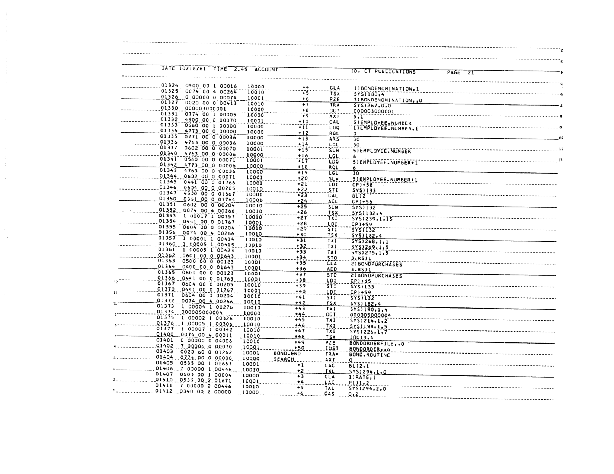
*Compiler listing page, Appendix 90.05 (PDF p.212).*
```
    DATE 10/18/61  TIME  2.45  ACCOUNT                          ID. CT PUBLICATIONS        PAGE  21

    01324  0500 00 1 00016   10000         +4   CLA    1)BONDENOMINATION,1
    01325  0074 00 4 00264   10010         +5   TSX    SYS)180,4
    01326  0 00000 0 00074   10001         +6   PZE    3)BONDENOMINATION,,0
    01327  0020 00 0 00413   10010         +7   TRA    SYS)267,0,0
    01330  000003000001      10000         +8   OCT    000003000001
    01331  0774 00 1 00005   10000         +9   AXT    5,1
    01332  4500 00 0 00070   10001        +10   CAL    5)EMPLOYEE.NUMBER
    01333  0560 00 1 00000   10000        +11   LDQ    1)EMPLOYEE.NUMBER,1
    01334  4773 00 0 00000   10000        +12   RQL    0
    01335  0771 00 0 00036   10000        +13   ARS    30
    01336  4763 00 0 00036   10000        +14   LGL    30
    01337  0602 00 0 00070   10001        +15   SLW    5)EMPLOYEE.NUMBER
    01340  4763 00 0 00006   10000        +16   LGL    6
    01341  0560 00 0 00071   10001        +17   LDQ    5)EMPLOYEE.NUMBER+1
    01342  4773 00 0 00006   10000        +18   RQL    6
    01343  4763 00 0 00036   10000        +19   LGL    30
    01344  0602 00 0 00071   10001        +20   SLW    5)EMPLOYEE.NUMBER+1
    01345  0441 00 0 01766   10001        +21   LDI    CP)+58
    01346  0604 00 0 00205   10010        +22   STI    SYS)133
    01347  4500 00 0 01667   10001        +23   CAL    BL)2
    01350  0361 00 0 01764   10001        +24   ACL    CP)+56
    01351  0602 00 0 00204   10010        +25   SLW    SYS)132
    01352  0074 00 4 00266   10010        +26   TSX    SYS)182,4
    01353  1 00017 1 00357   10010        +27   TXI    SYS)239,1,15
    01354  0441 00 0 01767   10001        +28   LDI    CP)+59
    01355  0604 00 0 00204   10010        +29   STI    SYS)132
    01356  0074 00 4 00266   10010        +30   TSX    SYS)182,4
    01357  1 00001 1 00414   10010        +31   TXI    SYS)268,1,1
    01360  1 00005 1 00415   10010        +32   TXI    SYS)269,1,5
    01361  1 00005 1 00423   10010        +33   TXI    SYS)275,1,5
    01362  0601 00 0 01643   10001        +34   STO    3.RS)1
    01363  0500 00 0 00123   10001        +35   CLA    2)BONDPURCHASES
    01364  0400 00 0 01643   10001        +36   ADD    3.RS)1
    01365  0601 00 0 00123   10001        +37   STO    2)BONDPURCHASES
    01366  0441 00 0 01763   10001        +38   LDI    CP)+55
    01367  0604 00 0 00205   10010        +39   STI    SYS)133
    01370  0441 00 0 01767   10001        +40   LDI    CP)+59
    01371  0604 00 0 00204   10010        +41   STI    SYS)132
    01372  0074 00 4 00266   10010        +42   TSX    SYS)182,4
    01373  1 00004 1 00276   10010        +43   TXI    SYS)190,1,4
    01374  000005000004      10000        +44   OCT    000005000004
    01375  1 00002 1 00326   10010        +45   TXI    SYS)214,1,2
    01376  1 00005 1 00306   10010        +46   TXI    SYS)198,1,5
    01377  1 00007 1 00342   10010        +47   TXI    SYS)226,1,7
    01400  0074 00 4 00011   10010        +48   TSX    IOC)9,4
    01401  0 00000 0 04006   10010        +49   PZE    BONDORDERFILE,,0
    01402  7 00006 0 00070   10001        +50   IOST   BONDORDER,,6
    01403  0020 60 0 01262   10001  BOND.END     TRA*   BOND.ROUTINE
    01404  0774 00 0 00000   10000  SEARCH        AXT   0
    01405  0535 00 1 01667   10001         +1   LAC    BL)2,1
    01406  7 00000 1 00446   10010         +2   TXL    SYS)294,1,0
    01407  0500 00 1 00004   10000         +3   CLA    1)RATE,1
    01410  0535 00 2 01671   10001         +4   LAC    PI)1,2
    01411  7 00000 2 00446   10010         +5   TXL    SYS)294,2,0
    01412  0340 00 2 00000   10000         +6   CAS    0,2
```

<!-- 90.05 listing | PDF 213 -->
**[90.05 sample-program listing, PDF p.213]**

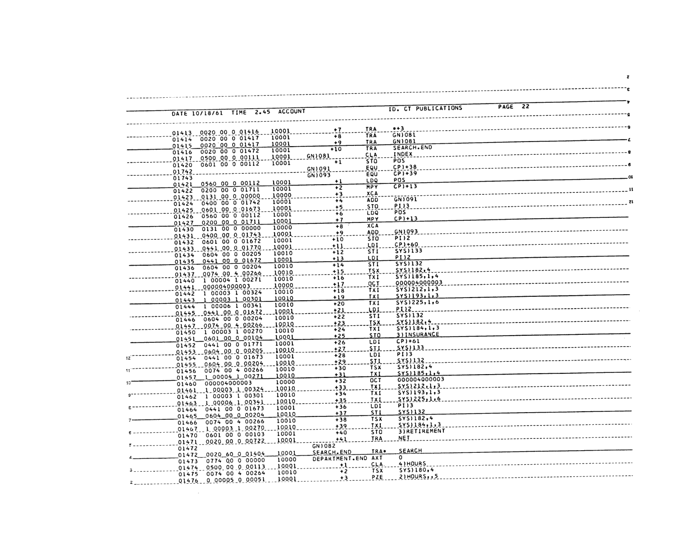
*Compiler listing page, Appendix 90.05 (PDF p.213).*
```
    DATE 10/18/61  TIME  2.45  ACCOUNT                          ID. CT PUBLICATIONS        PAGE  22

    01413  0020 00 0 01416   10001         +7   TRA    *+3
    01414  0020 00 0 01417   10001         +8   TRA    GN)081
    01415  0020 00 0 01417   10001         +9   TRA    GN)081
    01416  0020 00 0 01472   10001        +10   TRA    SEARCH.END
    01417  0500 00 0 00111   10001  GN)081       CLA    INDEX
    01420  0601 00 0 00112   10001         +1   STO    POS
    01742                                 GN)091       EQU    CP)+38
    01743                                 GN)093       EQU    CP)+39
    01421  0560 00 0 00112   10001         +1   LDQ    POS
    01422  0200 00 0 01711   10001         +2   MPY    CP)+13
    01423  0131 00 0 00000   10000         +3   XCA
    01424  0400 00 0 01742   10001         +4   ADD    GN)091
    01425  0601 00 0 01673   10001         +5   STO    PI)3
    01426  0560 00 0 00112   10001         +6   LDQ    POS
    01427  0200 00 0 01711   10001         +7   MPY    CP)+13
    01430  0131 00 0 00000   10000         +8   XCA
    01431  0400 00 0 01743   10001         +9   ADD    GN)093
    01432  0601 00 0 01672   10001        +10   STO    PI)2
    01433  0441 00 0 01770   10001        +11   LDI    CP)+60
    01434  0604 00 0 00205   10010        +12   STI    SYS)133
    01435  0441 00 0 01672   10001        +13   LDI    PI)2
    01436  0604 00 0 00204   10010        +14   STI    SYS)132
    01437  0074 00 4 00266   10010        +15   TSX    SYS)182,4
    01440  1 00004 1 00271   10010        +16   TXI    SYS)185,1,4
    01441  000004000003      10000        +17   OCT    000004000003
    01442  1 00003 1 00324   10010        +18   TXI    SYS)212,1,3
    01443  1 00003 1 00301   10010        +19   TXI    SYS)193,1,3
    01444  1 00006 1 00341   10010        +20   TXI    SYS)225,1,6
    01445  0441 00 0 01672   10001        +21   LDI    PI)2
    01446  0604 00 0 00204   10010        +22   STI    SYS)132
    01447  0074 00 4 00266   10010        +23   TSX    SYS)182,4
    01450  1 00003 1 00270   10010        +24   TXI    SYS)184,1,3
    01451  0601 00 0 00104   10001        +25   STO    3)INSURANCE
    01452  0441 00 0 01771   10001        +26   LDI    CP)+61
    01453  0604 00 0 00205   10010        +27   STI    SYS)133
    01454  0441 00 0 01673   10001        +28   LDI    PI)3
    01455  0604 00 0 00204   10010        +29   STI    SYS)132
    01456  0074 00 4 00266   10010        +30   TSX    SYS)182,4
    01457  1 00004 1 00271   10010        +31   TXI    SYS)185,1,4
    01460  000004000003      10000        +32   OCT    000004000003
    01461  1 00003 1 00324   10010        +33   TXI    SYS)212,1,3
    01462  1 00003 1 00301   10010        +34   TXI    SYS)193,1,3
    01463  1 00006 1 00341   10010        +35   TXI    SYS)225,1,6
    01464  0441 00 0 01673   10001        +36   LDI    PI)3
    01465  0604 00 0 00204   10010        +37   STI    SYS)132
    01466  0074 00 4 00266   10010        +38   TSX    SYS)182,4
    01467  1 00003 1 00270   10010        +39   TXI    SYS)184,1,3
    01470  0601 00 0 00103   10001        +40   STO    3)RETIREMENT
    01471  0020 00 0 00722   10001        +41   TRA    NET
    01472                                 GN)082
    01472  0020 60 0 01404   10001  SEARCH.END    TRA*   SEARCH
    01473  0774 00 0 00000   10000  DEPARTMENT.END  AXT  0
    01474  0500 00 0 00113   10001         +1   CLA    4)HOURS
    01475  0074 00 4 00264   10010         +2   TSX    SYS)180,4
    01476  0 00005 0 00051   10001         +3   PZE    2)HOURS,,5
```

<!-- 90.05 listing | PDF 214 -->
**[90.05 sample-program listing, PDF p.214]**

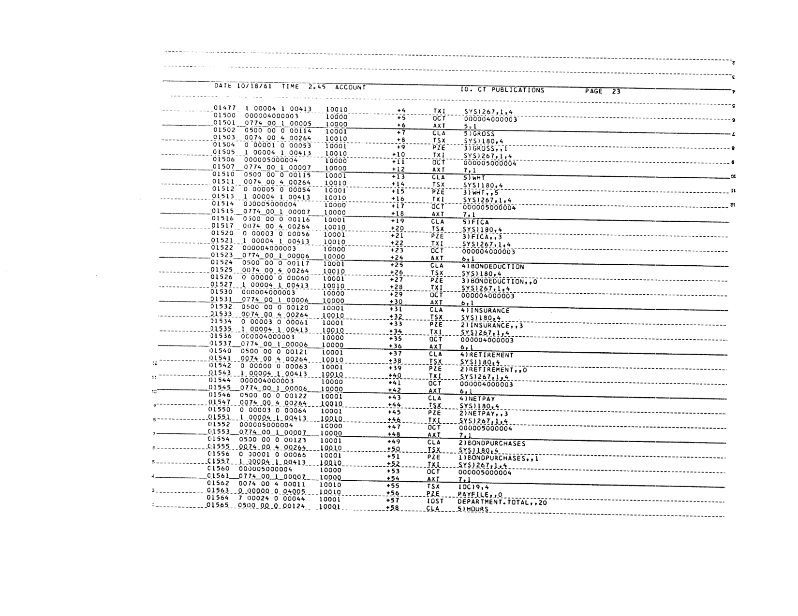
*Compiler listing page, Appendix 90.05 (PDF p.214).*
```
    DATE 10/18/61  TIME  2.45  ACCOUNT                          ID. CT PUBLICATIONS        PAGE  23

    01477  1 00004 1 00413   10010         +4   TXI    SYS)267,1,4
    01500  000004000003      10000         +5   OCT    000004000003
    01501  0774 00 1 00005   10000         +6   AXT    5,1
    01502  0500 00 0 00114   10001         +7   CLA    5)GROSS
    01503  0074 00 4 00264   10010         +8   TSX    SYS)180,4
    01504  0 00001 0 00053   10001         +9   PZE    3)GROSS,,1
    01505  1 00004 1 00413   10010        +10   TXI    SYS)267,1,4
    01506  000005000004      10000        +11   OCT    000005000004
    01507  0774 00 1 00007   10000        +12   AXT    7,1
    01510  0500 00 0 00115   10001        +13   CLA    5)WHT
    01511  0074 00 4 00264   10010        +14   TSX    SYS)180,4
    01512  0 00005 0 00054   10001        +15   PZE    3)WHT,,5
    01513  1 00004 1 00413   10010        +16   TXI    SYS)267,1,4
    01514  000005000004      10000        +17   OCT    000005000004
    01515  0774 00 1 00007   10000        +18   AXT    7,1
    01516  0500 00 0 00116   10001        +19   CLA    5)FICA
    01517  0074 00 4 00264   10010        +20   TSX    SYS)180,4
    01520  0 00003 0 00056   10001        +21   PZE    3)FICA,,3
    01521  1 00004 1 00413   10010        +22   TXI    SYS)267,1,4
    01522  000004000003      10000        +23   OCT    000004000003
    01523  0774 00 1 00006   10000        +24   AXT    6,1
    01524  0500 00 0 00117   10001        +25   CLA    4)BONDEDUCTION
    01525  0074 00 4 00264   10010        +26   TSX    SYS)180,4
    01526  0 00000 0 00060   10001        +27   PZE    3)BONDEDUCTION,,0
    01527  1 00004 1 00413   10010        +28   TXI    SYS)267,1,4
    01530  000004000003      10000        +29   OCT    000004000003
    01531  0774 00 1 00006   10000        +30   AXT    6,1
    01532  0500 00 0 00120   10001        +31   CLA    4)INSURANCE
    01533  0074 00 4 00264   10010        +32   TSX    SYS)180,4
    01534  0 00003 0 00061   10001        +33   PZE    2)INSURANCE,,3
    01535  1 00004 1 00413   10010        +34   TXI    SYS)267,1,4
    01536  000004000003      10000        +35   OCT    000004000003
    01537  0774 00 1 00006   10000        +36   AXT    6,1
    01540  0500 00 0 00121   10001        +37   CLA    4)RETIREMENT
    01541  0074 00 4 00264   10010        +38   TSX    SYS)180,4
    01542  0 00000 0 00063   10001        +39   PZE    2)RETIREMENT,,0
    01543  1 00004 1 00413   10010        +40   TXI    SYS)267,1,4
    01544  000004000003      10000        +41   OCT    000004000003
    01545  0774 00 1 00006   10000        +42   AXT    6,1
    01546  0500 00 0 00122   10001        +43   CLA    4)NETPAY
    01547  0074 00 4 00264   10010        +44   TSX    SYS)180,4
    01550  0 00003 0 00064   10001        +45   PZE    2)NETPAY,,3
    01551  1 00004 1 00413   10010        +46   TXI    SYS)267,1,4
    01552  000005000004      10000        +47   OCT    000005000004
    01553  0774 00 1 00007   10000        +48   AXT    7,1
    01554  0500 00 0 00123   10001        +49   CLA    2)BONDPURCHASES
    01555  0074 00 4 00264   10010        +50   TSX    SYS)180,4
    01556  0 00001 0 00066   10001        +51   PZE    1)BONDPURCHASES,,1
    01557  1 00004 1 00413   10010        +52   TXI    SYS)267,1,4
    01560  000005000004      10000        +53   OCT    000005000004
    01561  0774 00 1 00007   10000        +54   AXT    7,1
    01562  0074 00 4 00011   10010        +55   TSX    IOC)9,4
    01563  0 00000 0 04005   10010        +56   PZE    PAYFILE,,0
    01564  7 00024 0 00044   10001        +57   IOST   DEPARTMENT.TOTAL,,20
    01565  0500 00 0 00124   10001        +58   CLA    5)HOURS
```

<!-- 90.05 listing | PDF 215 -->
**[90.05 sample-program listing, PDF p.215]**

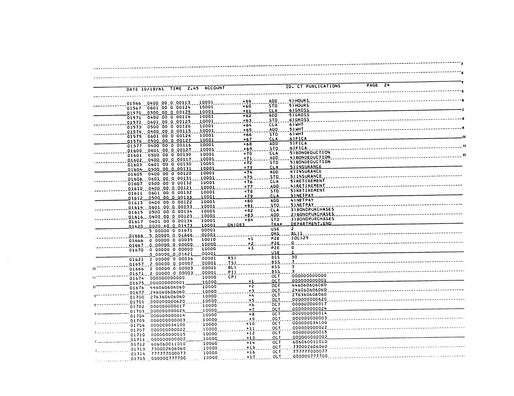
*Compiler listing page, Appendix 90.05 (PDF p.215).*
```
    DATE 10/18/61  TIME  2.45  ACCOUNT                          ID. CT PUBLICATIONS        PAGE  24

    01566  0400 00 0 00113   10001        +59   ADD    4)HOURS
    01567  0601 00 0 00124   10001        +60   STO    5)HOURS
    01570  0500 00 0 00125   10001        +61   CLA    6)GROSS
    01571  0400 00 0 00114   10001        +62   ADD    5)GROSS
    01572  0601 00 0 00125   10001        +63   STO    6)GROSS
    01573  0500 00 0 00126   10001        +64   CLA    6)WHT
    01574  0400 00 0 00115   10001        +65   ADD    5)WHT
    01575  0601 00 0 00126   10001        +66   STO    6)WHT
    01576  0500 00 0 00127   10001        +67   CLA    6)FICA
    01577  0400 00 0 00116   10001        +68   ADD    5)FICA
    01600  0601 00 0 00127   10001        +69   STO    6)FICA
    01601  0500 00 0 00130   10001        +70   CLA    5)BONDEDUCTION
    01602  0400 00 0 00117   10001        +71   ADD    4)BONDEDUCTION
    01603  0601 00 0 00130   10001        +72   STO    5)BONDEDUCTION
    01604  0500 00 0 00131   10001        +73   CLA    5)INSURANCE
    01605  0400 00 0 00120   10001        +74   ADD    4)INSURANCE
    01606  0601 00 0 00131   10001        +75   STO    5)INSURANCE
    01607  0500 00 0 00132   10001        +76   CLA    5)RETIREMENT
    01610  0400 00 0 00121   10001        +77   ADD    4)RETIREMENT
    01611  0601 00 0 00132   10001        +78   STO    5)RETIREMENT
    01612  0500 00 0 00133   10001        +79   CLA    4)NETPAY
    01613  0400 00 0 00122   10001        +80   ADD    4)NETPAY
    01614  0601 00 0 00133   10001        +81   STO    5)NETPAY
    01615  0500 00 0 00134   10001        +82   CLA    3)BONDPURCHASES
    01616  0400 00 0 00123   10001        +83   ADD    2)BONDPURCHASES
    01617  0601 00 0 00134   10001        +84   STO    3)BONDPURCHASES
    01620  0020 60 0 01473   10001  GN)083        TRA*   DEPARTMENT.END
           5 00000 0 01671   00001                USE    2
    01666  5 00000 0 01666   00001                ORG    BL)1
    01666  0 00000 0 00035   10010         +1   PZE    IOC)29
    01667  0 00000 0 00000   10000         +2   PZE    0
    01670  0 00000 0 00000   10000         +3   PZE    0
           5 00000 0 01621   00001                USE    1
    01621  2 00000 0 00036   00001  RS)           BSS    30
    01657  2 00000 0 00007   00001  TS)           BSS    7
    01666  2 00000 0 00003   00001  BL)           BSS    3
    01671  2 00000 0 00003   00001  PI)           BSS    3
    01674  000000000000      10000  CP)           OCT    000000000000
    01675  000000000001      10000         +1   OCT    000000000001
    01676  446060606060      10000         +2   OCT    446060606060
    01677  246060606060      10000         +3   OCT    246060606060
    01700  276360606060      10000         +4   OCT    276360606060
    01701  000000000620      10000         +5   OCT    000000000620
    01702  000000000017      10000         +6   OCT    000000000017
    01703  000000000024      10000         +7   OCT    000000000024
    01704  000000000014      10000         +8   OCT    000000000014
    01705  000000000003      10000         +9   OCT    000000000003
    01706  000000034100      10000        +10   OCT    000000034100
    01707  000000000022      10000        +11   OCT    000000000022
    01710  000000000015      10000        +12   OCT    000000000015
    01711  000000000002      10000        +13   OCT    000000000002
    01712  606060011010      10000        +14   OCT    606060011010
    01713  730002606060      10000        +15   OCT    730002606060
    01714  777777000077      10000        +16   OCT    777777000077
    01715  000000777700      10000        +17   OCT    000000777700
```

<!-- 90.05 listing | PDF 216 -->
**[90.05 sample-program listing, PDF p.216]**

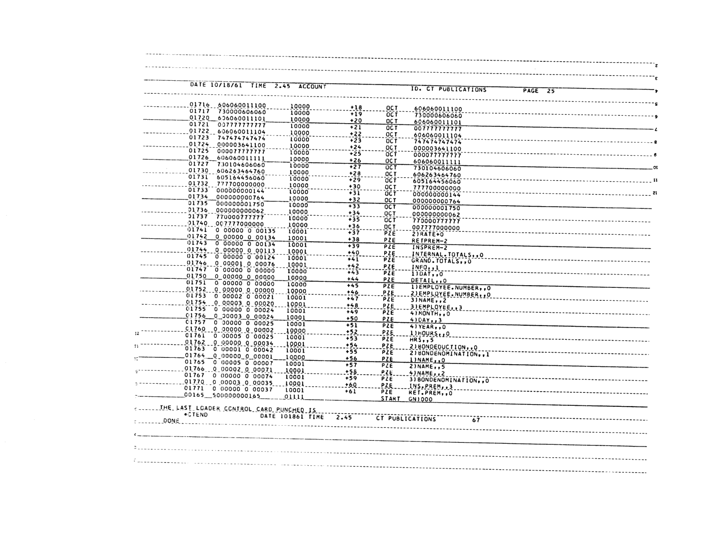
*Compiler listing page, Appendix 90.05 (PDF p.216).*
```
    DATE 10/18/61  TIME  2.45  ACCOUNT                          ID. CT PUBLICATIONS        PAGE  25

    01716  606060011100      10000        +18   OCT    606060011100
    01717  730000606060      10000        +19   OCT    730000606060
    01720  606060011101      10000        +20   OCT    606060011101
    01721  007777777777      10000        +21   OCT    007777777777
    01722  606060011104      10000        +22   OCT    606060011104
    01723  747474747474      10000        +23   OCT    747474747474
    01724  000003641100      10000        +24   OCT    000003641100
    01725  000077777777      10000        +25   OCT    000077777777
    01726  606060011111      10000        +26   OCT    606060011111
    01727  730104606060      10000        +27   OCT    730104606060
    01730  606263464760      10000        +28   OCT    606263464760
    01731  605164456060      10000        +29   OCT    605164456060
    01732  777700000000      10000        +30   OCT    777700000000
    01733  000000000144      10000        +31   OCT    000000000144
    01734  000000000764      10000        +32   OCT    000000000764
    01735  000000001750      10000        +33   OCT    000000001750
    01736  000000000062      10000        +34   OCT    000000000062
    01737  770000777777      10000        +35   OCT    770000777777
    01740  007777000000      10000        +36   OCT    007777000000
    01741  0 00000 0 00135   10001        +37   PZE    2)RATE+0
    01742  0 00000 0 00134   10001        +38   PZE    RETPREM-2
    01743  0 00000 0 00134   10001        +39   PZE    INSPREM-2
    01744  0 00000 0 00113   10001        +40   PZE    INTERNAL.TOTALS,,0
    01745  0 00000 0 00124   10001        +41   PZE    GRAND.TOTALS,,0
    01746  0 00001 0 00076   10001        +42   PZE    INFO,,1
    01747  0 00000 0 00000   10000        +43   PZE    1)DAT,,0
    01750  0 00000 0 00000   10000        +44   PZE    DETAIL,,0
    01751  0 00000 0 00000   10000        +45   PZE    1)EMPLOYEE.NUMBER,,0
    01752  0 00000 0 00000   10000        +46   PZE    2)EMPLOYEE.NUMBER,,0
    01753  0 00002 0 00021   10001        +47   PZE    3)NAME,,2
    01754  0 00003 0 00020   10001        +48   PZE    3)EMPLOYEE,,3
    01755  0 00000 0 00024   10001        +49   PZE    4)MONTH,,0
    01756  0 00003 0 00024   10001        +50   PZE    4)DAY,,3
    01757  0 00000 0 00025   10001        +51   PZE    4)YEAR,,0
    01760  0 00000 0 00002   10000        +52   PZE    1)HOURS,,0
    01761  0 00005 0 00025   10001        +53   PZE    HRS,,5
    01762  0 00000 0 00034   10001        +54   PZE    2)BONDEDUCTION,,0
    01763  0 00001 0 00042   10001        +55   PZE    2)BONDENOMINATION,,1
    01764  0 00000 0 00001   10000        +56   PZE    1)NAME,,0
    01765  0 00005 0 00007   10001        +57   PZE    2)NAME,,5
    01766  0 00002 0 00071   10001        +58   PZE    4)NAME,,2
    01767  0 00000 0 00074   10001        +59   PZE    3)BONDENOMINATION,,0
    01770  0 00003 0 00035   10001        +60   PZE    INS.PREM,,3
    01771  0 00000 0 00037   10001        +61   PZE    RET.PREM,,0
    00165   500000000165     01111               START  GN)000

    THE LAST LOADER CONTROL CARD PUNCHED IS
    *CTEND                DATE 10/18/61  TIME 2.45   CT PUBLICATIONS   67
    DONE
```

<!-- 90.05 report output | PDF 217 -->
**[90.05 sample-program listing, PDF p.217]**

#### REPORT OUTPUT FOR SAMPLE PROBLEM

The illustrative run of the sample program (source listed on the preceding pages) produced the following output. Column headings were not printed by the sample program; figures are reproduced exactly as printed, including the printer's practice of carrying the last few amount fields of a detail or totals line on the print position immediately above the identifying line.

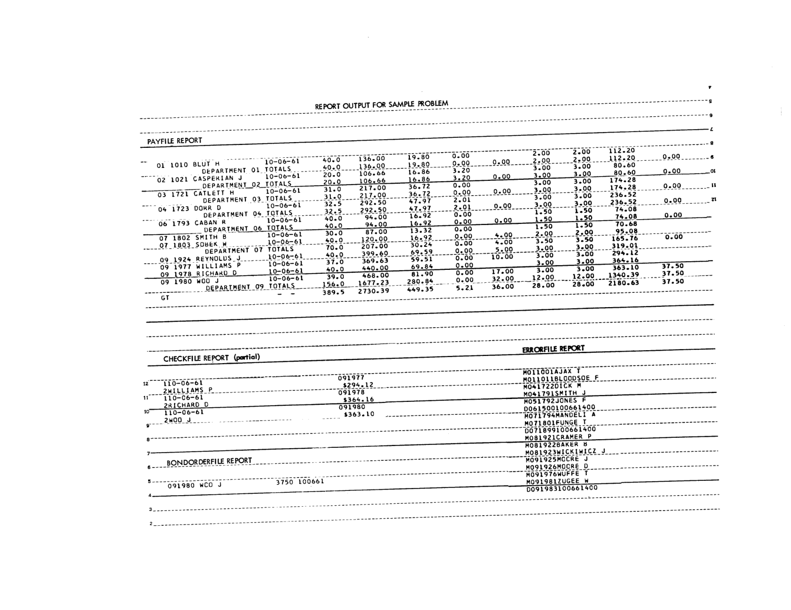
*Report output for sample problem (page 217).*

```
PAYFILE REPORT

                                                              2.00    2.00    112.20
01 1010 BLUT H          10-06-61   40.0    136.00   19.80   0.00           2.00    2.00    112.20    0.00
         DEPARTMENT 01 TOTALS      40.0    136.00   19.80   0.00   0.00    3.00    3.00     80.60
02 1021 CASPERIAN J     10-06-61   20.0    106.66   16.86   3.20           3.00    3.00     80.60    0.00
         DEPARTMENT 02 TOTALS      20.0    106.66   16.86   3.20   0.00    3.00    3.00    174.28
03 1721 CATLETT H       10-06-61   31.0    217.00   36.72   0.00           3.00    3.00    174.28    0.00
         DEPARTMENT 03 TOTALS      31.0    217.00   36.72   0.00   0.00    3.00    3.00    236.52
04 1723 DORR D          10-06-61   32.5    292.50   47.97   2.01           3.00    3.00    236.52    0.00
         DEPARTMENT 04 TOTALS      32.5    292.50   47.97   2.01   0.00    1.50    1.50     74.08
06 1793 CABAN R         10-06-61   40.0     94.00   16.92   0.00           1.50    1.50     74.08    0.00
         DEPARTMENT 06 TOTALS      40.0     94.00   16.92   0.00   0.00    1.50    1.50     70.68
07 1802 SMITH B         10-06-61   30.0     87.00   13.32   0.00           2.00    2.00     95.08
07 1803 SOBEK W         10-06-61   40.0    120.00   16.92   0.00   4.00    3.50    3.50    165.76    0.00
         DEPARTMENT 07 TOTALS      70.0    207.00   30.24   0.00   4.00    3.00    3.00    319.01
09 1924 REYNOLDS J      10-06-61   40.0    399.60   69.59   0.00   5.00    3.00    3.00    294.12
09 1977 WILLIAMS P      10-06-61   37.0    369.63   59.51   0.00  10.00    3.00    3.00    364.16
09 1978 RICHARD D       10-06-61   40.0    440.00   69.84   0.00           3.00    3.00    363.10   37.50
09 1980 WOO J           10-06-61   39.0    468.00   81.90   0.00  17.00   12.00   12.00   1340.39   37.50
         DEPARTMENT 09 TOTALS     156.0   1677.23  280.84   5.21  32.00   28.00   28.00   2180.63   37.50

GT                          - -   389.5   2730.39  449.35
```

```
CHECKFILE REPORT (partial)                          ERRORFILE REPORT

                              091977                 M011001AJAX T
    110-06-61                $294.12                M011011BLOODSOE F
    2WILLIAMS P                                      M041722DICK M
                              091978                 M041791SMITH J
    110-06-61                $364.16                M051792JONES F
    2RICHARD D                                       D061500100661400
                              091980                 M071794MANDELI A
    110-06-61                $363.10                M071801FUNGE T
    2WOO J                                           D071899100661400
                                                      M081921CRAMER P
                                                      M081922BAKER B
    BONDORDERFILE REPORT                             M081923WICKIWICZ J
                                                      M091925MOCRE J
    091980 WCO J          3750 100661                M091926MOCRE D
                                                      M091976WUFFE T
                                                      M091981ZUGEE W
                                                      D091983100661400
```

<!-- conversion notes: Pages 208-216 reproduce a continuous compiler/assembler object listing (printer output headed "ID. CT PUBLICATIONS", internal listing pages 17-25) with no section-code header, so PDF-number markers were used per spec. Recurring OCR/print artifacts were normalized against the page images throughout: the digit 0 was frequently rendered as a stray "C" in location and tag fields (e.g. "C1217"->"01217", "0C20"->"0020", "1C001"->"10001", "C760"->"0760") and consistently corrected; the assembler's self-relative address symbol (printed as a raised/centered dot on this worn print chain) was normalized to the conventional asterisk, e.g. "*+3". The chain-reference operand pattern "symbol)n" (e.g. BL)2,1, PI)2, SYS)267,1,4) and the period-joined temporary-storage form "1.RS)0" / "2.RS)0" / "3.RS)1" were verified letter-by-letter against zoomed crops and preserved exactly, including cases where "I" in the symbol PI could be mistaken for a bracket. The running "DATE 10/18/61 TIME 2.45 ACCOUNT ... ID. CT PUBLICATIONS PAGE nn" listing header on each page is itself sample-program output (not the manual's own running header) and was retained as part of the transcribed listing. Decorative dashed guide rules and the small margin sequence numbers printed at the paper edge of each listing page are print-form artifacts, not content, and were omitted. Page 217 ("REPORT OUTPUT FOR SAMPLE PROBLEM") reproduces a dense, non-gridded tabular printout in which the last few amount columns of each detail/totals line print on a half-line offset above the identifying text; this staggering is preserved literally rather than reflowed into a regular grid, and the page image is embedded alongside the transcription per the complex-table rule. Two name fields on page 217 (BONDORDERFILE "WCO J" and ERRORFILE "MOCRE J"/"MOCRE D") were confirmed by close zoom to read with a "C" rather than "O"/"OO" and are transcribed exactly as printed, even though the corresponding PAYFILE/other listings elsewhere show "WOO" and would ordinarily suggest "MOORE" — this may reflect the original 1961 test data or print rather than an OCR error, and is flagged here rather than silently normalized. No pages in this chunk required overbar/overpunch notation. -->
