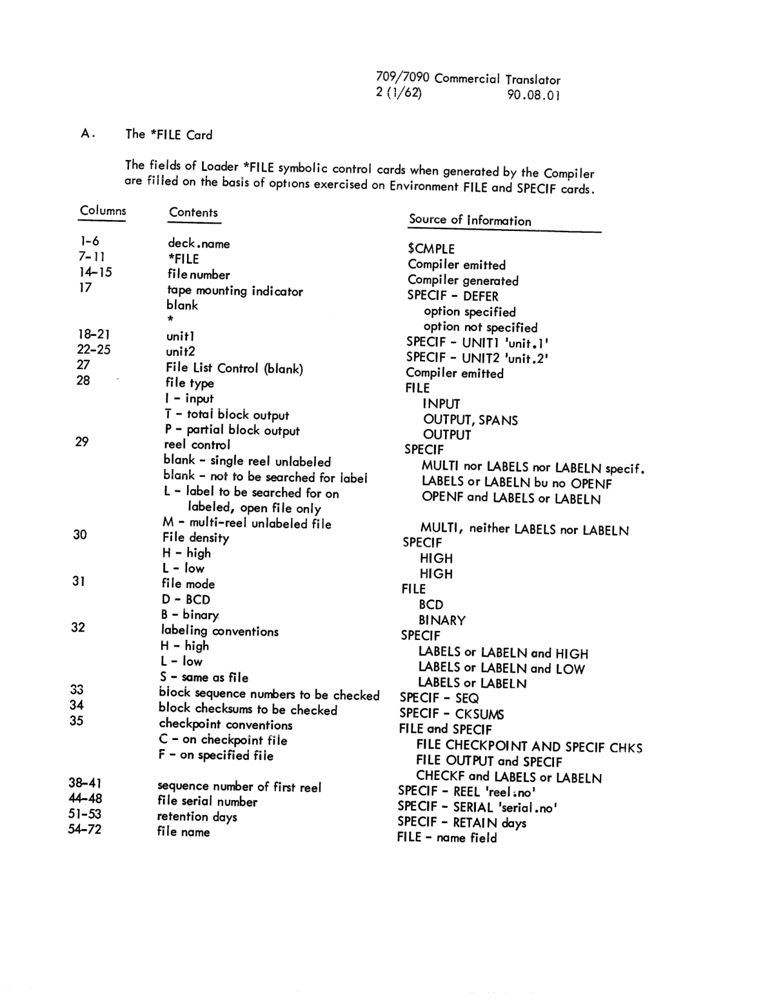
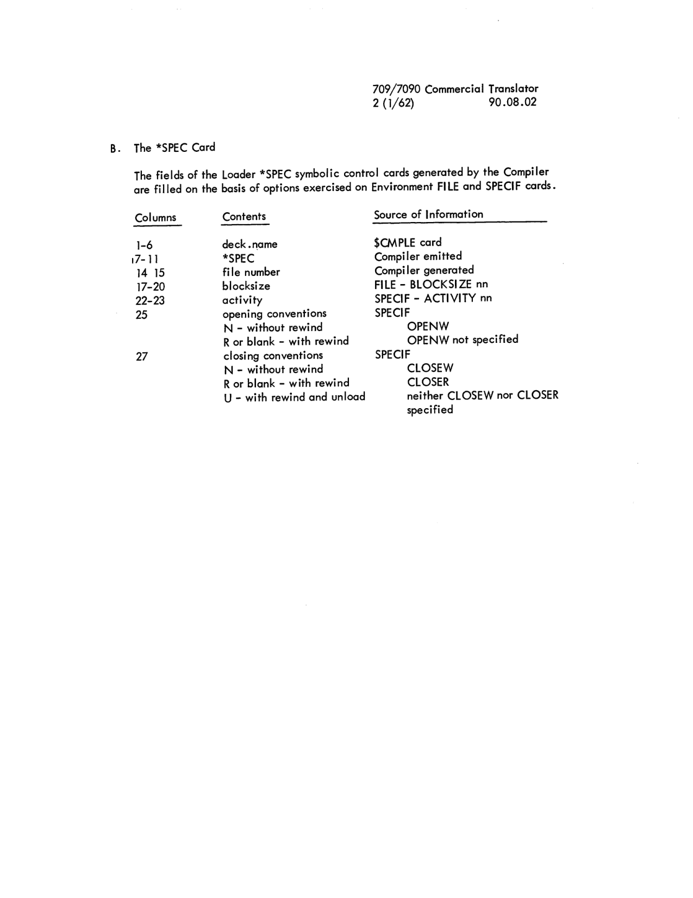

# Appendix 90.08: Compiler Use of Environment Descriptions in Generation of Loader Symbolic Control Cards

<!-- 90.08.00 | PDF 218 -->
**[90.08.00]**

## Appendix 90.08

Compiler Use of Environment Description Options in Generation of Loader Symbolic Control Cards.

<!-- 90.08.01 | PDF 219 -->
**[90.08.01]**

#### A. The \*FILE Card

The fields of Loader \*FILE symbolic control cards when generated by the Compiler are filled on the basis of options exercised on Environment FILE and SPECIF cards.

| Columns | Contents | Source of Information |
|---|---|---|
| 1-6 | deck.name | $CMPLE |
| 7-11 | \*FILE | Compiler emitted |
| 14-15 | file number | Compiler generated |
| 17 | tape mounting indicator | SPECIF - DEFER |
| | &nbsp;&nbsp;blank | &nbsp;&nbsp;option specified |
| | &nbsp;&nbsp;\* | &nbsp;&nbsp;option not specified |
| 18-21 | unit1 | SPECIF - UNIT1 'unit.1' |
| 22-25 | unit2 | SPECIF - UNIT2 'unit.2' |
| 27 | File List Control (blank) | Compiler emitted |
| 28 | file type | FILE |
| | &nbsp;&nbsp;I - input | &nbsp;&nbsp;INPUT |
| | &nbsp;&nbsp;T - total block output | &nbsp;&nbsp;OUTPUT, SPANS |
| | &nbsp;&nbsp;P - partial block output | &nbsp;&nbsp;OUTPUT |
| 29 | reel control | SPECIF |
| | &nbsp;&nbsp;blank - single reel unlabeled | &nbsp;&nbsp;MULTI nor LABELS nor LABELN specif. |
| | &nbsp;&nbsp;blank - not to be searched for label | &nbsp;&nbsp;LABELS or LABELN bu no OPENF |
| | &nbsp;&nbsp;L - label to be searched for on labeled, open file only | &nbsp;&nbsp;OPENF and LABELS or LABELN |
| | &nbsp;&nbsp;M - multi-reel unlabeled file | &nbsp;&nbsp;MULTI, neither LABELS nor LABELN |
| 30 | File density | SPECIF |
| | &nbsp;&nbsp;H - high | &nbsp;&nbsp;HIGH |
| | &nbsp;&nbsp;L - low | &nbsp;&nbsp;HIGH |
| 31 | file mode | FILE |
| | &nbsp;&nbsp;D - BCD | &nbsp;&nbsp;BCD |
| | &nbsp;&nbsp;B - binary | &nbsp;&nbsp;BINARY |
| 32 | labeling conventions | SPECIF |
| | &nbsp;&nbsp;H - high | &nbsp;&nbsp;LABELS or LABELN and HIGH |
| | &nbsp;&nbsp;L - low | &nbsp;&nbsp;LABELS or LABELN and LOW |
| | &nbsp;&nbsp;S - same as file | &nbsp;&nbsp;LABELS or LABELN |
| 33 | block sequence numbers to be checked | SPECIF - SEQ |
| 34 | block checksums to be checked | SPECIF - CKSUMS |
| 35 | checkpoint conventions | FILE and SPECIF |
| | &nbsp;&nbsp;C - on checkpoint file | &nbsp;&nbsp;FILE CHECKPOINT AND SPECIF CHKS |
| | &nbsp;&nbsp;F - on specified file | &nbsp;&nbsp;FILE OUTPUT and SPECIF CHECKF and LABELS or LABELN |
| 38-41 | sequence number of first reel | SPECIF - REEL 'reel.no' |
| 44-48 | file serial number | SPECIF - SERIAL 'serial.no' |
| 51-53 | retention days | SPECIF - RETAIN days |
| 54-72 | file name | FILE - name field |

*Fields of the Loader \*FILE symbolic control card as generated by the Compiler (page 90.08.01).*

<!-- 90.08.02 | PDF 220 -->
**[90.08.02]**

#### B. The \*SPEC Card

The fields of the Loader \*SPEC symbolic control cards generated by the Compiler are filled on the basis of options exercised on Environment FILE and SPECIF cards.

| Columns | Contents | Source of Information |
|---|---|---|
| 1-6 | deck.name | $CMPLE card |
| 7-11 | \*SPEC | Compiler emitted |
| 14 15 | file number | Compiler generated |
| 17-20 | blocksize | FILE - BLOCKSIZE nn |
| 22-23 | activity | SPECIF - ACTIVITY nn |
| 25 | opening conventions | SPECIF |
| | &nbsp;&nbsp;N - without rewind | &nbsp;&nbsp;OPENW |
| | &nbsp;&nbsp;R or blank - with rewind | &nbsp;&nbsp;OPENW not specified |
| 27 | closing conventions | SPECIF |
| | &nbsp;&nbsp;N - without rewind | &nbsp;&nbsp;CLOSEW |
| | &nbsp;&nbsp;R or blank - with rewind | &nbsp;&nbsp;CLOSER |
| | &nbsp;&nbsp;U - with rewind and unload | &nbsp;&nbsp;neither CLOSEW nor CLOSER specified |

*Fields of the Loader \*SPEC symbolic control card as generated by the Compiler (page 90.08.02).*

<!-- conversion notes: PDF pages 218-220 transcribed from OCR draft and corrected against page images; no pages required full image-only fallback. PDF page 218 had no section code in jmap.json (null) — read from the page image header as 90.08.00, consistent with the chunk note that Appendix 90.08 begins there. The two reference tables (90.08.01, 90.08.02: fields of the Loader *FILE and *SPEC symbolic control cards) have hierarchical/merged-cell structure (a single "Columns" entry governs several indented Contents/Source sub-rows); rendered as best-effort Markdown pipe tables with sub-items indented via &nbsp;&nbsp;, and the source page image embedded immediately below each table per spec for complex ruled tables. On 90.08.01, "L - low" under File density and "H - high" both list "HIGH" as their Source of Information in the original (verified against a zoomed crop of the image; likely an original printing error, reproduced as printed rather than corrected). Also reproduced as printed: "LABELS or LABELN bu no OPENF" (missing "t" in "but", confirmed at high zoom — appears to be an original typographical error, not an OCR artifact). On 90.08.02, the row for file number reads "14 15" (space, not hyphen) as printed, differing from the hyphenated "14-15" used for the same field on 90.08.01; and the *SPEC row's column range "7-11" was confirmed against a small stray ink mark before the "7" that is not a genuine digit (ruled out because "17-11" would be a nonsensical descending range and the field width would not match the 5-character card-name convention seen elsewhere). Asterisk-prefixed card names (*FILE, *SPEC) were backslash-escaped throughout to prevent Markdown italics, consistent with the convention used elsewhere in this manual's conversion. No overpunched/overbar digits appeared in this chunk. -->
